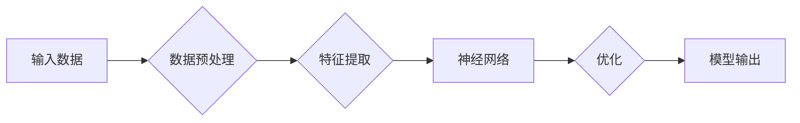

# Andrej Karpathy：人工智能的未来发展前景

> 关键词：Andrej Karpathy, 人工智能，深度学习，神经网络，自然语言处理，计算机视觉，智能未来

## 1. 背景介绍

Andrej Karpathy 是一位在人工智能领域极具影响力的专家，以其在自然语言处理（NLP）和计算机视觉领域的杰出贡献而闻名。他的工作不仅推动了深度学习技术的发展，也对人工智能的未来发展前景产生了深远影响。本文将探讨 Andrej Karpathy 的贡献，并展望人工智能的未来发展趋势和挑战。

### 1.1  问题的由来

随着计算能力的提升和大数据的涌现，人工智能（AI）技术在过去几十年取得了突飞猛进的发展。然而，AI 的未来究竟如何？它将如何影响我们的生活和工作？Andrej Karpathy 的观点为我们提供了宝贵的见解。

### 1.2  研究现状

Andrej Karpathy 在 NLP 和计算机视觉领域的贡献主要集中在以下几个方面：

- **神经网络和深度学习**：Karpathy 在其论文中提出了基于深度学习的 NLP 和计算机视觉模型，如 Recurrent Neural Networks (RNN) 和 Long Short-Term Memory (LSTM) 网络，这些模型在处理序列数据和图像理解任务中取得了突破性进展。
- **端到端学习**：他倡导端到端学习范式，即直接从原始输入到任务输出进行学习，避免了传统方法的复杂特征工程步骤。
- **开源和社区贡献**：Karpathy 通过开源其代码和模型，推动了 AI 社区的繁荣发展。

### 1.3  研究意义

Andrej Karpathy 的工作对于推动 AI 技术的发展和应用具有重要意义：

- **技术创新**：他的研究推动了神经网络和深度学习技术在 NLP 和计算机视觉领域的应用，为其他领域的研究提供了新的思路。
- **开源精神**：通过开源代码和模型，Karpathy 促进了 AI 社区的合作和发展。
- **教育和普及**：他的博客和教程帮助了大量开发者了解和学习 AI 技术。

### 1.4 本文结构

本文将按照以下结构展开：

- **第2部分**：介绍 Andrej Karpathy 的核心贡献和研究成果。
- **第3部分**：深入探讨深度学习在 NLP 和计算机视觉领域的原理和应用。
- **第4部分**：分析 AI 的未来发展趋势和潜在挑战。
- **第5部分**：展望 AI 技术在各个领域的应用前景。
- **第6部分**：推荐相关的学习资源和开发工具。
- **第7部分**：总结 AI 技术的未来发展趋势和挑战。

## 2. 核心概念与联系

### 2.1 核心概念原理和架构的 Mermaid 流程图



### 2.2 核心概念

- **输入数据**：AI 模型的输入可以是文本、图像、音频等。
- **数据预处理**：包括清洗、标准化、归一化等步骤，以提高模型性能。
- **特征提取**：从原始数据中提取有用信息，如文本中的词向量或图像中的特征。
- **神经网络**：由多个神经元组成的计算模型，能够学习数据的复杂模式。
- **优化**：通过调整网络参数，使模型输出更接近真实标签。
- **模型输出**：模型的最终输出，可以是分类结果、预测值等。

这些概念构成了 AI 模型的基础架构，而 Andrej Karpathy 的工作正是在这个框架下推动了技术进步。

## 3. 核心算法原理 & 具体操作步骤

### 3.1 算法原理概述

深度学习是 AI 中的核心技术之一，它通过模拟人脑神经网络的结构和功能，实现对复杂数据的处理和分析。以下是深度学习的基本原理：

- **神经网络**：由多个神经元组成，每个神经元负责处理输入数据的一部分。
- **激活函数**：用于将神经元的线性组合转换成非线性输出。
- **损失函数**：用于衡量模型输出与真实标签之间的差异。
- **优化算法**：如梯度下降，用于调整网络参数，以最小化损失函数。

### 3.2 算法步骤详解

深度学习的具体操作步骤如下：

1. **数据收集**：收集用于训练和测试的数据集。
2. **数据预处理**：对数据进行清洗、标准化等处理。
3. **模型构建**：设计神经网络结构，包括层数、神经元数量、连接方式等。
4. **模型训练**：使用训练数据对模型进行训练，调整网络参数。
5. **模型评估**：使用测试数据评估模型性能，调整模型结构或参数。
6. **模型部署**：将训练好的模型应用于实际任务。

### 3.3 算法优缺点

深度学习的优点：

- **强大的学习能力**：能够从大量数据中学习复杂的模式和特征。
- **泛化能力**：能够在未见过的数据上取得良好的性能。

深度学习的缺点：

- **数据需求量大**：需要大量的训练数据。
- **计算资源消耗大**：需要高性能的硬件设备。
- **可解释性差**：模型的决策过程难以理解。

### 3.4 算法应用领域

深度学习在以下领域得到了广泛应用：

- **自然语言处理**：文本分类、机器翻译、情感分析等。
- **计算机视觉**：图像识别、目标检测、图像生成等。
- **语音识别**：语音转文字、语音合成等。
- **推荐系统**：个性化推荐、广告投放等。

## 4. 数学模型和公式 & 详细讲解 & 举例说明

### 4.1 数学模型构建

深度学习中的数学模型主要包括：

- **神经网络模型**：由多个层组成，每层由多个神经元构成。
- **损失函数**：用于衡量模型输出与真实标签之间的差异。
- **优化算法**：用于调整网络参数，以最小化损失函数。

### 4.2 公式推导过程

以下是神经网络模型和损失函数的基本公式：

- **神经网络模型**：

$$
y = \sigma(W \cdot x + b)
$$

其中 $y$ 是输出，$x$ 是输入，$W$ 是权重矩阵，$b$ 是偏置项，$\sigma$ 是激活函数。

- **损失函数**（均方误差）：

$$
L = \frac{1}{2} \sum_{i=1}^{N}(y_i - \hat{y_i})^2
$$

其中 $y_i$ 是真实标签，$\hat{y_i}$ 是模型预测值。

### 4.3 案例分析与讲解

以下是一个简单的神经网络模型示例：

```
输入层：[x1, x2, x3]
隐藏层：[f1, f2, f3]
输出层：[y1, y2]
```

其中：

- 输入层接收三个输入特征。
- 隐藏层包含三个神经元，使用 ReLU 激活函数。
- 输出层包含两个神经元，使用 Sigmoid 激活函数。

模型训练过程中，通过反向传播算法不断调整网络参数，最小化损失函数，最终得到最佳模型。

## 5. 项目实践：代码实例和详细解释说明

### 5.1 开发环境搭建

以下是使用 Python 和 TensorFlow 构建深度学习模型的步骤：

1. 安装 Python 和 TensorFlow：
```bash
pip install tensorflow
```

2. 编写 Python 代码，定义神经网络模型、损失函数和优化器。

3. 加载数据集并进行预处理。

4. 训练模型，并在测试集上评估模型性能。

### 5.2 源代码详细实现

以下是一个简单的神经网络模型示例代码：

```python
import tensorflow as tf

model = tf.keras.Sequential([
    tf.keras.layers.Dense(64, activation='relu', input_shape=(3,)),
    tf.keras.layers.Dense(2, activation='sigmoid')
])

model.compile(optimizer='adam', loss='binary_crossentropy', metrics=['accuracy'])

# 加载数据集并进行预处理
# ...

# 训练模型
model.fit(x_train, y_train, epochs=10, validation_split=0.2)

# 评估模型
model.evaluate(x_test, y_test)
```

### 5.3 代码解读与分析

以上代码展示了如何使用 TensorFlow 构建一个简单的二分类神经网络模型。首先，定义了一个 Sequential 模型，包含两个层：一个 64 个神经元的隐藏层和一个 2 个神经元的输出层。隐藏层使用 ReLU 激活函数，输出层使用 Sigmoid 激活函数。

然后，使用 Adam 优化器、二分类交叉熵损失函数和准确率指标编译模型。接下来，加载数据集并进行预处理，训练模型 10 个 epoch，并在测试集上评估模型性能。

### 5.4 运行结果展示

运行上述代码后，可以看到模型训练过程中的损失和准确率，以及在测试集上的最终准确率。

## 6. 实际应用场景

深度学习技术在各个领域都有广泛的应用，以下是一些典型的应用场景：

### 6.1 自然语言处理

- **文本分类**：将文本分类为不同的类别，如垃圾邮件检测、情感分析等。
- **机器翻译**：将一种语言的文本翻译成另一种语言。
- **问答系统**：回答用户提出的问题。

### 6.2 计算机视觉

- **图像识别**：识别图像中的对象，如人脸识别、物体检测等。
- **图像生成**：根据文字描述生成图像。
- **视频分析**：分析视频中的动作、事件等。

### 6.3 语音识别

- **语音转文字**：将语音转换为文字。
- **语音合成**：将文字转换为语音。
- **语音控制**：通过语音控制智能家居、手机等设备。

## 7. 工具和资源推荐

### 7.1 学习资源推荐

- **书籍**：
  - 《深度学习》（Ian Goodfellow、Yoshua Bengio、Aaron Courville 著）
  - 《神经网络与深度学习》（邱锡鹏 著）
- **在线课程**：
  - Coursera 上的“深度学习”课程（由 Andrew Ng 开设）
  - fast.ai 上的“Practical Deep Learning for Coders”课程

### 7.2 开发工具推荐

- **深度学习框架**：
  - TensorFlow
  - PyTorch
- **数据集**：
  - ImageNet
  - CIFAR-10
  - MNIST

### 7.3 相关论文推荐

- **自然语言处理**：
  - “Sequence to Sequence Learning with Neural Networks”（Ilya Sutskever 等）
  - “Attention is All You Need”（Ashish Vaswani 等）
- **计算机视觉**：
  - “Convolutional Neural Networks”（Yann LeCun 等）
  - “Deep Residual Learning for Image Recognition”（Kaiming He 等）

## 8. 总结：未来发展趋势与挑战

### 8.1 研究成果总结

本文介绍了 Andrej Karpathy 的核心贡献和研究成果，探讨了深度学习在 NLP 和计算机视觉领域的原理和应用，分析了 AI 的未来发展趋势和潜在挑战。

### 8.2 未来发展趋势

以下是 AI 技术的未来发展趋势：

- **模型轻量化**：开发轻量级模型，降低计算资源消耗。
- **可解释性**：提高模型的可解释性，使其决策过程更加透明。
- **多模态学习**：融合多模态信息，如文本、图像、音频等。
- **知识增强**：结合领域知识，提高模型的鲁棒性和泛化能力。

### 8.3 面临的挑战

AI 技术在发展过程中也面临着以下挑战：

- **数据隐私**：如何保护用户隐私，防止数据泄露。
- **伦理道德**：如何确保 AI 技术的应用符合伦理道德标准。
- **可解释性**：如何提高模型的可解释性，使其决策过程更加透明。
- **安全性**：如何防止 AI 被恶意利用。

### 8.4 研究展望

未来，AI 技术将朝着更加智能化、自动化、人性化的方向发展。通过克服现有的挑战，AI 技术将更好地服务于人类社会，为人们创造更加美好的未来。

## 9. 附录：常见问题与解答

**Q1：深度学习是否能够完全取代传统机器学习方法？**

A：深度学习在处理复杂数据和模式时具有显著优势，但并不意味着它能够完全取代传统机器学习方法。传统方法在某些简单任务上仍然有效，而且在某些情况下，传统方法的计算效率更高。

**Q2：如何提高深度学习模型的可解释性？**

A：提高模型的可解释性可以通过以下方法实现：

- **可视化**：将模型结构、激活图等进行可视化，以便更好地理解模型的决策过程。
- **注意力机制**：使用注意力机制模型，突出模型在输入数据上的关注点。
- **解释性模型**：构建专门的可解释性模型，如规则基模型、决策树等。

**Q3：AI 技术是否会导致失业？**

A：AI 技术的快速发展可能会改变某些工作岗位，但同时也将创造新的就业机会。关键在于如何适应变化，学习新的技能，以适应智能时代的需求。

**Q4：如何确保 AI 技术的应用符合伦理道德标准？**

A：确保 AI 技术的应用符合伦理道德标准需要多方面的努力：

- **制定伦理规范**：制定 AI 技术应用的伦理规范，明确其边界和限制。
- **加强监管**：加强对 AI 技术应用的监管，防止其被滥用。
- **公众教育**：提高公众对 AI 技术的认识和了解，培养正确的价值观。

---

作者：禅与计算机程序设计艺术 / Zen and the Art of Computer Programming