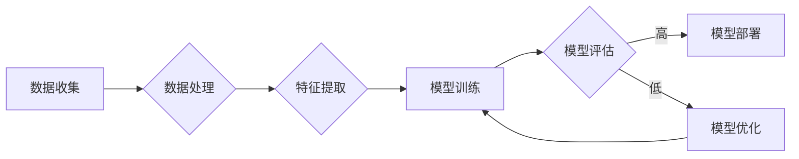

> 人工智能，深度学习，机器学习，神经网络，未来挑战，自动驾驶，自然语言处理，伦理，可持续发展

# Andrej Karpathy：人工智能的未来发展挑战

## 1. 背景介绍

人工智能（AI）作为一门多学科交叉的领域，正在以惊人的速度发展。其核心驱动力之一是深度学习，一种模仿人脑神经网络结构的计算模型。Andrej Karpathy，一位在人工智能领域具有重要影响力的专家，以其在自然语言处理（NLP）和自动驾驶方面的贡献而闻名。本文将探讨Karpathy提出的关于人工智能未来发展的几个关键挑战，并分析这些挑战背后的原理和潜在解决方案。

## 2. 核心概念与联系

### 2.1 核心概念

- **深度学习**：一种利用多层神经网络进行特征提取和变换的机器学习技术，能够从数据中学习复杂的模式。
- **神经网络**：由大量简单神经元连接而成的计算系统，能够执行复杂的计算任务。
- **自动驾驶**：利用AI技术实现的汽车自主驾驶能力。
- **自然语言处理（NLP）**：使计算机能够理解和生成人类语言的技术。
- **伦理**：在AI设计中考虑的道德和伦理问题。
- **可持续发展**：在满足当代需求的同时，不损害未来世代满足其需求的能力。

### 2.2 架构流程图



在上述流程图中，数据收集、处理、特征提取、模型训练、评估、部署和优化构成了人工智能项目的主要环节。

## 3. 核心算法原理 & 具体操作步骤

### 3.1 算法原理概述

人工智能的核心是算法，而深度学习算法是其主要组成部分。以下是几个关键的深度学习算法：

- **神经网络**：通过调整连接权重，学习数据中的非线性关系。
- **卷积神经网络（CNN）**：擅长处理图像和视频数据。
- **循环神经网络（RNN）**：擅长处理序列数据，如时间序列数据或文本。
- **长短期记忆网络（LSTM）**：RNN的一种变体，能够学习长期依赖关系。

### 3.2 算法步骤详解

1. **数据收集**：收集大量相关数据，用于训练和测试模型。
2. **数据处理**：清洗、标注和预处理数据，使其适合模型输入。
3. **特征提取**：使用CNN、RNN等算法从数据中提取特征。
4. **模型训练**：使用训练数据训练模型，调整模型参数以最小化损失函数。
5. **模型评估**：使用测试数据评估模型性能，确定模型是否满足需求。
6. **模型部署**：将训练好的模型部署到实际应用中。
7. **模型优化**：根据应用反馈，进一步优化模型性能。

### 3.3 算法优缺点

- **优点**：深度学习模型能够处理复杂的数据，并在许多任务中取得优异的性能。
- **缺点**：需要大量的数据和计算资源，模型的可解释性较差。

### 3.4 算法应用领域

深度学习算法在以下领域有着广泛的应用：

- **图像识别**：识别图像中的物体和场景。
- **语音识别**：将语音转换为文本。
- **自然语言处理**：理解和生成人类语言。
- **自动驾驶**：使汽车能够自主导航。

## 4. 数学模型和公式 & 详细讲解 & 举例说明

### 4.1 数学模型构建

深度学习模型通常基于以下数学模型：

- **神经网络**：由多个神经元组成，每个神经元都是一个简单的函数，如Sigmoid或ReLU函数。
- **损失函数**：用于衡量模型预测值与真实值之间的差异，如均方误差或交叉熵损失。

### 4.2 公式推导过程

以下是一个简单的神经网络损失函数的公式推导：

$$
\text{loss} = \frac{1}{2} \sum_{i=1}^{N} (y_i - \hat{y}_i)^2
$$

其中，$y_i$ 是真实值，$\hat{y}_i$ 是模型预测值，$N$ 是样本数量。

### 4.3 案例分析与讲解

以图像识别任务为例，我们可以使用CNN模型来识别图像中的物体。首先，我们需要收集大量带有标签的图像数据，然后使用CNN模型提取图像特征。最后，使用这些特征来识别图像中的物体。

## 5. 项目实践：代码实例和详细解释说明

### 5.1 开发环境搭建

要实践深度学习项目，我们需要以下开发环境：

- Python编程语言
- 深度学习框架，如TensorFlow或PyTorch
- 计算机硬件，如GPU

### 5.2 源代码详细实现

以下是一个简单的CNN模型示例，用于图像分类：

```python
import torch
import torch.nn as nn

class SimpleCNN(nn.Module):
    def __init__(self):
        super(SimpleCNN, self).__init__()
        self.conv1 = nn.Conv2d(3, 32, kernel_size=3, stride=1, padding=1)
        self.conv2 = nn.Conv2d(32, 64, kernel_size=3, stride=1, padding=1)
        self.fc1 = nn.Linear(64 * 6 * 6, 128)
        self.fc2 = nn.Linear(128, 10)

    def forward(self, x):
        x = nn.functional.relu(self.conv1(x))
        x = nn.functional.max_pool2d(x, 2, 2)
        x = nn.functional.relu(self.conv2(x))
        x = nn.functional.max_pool2d(x, 2, 2)
        x = x.view(-1, 64 * 6 * 6)
        x = nn.functional.relu(self.fc1(x))
        x = self.fc2(x)
        return x
```

### 5.3 代码解读与分析

在上面的代码中，我们定义了一个简单的CNN模型，它包含两个卷积层和两个全连接层。模型首先通过卷积层提取图像特征，然后通过全连接层进行分类。

### 5.4 运行结果展示

要运行上述代码，我们需要准备数据、定义损失函数和优化器，然后进行模型训练和评估。以下是一个简单的训练循环：

```python
model = SimpleCNN()
criterion = nn.CrossEntropyLoss()
optimizer = torch.optim.Adam(model.parameters(), lr=0.001)

for epoch in range(10):
    for data, target in train_loader:
        optimizer.zero_grad()
        output = model(data)
        loss = criterion(output, target)
        loss.backward()
        optimizer.step()
    print(f'Epoch {epoch+1}, Loss: {loss.item()}')
```

在这个循环中，我们使用训练数据来训练模型，并打印每个epoch的损失值。

## 6. 实际应用场景

### 6.1 自动驾驶

自动驾驶是AI的一个重要应用场景。通过在大量交通场景数据上训练，自动驾驶系统可以学习如何驾驶汽车，包括识别道路标志、检测行人和其他车辆等。

### 6.2 自然语言处理

NLP是AI的另一个关键领域。通过在大量文本数据上训练，NLP系统可以学习如何理解和生成人类语言，从而实现机器翻译、情感分析、文本摘要等任务。

## 7. 工具和资源推荐

### 7.1 学习资源推荐

- 《深度学习》（Ian Goodfellow等著）
- 《Python深度学习》（François Chollet著）
- Coursera上的深度学习课程

### 7.2 开发工具推荐

- TensorFlow
- PyTorch
- Keras

### 7.3 相关论文推荐

- "ImageNet Classification with Deep Convolutional Neural Networks"（Alex Krizhevsky等著）
- "Sequence to Sequence Learning with Neural Networks"（Ilya Sutskever等著）

## 8. 总结：未来发展趋势与挑战

### 8.1 研究成果总结

AI在过去几年取得了巨大的进展，但仍然面临许多挑战。

### 8.2 未来发展趋势

- 更大的模型
- 更好的算法
- 更多的应用场景
- 更好的可解释性

### 8.3 面临的挑战

- 数据隐私
- 道德和伦理问题
- 模型可解释性
- 算力需求

### 8.4 研究展望

AI的未来将充满挑战和机遇。通过持续的研究和创新，我们有望解决这些挑战，并利用AI技术为人类社会带来更多的便利和进步。

## 9. 附录：常见问题与解答

**Q1：AI是否会取代人类？**

A：AI可以帮助人们完成一些重复性的工作，但它们无法完全取代人类的创造力和情感。

**Q2：AI是否会失控？**

A：目前的技术水平还无法实现真正的AI失控。然而，我们需要确保AI系统的设计和部署符合伦理和安全标准。

**Q3：AI如何影响就业？**

A：AI可能会取代一些工作，但也会创造新的工作机会。

**Q4：AI如何影响社会？**

A：AI有潜力改善人们的生活，但我们需要确保它的发展符合社会的利益。

作者：禅与计算机程序设计艺术 / Zen and the Art of Computer Programming