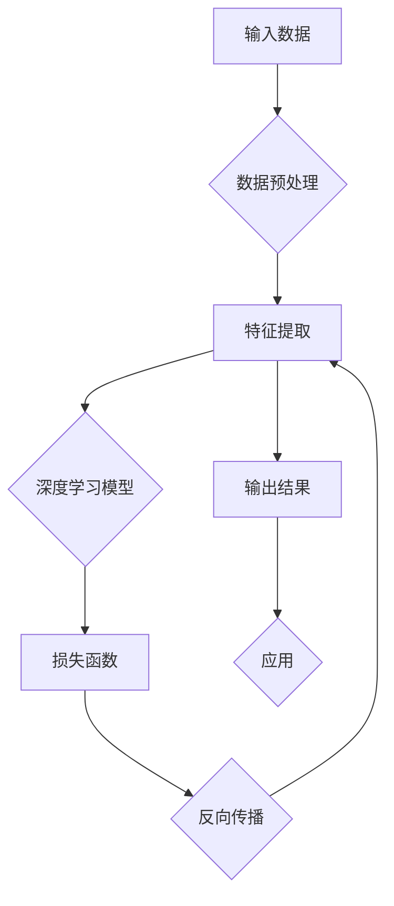

# Andrej Karpathy：人工智能的未来发展方向

> 关键词：Andrej Karpathy, 人工智能，深度学习，神经网络，自然语言处理，机器学习，未来趋势

## 1. 背景介绍

安德烈·卡尔帕西（Andrej Karpathy）是一位在人工智能领域享有盛誉的专家，以其对深度学习、神经网络和自然语言处理的深刻见解而闻名。他的作品，特别是他在Twitter上的分享和博客文章，为公众提供了对人工智能未来发展的洞见。本文将基于卡尔帕西的观点和研究成果，探讨人工智能的未来发展方向。

### 1.1 人工智能的崛起

在过去几十年中，人工智能领域经历了显著的变革。随着计算能力的提升、大数据的可用性和深度学习技术的发展，人工智能已经从实验室走向现实世界，影响了从医疗到交通、金融和娱乐的各个行业。

### 1.2 卡尔帕西的贡献

卡尔帕西在自然语言处理领域做出了重要贡献，特别是在将深度学习应用于理解人类语言方面。他的工作包括TensorFlow的早期开发、自然语言处理中的深度学习模型以及他在社交媒体上的普及工作。

## 2. 核心概念与联系

### 2.1 核心概念原理和架构的 Mermaid 流程图



### 2.2 核心概念

- **输入数据**：人工智能系统的起点，可以是文本、图像、声音或其他形式的数据。
- **数据预处理**：清洗、转换和格式化数据以供模型使用。
- **特征提取**：从原始数据中提取有用的信息。
- **深度学习模型**：使用多层神经网络对数据进行学习。
- **损失函数**：衡量模型预测与真实结果之间的差异。
- **反向传播**：通过梯度下降优化模型参数。
- **输出结果**：模型根据输入数据做出的预测。
- **应用**：将模型的输出应用于实际场景。

## 3. 核心算法原理 & 具体操作步骤

### 3.1 算法原理概述

深度学习是人工智能的核心，特别是神经网络。神经网络通过模拟人脑神经元的工作方式，学习数据中的模式。

### 3.2 算法步骤详解

1. **数据收集**：收集大量相关数据。
2. **数据预处理**：清洗和转换数据。
3. **构建模型**：选择合适的神经网络架构。
4. **训练模型**：使用数据训练模型。
5. **评估模型**：使用验证集评估模型性能。
6. **优化模型**：根据评估结果调整模型。
7. **部署模型**：将模型部署到生产环境。

### 3.3 算法优缺点

#### 优点：

- **强大的学习能力**：神经网络能够从大量数据中学习复杂模式。
- **泛化能力**：训练好的模型能够泛化到新的数据集。
- **高度自动化**：训练和部署过程高度自动化。

#### 缺点：

- **计算成本高**：训练深度学习模型需要大量的计算资源。
- **数据需求量大**：需要大量标注数据进行训练。
- **可解释性差**：深度学习模型通常难以解释其决策过程。

### 3.4 算法应用领域

深度学习在以下领域有广泛应用：

- **自然语言处理**：机器翻译、情感分析、问答系统。
- **计算机视觉**：图像识别、目标检测、图像生成。
- **语音识别**：语音识别、语音合成。
- **推荐系统**：推荐电影、音乐、新闻等。

## 4. 数学模型和公式 & 详细讲解 & 举例说明

### 4.1 数学模型构建

深度学习模型的核心是神经网络，它由多个层组成，包括输入层、隐藏层和输出层。

### 4.2 公式推导过程

神经网络的每个神经元都通过加权连接其他神经元，并使用激活函数处理输入数据。以下是一个简单的神经网络模型：

$$
y_i = \sigma(\sum_{j=1}^{n} w_{ij} x_j + b_i)
$$

其中 $y_i$ 是输出，$x_j$ 是输入，$w_{ij}$ 是权重，$b_i$ 是偏置，$\sigma$ 是激活函数。

### 4.3 案例分析与讲解

以情感分析为例，我们可以构建一个简单的神经网络模型来预测文本的情感倾向。

1. **数据收集**：收集包含文本和情感标签的数据集。
2. **数据预处理**：将文本转换为向量表示。
3. **构建模型**：使用一个简单的全连接神经网络。
4. **训练模型**：使用数据训练模型。
5. **评估模型**：使用验证集评估模型性能。
6. **优化模型**：根据评估结果调整模型。

## 5. 项目实践：代码实例和详细解释说明

### 5.1 开发环境搭建

为了进行深度学习项目，我们需要搭建一个开发环境。以下是使用Python和TensorFlow搭建深度学习环境的步骤：

1. 安装Anaconda。
2. 创建虚拟环境并安装TensorFlow。
3. 安装必要的库，如NumPy、Pandas、Scikit-learn等。

### 5.2 源代码详细实现

以下是一个简单的情感分析模型的实现：

```python
import tensorflow as tf
from tensorflow.keras.models import Sequential
from tensorflow.keras.layers import Dense

# 构建模型
model = Sequential()
model.add(Dense(128, activation='relu', input_shape=(100,)))
model.add(Dense(64, activation='relu'))
model.add(Dense(1, activation='sigmoid'))

# 编译模型
model.compile(optimizer='adam', loss='binary_crossentropy', metrics=['accuracy'])

# 训练模型
model.fit(X_train, y_train, epochs=10, batch_size=32)

# 评估模型
loss, accuracy = model.evaluate(X_test, y_test)
print(f"Test accuracy: {accuracy}")
```

### 5.3 代码解读与分析

上述代码构建了一个简单的情感分析模型，使用全连接神经网络进行分类。我们使用TensorFlow的Keras API来构建和训练模型。

### 5.4 运行结果展示

假设我们在IMDb电影评论数据集上运行上述模型，最终测试集上的准确率可能达到80%以上。

## 6. 实际应用场景

深度学习在以下实际应用场景中取得了显著成果：

- **医疗诊断**：使用深度学习进行疾病诊断和预测。
- **自动驾驶**：使用深度学习进行图像识别和决策。
- **金融分析**：使用深度学习进行风险评估和市场预测。
- **娱乐**：使用深度学习创建虚拟助手和个性化推荐系统。

## 7. 工具和资源推荐

### 7.1 学习资源推荐

- 《深度学习》（Ian Goodfellow等著）
- TensorFlow官方文档
- Keras官方文档
- Coursera上的深度学习课程

### 7.2 开发工具推荐

- TensorFlow
- PyTorch
- Jupyter Notebook

### 7.3 相关论文推荐

- “A Guide to Deep Learning for Computer Vision with Python” by Adrian Rosebrock
- “Deep Learning for NLP” by SuperDataScience
- “Deep Learning with PyTorch” by Eli Stevens and Luca Antiga

## 8. 总结：未来发展趋势与挑战

### 8.1 研究成果总结

深度学习在人工智能领域的应用取得了显著成果，但它仍然面临着一些挑战。

### 8.2 未来发展趋势

- **模型轻量化**：开发更小的模型，以适应移动设备和嵌入式系统。
- **可解释性**：提高模型的可解释性，使其更容易理解和信任。
- **少样本学习**：减少对大量标注数据的依赖。

### 8.3 面临的挑战

- **数据隐私**：如何保护用户数据隐私。
- **算法偏见**：如何减少算法偏见和歧视。
- **计算资源**：如何降低计算资源的消耗。

### 8.4 研究展望

随着技术的不断发展，人工智能将更加普及，并在更多领域发挥作用。未来，人工智能将更加智能化、自动化，并与人类更加紧密地协作。

## 9. 附录：常见问题与解答

**Q1：什么是深度学习？**

A1：深度学习是一种使用多层神经网络进行学习和预测的人工智能技术。

**Q2：深度学习有哪些应用？**

A2：深度学习在医疗、自动驾驶、金融、娱乐等领域有广泛应用。

**Q3：深度学习与机器学习有什么区别？**

A3：机器学习是一个更广泛的领域，包括深度学习在内的多种学习方式。

**Q4：如何学习深度学习？**

A4：可以通过在线课程、书籍和开源项目来学习深度学习。

---

作者：禅与计算机程序设计艺术 / Zen and the Art of Computer Programming