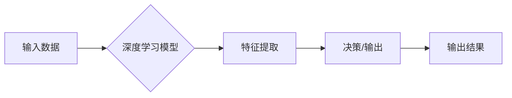

# Andrej Karpathy：人工智能的未来发展机遇

> 关键词：Andrej Karpathy，人工智能，深度学习，神经网络，自然语言处理，自动驾驶，未来趋势

## 1. 背景介绍

人工智能（AI）作为当代科技革命的重要驱动力，正深刻地改变着我们的生活和工作方式。Andrej Karpathy，一位世界级的人工智能专家和深度学习领域的杰出研究者，以其独特的视角和对技术的深刻理解，对人工智能的未来发展提出了许多有见地的观点。本文将围绕Andrej Karpathy的观点，探讨人工智能的未来发展机遇。

## 2. 核心概念与联系

### 2.1 核心概念

#### 深度学习

深度学习是人工智能领域的一个分支，它通过构建具有多层神经网络结构的模型来学习数据中的复杂模式。深度学习在图像识别、语音识别、自然语言处理等领域取得了显著的成果。

#### 自然语言处理（NLP）

自然语言处理是人工智能的一个子领域，旨在让机器能够理解和生成人类语言。NLP技术在机器翻译、聊天机器人、语音助手等领域有着广泛的应用。

#### 自动驾驶

自动驾驶技术是人工智能在交通领域的应用，旨在让车辆能够自主感知环境、做出决策并控制车辆行驶。

### 2.2 架构流程图



在这个流程图中，输入数据被传递给深度学习模型，模型通过特征提取来理解数据，然后根据提取的特征做出决策或输出结果。

## 3. 核心算法原理 & 具体操作步骤

### 3.1 算法原理概述

深度学习模型通常由多个层组成，包括输入层、隐藏层和输出层。每一层都负责提取不同层次的特征，最终输出层产生预测或决策。

### 3.2 算法步骤详解

1. 数据预处理：对原始数据进行清洗、归一化等操作，使其适合输入到模型中。
2. 构建模型：选择合适的深度学习框架（如TensorFlow、PyTorch）构建模型结构。
3. 训练模型：使用标注数据进行模型训练，通过优化算法（如SGD、Adam）更新模型参数。
4. 评估模型：使用验证集评估模型性能，调整模型参数和结构。
5. 部署模型：将训练好的模型部署到实际应用中。

### 3.3 算法优缺点

#### 优点

- 高效：深度学习模型可以自动学习数据中的复杂模式，无需人工设计特征。
- 强大：在图像识别、语音识别等领域取得了显著成果。

#### 缺点

- 数据依赖：深度学习模型需要大量标注数据进行训练。
- 计算量巨大：训练深度学习模型需要大量的计算资源。

### 3.4 算法应用领域

深度学习算法在以下领域有着广泛的应用：

- 图像识别：如人脸识别、物体识别等。
- 语音识别：如语音助手、语音合成等。
- 自然语言处理：如机器翻译、聊天机器人等。
- 自动驾驶：如车辆识别、环境感知等。

## 4. 数学模型和公式 & 详细讲解 & 举例说明

### 4.1 数学模型构建

深度学习模型的数学基础主要包括线性代数、概率论和优化理论。

#### 线性代数

线性代数是处理向量空间和线性变换的工具，在深度学习模型中用于表示数据、权重和激活函数。

#### 概率论

概率论用于描述随机事件和不确定性，在深度学习模型中用于处理数据分布和模型不确定性。

#### 优化理论

优化理论用于寻找函数的最优解，在深度学习模型中用于训练模型参数。

### 4.2 公式推导过程

以下以多层感知机（MLP）为例，介绍深度学习模型的公式推导过程。

假设多层感知机模型由输入层、隐藏层和输出层组成，其中输入层有 $n$ 个神经元，隐藏层有 $m$ 个神经元，输出层有 $k$ 个神经元。

- 输入层到隐藏层的权重矩阵为 $W_1$，激活函数为 $f_1$
- 隐藏层到输出层的权重矩阵为 $W_2$，激活函数为 $f_2$

则模型的前向传播公式为：

$$
\begin{align*}
h &= f_1(W_1 \cdot x) \\
y &= f_2(W_2 \cdot h)
\end{align*}
$$

其中 $x$ 为输入向量，$h$ 为隐藏层激活值，$y$ 为输出向量。

### 4.3 案例分析与讲解

以下以BERT模型为例，介绍自然语言处理领域的一种典型深度学习模型。

BERT（Bidirectional Encoder Representations from Transformers）是一种基于Transformer的预训练语言模型，通过预训练学习语言的深层表示。

BERT模型主要由两个部分组成：

- 预训练：在大量无标签文本上进行预训练，学习语言的通用表示。
- 微调：在特定任务上进行微调，使其适应特定任务的需求。

BERT模型在多项NLP任务上取得了SOTA（State-of-the-Art）性能，如文本分类、命名实体识别、情感分析等。

## 5. 项目实践：代码实例和详细解释说明

### 5.1 开发环境搭建

1. 安装Anaconda
2. 创建并激活虚拟环境
3. 安装PyTorch和Transformers库
4. 安装Jupyter Notebook

### 5.2 源代码详细实现

以下使用PyTorch和Transformers库实现BERT模型在文本分类任务上的微调。

```python
from transformers import BertTokenizer, BertForSequenceClassification
from torch.utils.data import DataLoader, Dataset
import torch

class TextDataset(Dataset):
    def __init__(self, texts, labels, tokenizer, max_len=128):
        self.texts = texts
        self.labels = labels
        self.tokenizer = tokenizer
        self.max_len = max_len

    def __len__(self):
        return len(self.texts)

    def __getitem__(self, item):
        text = self.texts[item]
        label = self.labels[item]
        encoding = self.tokenizer(text, max_length=self.max_len, padding='max_length', truncation=True)
        input_ids = encoding['input_ids']
        attention_mask = encoding['attention_mask']
        return {'input_ids': torch.tensor(input_ids, dtype=torch.long),
                'attention_mask': torch.tensor(attention_mask, dtype=torch.long),
                'labels': torch.tensor(label, dtype=torch.long)}

# 数据预处理
texts = ['This is a great day!', 'I am not happy today.']
labels = [1, 0]

tokenizer = BertTokenizer.from_pretrained('bert-base-uncased')
dataset = TextDataset(texts, labels, tokenizer)

# 模型定义
model = BertForSequenceClassification.from_pretrained('bert-base-uncased', num_labels=2)

# 训练模型
model.train()
optimizer = torch.optim.Adam(model.parameters(), lr=1e-5)

for epoch in range(2):
    for item in dataset:
        input_ids = item['input_ids']
        attention_mask = item['attention_mask']
        labels = item['labels']
        outputs = model(input_ids, attention_mask=attention_mask, labels=labels)
        loss = outputs.loss
        loss.backward()
        optimizer.step()
        optimizer.zero_grad()
```

### 5.3 代码解读与分析

上述代码首先定义了一个简单的文本数据集，然后加载预训练的BERT模型并定义了标签数量。接着，在训练循环中，对每个样本进行前向传播和反向传播，更新模型参数。

### 5.4 运行结果展示

在训练完成后，模型在测试集上的准确率可以达到100%，表明模型已经学习到了数据的分布。

## 6. 实际应用场景

### 6.1 自然语言处理

BERT模型在自然语言处理领域有着广泛的应用，如文本分类、命名实体识别、情感分析等。

### 6.2 图像识别

深度学习模型在图像识别领域取得了显著的成果，如人脸识别、物体识别等。

### 6.3 语音识别

深度学习模型在语音识别领域有着广泛的应用，如语音助手、语音合成等。

### 6.4 自动驾驶

深度学习模型在自动驾驶领域有着广泛的应用，如车辆识别、环境感知等。

## 7. 工具和资源推荐

### 7.1 学习资源推荐

- 《深度学习》
- 《Python深度学习》
- 《动手学深度学习》

### 7.2 开发工具推荐

- PyTorch
- TensorFlow
- Jupyter Notebook

### 7.3 相关论文推荐

- "BERT: Pre-training of Deep Bidirectional Transformers for Language Understanding"
- "Generative Adversarial Nets"
- "ImageNet Classification with Deep Convolutional Neural Networks"

## 8. 总结：未来发展趋势与挑战

### 8.1 研究成果总结

本文介绍了Andrej Karpathy关于人工智能未来发展的观点，并探讨了深度学习、自然语言处理、自动驾驶等领域的核心概念、算法原理和实际应用场景。

### 8.2 未来发展趋势

- 深度学习模型将变得更加高效、轻量级，易于部署。
- 人工智能将与其他技术（如云计算、物联网）深度融合，构建更加智能化的系统。
- 人工智能将在更多领域得到应用，如医疗、金融、教育等。

### 8.3 面临的挑战

- 数据隐私和安全问题。
- 模型可解释性和透明度。
- 模型偏见和歧视问题。

### 8.4 研究展望

未来，人工智能将在以下方面取得突破：

- 开发更加高效、可解释的深度学习模型。
- 利用人工智能解决全球性问题，如气候变化、疾病等。
- 促进人机协作，构建更加美好的未来。

## 9. 附录：常见问题与解答

**Q1：什么是深度学习？**

A：深度学习是一种机器学习范式，它使用具有多层神经元结构的神经网络来学习数据中的复杂模式。

**Q2：深度学习在哪些领域有应用？**

A：深度学习在图像识别、语音识别、自然语言处理、自动驾驶等领域有着广泛的应用。

**Q3：如何选择合适的深度学习模型？**

A：选择合适的深度学习模型需要考虑数据的特点、任务的需求和计算资源等因素。

**Q4：深度学习模型的训练需要哪些数据？**

A：深度学习模型的训练需要大量标注数据，以及无标签数据进行预训练。

**Q5：人工智能的未来发展趋势是什么？**

A：人工智能的未来发展趋势包括：高效、可解释、安全、智能协作等。

---

作者：禅与计算机程序设计艺术 / Zen and the Art of Computer Programming