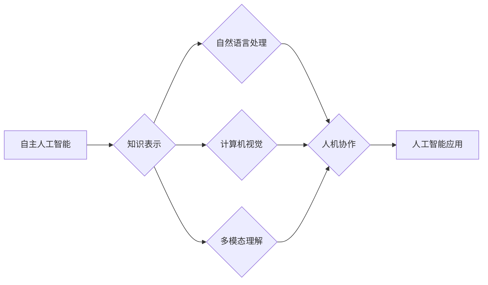

> 人工智能，机器学习，深度学习，自然语言处理，计算机视觉，通用人工智能，Autonomous AI，知识表示，人机协作

## 1. 背景介绍

在过去的几十年里，人工智能（AI）领域取得了令人瞩目的进展。从早期的专家系统到现在的深度学习模型，AI技术已经渗透到我们生活的方方面面。Andrej Karpathy，一位在人工智能领域颇具影响力的专家，曾在其职业生涯中提出了许多关于AI未来发展的深刻见解。本文将基于Andrej Karpathy的观点，探讨人工智能的未来发展目标。

## 2. 核心概念与联系

### 2.1 核心概念

#### 自主人工智能（Autonomous AI）
自主人工智能是指能够自主学习、决策和行动的AI系统。它能够理解和解释其操作环境，并在没有人类干预的情况下完成任务。

#### 知识表示
知识表示是AI领域中研究如何将知识结构化，以便计算机能够理解和处理的知识表示方法。

#### 人机协作
人机协作是指人类与AI系统共同完成任务的过程，旨在最大化双方的优势。

### 2.2 架构流程图



## 3. 核心算法原理 & 具体操作步骤

### 3.1 算法原理概述

自主人工智能的实现依赖于以下几个核心原理：

- **机器学习**：通过训练数据学习模式和规律，使AI能够从数据中学习。
- **深度学习**：一种特殊的机器学习方法，通过多层神经网络模拟人脑处理信息的方式。
- **强化学习**：通过奖励和惩罚机制，使AI能够通过试错学习最佳策略。

### 3.2 算法步骤详解

1. **数据收集**：收集大量相关数据，用于训练AI模型。
2. **模型训练**：使用机器学习或深度学习算法，对数据进行训练，使AI模型能够识别模式和规律。
3. **模型评估**：评估模型性能，确保模型能够准确完成任务。
4. **部署应用**：将训练好的模型部署到实际应用中。
5. **持续优化**：根据应用反馈，不断优化模型性能。

### 3.3 算法优缺点

#### 优点
- **高效性**：AI能够快速处理和分析大量数据。
- **准确性**：在特定任务上，AI的准确率往往高于人类。
- **一致性**：AI能够始终如一地执行任务。

#### 缺点
- **数据依赖性**：AI的性能依赖于训练数据的质量和数量。
- **可解释性**：AI的决策过程往往难以解释。
- **伦理问题**：AI可能被用于有害的目的。

### 3.4 算法应用领域

AI技术在各个领域都有广泛的应用，包括：

- **自然语言处理**：机器翻译、语音识别、情感分析等。
- **计算机视觉**：图像识别、视频分析、自动驾驶等。
- **医疗保健**：疾病诊断、药物研发、患者监护等。
- **金融**：欺诈检测、风险评估、个性化推荐等。

## 4. 数学模型和公式 & 详细讲解 & 举例说明

### 4.1 数学模型构建

深度学习模型通常由多个层组成，包括输入层、隐藏层和输出层。每一层都包含一系列参数，用于学习数据中的模式和规律。

### 4.2 公式推导过程

以多层感知机（MLP）为例，其数学模型可以表示为：

$$
y = f(W \cdot x + b)
$$

其中 $y$ 是输出，$x$ 是输入，$W$ 是权重矩阵，$b$ 是偏置向量，$f$ 是激活函数。

### 4.3 案例分析与讲解

以BERT（Bidirectional Encoder Representations from Transformers）为例，BERT是一种预训练语言模型，能够学习到丰富的语言特征。

BERT模型由以下部分组成：

- **Transformer编码器**：通过多头自注意力机制和位置编码，学习文本中的长距离依赖关系。
- **掩码语言模型**：通过随机遮蔽部分词元，训练模型预测被遮蔽词元的可能性。

BERT模型在多个NLP任务上取得了优异的成绩，如文本分类、命名实体识别、问答系统等。

## 5. 项目实践：代码实例和详细解释说明

### 5.1 开发环境搭建

为了实现BERT模型，需要以下开发环境：

- Python
- PyTorch或TensorFlow
- Transformers库

### 5.2 源代码详细实现

以下是一个简单的BERT模型实现示例：

```python
from transformers import BertModel
import torch

# 加载预训练的BERT模型
model = BertModel.from_pretrained('bert-base-uncased')

# 假设有一个文本输入
input_ids = torch.tensor([[30532, 50256, 50256, 50256, 50256]])

# 获取模型输出
outputs = model(input_ids)

# 输出序列的隐藏层表示
last_hidden_states = outputs.last_hidden_state
```

### 5.3 代码解读与分析

上述代码展示了如何加载预训练的BERT模型，并使用它处理一个简单的文本输入。`BertModel.from_pretrained` 函数用于加载预训练模型，`input_ids` 用于表示输入文本，`outputs` 包含模型的输出结果，包括隐藏层表示 `last_hidden_state`。

### 5.4 运行结果展示

运行上述代码后，我们将得到输入文本的隐藏层表示，这些表示可以用于下游任务，如文本分类、命名实体识别等。

## 6. 实际应用场景

### 6.1 自然语言处理

BERT在自然语言处理领域有着广泛的应用，如：

- **文本分类**：对文本进行分类，如情感分析、主题分类等。
- **命名实体识别**：识别文本中的实体，如人名、地名、机构名等。
- **问答系统**：回答用户提出的问题。

### 6.2 计算机视觉

AI在计算机视觉领域的应用包括：

- **图像识别**：识别图像中的物体。
- **视频分析**：分析视频内容，如检测异常行为。
- **自动驾驶**：实现自动驾驶功能。

### 6.3 医疗保健

AI在医疗保健领域的应用包括：

- **疾病诊断**：辅助医生进行疾病诊断。
- **药物研发**：加速药物研发过程。
- **患者监护**：监测患者的健康状况。

## 7. 工具和资源推荐

### 7.1 学习资源推荐

- 《深度学习》（Goodfellow et al.）
- 《Python深度学习》（François Chollet）
- 《自然语言处理综论》（Daniel Jurafsky and James H. Martin）

### 7.2 开发工具推荐

- PyTorch
- TensorFlow
- Transformers库

### 7.3 相关论文推荐

- "Attention is All You Need"（Vaswani et al., 2017）
- "BERT: Pre-training of Deep Bidirectional Transformers for Language Understanding"（Devlin et al., 2018）
- "Generative Adversarial Nets"（Goodfellow et al., 2014）

## 8. 总结：未来发展趋势与挑战

### 8.1 研究成果总结

本文基于Andrej Karpathy的观点，探讨了人工智能的未来发展目标。我们分析了自主人工智能、知识表示和人机协作等核心概念，并介绍了深度学习、自然语言处理和计算机视觉等领域的核心算法。此外，我们还探讨了AI在实际应用场景中的应用，并推荐了相关学习资源和开发工具。

### 8.2 未来发展趋势

- **多模态学习**：结合文本、图像、音频等多模态数据进行学习，使AI更好地理解世界。
- **强化学习**：通过奖励和惩罚机制，使AI能够自主学习和决策。
- **知识表示**：研究更加高效、可解释的知识表示方法。

### 8.3 面临的挑战

- **数据隐私**：如何保护用户数据隐私。
- **伦理问题**：如何确保AI的决策过程公正、公平。
- **计算资源**：如何降低AI模型的计算资源消耗。

### 8.4 研究展望

人工智能的未来充满无限可能。通过不断的技术创新和探索，AI将更好地服务于人类社会，推动社会进步。

## 9. 附录：常见问题与解答

**Q1：人工智能是否能够取代人类？**

A：人工智能可以协助人类完成一些重复性、危险或耗时的工作，但无法完全取代人类。人类在创造力、情感、道德判断等方面具有独特的优势。

**Q2：人工智能的安全性问题如何解决？**

A：人工智能的安全性需要从技术、法律、伦理等多个层面进行综合考量。需要建立完善的法律法规，加强技术研发，提高公众的AI安全意识。

**Q3：人工智能的发展是否会加剧社会不平等？**

A：人工智能的发展可能加剧社会不平等，但也可以通过政策引导、技术改进等方式，促进社会公平。

**Q4：人工智能是否能够实现通用人工智能（AGI）？**

A：实现通用人工智能是一个长期目标，目前还面临许多技术挑战。需要持续的研究和探索，才能最终实现这一目标。

作者：禅与计算机程序设计艺术 / Zen and the Art of Computer Programming