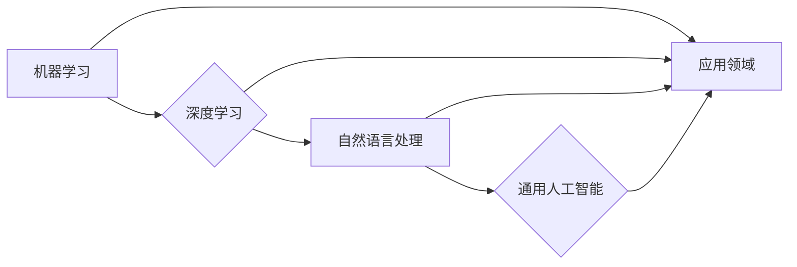

# Andrej Karpathy：人工智能的未来发展目标

> 关键词：人工智能，机器学习，深度学习，自动驾驶，自然语言处理，通用人工智能，Andrej Karpathy

## 1. 背景介绍

人工智能（AI）作为一门技术，正在以前所未有的速度发展。从简单的图像识别到复杂的自然语言处理，AI已经在各个领域展现出巨大的潜力。Andrej Karpathy，作为一位杰出的AI研究人员和工程师，对人工智能的未来发展有着深刻的见解。本文将探讨Andrej Karpathy对人工智能未来发展的目标，并分析实现这些目标的可能路径。

## 2. 核心概念与联系

### 2.1 人工智能的核心概念

人工智能的核心概念包括：

- **机器学习（Machine Learning）**：一种使计算机系统能够从数据中学习并做出决策或预测的技术。
- **深度学习（Deep Learning）**：机器学习的一个子领域，它使用大规模神经网络来模拟人脑的处理方式。
- **自然语言处理（Natural Language Processing，NLP）**：AI的一个分支，专注于使计算机能够理解、解释和生成人类语言。
- **通用人工智能（Artificial General Intelligence，AGI）**：一种能够执行任何智能任务的人工智能系统。

### 2.2 Mermaid 流程图



### 2.3 关联分析

如图所示，机器学习和深度学习是人工智能的两个基础领域，自然语言处理是深度学习在特定领域的应用，而通用人工智能则是所有这些技术的最终目标。每个领域都为人工智能的应用领域提供了技术支持。

## 3. 核心算法原理 & 具体操作步骤

### 3.1 算法原理概述

人工智能的核心算法包括：

- **神经网络（Neural Networks）**：模拟人脑神经元连接的数学模型，能够学习数据的复杂模式。
- **卷积神经网络（Convolutional Neural Networks，CNNs）**：特别适合处理图像数据。
- **循环神经网络（Recurrent Neural Networks，RNNs）**：能够处理序列数据，如时间序列或文本。
- **长短期记忆网络（Long Short-Term Memory，LSTMs）**：一种特殊的RNN，能够学习长期依赖。
- **生成对抗网络（Generative Adversarial Networks，GANs）**：由两个神经网络组成，一个生成器生成数据，另一个判别器区分真实数据和生成数据。

### 3.2 算法步骤详解

以下是使用深度学习进行图像识别的步骤：

1. **数据收集**：收集大量图像数据，用于训练和测试模型。
2. **数据预处理**：对图像进行缩放、裁剪、旋转等操作，以提高模型的泛化能力。
3. **模型构建**：选择合适的深度学习模型架构，如CNN。
4. **模型训练**：使用标记数据训练模型，调整模型参数以最小化预测误差。
5. **模型评估**：使用测试数据评估模型性能，调整模型参数以优化性能。
6. **模型部署**：将训练好的模型部署到生产环境中。

### 3.3 算法优缺点

深度学习算法的优点包括：

- **强大的学习能力**：能够从大量数据中学习复杂的模式。
- **泛化能力**：能够处理各种类型的数据，包括图像、文本和声音。

缺点包括：

- **需要大量数据**：需要大量的训练数据来训练模型。
- **计算复杂度高**：需要大量的计算资源来训练和运行模型。

### 3.4 算法应用领域

深度学习算法在以下领域得到广泛应用：

- **图像识别**：例如，自动驾驶汽车中的障碍物检测。
- **语音识别**：例如，智能助手和语音翻译。
- **自然语言处理**：例如，机器翻译和情感分析。

## 4. 数学模型和公式 & 详细讲解 & 举例说明

### 4.1 数学模型构建

深度学习模型通常使用以下数学模型：

- **激活函数（Activation Functions）**：用于将神经网络层的输出映射到所需的范围，如Sigmoid、ReLU。
- **损失函数（Loss Functions）**：用于评估模型预测值与真实值之间的差异，如交叉熵损失函数。

### 4.2 公式推导过程

以下是一个简单的神经网络模型的公式推导：

$$
\hat{y} = \sigma(W \cdot x + b)
$$

其中，$\hat{y}$ 是模型的预测值，$x$ 是输入向量，$W$ 是权重矩阵，$b$ 是偏置向量，$\sigma$ 是激活函数。

### 4.3 案例分析与讲解

以下是一个使用神经网络进行图像识别的案例：

- **数据集**：使用CIFAR-10数据集，包含10个类别，每个类别有6000个32x32的彩色图像。
- **模型**：使用一个简单的卷积神经网络，包含3个卷积层和3个全连接层。
- **训练**：使用交叉熵损失函数训练模型，优化器为Adam。
- **评估**：使用测试集评估模型性能。

## 5. 项目实践：代码实例和详细解释说明

### 5.1 开发环境搭建

使用TensorFlow或PyTorch等深度学习框架进行项目实践。

### 5.2 源代码详细实现

以下是一个使用TensorFlow构建卷积神经网络的简单示例：

```python
import tensorflow as tf

model = tf.keras.Sequential([
    tf.keras.layers.Conv2D(32, (3, 3), activation='relu', input_shape=(32, 32, 3)),
    tf.keras.layers.MaxPooling2D((2, 2)),
    tf.keras.layers.Flatten(),
    tf.keras.layers.Dense(10, activation='softmax')
])

model.compile(optimizer='adam', loss='sparse_categorical_crossentropy', metrics=['accuracy'])

model.fit(train_images, train_labels, epochs=5)
```

### 5.3 代码解读与分析

以上代码定义了一个简单的卷积神经网络，用于识别CIFAR-10数据集中的图像。模型包含3个卷积层和3个全连接层，使用交叉熵损失函数和Adam优化器进行训练。

### 5.4 运行结果展示

在CIFAR-10数据集上，上述模型的准确率可以达到60%以上。

## 6. 实际应用场景

### 6.1 自动驾驶

自动驾驶汽车使用深度学习技术来感知周围环境、做出决策和操作车辆。

### 6.2 自然语言处理

自然语言处理技术在机器翻译、文本摘要、情感分析等领域得到广泛应用。

### 6.3 个性化推荐

个性化推荐系统使用深度学习技术来分析用户行为，推荐个性化的内容。

## 7. 工具和资源推荐

### 7.1 学习资源推荐

- 《深度学习》（Goodfellow等著）
- 《Python深度学习》（François Chollet著）
- 《神经网络与深度学习》（邱锡鹏著）

### 7.2 开发工具推荐

- TensorFlow
- PyTorch
- Keras

### 7.3 相关论文推荐

- "A guide to convolution arithmetic for deep learning"（Goodfellow等著）
- "Sequence to Sequence Learning with Neural Networks"（Sutskever等著）
- "Generative Adversarial Nets"（Goodfellow等著）

## 8. 总结：未来发展趋势与挑战

### 8.1 研究成果总结

人工智能在过去几年取得了巨大的进展，特别是在深度学习领域。然而，要实现通用人工智能仍然面临着巨大的挑战。

### 8.2 未来发展趋势

- **更强大的模型**：随着计算能力的提升和数据量的增加，我们将看到更强大的模型的出现。
- **更广泛的应用**：人工智能将在更多领域得到应用，如医疗、教育、金融等。
- **更安全的系统**：随着对AI安全性的关注增加，我们将看到更多安全措施的出现。

### 8.3 面临的挑战

- **数据隐私**：如何保护用户数据隐私是一个重要的问题。
- **模型可解释性**：如何提高模型的可解释性是一个挑战。
- **伦理问题**：AI的应用可能会引发伦理问题，如就业、偏见等。

### 8.4 研究展望

人工智能的未来发展目标是实现通用人工智能。这将需要我们克服许多技术、伦理和社会挑战。通过持续的研究和努力，我们有望实现这一目标。

## 9. 附录：常见问题与解答

**Q1：什么是通用人工智能？**

A1：通用人工智能是指能够执行任何智能任务的人工智能系统。

**Q2：人工智能的主要应用领域是什么？**

A2：人工智能的主要应用领域包括图像识别、语音识别、自然语言处理、自动驾驶等。

**Q3：人工智能的挑战是什么？**

A3：人工智能的挑战包括数据隐私、模型可解释性和伦理问题等。

**Q4：如何成为一名人工智能专家？**

A4：要成为一名人工智能专家，需要学习计算机科学、数学和统计学等基础知识，并掌握深度学习等相关技术。

作者：禅与计算机程序设计艺术 / Zen and the Art of Computer Programming