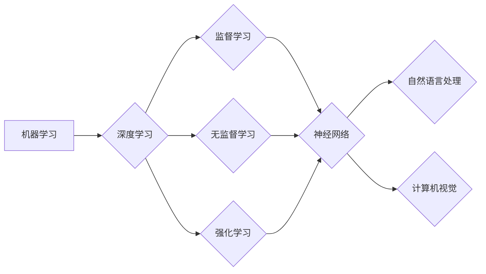

> 人工智能，未来趋势，深度学习，神经网络，机器学习，自然语言处理，计算机视觉，数据科学，伦理道德

# Andrej Karpathy：人工智能的未来发展策略

人工智能（AI）正处于快速发展阶段，其影响力正在渗透到社会、经济、科技等各个领域。作为人工智能领域的杰出代表，Andrej Karpathy以其深入的研究和对AI未来发展的独特见解，引发了全球的关注。本文将基于Andrej Karpathy的观点，探讨人工智能的未来发展策略。

## 1. 背景介绍

Andrej Karpathy是一位著名的人工智能专家、程序员和工程师，曾任职于Facebook的人工智能研究团队，负责开发和研究大规模深度学习模型。他因其出色的技术能力和对AI领域的深刻洞察而广受尊敬。本文将从Andrej Karpathy的角度出发，探讨人工智能的未来发展方向。

## 2. 核心概念与联系

### 2.1 核心概念原理

人工智能的核心概念包括：

- **机器学习**：机器学习是使计算机能够从数据中学习并做出决策或预测的技术。它包括监督学习、无监督学习、强化学习等子领域。
- **深度学习**：深度学习是机器学习的一个子领域，它使用深层神经网络来学习数据的复杂模式。
- **神经网络**：神经网络是一种模仿人脑神经元结构的计算模型，用于处理和解释数据。
- **自然语言处理（NLP）**：自然语言处理是人工智能的一个分支，它使计算机能够理解和生成自然语言。
- **计算机视觉**：计算机视觉是人工智能的一个分支，它使计算机能够理解图像和视频。

以下是核心概念原理的Mermaid流程图：



### 2.2 核心概念联系

这些核心概念相互关联，共同构成了人工智能的生态系统。机器学习是人工智能的基础，深度学习和神经网络是实现机器学习的关键技术。自然语言处理和计算机视觉是AI的两个重要应用领域，它们依赖于强大的机器学习模型来处理复杂的输入数据。

## 3. 核心算法原理 & 具体操作步骤

### 3.1 算法原理概述

人工智能的核心算法包括：

- **神经网络**：神经网络通过层的堆叠和前馈机制，从数据中学习模式和特征。
- **卷积神经网络（CNN）**：卷积神经网络在计算机视觉领域具有广泛的应用，它通过卷积操作提取图像特征。
- **递归神经网络（RNN）**：递归神经网络在处理序列数据时具有优势，如自然语言处理。
- **长短期记忆网络（LSTM）**：长短期记忆网络是一种特殊的RNN，能够处理长序列数据。
- **生成对抗网络（GAN）**：生成对抗网络由两个神经网络组成，一个生成器生成数据，另一个判别器判断数据的真实性。

### 3.2 算法步骤详解

以下是使用神经网络进行图像分类的基本步骤：

1. **数据预处理**：对图像数据进行标准化、归一化等处理，以便于模型学习。
2. **模型设计**：设计神经网络的结构，包括层数、神经元数量、激活函数等。
3. **模型训练**：使用标注数据训练模型，优化网络参数。
4. **模型评估**：使用测试数据评估模型的性能，调整模型参数。
5. **模型部署**：将训练好的模型部署到实际应用中。

### 3.3 算法优缺点

- **优点**：神经网络能够处理复杂的非线性问题，具有强大的特征学习能力。
- **缺点**：神经网络需要大量训练数据和计算资源，模型的可解释性较差。

### 3.4 算法应用领域

神经网络及其变体在各个领域都有广泛的应用，包括：

- **图像识别**：识别图片中的对象、场景、动作等。
- **自然语言处理**：处理和生成自然语言文本。
- **语音识别**：将语音信号转换为文本。
- **推荐系统**：推荐用户可能感兴趣的内容。
- **游戏**：实现智能游戏角色。

## 4. 数学模型和公式 & 详细讲解 & 举例说明

### 4.1 数学模型构建

神经网络的核心是神经元，每个神经元都是一个简单的计算单元。以下是单个神经元的数学模型：

$$
y = f(W_1x_1 + W_2x_2 + ... + W_nx_n + b)
$$

其中 $y$ 是神经元的输出，$x_1, x_2, ..., x_n$ 是输入，$W_1, W_2, ..., W_n$ 是权重，$b$ 是偏置，$f$ 是激活函数。

### 4.2 公式推导过程

激活函数 $f$ 可以是线性、Sigmoid、ReLU、Tanh等。以下是ReLU激活函数的推导过程：

$$
f(x) = \begin{cases} 
x & \text{if } x > 0 \\
0 & \text{if } x \leq 0 
\end{cases}
$$

### 4.3 案例分析与讲解

以下是一个简单的神经网络模型，用于识别手写数字：

- 输入层：28x28像素的灰度图像
- 隐藏层：64个神经元，使用ReLU激活函数
- 输出层：10个神经元，对应数字0-9，使用Softmax激活函数

该模型可以用于图像分类任务，输入一张手写数字图片，输出该数字的概率分布。

## 5. 项目实践：代码实例和详细解释说明

### 5.1 开发环境搭建

为了实践神经网络，我们需要以下开发环境：

- Python
- TensorFlow或PyTorch
- NumPy

### 5.2 源代码详细实现

以下是一个使用PyTorch实现的简单神经网络模型：

```python
import torch
import torch.nn as nn

class SimpleNet(nn.Module):
    def __init__(self):
        super(SimpleNet, self).__init__()
        self.fc1 = nn.Linear(28*28, 64)
        self.fc2 = nn.Linear(64, 10)
        
    def forward(self, x):
        x = x.view(-1, 28*28)
        x = torch.relu(self.fc1(x))
        x = self.fc2(x)
        return x

# 创建模型实例
model = SimpleNet()
```

### 5.3 代码解读与分析

上述代码定义了一个简单的神经网络模型，包含两个全连接层。输入层接收28x28像素的图像，隐藏层包含64个神经元，输出层包含10个神经元，对应数字0-9。

### 5.4 运行结果展示

我们可以使用MNIST数据集来训练和测试这个模型。以下是一个简单的训练和测试流程：

```python
import torch.optim as optim
from torchvision import datasets, transforms

# 加载数据集
transform = transforms.Compose([transforms.ToTensor()])
train_dataset = datasets.MNIST(root='./data', train=True, transform=transform, download=True)
test_dataset = datasets.MNIST(root='./data', train=False, transform=transform, download=True)

train_loader = torch.utils.data.DataLoader(train_dataset, batch_size=64, shuffle=True)
test_loader = torch.utils.data.DataLoader(test_dataset, batch_size=64, shuffle=False)

# 训练模型
criterion = nn.CrossEntropyLoss()
optimizer = optim.SGD(model.parameters(), lr=0.01)

for epoch in range(10):
    model.train()
    for images, labels in train_loader:
        optimizer.zero_grad()
        outputs = model(images)
        loss = criterion(outputs, labels)
        loss.backward()
        optimizer.step()
    
    # 测试模型
    model.eval()
    correct = 0
    total = 0
    with torch.no_grad():
        for images, labels in test_loader:
            outputs = model(images)
            _, predicted = torch.max(outputs.data, 1)
            total += labels.size(0)
            correct += (predicted == labels).sum().item()
    print(f'Accuracy of the network on the 10000 test images: {100 * correct / total}%')
```

## 6. 实际应用场景

### 6.1 医疗诊断

人工智能在医疗领域的应用潜力巨大。通过深度学习模型，可以自动分析医学影像，辅助医生进行疾病诊断，如肿瘤检测、心血管疾病筛查等。

### 6.2 金融服务

人工智能在金融服务领域也有广泛的应用，如风险评估、欺诈检测、智能投顾等。通过机器学习模型，可以分析客户数据，提供个性化的金融服务。

### 6.3 智能制造

人工智能可以用于智能制造领域，如质量检测、故障预测、生产优化等。通过传感器数据分析和机器学习模型，可以提高生产效率和产品质量。

## 7. 工具和资源推荐

### 7.1 学习资源推荐

- Coursera上的《机器学习》课程
- fast.ai的《深度学习》课程
- TensorFlow官方文档
- PyTorch官方文档

### 7.2 开发工具推荐

- Python
- TensorFlow或PyTorch
- Jupyter Notebook
- Google Colab

### 7.3 相关论文推荐

- "ImageNet Classification with Deep Convolutional Neural Networks" - Krizhevsky et al., 2012
- "Sequence to Sequence Learning with Neural Networks" - Sutskever et al., 2014
- "Attention Is All You Need" - Vaswani et al., 2017
- "BERT: Pre-training of Deep Bidirectional Transformers for Language Understanding" - Devlin et al., 2019

## 8. 总结：未来发展趋势与挑战

### 8.1 研究成果总结

人工智能在过去几十年取得了长足的进步，深度学习等技术的突破为AI应用打开了新的大门。然而，AI的发展也面临着诸多挑战，如数据隐私、算法偏见、可解释性等。

### 8.2 未来发展趋势

- **数据驱动**：随着数据量的爆炸式增长，数据将成为AI发展的核心驱动力。
- **多模态学习**：未来AI将能够处理和融合多种模态的数据，如文本、图像、音频等。
- **可解释性**：可解释性AI将成为研究的重点，以提高AI的透明度和可信度。
- **泛化能力**：提升AI的泛化能力，使其能够更好地适应新的环境和任务。

### 8.3 面临的挑战

- **数据隐私**：如何在保护用户隐私的前提下，利用数据训练AI模型，是一个亟待解决的问题。
- **算法偏见**：AI模型可能存在算法偏见，导致不公平的决策结果。
- **可解释性**：如何提高AI模型的可解释性，使其决策过程更加透明。
- **伦理道德**：AI的发展需要遵循伦理道德规范，避免潜在的负面影响。

### 8.4 研究展望

未来，人工智能将在各个领域发挥更大的作用，推动社会进步。为了实现这一目标，我们需要克服现有挑战，不断推动AI技术的发展和创新。

## 9. 附录：常见问题与解答

**Q1：人工智能的目的是什么？**

A：人工智能的目的是让计算机能够模拟人类的智能行为，如学习、推理、感知等，以解决实际问题，提高生产效率，改善人类生活。

**Q2：深度学习与机器学习有何区别？**

A：深度学习是机器学习的一个子领域，它使用深层神经网络来学习数据的复杂模式。机器学习则是一个更广泛的概念，包括深度学习、传统机器学习方法等。

**Q3：人工智能是否会取代人类工作？**

A：人工智能可以自动化许多重复性、低价值的工作，但同时也创造了新的工作机会。人工智能与人类的协作将成为未来工作的重要趋势。

**Q4：如何防止AI模型出现偏见？**

A：为了防止AI模型出现偏见，需要在数据收集、模型训练、模型部署等各个环节进行严格的质量控制。同时，需要建立相应的伦理道德规范，确保AI技术的公平性和公正性。

**Q5：人工智能的未来会是什么样子？**

A：人工智能的未来充满不确定性，但可以预见的是，它将继续发展，渗透到更多领域，为人类社会带来更多的便利和进步。

作者：禅与计算机程序设计艺术 / Zen and the Art of Computer Programming