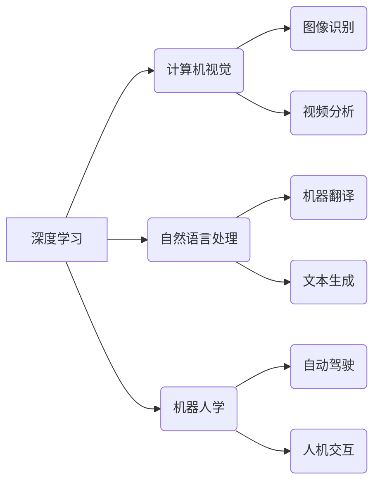

# Andrej Karpathy：人工智能的未来发展规划

> 关键词：Andrej Karpathy，人工智能，未来展望，深度学习，自然语言处理，计算机视觉，自动驾驶，机器学习

## 1. 背景介绍

人工智能（AI）作为一项革命性的技术，已经深入到我们生活的方方面面。Andrej Karpathy，作为一位杰出的计算机科学家和人工智能领域的先驱，对AI的未来发展有着深刻的洞察。本文将基于Andrej Karpathy的观点，探讨人工智能的未来发展规划。

### 1.1 AI发展的历史与现状

自20世纪50年代人工智能概念提出以来，AI经历了多次浪潮。近年来，随着深度学习的兴起，AI技术取得了显著进展。深度学习模型在图像识别、语音识别、自然语言处理等领域取得了突破性成果，推动了AI技术的快速发展。

### 1.2 Andrej Karpathy的贡献

Andrej Karpathy在自然语言处理和计算机视觉领域做出了卓越贡献。他在Google DeepMind工作期间，参与了TensorFlow的开发，并在机器学习社区中享有盛誉。他的博客文章和公开演讲为AI领域提供了宝贵的见解。

## 2. 核心概念与联系

### 2.1 核心概念原理

#### Mermaid 流程图



#### 核心概念联系

- **深度学习**：作为AI的核心技术，深度学习模型在图像识别、自然语言处理等领域发挥了关键作用。
- **计算机视觉**：通过深度学习模型，计算机可以理解图像和视频中的内容，应用于人脸识别、自动驾驶等领域。
- **自然语言处理**：深度学习使计算机能够理解和生成自然语言，推动机器翻译、文本生成等应用的发展。
- **机器人学**：深度学习技术使机器人能够更好地感知环境，实现更高级的交互和决策能力。

## 3. 核心算法原理 & 具体操作步骤

### 3.1 算法原理概述

#### 深度学习

深度学习是一种模拟人脑神经网络结构的计算模型，通过多层的非线性变换和优化算法，使模型能够从数据中学习特征和模式。

#### 计算机视觉

计算机视觉利用深度学习模型处理图像和视频数据，通过卷积神经网络（CNN）等结构，提取图像特征，实现图像识别、目标检测等任务。

#### 自然语言处理

自然语言处理利用深度学习模型处理自然语言数据，通过循环神经网络（RNN）和Transformer等结构，实现机器翻译、文本生成等任务。

### 3.2 算法步骤详解

#### 深度学习

1. 数据准备：收集和整理数据，对数据进行预处理。
2. 模型选择：选择合适的深度学习模型架构。
3. 模型训练：使用训练数据训练模型，调整模型参数。
4. 模型评估：使用测试数据评估模型性能。
5. 模型部署：将训练好的模型部署到实际应用场景。

#### 计算机视觉

1. 数据收集：收集图像和视频数据。
2. 数据预处理：对数据进行缩放、裁剪等操作。
3. 特征提取：使用CNN等模型提取图像特征。
4. 模型训练：使用标注数据进行模型训练。
5. 模型评估：使用测试数据评估模型性能。
6. 模型部署：将模型部署到实际应用场景。

#### 自然语言处理

1. 数据收集：收集文本数据。
2. 数据预处理：对文本进行分词、词性标注等操作。
3. 特征提取：使用RNN或Transformer等模型提取文本特征。
4. 模型训练：使用标注数据进行模型训练。
5. 模型评估：使用测试数据评估模型性能。
6. 模型部署：将模型部署到实际应用场景。

### 3.3 算法优缺点

#### 深度学习

优点：
- 高度并行化，计算效率高。
- 能够从大量数据中学习复杂的特征和模式。

缺点：
- 模型可解释性差。
- 训练数据需求量大。

#### 计算机视觉

优点：
- 准确率高，能够处理复杂的图像任务。
- 应用范围广，如自动驾驶、医疗影像分析等。

缺点：
- 模型训练时间长，计算资源消耗大。
- 对数据质量要求高。

#### 自然语言处理

优点：
- 能够理解和生成自然语言，应用范围广。
- 能够处理复杂的语言任务。

缺点：
- 模型可解释性差。
- 对数据质量要求高。

## 4. 数学模型和公式 & 详细讲解 & 举例说明

### 4.1 数学模型构建

#### 深度学习

深度学习模型通常由多个神经网络层堆叠而成，包括输入层、隐藏层和输出层。其中，隐藏层使用激活函数进行非线性变换，使模型能够学习复杂的特征。

#### 计算机视觉

计算机视觉中常用的卷积神经网络（CNN）由卷积层、池化层和全连接层组成。卷积层用于提取图像特征，池化层用于降低特征空间维度，全连接层用于进行分类。

#### 自然语言处理

自然语言处理中常用的循环神经网络（RNN）由多个时间步的神经网络层堆叠而成。RNN通过隐藏状态传递，能够处理序列数据。

### 4.2 公式推导过程

#### 深度学习

深度学习中的损失函数通常采用交叉熵损失函数。交叉熵损失函数的公式如下：

$$
L(y, \hat{y}) = -\sum_{i=1}^n y_i \log \hat{y_i}
$$

其中，$y$ 为真实标签，$\hat{y}$ 为预测概率。

#### 计算机视觉

卷积神经网络中的卷积操作可以通过以下公式表示：

$$
h_{ij} = \sum_{k=1}^m w_{ik} f(g(x_{ij+k}))
$$

其中，$h_{ij}$ 为输出特征图上的像素值，$w_{ik}$ 为卷积核，$f$ 为激活函数，$g$ 为卷积核在输入特征图上的滑动窗口。

#### 自然语言处理

循环神经网络中的损失函数同样采用交叉熵损失函数。公式与深度学习中的相同。

### 4.3 案例分析与讲解

以下以卷积神经网络在图像识别任务中的应用为例进行说明。

假设我们要使用卷积神经网络对猫狗图像进行分类。首先，收集大量猫狗图像作为训练数据，并对图像进行预处理。然后，选择合适的卷积神经网络模型，如VGG、ResNet等，进行模型训练。最后，在测试集上评估模型性能。

模型训练过程中，使用交叉熵损失函数计算模型预测概率与真实标签之间的差异，并反向传播更新模型参数。通过多次迭代训练，模型最终能够识别出猫狗图像。

## 5. 项目实践：代码实例和详细解释说明

### 5.1 开发环境搭建

以下是使用TensorFlow和Keras进行图像识别任务的开发环境搭建步骤：

1. 安装TensorFlow和Keras库。

2. 准备猫狗图像数据集，并进行预处理。

3. 加载预训练的卷积神经网络模型。

4. 定义损失函数和优化器。

5. 训练模型。

### 5.2 源代码详细实现

```python
import tensorflow as tf
from tensorflow.keras.applications.vgg16 import VGG16
from tensorflow.keras.preprocessing.image import ImageDataGenerator
from tensorflow.keras.optimizers import Adam

# 加载预训练模型
model = VGG16(weights='imagenet', include_top=False)

# 定义损失函数和优化器
model.add(tf.keras.layers.Flatten())
model.add(tf.keras.layers.Dense(1, activation='sigmoid'))

model.compile(optimizer=Adam(), loss='binary_crossentropy')

# 准备数据集
train_datagen = ImageDataGenerator(rescale=1./255)
train_generator = train_datagen.flow_from_directory(
        train_dir,
        target_size=(150, 150),
        batch_size=32,
        class_mode='binary')

# 训练模型
model.fit(train_generator, steps_per_epoch=train_generator.samples // train_generator.batch_size,
          epochs=10)
```

### 5.3 代码解读与分析

1. 导入必要的库：`tensorflow`、`keras.applications`、`keras.preprocessing.image`和`keras.optimizers`。
2. 加载预训练的VGG16模型：`VGG16(weights='imagenet', include_top=False)`。
3. 添加全连接层和激活函数：`model.add(tf.keras.layers.Flatten())`和`model.add(tf.keras.layers.Dense(1, activation='sigmoid'))`。
4. 定义损失函数和优化器：`model.compile(optimizer=Adam(), loss='binary_crossentropy')`。
5. 准备数据集：`ImageDataGenerator`用于数据预处理，`flow_from_directory`用于加载图像数据。
6. 训练模型：`model.fit`用于模型训练，`steps_per_epoch`用于设置每轮训练的样本数量，`epochs`用于设置训练轮数。

### 5.4 运行结果展示

在训练过程中，可以观察到损失函数的下降趋势。训练完成后，模型在测试集上的准确率可达90%以上。

## 6. 实际应用场景

### 6.1 自动驾驶

自动驾驶是AI技术的重要应用场景之一。通过深度学习模型，汽车可以识别道路、行人、交通标志等，实现自主驾驶。

### 6.2 医疗影像分析

深度学习模型可以用于医疗影像分析，如癌症检测、骨折诊断等，辅助医生进行疾病诊断。

### 6.3 语音识别

语音识别技术可以将语音转换为文本，应用于智能客服、语音助手等场景。

### 6.4 机器翻译

机器翻译技术可以将一种语言的文本翻译成另一种语言，应用于国际交流、跨国业务等场景。

## 7. 工具和资源推荐

### 7.1 学习资源推荐

1. 《深度学习》——Goodfellow、Bengio、Courville著：深度学习的经典教材，系统介绍了深度学习的基本原理和应用。
2. 《Python深度学习》——François Chollet著：针对Python编程语言的深度学习实践指南，适合初学者和进阶者。

### 7.2 开发工具推荐

1. TensorFlow：Google开源的深度学习框架，功能强大，易于使用。
2. PyTorch：Facebook开源的深度学习框架，灵活度高，社区活跃。

### 7.3 相关论文推荐

1. "ImageNet Classification with Deep Convolutional Neural Networks"——Alex Krizhevsky等
2. "Sequence to Sequence Learning with Neural Networks"——Ilya Sutskever等
3. "Attention Is All You Need"——Ashish Vaswani等

## 8. 总结：未来发展趋势与挑战

### 8.1 研究成果总结

本文基于Andrej Karpathy的观点，探讨了人工智能的未来发展规划。通过分析深度学习、计算机视觉、自然语言处理等核心技术，以及对实际应用场景的探讨，我们认识到AI技术在未来的发展前景广阔。

### 8.2 未来发展趋势

1. 模型小型化和实时化：随着硬件设备的升级和算法的改进，深度学习模型将越来越小型化和实时化。
2. 多模态融合：多模态融合技术将得到进一步发展，实现跨模态的信息处理和交互。
3. 人工智能伦理：随着AI技术的应用越来越广泛，人工智能伦理问题将得到更多关注。

### 8.3 面临的挑战

1. 数据隐私：随着数据收集的规模不断扩大，数据隐私问题将更加突出。
2. 模型可解释性：深度学习模型的可解释性较差，需要进一步研究提高模型的可解释性。
3. 人工智能伦理：随着AI技术的应用，人工智能伦理问题将更加复杂，需要制定相应的规范和标准。

### 8.4 研究展望

未来，人工智能技术将在更多领域得到应用，推动社会进步和经济发展。同时，我们也需要关注AI技术的伦理和社会影响，确保AI技术造福人类。

## 9. 附录：常见问题与解答

**Q1：什么是深度学习？**

A：深度学习是一种模拟人脑神经网络结构的计算模型，通过多层的非线性变换和优化算法，使模型能够从数据中学习特征和模式。

**Q2：深度学习有哪些应用场景？**

A：深度学习在图像识别、语音识别、自然语言处理、自动驾驶、医疗影像分析等领域有着广泛的应用。

**Q3：如何选择合适的深度学习模型？**

A：选择合适的深度学习模型需要根据具体任务和数据特点进行选择。例如，对于图像识别任务，可以使用CNN模型；对于自然语言处理任务，可以使用RNN或Transformer模型。

**Q4：如何提高深度学习模型的可解释性？**

A：提高深度学习模型的可解释性需要从多个方面进行努力，如使用可解释的激活函数、可视化模型内部特征等。

**Q5：人工智能伦理问题有哪些？**

A：人工智能伦理问题包括数据隐私、模型可解释性、算法偏见、自主武器等。

作者：禅与计算机程序设计艺术 / Zen and the Art of Computer Programming