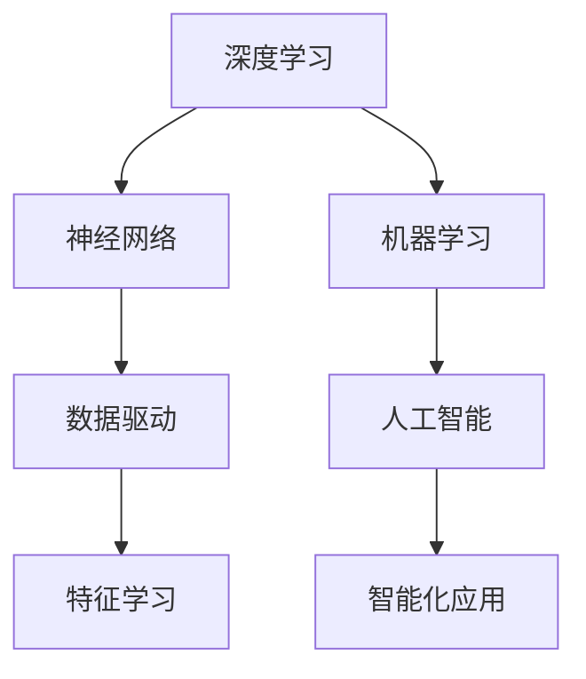

# Andrej Karpathy：人工智能的未来发展趋势

> 关键词：Andrej Karpathy，人工智能，深度学习，机器学习，神经网络，自然语言处理，计算机视觉，强化学习

## 1. 背景介绍

在人工智能领域，Andrej Karpathy是一位备受尊敬的专家，以其在深度学习和机器学习领域的贡献而闻名。他在Google Brain工作，曾是Tesla的AI项目负责人，并在多个顶级会议和媒体上发表过关于人工智能的见解。本文将探讨Andrej Karpathy所提出的关于人工智能未来发展趋势的观点，并分析这些趋势对技术和社会的影响。

### 1.1 Andrej Karpathy的贡献

Andrej Karpathy在自然语言处理（NLP）和计算机视觉（CV）领域做出了重要贡献。他开发了著名的Neural Talk模型，这是一个能够生成自然语言描述图像的神经网络。他还参与了TensorFlow的早期开发，并撰写了《The Unsupervised Teacher Forcing for Sequence Models》论文，提出了在序列模型中使用的无监督教师强制策略。

### 1.2 人工智能的发展现状

人工智能正在以前所未有的速度发展。深度学习技术的突破使得机器能够在图像识别、语音识别、自然语言理解等领域取得显著进展。然而，人工智能的发展也引发了一系列伦理、安全和社会问题，需要我们深入思考和应对。

## 2. 核心概念与联系

以下是大语言模型、神经网络和深度学习等核心概念之间的Mermaid流程图：



从图中可以看出，深度学习是人工智能的核心，它依赖于神经网络来进行特征学习和模式识别。机器学习则是人工智能的基础，它使计算机能够从数据中学习并作出决策。人工智能的目标是实现智能化应用，而深度学习是实现这一目标的强大工具。

## 3. 核心算法原理 & 具体操作步骤

### 3.1 算法原理概述

深度学习是一种模拟人脑神经网络结构和功能的技术，它通过多层神经网络来学习数据中的复杂模式。以下是深度学习的基本原理：

1. **输入层**：接收原始数据。
2. **隐藏层**：通过非线性激活函数处理输入数据，提取特征。
3. **输出层**：根据隐藏层的输出，产生最终的结果。

### 3.2 算法步骤详解

深度学习的基本步骤如下：

1. **数据收集**：收集大量带标签的数据，用于训练和验证模型。
2. **数据预处理**：对数据进行清洗、归一化等处理。
3. **模型设计**：选择合适的神经网络结构，包括层数和每层的神经元数量。
4. **训练模型**：使用损失函数和优化算法（如梯度下降）训练模型。
5. **模型评估**：使用验证集评估模型性能，调整模型参数。
6. **模型部署**：将训练好的模型部署到实际应用中。

### 3.3 算法优缺点

深度学习具有以下优点：

- 能够学习非常复杂的数据特征。
- 自动从数据中提取特征，无需手动设计特征。
- 在多个领域取得了显著的成果。

然而，深度学习也存在一些缺点：

- 计算资源需求高，需要大量的计算能力和存储空间。
- 难以解释模型的决策过程。
- 对数据质量和规模有较高要求。

### 3.4 算法应用领域

深度学习在多个领域得到了广泛应用，包括：

- 计算机视觉：图像识别、图像分割、目标检测等。
- 自然语言处理：机器翻译、文本生成、情感分析等。
- 语音识别：语音合成、语音识别、说话人识别等。
- 推荐系统：个性化推荐、商品推荐等。

## 4. 数学模型和公式 & 详细讲解 & 举例说明

### 4.1 数学模型构建

深度学习中的数学模型主要包括：

- 激活函数：如ReLU、Sigmoid、Tanh等。
- 损失函数：如交叉熵、均方误差等。
- 优化算法：如梯度下降、Adam等。

### 4.2 公式推导过程

以下是一个简单的神经网络模型及其训练过程的公式推导：

假设我们有一个单层神经网络，其中包含一个输入层、一个隐藏层和一个输出层。输入层有 $x_1, x_2, \ldots, x_n$ 个输入，隐藏层有 $h_1, h_2, \ldots, h_m$ 个神经元，输出层有 $y_1, y_2, \ldots, y_k$ 个输出。

- 隐藏层激活函数：
  $$
  h_i = \text{ReLU}(W_{h}x + b_h)
  $$
  其中 $W_h$ 是输入层到隐藏层的权重矩阵，$b_h$ 是隐藏层的偏置向量。

- 输出层激活函数：
  $$
  y_i = \text{Sigmoid}(W_{o}h + b_o)
  $$
  其中 $W_o$ 是隐藏层到输出层的权重矩阵，$b_o$ 是输出层的偏置向量。

- 损失函数（均方误差）：
  $$
  L = \frac{1}{2} \sum_{i=1}^{k} (y_i - \hat{y_i})^2
  $$
  其中 $y_i$ 是真实标签，$\hat{y_i}$ 是模型的预测值。

- 梯度下降：
  $$
  \theta_{\text{new}} = \theta_{\text{old}} - \alpha \nabla_{\theta}L
  $$
  其中 $\theta$ 是所有参数的集合，$\alpha$ 是学习率。

### 4.3 案例分析与讲解

以图像识别任务为例，我们可以使用卷积神经网络（CNN）来识别图像中的物体。

1. **数据收集**：收集大量带有标签的图像数据，用于训练和验证模型。
2. **数据预处理**：对图像进行归一化、裁剪、翻转等处理。
3. **模型设计**：选择合适的CNN结构，包括卷积层、池化层、全连接层等。
4. **训练模型**：使用损失函数和优化算法训练模型。
5. **模型评估**：使用验证集评估模型性能，调整模型参数。
6. **模型部署**：将训练好的模型部署到实际应用中。

CNN能够通过卷积操作提取图像中的局部特征，并通过池化操作减少特征数量，降低计算复杂度。在训练过程中，模型会不断学习图像中的特征，最终能够识别图像中的物体。

## 5. 项目实践：代码实例和详细解释说明

### 5.1 开发环境搭建

为了进行深度学习项目，我们需要安装以下软件：

- Python：深度学习的主要编程语言。
- TensorFlow或PyTorch：深度学习框架。
- NumPy：科学计算库。

### 5.2 源代码详细实现

以下是一个使用PyTorch实现的简单CNN模型：

```python
import torch
import torch.nn as nn

class SimpleCNN(nn.Module):
    def __init__(self):
        super(SimpleCNN, self).__init__()
        self.conv1 = nn.Conv2d(3, 6, 5)
        self.pool = nn.MaxPool2d(2, 2)
        self.conv2 = nn.Conv2d(6, 16, 5)
        self.fc1 = nn.Linear(16 * 5 * 5, 120)
        self.fc2 = nn.Linear(120, 84)
        self.fc3 = nn.Linear(84, 10)

    def forward(self, x):
        x = self.pool(nn.functional.relu(self.conv1(x)))
        x = self.pool(nn.functional.relu(self.conv2(x)))
        x = x.view(-1, 16 * 5 * 5)
        x = nn.functional.relu(self.fc1(x))
        x = nn.functional.relu(self.fc2(x))
        x = self.fc3(x)
        return x
```

### 5.3 代码解读与分析

在这个例子中，我们定义了一个简单的CNN模型，它包含两个卷积层、两个池化层和三个全连接层。卷积层用于提取图像特征，池化层用于减少特征数量，全连接层用于分类。

### 5.4 运行结果展示

运行上述代码，我们可以训练和测试CNN模型在MNIST数据集上的图像识别性能。

## 6. 实际应用场景

深度学习在多个领域得到了广泛应用，以下是一些典型的应用场景：

### 6.1 计算机视觉

- 图像识别：识别图像中的物体、场景等。
- 图像分割：将图像划分为不同的区域。
- 目标检测：定位图像中的物体并识别其类别。

### 6.2 自然语言处理

- 机器翻译：将一种语言翻译成另一种语言。
- 文本生成：生成自然语言文本。
- 情感分析：分析文本的情感倾向。

### 6.3 语音识别

- 语音合成：将文本转换为语音。
- 语音识别：将语音转换为文本。

## 7. 工具和资源推荐

### 7.1 学习资源推荐

- 《深度学习》[Goodfellow, Bengio, Courville]：深度学习的经典教材。
- 《神经网络与深度学习》[邱锡鹏]：中文深度学习教材。
- 《动手学深度学习》[花书]：基于PyTorch的深度学习实践指南。

### 7.2 开发工具推荐

- PyTorch：Facebook开发的开源深度学习框架。
- TensorFlow：Google开发的开源深度学习框架。
- Keras：基于Theano和TensorFlow的Python深度学习库。

### 7.3 相关论文推荐

- "A Neural Algorithm of Artistic Style" [Gatys, Ecker, Bethge]：基于生成对抗网络的图像风格迁移。
- "Generative Adversarial Nets" [Goodfellow et al.]：生成对抗网络。
- "Attention Is All You Need" [Vaswani et al.]：Transformer模型。

## 8. 总结：未来发展趋势与挑战

### 8.1 研究成果总结

本文介绍了Andrej Karpathy关于人工智能未来发展趋势的观点，分析了深度学习、神经网络和机器学习等核心概念，并探讨了人工智能在实际应用中的挑战和机遇。

### 8.2 未来发展趋势

- 深度学习模型将更加复杂，能够处理更复杂的数据和任务。
- 人工智能将与其他领域（如生物学、物理学）融合，产生新的交叉学科。
- 人工智能将在更多领域得到应用，改变我们的生活和工作方式。

### 8.3 面临的挑战

- 数据隐私和安全问题。
- 人工智能的伦理和道德问题。
- 人工智能的通用性和可解释性问题。

### 8.4 研究展望

- 开发更加安全、可靠、可解释的人工智能系统。
- 探索人工智能在不同领域的应用，如医疗、教育、交通等。
- 促进人工智能与人类社会的和谐发展。

## 9. 附录：常见问题与解答

**Q1：深度学习与机器学习的区别是什么？**

A：深度学习是机器学习的一个子领域，它使用多层神经网络来学习数据中的复杂模式。机器学习则是一个更广泛的概念，包括深度学习、支持向量机、决策树等多种算法。

**Q2：什么是神经网络？**

A：神经网络是一种模拟人脑神经元结构的计算模型，它通过调整神经元之间的连接权重来学习数据中的特征和模式。

**Q3：什么是深度学习？**

A：深度学习是一种利用多层神经网络进行学习的机器学习技术，它能够学习非常复杂的数据特征。

**Q4：深度学习有哪些应用？**

A：深度学习在多个领域得到了广泛应用，包括计算机视觉、自然语言处理、语音识别等。

**Q5：人工智能的未来发展趋势是什么？**

A：人工智能的未来发展趋势包括模型更加复杂、与其他领域融合、在更多领域得到应用等。

作者：禅与计算机程序设计艺术 / Zen and the Art of Computer Programming