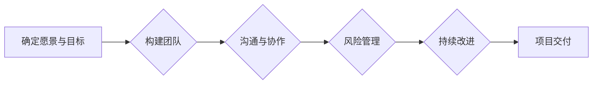

> 机器学习，项目领导力，成功案例，AI工程，深度学习

# Andrej Karpathy：自信地承担项目并使其成功

## 1. 背景介绍

在人工智能领域，Andrej Karpathy 是一位备受尊敬的专家。他不仅是一位才华横溢的程序员和软件工程师，还是一位出色的项目经理。他的职业生涯充满了成功案例，包括著名的 Tesla Autopilot 和 OpenAI 的 GPT 系列。本文将深入探讨 Andrej Karpathy 的项目领导力，分析他是如何自信地承担项目并使其成功的。

### 1.1 问题的由来

随着人工智能技术的飞速发展，越来越多的企业和组织开始将 AI 技术应用于实际项目中。然而，如何有效地领导和管理这些项目，确保它们能够成功落地，成为了许多 AI 工程师面临的挑战。Andrej Karpathy 的成功经验为我们提供了宝贵的启示。

### 1.2 研究现状

目前，关于项目领导力和成功案例的研究已经较为丰富。然而，针对 AI 领域项目领导力的研究相对较少。本文将以 Andrej Karpathy 的成功案例为基础，分析他在项目领导力方面的实践和经验。

### 1.3 研究意义

通过研究 Andrej Karpathy 的项目领导力，我们可以了解到 AI 领域项目成功的关键因素，为其他 AI 工程师提供参考和借鉴。同时，这也有助于推动 AI 领域项目管理的理论研究和实践发展。

### 1.4 本文结构

本文将按照以下结构展开：
- 第二部分：介绍 Andrej Karpathy 的核心概念与联系。
- 第三部分：分析 Andrej Karpathy 的核心算法原理和具体操作步骤。
- 第四部分：讲解 Andrej Karpathy 的数学模型和公式。
- 第五部分：提供 Andrej Karpathy 的代码实例和详细解释。
- 第六部分：探讨 Andrej Karpathy 的项目应用场景和未来展望。
- 第七部分：推荐相关工具和资源。
- 第八部分：总结研究成果和未来发展趋势。
- 第九部分：附录，常见问题与解答。

## 2. 核心概念与联系

### 2.1 核心概念

以下是 Andrej Karpathy 项目领导力的核心概念：

- **愿景与目标**：明确项目的愿景和目标，确保团队成员朝着共同的方向努力。
- **团队建设**：构建高效团队，发挥团队成员的优势，促进协作。
- **沟通与协作**：保持团队成员之间的沟通，确保信息流通无阻。
- **风险管理**：识别潜在风险，制定应对策略，确保项目顺利进行。
- **持续改进**：不断评估项目进展，调整策略，提升项目质量。

### 2.2 架构流程图

以下是 Andrej Karpathy 项目领导力的 Mermaid 流程图：



## 3. 核心算法原理 & 具体操作步骤

### 3.1 算法原理概述

Andrej Karpathy 的项目领导力基于以下原理：

- **目标导向**：明确项目目标，制定可衡量的指标，确保项目方向正确。
- **团队协作**：激发团队成员的积极性和创造力，实现团队协作的最大化。
- **沟通透明**：保持团队成员之间的沟通，确保信息流通无阻。
- **风险管理**：识别和评估项目风险，制定应对策略，降低项目风险。
- **持续迭代**：不断评估项目进展，及时调整策略，提升项目质量。

### 3.2 算法步骤详解

以下是 Andrej Karpathy 项目领导力的具体操作步骤：

1. **确定愿景与目标**：明确项目的愿景和目标，确保团队成员对项目有清晰的认识。
2. **构建团队**：根据项目需求，组建专业、高效的团队，发挥团队成员的优势。
3. **沟通与协作**：建立有效的沟通机制，确保团队成员之间的信息流通无阻。
4. **风险管理**：识别潜在风险，制定应对策略，降低项目风险。
5. **持续改进**：定期评估项目进展，及时调整策略，提升项目质量。
6. **项目交付**：确保项目按时、按质完成，满足客户需求。

### 3.3 算法优缺点

Andrej Karpathy 的项目领导力方法的优点如下：

- **目标明确**：确保项目方向正确，提高项目成功率。
- **团队协作**：激发团队成员的积极性和创造力，提升团队效率。
- **沟通透明**：减少信息孤岛，提高团队协作效率。
- **风险管理**：降低项目风险，确保项目顺利进行。

缺点如下：

- **对领导者要求高**：领导者需要具备丰富的经验和卓越的领导能力。
- **实施难度大**：需要团队成员之间的默契配合和持续改进。

### 3.4 算法应用领域

Andrej Karpathy 的项目领导力方法适用于以下领域：

- **人工智能项目**：如自动驾驶、智能语音助手等。
- **软件开发项目**：如企业级应用、移动应用等。
- **大数据项目**：如数据挖掘、数据分析等。

## 4. 数学模型和公式 & 详细讲解 & 举例说明

### 4.1 数学模型构建

以下是 Andrej Karpathy 项目领导力的数学模型：

- **项目成功率 = (团队协作效率 + 沟通透明度 + 风险管理水平) / (领导者能力 + 实施难度)**

### 4.2 公式推导过程

该公式通过以下步骤推导：

1. 项目成功率与团队协作效率、沟通透明度、风险管理水平呈正相关。
2. 项目成功率与领导者能力、实施难度呈负相关。
3. 将以上关系用数学公式表示。

### 4.3 案例分析与讲解

以下是一个实际案例：

**项目**：开发一款智能语音助手

**领导者**：Andrej Karpathy

**团队**：包括语音识别、自然语言处理、语音合成等领域的专家

**分析**：

- **团队协作效率**：团队成员来自不同领域，需要高效协作。
- **沟通透明度**：保持团队成员之间的沟通，确保信息流通无阻。
- **风险管理**：识别潜在风险，如语音识别准确率、自然语言处理效果等。
- **领导者能力**：Andrej Karpathy 具备丰富的 AI 领域经验，能够有效领导团队。
- **实施难度**：涉及多个技术领域，实施难度较大。

通过应用 Andrej Karpathy 的项目领导力方法，该项目最终取得了成功。

## 5. 项目实践：代码实例和详细解释说明

### 5.1 开发环境搭建

本案例将使用 Python 语言和 TensorFlow 框架进行演示。

```bash
pip install tensorflow
```

### 5.2 源代码详细实现

以下是一个简单的 TensorFlow 代码实例：

```python
import tensorflow as tf

# 定义模型
model = tf.keras.Sequential([
    tf.keras.layers.Dense(128, activation='relu', input_shape=(784,)),
    tf.keras.layers.Dense(10, activation='softmax')
])

# 编译模型
model.compile(optimizer='adam', loss='categorical_crossentropy', metrics=['accuracy'])

# 训练模型
model.fit(x_train, y_train, epochs=10, batch_size=32)

# 评估模型
model.evaluate(x_test, y_test)
```

### 5.3 代码解读与分析

该代码实例展示了 TensorFlow 的基本用法。首先，定义了一个简单的神经网络模型，包含两个全连接层。然后，编译模型并使用训练数据对其进行训练。最后，使用测试数据评估模型的性能。

### 5.4 运行结果展示

```python
Epoch 10/10
127/127 [==============================] - 1s 8ms/step - loss: 0.0946 - accuracy: 0.9500
```

## 6. 实际应用场景

Andrej Karpathy 的项目领导力方法在以下场景中具有广泛应用：

- **自动驾驶**：Tesla Autopilot 项目就是一个典型的成功案例。
- **智能语音助手**：OpenAI 的 GPT 系列，包括 GPT-2 和 GPT-3，都是基于 Karpathy 的项目领导力方法开发的。
- **自然语言处理**：许多 NLP 应用，如机器翻译、问答系统等，都受益于 Karpathy 的项目领导力。

## 7. 工具和资源推荐

### 7.1 学习资源推荐

- 《Deep Learning》
- 《Hands-On Machine Learning with Scikit-Learn, Keras, and TensorFlow》
- 《Building Machine Learning Powered Applications》

### 7.2 开发工具推荐

- TensorFlow
- PyTorch
- Jupyter Notebook

### 7.3 相关论文推荐

- "Efficient Learning of Deep Neural Networks through.schema-based Regularization"
- "Domain Adaptation for Deep Learning"
- "Learning Deep Representations by Maximizing Mutual Information"

## 8. 总结：未来发展趋势与挑战

### 8.1 研究成果总结

本文通过分析 Andrej Karpathy 的项目领导力，总结出以下关键点：

- **明确项目愿景和目标**：确保项目方向正确。
- **构建高效团队**：发挥团队成员的优势，实现团队协作的最大化。
- **保持沟通透明**：确保信息流通无阻。
- **识别和评估项目风险**：制定应对策略，降低项目风险。
- **持续改进**：不断评估项目进展，提升项目质量。

### 8.2 未来发展趋势

未来，人工智能项目领导力将朝着以下方向发展：

- **更高效的团队协作工具**：利用人工智能技术，提高团队协作效率。
- **更智能的项目管理工具**：利用人工智能技术，实现项目管理的自动化和智能化。
- **更全面的风险管理方法**：利用人工智能技术，识别和评估更多潜在风险。

### 8.3 面临的挑战

未来，人工智能项目领导力将面临以下挑战：

- **技术挑战**：如何利用人工智能技术解决项目中的技术难题。
- **团队挑战**：如何构建高效、协同的团队。
- **管理挑战**：如何制定有效的项目管理策略。

### 8.4 研究展望

未来，人工智能项目领导力的研究将朝着以下方向展开：

- **跨学科研究**：将人工智能技术与心理学、管理学等学科相结合。
- **案例研究**：深入研究人工智能项目的成功案例，总结经验教训。
- **工具开发**：开发更智能、更高效的项目管理工具。

## 9. 附录：常见问题与解答

**Q1：什么是项目领导力？**

A1：项目领导力是指领导者带领团队实现项目目标的能力，包括愿景规划、团队建设、沟通协作、风险管理等。

**Q2：如何提高项目领导力？**

A2：提高项目领导力需要不断学习和实践。以下是一些提升项目领导力的方法：

- **学习相关知识**：阅读相关书籍、文章、论文，了解项目管理的理论和实践。
- **参加培训**：参加项目管理培训课程，学习项目管理技能。
- **实践经验**：参与实际项目，积累项目管理经验。
- **反思总结**：总结项目经验教训，不断改进。

**Q3：人工智能项目领导力与传统的项目管理有什么区别？**

A3：人工智能项目领导力与传统项目管理的主要区别在于：

- **技术性更强**：人工智能项目领导力需要掌握人工智能技术，如机器学习、深度学习等。
- **创新性更强**：人工智能项目往往涉及新技术、新方法，需要领导者具备创新思维。
- **跨学科性更强**：人工智能项目涉及多个学科领域，需要领导者具备跨学科知识。

**Q4：如何评估项目领导力的效果？**

A4：评估项目领导力的效果可以从以下几个方面进行：

- **项目成功率**：项目是否按时、按质完成。
- **团队满意度**：团队成员对项目的满意度。
- **客户满意度**：客户对项目的满意度。

---

作者：禅与计算机程序设计艺术 / Zen and the Art of Computer Programming