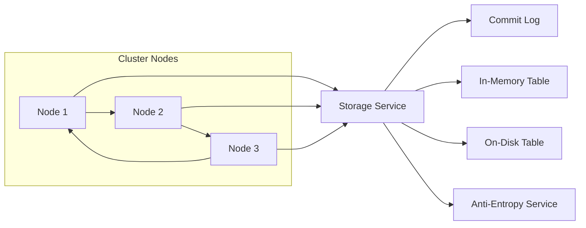

> 关键词：Cassandra, 非关系数据库, 分布式存储, 去中心化, 批量处理, 气候数据存储

# Cassandra原理与代码实例讲解

## 1. 背景介绍

在分布式系统中，数据存储的需求日益增长，尤其是对于需要处理大量数据的应用。传统的集中式数据库在扩展性和可伸缩性方面存在局限性，难以满足现代分布式系统的需求。Cassandra应运而生，作为一款开源的分布式NoSQL数据库，它以其高性能、高可用性和可伸缩性成为了许多企业的首选。本文将深入探讨Cassandra的原理，并通过代码实例进行详细讲解。

## 2. 核心概念与联系

### 2.1 核心概念

Cassandra的核心概念包括：

- **分布式存储**：Cassandra通过在多个节点上复制数据来提供高可用性和容错性。
- **去中心化**：Cassandra没有中心节点，所有节点对等，不存在单点故障的风险。
- **批量处理**：Cassandra支持批量插入和更新操作，可以显著提高效率。
- **一致性级别**：Cassandra提供了不同的数据一致性级别，可以根据具体需求进行配置。
- **故障转移**：Cassandra可以自动处理节点故障，确保数据不丢失。

### 2.2 架构图

以下是一个简化的Cassandra架构图，使用Mermaid语法表示：



- **Cluster Nodes**：表示Cassandra集群中的节点。
- **Storage Service**：负责数据的存储和检索。
- **Commit Log**：确保数据的持久性。
- **In-Memory Table**：用于快速访问。
- **On-Disk Table**：用于持久化数据。
- **Anti-Entropy Service**：用于数据同步和修复。

## 3. 核心算法原理 & 具体操作步骤

### 3.1 算法原理概述

Cassandra的算法原理主要包括：

- **Gossip协议**：用于节点发现和状态同步。
- **一致性哈希**：用于数据分布。
- **复制策略**：用于数据复制和故障转移。
- **分布式事务**：通过向量时钟和Paxos算法实现。

### 3.2 算法步骤详解

#### 3.2.1 Gossip协议

Gossip协议是Cassandra中的心跳机制，它允许节点之间交换状态信息。以下是Gossip协议的基本步骤：

1. 每个节点定期发送自己的状态信息到随机选择的节点。
2. 收到信息的节点将合并这些信息，并再次广播出去。
3. 随着时间的推移，所有节点的状态信息会逐渐同步。

#### 3.2.2 一致性哈希

一致性哈希是Cassandra数据分布的核心算法。以下是基本步骤：

1. 选择一个哈希函数对键进行哈希处理。
2. 将哈希值映射到一个环上。
3. 每个节点负责环上的一个或多个区域。
4. 数据根据键的哈希值存储在对应的节点上。

#### 3.2.3 复制策略

Cassandra支持多种复制策略，如简单复制、网络分区复制等。以下是简单复制策略的基本步骤：

1. 将数据复制到多个节点。
2. 复制因子默认为3，但可以根据需要调整。
3. 在发生故障时，自动从副本中选择一个新的主节点。

#### 3.2.4 分布式事务

Cassandra的分布式事务通过以下步骤实现：

1. 使用向量时钟记录每个操作的时间戳。
2. 使用Paxos算法达成共识。
3. 通过比较向量时钟和时间戳，确保操作的顺序。

### 3.3 算法优缺点

#### 3.3.1 优点

- 高性能：Cassandra支持高吞吐量和低延迟。
- 高可用性：无单点故障，数据自动复制和恢复。
- 可伸缩性：可以水平扩展，支持大规模数据存储。

#### 3.3.2 缺点

- 数据一致性：Cassandra的一致性保证较低，可能需要根据具体需求调整。
- 复杂性：Cassandra的管理和运维相对复杂。
- 事务支持：Cassandra的事务支持有限，对于需要强事务支持的场景可能不太适用。

### 3.4 算法应用领域

Cassandra适用于以下场景：

- 大规模数据存储：如日志数据、气象数据、物联网数据等。
- 高并发读写：如电子商务、在线游戏等。
- 分布式系统：如分布式缓存、分布式计算等。

## 4. 数学模型和公式 & 详细讲解 & 举例说明

### 4.1 数学模型构建

Cassandra的数学模型主要包括：

- **哈希函数**：用于数据分布，如MD5、SHA-256等。
- **一致性级别**：如强一致性、最终一致性等。
- **复制因子**：表示数据的副本数量。

### 4.2 公式推导过程

以下是一个简单的哈希函数的推导过程：

$$
\text{hash}(x) = \text{MD5}(x) \% \text{ring size}
$$

其中，$\text{hash}(x)$ 为数据的哈希值，$\text{ring size}$ 为环的尺寸。

### 4.3 案例分析与讲解

假设有一个包含1亿条数据的Cassandra集群，数据分布在100个节点上。使用上述哈希函数，每个节点大约存储1百万条数据。

## 5. 项目实践：代码实例和详细解释说明

### 5.1 开发环境搭建

为了实践Cassandra，你需要以下环境：

- Java开发环境
- Cassandra服务器
- 数据库客户端

### 5.2 源代码详细实现

以下是一个简单的Cassandra客户端示例，用于插入和查询数据：

```java
import com.datastax.driver.core.Cluster;
import com.datastax.driver.core.Session;

public class CassandraExample {
    public static void main(String[] args) {
        Cluster cluster = Cluster.builder().addContactPoint("127.0.0.1").build();
        Session session = cluster.connect("mykeyspace");

        // 创建表
        session.execute("CREATE TABLE mytable (key int PRIMARY KEY, value text)");

        // 插入数据
        session.execute("INSERT INTO mytable (key, value) VALUES (1, 'Hello Cassandra')");

        // 查询数据
        Row row = session.execute("SELECT value FROM mytable WHERE key = 1").first();
        System.out.println("Value: " + row.getString("value"));

        // 关闭连接
        session.close();
        cluster.close();
    }
}
```

### 5.3 代码解读与分析

上述代码展示了如何使用Cassandra客户端进行数据操作。首先，创建一个连接到Cassandra集群的`Cluster`对象。然后，通过`Cluster`对象获取一个`Session`对象，用于执行SQL-like的CQL语句。最后，通过`Session`对象执行创建表、插入和查询等操作。

### 5.4 运行结果展示

运行上述代码，你应该会在控制台看到以下输出：

```
Value: Hello Cassandra
```

这表明数据已经被成功插入和查询。

## 6. 实际应用场景

Cassandra在以下场景中得到了广泛应用：

- **大数据平台**：Cassandra是许多大数据平台的数据存储后端，如Apache Spark、Apache Hadoop等。
- **实时分析**：Cassandra可以用于实时分析用户行为、交易数据等。
- **物联网**：Cassandra可以处理来自传感器的海量数据。

## 7. 工具和资源推荐

### 7.1 学习资源推荐

- 《Cassandra: The Definitive Guide》
- Apache Cassandra官方文档
- Cassandrablog.com

### 7.2 开发工具推荐

- Apache Cassandra官方客户端
- DataStax DevCenter

### 7.3 相关论文推荐

- "Cassandra: A Decentralized Structure for Scalable Storage" by Avinash Lakshman and Pramod Narayanan

## 8. 总结：未来发展趋势与挑战

### 8.1 研究成果总结

Cassandra作为一款开源的分布式NoSQL数据库，以其高性能、高可用性和可伸缩性在分布式系统中得到了广泛应用。本文详细介绍了Cassandra的原理、算法、实践和实际应用场景，为读者提供了全面的理解和参考。

### 8.2 未来发展趋势

- 支持更多数据类型：Cassandra未来可能支持更多数据类型，如时间序列数据、图形数据等。
- 提高一致性保证：Cassandra可能会提供更高的一致性保证，以满足更多对数据一致性要求较高的场景。
- 提升易用性：Cassandra的运维和管理可能会更加简化，降低使用门槛。

### 8.3 面临的挑战

- 数据一致性：Cassandra需要在不牺牲性能的前提下提高数据一致性保证。
- 安全性：Cassandra需要加强安全性，以防止数据泄露和恶意攻击。
- 与新技术的兼容性：Cassandra需要与新技术（如人工智能、区块链等）保持兼容性。

### 8.4 研究展望

Cassandra将继续发展，以满足不断变化的分布式系统需求。未来的研究将集中在提高性能、安全性、易用性和兼容性等方面，以保持其在分布式数据库领域的领先地位。

## 9. 附录：常见问题与解答

**Q1：Cassandra与关系型数据库相比有哪些优势？**

A: Cassandra的主要优势包括高可用性、可伸缩性和高性能。它适合处理大量数据和高并发读写，而传统的关系型数据库在这些方面可能存在局限性。

**Q2：Cassandra的复制策略有哪些？**

A: Cassandra提供了多种复制策略，如简单复制、网络分区复制、多区域复制等。可以根据具体需求选择合适的复制策略。

**Q3：Cassandra的一致性级别有哪些？**

A: Cassandra提供了一致性级别，如强一致性、最终一致性等。可以根据具体需求选择合适的一致性级别。

**Q4：Cassandra如何保证数据的安全性？**

A: Cassandra提供了数据加密、访问控制等安全特性，以保护数据不被未授权访问。

**Q5：Cassandra适合哪些场景？**

A: Cassandra适合处理大规模数据和高并发读写，如大数据平台、实时分析、物联网等场景。

---

作者：禅与计算机程序设计艺术 / Zen and the Art of Computer Programming