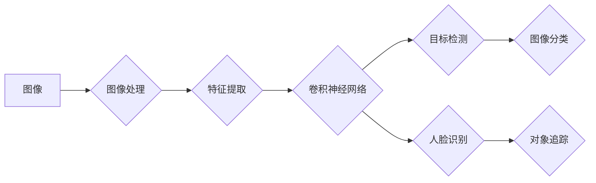

# Computer Vision (CV) 原理与代码实战案例讲解

> 关键词：计算机视觉，图像处理，深度学习，卷积神经网络，目标检测，图像分类，人脸识别，对象追踪

## 1. 背景介绍

计算机视觉（Computer Vision, CV）是人工智能的一个重要分支，旨在使计算机能够从图像和视频中理解视觉信息，并据此执行任务。从自动驾驶汽车到手机拍照，从医疗诊断到安全监控，CV技术在现代社会中扮演着越来越重要的角色。本文将深入探讨CV的原理，并通过代码实战案例展示如何将理论应用于实践。

### 1.1 问题的由来

计算机视觉技术的需求源于人类对视觉信息的依赖。人类通过视觉获取了大部分外界信息，因此能够快速、准确地理解和适应周围环境。计算机视觉的目标是实现机器与人类相似的视觉能力，让机器能够“看”和理解图像。

### 1.2 研究现状

随着深度学习技术的快速发展，CV领域取得了显著的进步。特别是卷积神经网络（Convolutional Neural Networks, CNNs）的出现，使得CV任务的自动化和智能化成为可能。目前，CV技术在图像分类、目标检测、图像分割、人脸识别等方面都取得了显著的成果。

### 1.3 研究意义

CV技术的研究对于推动人工智能技术的发展具有重要意义。它不仅能够提升人类生活质量，还能为工业、医疗、安全等众多领域带来革命性的变革。

### 1.4 本文结构

本文将分为以下几个部分：
- 2. 核心概念与联系
- 3. 核心算法原理 & 具体操作步骤
- 4. 数学模型和公式 & 详细讲解 & 举例说明
- 5. 项目实践：代码实例和详细解释说明
- 6. 实际应用场景
- 7. 工具和资源推荐
- 8. 总结：未来发展趋势与挑战
- 9. 附录：常见问题与解答

## 2. 核心概念与联系

### 2.1 核心概念

- **图像处理（Image Processing）**：对图像进行各种操作，如滤波、边缘检测、特征提取等，以改善图像质量和提取有用信息。
- **特征提取（Feature Extraction）**：从图像中提取具有区分性的特征，以便后续的图像分析和理解。
- **卷积神经网络（CNN）**：一种用于图像识别和图像处理的深度学习模型，能够自动学习图像特征。
- **目标检测（Object Detection）**：在图像中定位并识别出特定的对象。
- **图像分类（Image Classification）**：将图像分类到预定义的类别中。
- **人脸识别（Face Recognition）**：识别图像中的人脸，并确定其身份。
- **对象追踪（Object Tracking）**：在视频序列中跟踪物体的运动轨迹。

### 2.2 Mermaid 流程图



### 2.3 核心概念联系

图像处理是CV的基础，通过图像处理可以提取出图像的特征。这些特征随后可以被卷积神经网络（CNN）学习，以执行更高级的任务，如目标检测、图像分类、人脸识别和对象追踪。

## 3. 核心算法原理 & 具体操作步骤

### 3.1 算法原理概述

CV算法主要分为以下几类：

- **传统CV算法**：基于图像处理技术，如边缘检测、特征匹配等。
- **深度学习CV算法**：基于深度神经网络，如CNN、RNN等。
- **强化学习CV算法**：结合强化学习技术，实现智能视觉系统的自主决策。

### 3.2 算法步骤详解

以下是CV算法的一般步骤：

1. **图像预处理**：对图像进行缩放、裁剪、翻转等操作，以适应后续的算法处理。
2. **图像处理**：使用图像处理技术提取图像特征，如边缘检测、角点检测、纹理分析等。
3. **特征提取**：使用特征提取技术提取图像特征，如SIFT、HOG、CNN等。
4. **模型训练**：使用提取的特征训练深度学习模型，如CNN、RNN等。
5. **模型评估**：使用测试数据评估模型的性能，并根据需要调整模型参数。
6. **模型应用**：将训练好的模型应用于新的图像数据，进行预测或决策。

### 3.3 算法优缺点

**传统CV算法**：

- 优点：计算量小，易于实现。
- 缺点：性能受限于手工设计的特征，难以处理复杂场景。

**深度学习CV算法**：

- 优点：性能优异，能够处理复杂场景。
- 缺点：计算量大，需要大量数据训练。

**强化学习CV算法**：

- 优点：能够实现智能视觉系统的自主决策。
- 缺点：训练过程复杂，需要大量时间和资源。

### 3.4 算法应用领域

CV算法在以下领域有广泛的应用：

- **图像分类**：如图片搜索引擎、内容审核、医疗影像诊断等。
- **目标检测**：如自动驾驶、视频监控、工业检测等。
- **人脸识别**：如门禁系统、安全监控、个人隐私保护等。
- **对象追踪**：如视频监控、运动分析、机器人导航等。

## 4. 数学模型和公式 & 详细讲解 & 举例说明

### 4.1 数学模型构建

CV算法中的数学模型主要包括：

- **图像处理模型**：如滤波器、边缘检测算子、特征变换等。
- **特征提取模型**：如SIFT、HOG、CNN等。
- **深度学习模型**：如卷积层、池化层、全连接层等。

### 4.2 公式推导过程

以下是一些常见的CV公式推导过程：

- **高斯滤波**：使用高斯函数作为滤波器，平滑图像。
- **Sobel算子**：用于边缘检测，计算图像边缘的强度。
- **HOG特征**：通过计算图像的梯度直方图来提取特征。
- **CNN结构**：卷积层、池化层、全连接层的组合。

### 4.3 案例分析与讲解

以CNN为例，讲解其结构和工作原理：

- **卷积层**：通过卷积操作提取图像特征。
- **池化层**：降低特征的空间维度，减少计算量。
- **全连接层**：将特征映射到类别标签。

## 5. 项目实践：代码实例和详细解释说明

### 5.1 开发环境搭建

1. 安装Python环境。
2. 安装深度学习库，如TensorFlow、PyTorch等。
3. 安装图像处理库，如OpenCV、PIL等。

### 5.2 源代码详细实现

以下是一个简单的图像分类模型的实现：

```python
import tensorflow as tf
from tensorflow.keras.models import Sequential
from tensorflow.keras.layers import Conv2D, MaxPooling2D, Flatten, Dense

# 构建模型
model = Sequential()
model.add(Conv2D(32, (3, 3), activation='relu', input_shape=(64, 64, 3)))
model.add(MaxPooling2D((2, 2)))
model.add(Conv2D(64, (3, 3), activation='relu'))
model.add(MaxPooling2D((2, 2)))
model.add(Flatten())
model.add(Dense(10, activation='softmax'))

# 编译模型
model.compile(optimizer='adam', loss='categorical_crossentropy', metrics=['accuracy'])

# 训练模型
model.fit(train_images, train_labels, validation_data=(test_images, test_labels), epochs=5)

# 评估模型
model.evaluate(test_images, test_labels)
```

### 5.3 代码解读与分析

这段代码使用TensorFlow构建了一个简单的卷积神经网络，用于图像分类。首先定义了一个Sequential模型，然后添加了卷积层、池化层、平坦层和全连接层。接着，使用adam优化器和交叉熵损失函数编译模型，并在训练数据上进行训练。最后，在测试数据上评估模型的性能。

### 5.4 运行结果展示

运行上述代码后，模型会在训练集和测试集上进行训练和评估，输出训练过程和评估结果。

## 6. 实际应用场景

### 6.1 图像分类

图像分类是CV领域最基础的任务之一，例如：

- **图片搜索引擎**：将用户上传的图片与数据库中的图片进行匹配，返回相似图片。
- **内容审核**：自动识别并过滤不适宜的图片或视频内容。

### 6.2 目标检测

目标检测是CV领域的一个重要任务，例如：

- **自动驾驶**：在实时视频流中检测并跟踪行人、车辆等对象。
- **视频监控**：自动识别并报警异常行为，如盗窃、斗殴等。

### 6.3 人脸识别

人脸识别是CV领域的一个热门应用，例如：

- **门禁系统**：自动识别和验证人员的身份。
- **安全监控**：识别可疑人员，提高安全防范能力。

### 6.4 对象追踪

对象追踪是CV领域的一个挑战性任务，例如：

- **视频监控**：跟踪特定对象在视频中的运动轨迹。
- **机器人导航**：使机器人能够自主导航，避开障碍物。

## 7. 工具和资源推荐

### 7.1 学习资源推荐

- **《Computer Vision: Algorithms and Applications》**：一本全面介绍CV算法和应用的书。
- **《Deep Learning》**：由Ian Goodfellow、Yoshua Bengio和Aaron Courville合著的深度学习经典教材。
- **《Pattern Recognition and Machine Learning》**：Christopher Bishop的机器学习经典教材，涵盖了CV的基本概念。

### 7.2 开发工具推荐

- **TensorFlow**：由Google开发的开源深度学习框架。
- **PyTorch**：由Facebook开发的开源深度学习框架。
- **OpenCV**：一个开源计算机视觉库。

### 7.3 相关论文推荐

- **“A Comprehensive Survey of Convolutional Neural Networks”**：一篇关于CNN的全面综述。
- **“You Only Look Once: Unified, Real-Time Object Detection”**：一篇关于目标检测的论文。
- **“FaceNet: A Unified Embedding for Face Recognition and Clustering”**：一篇关于人脸识别的论文。

## 8. 总结：未来发展趋势与挑战

### 8.1 研究成果总结

CV技术在过去几十年取得了长足的进步，特别是在深度学习技术的推动下。CV算法在图像分类、目标检测、人脸识别等领域取得了显著的成果。

### 8.2 未来发展趋势

- **多模态学习**：结合图像、文本、语音等多种模态信息，提高CV算法的鲁棒性和泛化能力。
- **可解释性**：提高CV算法的可解释性，使其决策过程更加透明。
- **轻量级模型**：开发轻量级CV模型，降低计算资源和能源消耗。

### 8.3 面临的挑战

- **数据标注**：高质量的标注数据是CV算法训练的关键，但数据标注成本高、耗时长。
- **模型泛化能力**：CV算法在特定领域的数据上表现良好，但在其他领域可能失效。
- **隐私保护**：CV算法在处理个人隐私数据时，需要考虑隐私保护问题。

### 8.4 研究展望

CV技术的未来将更加注重跨学科交叉，结合计算机视觉、机器学习、认知科学等领域的知识，推动CV技术的发展和应用。

## 9. 附录：常见问题与解答

**Q1：CV算法与传统图像处理算法有什么区别？**

A：CV算法是基于深度学习的，能够自动学习图像特征，而传统图像处理算法是基于图像处理技术，如滤波、边缘检测等。

**Q2：如何提高CV算法的鲁棒性？**

A：提高CV算法的鲁棒性可以通过多种方式实现，如数据增强、迁移学习、多模型集成等。

**Q3：CV算法在实际应用中面临哪些挑战？**

A：CV算法在实际应用中面临的挑战包括数据标注、模型泛化能力、隐私保护等。

作者：禅与计算机程序设计艺术 / Zen and the Art of Computer Programming