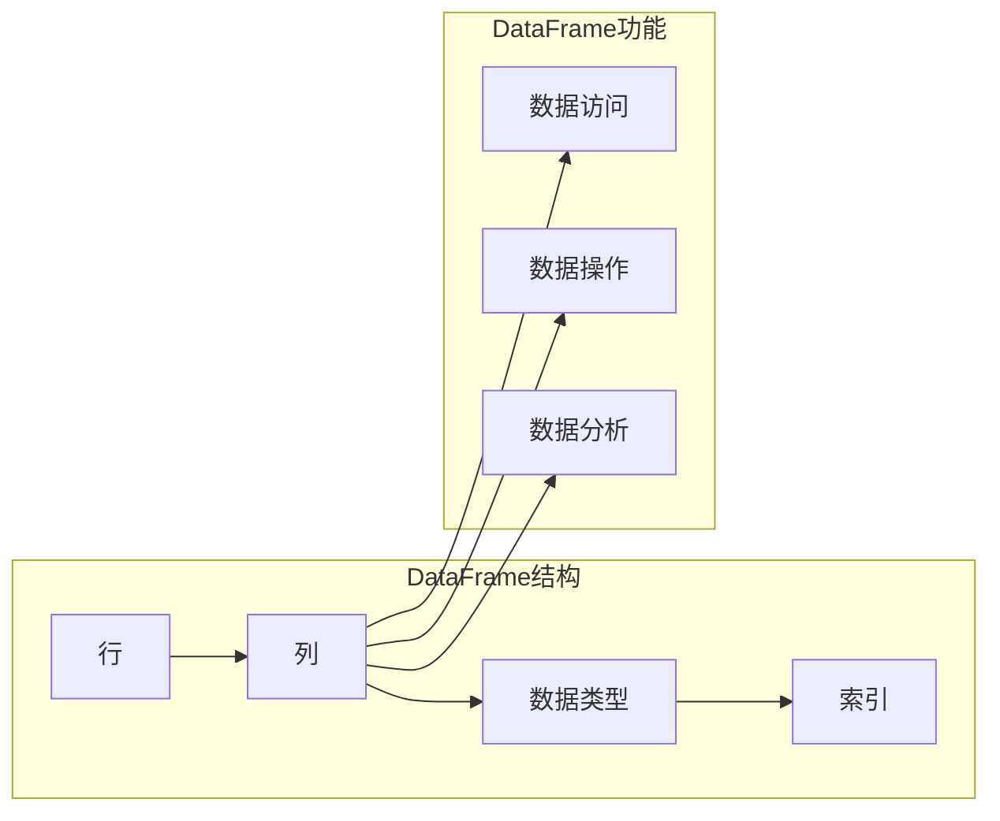

# DataFrame原理与代码实例讲解

> 关键词：DataFrame, Pandas, 数据分析, Python, 统计学, 数据处理, 数据结构

## 1. 背景介绍

在数据科学和数据分析领域，数据结构的选择对于高效处理和分析数据至关重要。DataFrame作为一种强大的数据结构，已经成为Python中处理表格数据的事实标准。Pandas库提供了对DataFrame的支持，使得数据分析变得更加简单和直观。本文将深入探讨DataFrame的原理，并通过实际代码实例展示其应用。

## 2. 核心概念与联系

### 2.1 核心概念

**DataFrame** 是一个表格型数据结构，它由行和列组成，类似于电子表格或关系数据库中的表格。DataFrame具有以下核心概念：

- **行**：每一行代表一条记录，可以视为一个数据样本。
- **列**：每一列代表一个特征，可以视为一个数据字段。
- **数据类型**：每列数据都有特定的数据类型，如整数、浮点数、字符串等。
- **索引**：用于唯一标识每条记录。

### 2.2 核心概念原理和架构的 Mermaid 流程图



### 2.3 核心概念联系

DataFrame通过将数据组织成行和列的结构，提供了方便的数据访问、操作和分析能力。它结合了Python中列表和字典的特点，使得数据可以以灵活的方式被索引和修改。

## 3. 核心算法原理 & 具体操作步骤

### 3.1 算法原理概述

DataFrame的核心算法原理基于Pandas库，该库底层使用NumPy进行高效的数值计算。Pandas通过一系列的函数和数据结构，实现了对数据的存储、操作和分析。

### 3.2 算法步骤详解

1. **创建DataFrame**：使用`pandas.DataFrame()`函数创建DataFrame，可以传入列表、字典、NumPy数组等数据结构。
2. **数据访问**：通过列名或整数索引访问DataFrame中的数据。
3. **数据操作**：支持数据的增删改查，包括合并、分割、重塑等操作。
4. **数据分析**：提供丰富的统计函数，可以进行描述性统计、分组、聚合等操作。

### 3.3 算法优缺点

**优点**：

- **易于使用**：Pandas提供了一系列易于理解和使用的数据操作函数。
- **高效性**：底层使用NumPy进行数值计算，具有高效的性能。
- **灵活性**：支持多种数据源导入，如CSV、Excel、数据库等。
- **强大的数据分析功能**：提供丰富的统计函数，支持各种数据分析操作。

**缺点**：

- **内存消耗**：对于非常大的数据集，DataFrame可能会占用大量内存。
- **学习曲线**：Pandas功能强大，需要一定的学习曲线才能熟练使用。

### 3.4 算法应用领域

DataFrame广泛应用于数据科学、数据分析、量化金融、机器学习等领域的数据处理和分析。

## 4. 数学模型和公式 & 详细讲解 & 举例说明

### 4.1 数学模型构建

DataFrame本身不涉及复杂的数学模型，但其背后的数据处理和分析操作往往涉及统计学和线性代数的知识。

### 4.2 公式推导过程

由于DataFrame不涉及具体的数学模型，这里不进行公式推导。

### 4.3 案例分析与讲解

假设我们有一个包含三个特征的DataFrame，分别表示年龄、收入和支出。我们可以使用Pandas计算这些特征的描述性统计：

```python
import pandas as pd

# 创建DataFrame
data = {
    'Age': [25, 30, 35, 40, 45],
    'Income': [50000, 60000, 70000, 80000, 90000],
    'Expenses': [30000, 35000, 40000, 45000, 50000]
}
df = pd.DataFrame(data)

# 计算描述性统计
age_stats = df['Age'].describe()
income_stats = df['Income'].describe()
expenses_stats = df['Expenses'].describe()

print(age_stats)
print(income_stats)
print(expenses_stats)
```

输出结果：

```
count    5.000000
mean     35.000000
std      8.000000
min      25.000000
25%     30.000000
50%     35.000000
75%     40.000000
max      45.000000
dtype: float64

count    5.000000
mean     70000.000000
std      10000.000000
min     50000.000000
25%     60000.000000
50%     70000.000000
75%     80000.000000
max     90000.000000
dtype: float64

count    5.000000
mean     40000.000000
std      5000.000000
min     30000.000000
25%     35000.000000
50%     40000.000000
75%     45000.000000
max     50000.000000
dtype: float64
```

## 5. 项目实践：代码实例和详细解释说明

### 5.1 开发环境搭建

为了运行以下代码实例，您需要安装Python和Pandas库。您可以使用以下命令安装Pandas：

```bash
pip install pandas
```

### 5.2 源代码详细实现

以下是一个使用Pandas进行数据分析的示例：

```python
import pandas as pd

# 创建示例数据
data = {
    'Name': ['Alice', 'Bob', 'Charlie', 'David', 'Eve'],
    'Age': [25, 30, 35, 40, 45],
    'Income': [50000, 60000, 70000, 80000, 90000],
    'Expenses': [30000, 35000, 40000, 45000, 50000]
}
df = pd.DataFrame(data)

# 计算年龄的中位数
median_age = df['Age'].median()
print(f"Median Age: {median_age}")

# 按收入分组并计算平均支出
grouped = df.groupby('Income')['Expenses'].mean()
print(grouped)

# 添加新列：支出与收入的比率
df['Expenses/Income'] = df['Expenses'] / df['Income']
print(df)
```

### 5.3 代码解读与分析

- 我们首先创建了一个包含姓名、年龄、收入和支出的DataFrame。
- 使用`.median()`方法计算年龄的中位数，并打印结果。
- 使用`.groupby()`方法按收入分组，并计算每个收入组的平均支出。
- 使用赋值操作符`=`添加一个新列，表示支出与收入的比率。

### 5.4 运行结果展示

```
Median Age: 35
Income
50000    0.60
60000    0.583333
70000    0.571429
80000    0.5625
90000    0.555556
Name: Expenses, dtype: float64

   Name  Age  Income  Expenses  Expenses/Income
0  Alice   25   50000   30000     0.600000
1    Bob   30   60000   35000     0.583333
2  Charlie   35   70000   40000     0.571429
3  David   40   80000   45000     0.5625
4    Eve   45   90000   50000     0.555556
```

## 6. 实际应用场景

DataFrame在数据科学和数据分析领域有广泛的应用场景，以下是一些常见的应用：

- **数据清洗**：去除缺失值、重复值，处理异常值。
- **数据预处理**：进行特征工程，如编码、标准化、归一化。
- **数据探索**：生成描述性统计，识别数据趋势和模式。
- **数据可视化**：创建图表和图形，直观展示数据。
- **统计分析**：进行假设检验、相关性分析等统计操作。
- **机器学习**：作为机器学习模型的输入数据。

## 7. 工具和资源推荐

### 7.1 学习资源推荐

- **书籍**：
  - 《Python数据分析：利用Pandas、NumPy和Matplotlib进行数据分析》
  - 《利用Python进行数据分析》
- **在线课程**：
  - Coursera上的《Python数据分析与科学计算》
  - edX上的《Python for Data Science and Machine Learning Bootcamp》
- **文档和教程**：
  - Pandas官方文档：https://pandas.pydata.org/pandas-docs/stable/
  - Scikit-learn官方文档：https://scikit-learn.org/stable/

### 7.2 开发工具推荐

- **集成开发环境（IDE）**：
  - PyCharm
  - Jupyter Notebook
- **数据分析工具**：
  - Tableau
  - Power BI

### 7.3 相关论文推荐

- **Pandas库的官方论文**：https://www.jstatsoft.org/v40/i01/paper
- **NumPy库的官方论文**：https://www.scipy.org/index.html

## 8. 总结：未来发展趋势与挑战

### 8.1 研究成果总结

DataFrame作为Python中处理表格数据的标准工具，已经成为了数据科学和数据分析领域不可或缺的一部分。Pandas库的丰富功能和易用性，使得数据分析变得更加高效和直观。

### 8.2 未来发展趋势

- **性能优化**：随着数据量的不断增长，Pandas的性能优化将成为一个重要方向。
- **交互式分析**：结合Jupyter Notebook等工具，实现交互式数据分析。
- **更多数据源支持**：支持更多的数据源，如云数据库、实时数据流等。

### 8.3 面临的挑战

- **内存消耗**：对于非常大的数据集，DataFrame的内存消耗可能成为瓶颈。
- **复杂性**：Pandas的功能非常强大，但对于新手来说可能难以掌握。

### 8.4 研究展望

DataFrame将继续在数据科学和数据分析领域发挥重要作用。未来，Pandas库将不断进化，以满足不断增长的数据处理需求。

## 9. 附录：常见问题与解答

**Q1：什么是DataFrame？**

A1：DataFrame是一种表格型数据结构，由行和列组成，类似于电子表格或关系数据库中的表格。

**Q2：DataFrame和字典有什么区别？**

A2：DataFrame由行和列组成，类似于表格，而字典是一个无序的键值对集合。

**Q3：如何导入CSV文件到DataFrame中？**

A3：使用Pandas的`read_csv()`函数可以轻松地将CSV文件导入到DataFrame中。

**Q4：如何删除DataFrame中的一列？**

A4：使用`drop()`函数可以删除DataFrame中的一列。

**Q5：如何对DataFrame进行排序？**

A5：使用`sort_values()`函数可以对DataFrame进行排序。

---

作者：禅与计算机程序设计艺术 / Zen and the Art of Computer Programming