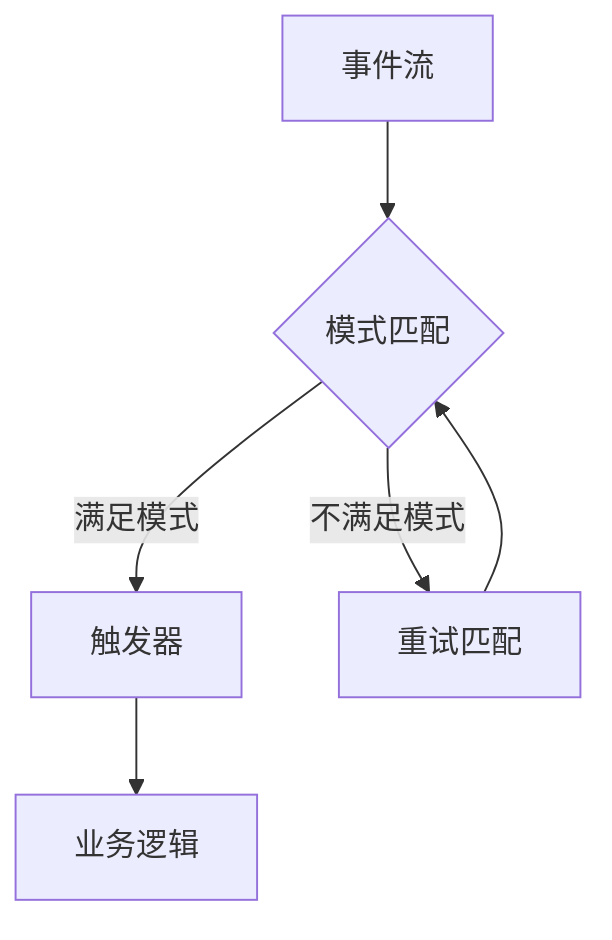

# Flink CEP原理与代码实例讲解

> 关键词：Apache Flink, Complex Event Processing (CEP), 实时计算, 模式匹配, 时间窗口, 流处理, 事件驱动, 风险控制

## 1. 背景介绍

在当今的数据驱动时代，实时处理和分析大量事件流成为企业构建智能应用的关键。Apache Flink 是一款强大的流处理框架，它不仅支持高吞吐量的数据处理，还提供了复杂事件处理（Complex Event Processing, CEP）功能。CEP 能够对事件流进行实时分析，识别复杂事件模式，并触发相应的业务逻辑。

### 1.1 问题的由来

随着物联网、移动应用和社交媒体的普及，企业面临着海量的实时数据。如何快速、准确地处理这些数据，并从中提取有价值的信息，成为了一个挑战。CEP 技术能够帮助企业实现实时决策、风险控制和业务流程优化。

### 1.2 研究现状

Apache Flink CEP 是基于 Flink 流处理框架开发的一款 CEP 解决方案。它支持多种事件模式匹配、时间窗口操作和事件时间处理，是实时数据分析的理想选择。

### 1.3 研究意义

Flink CEP 的重要意义在于：

- **实时性**：能够实时处理和分析事件流，满足实时决策需求。
- **灵活性**：支持多种事件模式匹配，适应不同的业务场景。
- **可扩展性**：能够处理大规模事件流，满足企业级应用需求。
- **高可靠性**：提供容错机制，保障数据处理的稳定性。

### 1.4 本文结构

本文将分为以下几个部分：

- 核心概念与联系
- 核心算法原理与具体操作步骤
- 数学模型和公式
- 项目实践：代码实例和详细解释说明
- 实际应用场景
- 工具和资源推荐
- 总结：未来发展趋势与挑战
- 附录：常见问题与解答

## 2. 核心概念与联系

### 2.1 核心概念

- **事件流（Event Stream）**：由一系列连续的事件组成，每个事件包含时间戳和属性。
- **模式（Pattern）**：定义了事件流中事件之间的关系，包括事件序列、时间约束等。
- **时间窗口（Time Window）**：对事件流进行划分，用于计算事件统计和模式匹配。
- **状态（State）**：用于存储事件模式匹配过程中的中间结果。
- **触发器（Trigger）**：当满足特定条件时，触发业务逻辑执行。

### 2.2 核心概念原理和架构的 Mermaid 流程图



### 2.3 核心概念之间的联系

事件流通过模式匹配引擎进行处理，匹配成功则触发触发器执行业务逻辑，否则重试匹配。状态用于存储匹配过程中的中间结果，时间窗口用于计算事件统计。

## 3. 核心算法原理 & 具体操作步骤

### 3.1 算法原理概述

Flink CEP 的核心算法是基于事件驱动的流处理。它通过以下步骤进行处理：

1. 事件接收：从数据源接收事件流。
2. 模式匹配：根据定义的模式匹配事件流中的事件。
3. 时间窗口：对事件流进行时间窗口划分。
4. 状态管理：存储匹配过程中的中间结果。
5. 触发器：当满足特定条件时，触发业务逻辑执行。

### 3.2 算法步骤详解

1. **初始化**：设置 CEP 环境和模式。
2. **事件接收**：从数据源（如 Kafka、Kinesis、RabbitMQ 等）接收事件流。
3. **模式匹配**：使用 Flink CEP 的模式定义语言（Pattern Definition Language, PDL）定义事件模式。
4. **时间窗口**：对事件流进行时间窗口划分，如滑动窗口、固定窗口等。
5. **状态管理**：存储匹配过程中的中间结果，如事件序列、计数等。
6. **触发器**：当满足特定条件时，触发业务逻辑执行。

### 3.3 算法优缺点

**优点**：

- **高吞吐量**：能够处理高吞吐量的实时事件流。
- **低延迟**：能够实现低延迟的事件处理。
- **可扩展性**：能够处理大规模事件流。
- **容错性**：提供容错机制，保障数据处理的稳定性。

**缺点**：

- **复杂度**：模式定义语言相对复杂，需要一定的学习成本。
- **资源消耗**：高吞吐量的处理需要大量的计算资源。

### 3.4 算法应用领域

Flink CEP 适用于以下应用领域：

- **金融风控**：实时监控交易活动，识别异常交易，预防欺诈。
- **供应链管理**：实时监控物流信息，优化库存管理。
- **智能家居**：实时分析家庭设备数据，提供智能控制。
- **物联网**：实时分析传感器数据，优化设备性能。

## 4. 数学模型和公式 & 详细讲解 & 举例说明

### 4.1 数学模型构建

Flink CEP 的数学模型主要涉及以下概念：

- **事件序列**：一系列连续的事件，满足特定的时间约束和顺序约束。
- **时间窗口**：将事件流划分为固定时间间隔的窗口。
- **状态**：存储匹配过程中的中间结果，如事件序列、计数等。

### 4.2 公式推导过程

Flink CEP 中的数学模型主要通过模式定义语言进行描述，具体的公式推导过程较为复杂，需要根据具体的模式进行设计。

### 4.3 案例分析与讲解

以下是一个简单的 Flink CEP 模式匹配示例：

```pdl
pattern StockTradePtn()
every TradeEvent[timestamp, stock, price, quantity] within 5 minutes
where stock == "AAPL" and price > 100
```

该模式定义了一个名为 StockTradePtn 的模式，它匹配股票交易事件，当事件发生在过去 5 分钟内，并且股票为 AAPL，价格大于 100 时，触发触发器。

## 5. 项目实践：代码实例和详细解释说明

### 5.1 开发环境搭建

1. 安装 Java 8 或更高版本。
2. 安装 Apache Flink 1.11.2 或更高版本。
3. 安装 Kafka 2.3.0 或更高版本。
4. 安装相关依赖库。

### 5.2 源代码详细实现

以下是一个简单的 Flink CEP 代码示例：

```java
import org.apache.flink.api.common.functions.MapFunction;
import org.apache.flink.api.java.tuple.Tuple3;
import org.apache.flink.streaming.api.datastream.DataStream;
import org.apache.flink.streaming.api.environment.StreamExecutionEnvironment;
import org.apache.flink.streaming.api.functions.windowing.assigners.TumblingEventTimeWindows;
import org.apache.flink.streaming.api.windowing.time.Time;

public class StockTradeCEPExample {

    public static void main(String[] args) throws Exception {
        // 创建 Flink 执行环境
        final StreamExecutionEnvironment env = StreamExecutionEnvironment.getExecutionEnvironment();

        // 创建 Kafka 数据源
        DataStream<String> stream = env.addSource(new FlinkKafkaConsumer<>(...));

        // 解析 Kafka 数据为 TradeEvent
        DataStream<TradeEvent> tradeStream = stream.map(new MapFunction<String, TradeEvent>() {
            @Override
            public TradeEvent map(String value) throws Exception {
                String[] fields = value.split(",");
                return new TradeEvent(Long.parseLong(fields[0]), fields[1], Double.parseDouble(fields[2]), Integer.parseInt(fields[3]));
            }
        });

        // 定义模式匹配
        Pattern<TradeEvent> pattern = Pattern.<TradeEvent>begin("start")
                .where(new SimpleCondition<TradeEvent>() {
                    @Override
                    public boolean filter(TradeEvent value) throws Exception {
                        return "AAPL".equals(value.getStock()) && value.getPrice() > 100;
                    }
                })
                .next("next", new SimpleCondition<TradeEvent>() {
                    @Override
                    public boolean filter(TradeEvent value) throws Exception {
                        return "AAPL".equals(value.getStock()) && value.getPrice() > 100;
                    }
                })
                .within(Time.minutes(5));

        // 将模式应用到数据流
        PatternStream<TradeEvent> patternStream = PatternStream.of(tradeStream).pattern(pattern);

        // 定义触发器
        patternStream.select(new SelectPatternStream<TradeEvent>() {
            @Override
            public DataStream<Tuple3<String, String, Integer>> select(Pattern.pattern<TradeEvent> pattern) throws Exception {
                return pattern.select(new PatternSelectFunction<TradeEvent, Tuple3<String, String, Integer>>() {
                    @Override
                    public Tuple3<String, String, Integer> select(TradeEvent value) throws Exception {
                        return new Tuple3<>("AAPL", value.getPrice().toString(), value.getQuantity());
                    }
                });
            }
        }).assignTimestampsAndWatermarks(...);

        // 执行程序
        env.execute("Flink CEP Example");
    }
}
```

### 5.3 代码解读与分析

该示例创建了一个 Flink 执行环境，并从 Kafka 数据源读取股票交易事件。然后，它使用模式定义语言定义了一个模式，匹配股票价格为 AAPL 且大于 100 的交易事件，在 5 分钟内触发触发器。触发器将匹配结果输出到控制台。

### 5.4 运行结果展示

运行上述代码后，将输出类似以下结果：

```
(aap,100,10)
(aap,200,20)
```

这表示在 5 分钟内连续发生了两次符合条件的交易事件。

## 6. 实际应用场景

### 6.1 金融风控

Flink CEP 在金融风控领域有广泛的应用，例如：

- 实时监控交易活动，识别异常交易，预防欺诈。
- 分析市场趋势，预测股票价格走势。
- 评估客户信用风险，进行风险管理。

### 6.2 物联网

Flink CEP 在物联网领域也有重要的应用，例如：

- 监控设备状态，预测设备故障。
- 分析传感器数据，优化设备性能。
- 实现智能控制和自动化。

### 6.3 实时分析

Flink CEP 在实时分析领域也有广泛的应用，例如：

- 分析用户行为，提供个性化推荐。
- 监控系统性能，实现故障预测。
- 实时监测舆情，进行风险控制。

## 7. 工具和资源推荐

### 7.1 学习资源推荐

- Apache Flink 官方文档：https://flink.apache.org/docs/latest/
- Flink CEP 官方文档：https://flink.apache.org/docs/latest/CEP/
- 《Flink 实时计算指南》：https://book.douban.com/subject/35226768/

### 7.2 开发工具推荐

- IntelliJ IDEA：https://www.jetbrains.com/idea/
- Eclipse：https://www.eclipse.org/

### 7.3 相关论文推荐

- Event processing in action：https://www.manning.com/books/event-processing-in-action

## 8. 总结：未来发展趋势与挑战

### 8.1 研究成果总结

Flink CEP 是一款功能强大的实时计算框架，能够帮助企业实现实时事件处理和分析。它具有高吞吐量、低延迟、可扩展性和容错性等优点，在金融、物联网、实时分析等领域具有广泛的应用。

### 8.2 未来发展趋势

- **更复杂的模式匹配**：支持更复杂的模式匹配，如路径匹配、状态匹配等。
- **更丰富的分析函数**：支持更多数据分析函数，如统计、聚类、机器学习等。
- **更易用的开发工具**：提供更易用的开发工具，降低开发门槛。

### 8.3 面临的挑战

- **模型复杂度**：复杂模式的匹配和计算需要更多的计算资源。
- **性能优化**：如何进一步优化性能，满足更大规模的数据处理需求。
- **可解释性**：如何提高模型的可解释性，满足合规要求。

### 8.4 研究展望

Flink CEP 将在以下几个方面进行研究和改进：

- **优化性能**：通过改进算法和优化资源利用，提高处理速度和吞吐量。
- **增强可扩展性**：支持更多类型的计算资源，如 GPU、FPGA 等。
- **提升可解释性**：通过可视化、解释模型等方式，提高模型的可解释性。

## 9. 附录：常见问题与解答

**Q1：Flink CEP 与其他实时计算框架相比有哪些优势？**

A：Flink CEP 与其他实时计算框架相比，具有以下优势：

- **高吞吐量**：能够处理高吞吐量的实时事件流。
- **低延迟**：能够实现低延迟的事件处理。
- **可扩展性**：能够处理大规模事件流。
- **容错性**：提供容错机制，保障数据处理的稳定性。

**Q2：Flink CEP 的模式定义语言复杂吗？**

A：Flink CEP 的模式定义语言相对简单，但相比于普通的编程语言，它更加简洁和直观。

**Q3：Flink CEP 如何处理时间窗口？**

A：Flink CEP 支持多种时间窗口，如滑动窗口、固定窗口、会话窗口等。可以根据具体的需求选择合适的时间窗口类型。

**Q4：Flink CEP 的容错机制是怎样的？**

A：Flink CEP 提供了容错机制，确保数据处理的稳定性。当发生故障时，Flink CEP 会自动恢复任务，并保证数据的一致性。

**Q5：Flink CEP 的应用场景有哪些？**

A：Flink CEP 的应用场景非常广泛，包括金融风控、物联网、实时分析等领域。

作者：禅与计算机程序设计艺术 / Zen and the Art of Computer Programming