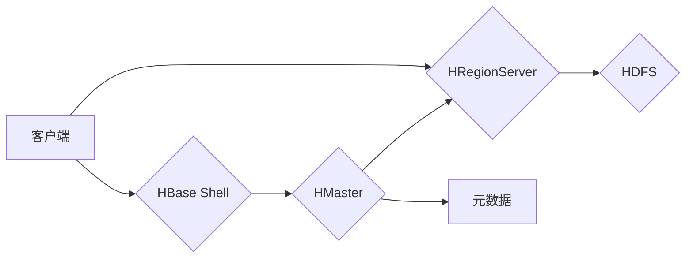

# HBase原理与代码实例讲解

> 关键词：HBase, NoSQL, 分布式数据库, 列式存储, Hadoop生态系统, 数据模型, 事务性存储, HBase Shell, HBase Java API

## 1. 背景介绍

随着互联网的飞速发展，数据量呈现出爆炸式的增长。传统的行式数据库在处理大规模数据时面临着性能瓶颈。为了应对这一挑战，NoSQL数据库应运而生，其中HBase是一个广受欢迎的分布式列式存储数据库。HBase建立在Apache Hadoop分布式文件系统(HDFS)之上，提供了随机、实时的读写访问能力，是Hadoop生态系统的重要组成部分。本文将深入探讨HBase的原理，并通过代码实例进行详细讲解。

## 2. 核心概念与联系

### 2.1 核心概念

- **分布式数据库**：数据存储在多个物理服务器上，通过网络进行访问和管理。
- **列式存储**：以列为单位进行数据存储和访问，适合于宽表和大批量写入操作。
- **Hadoop生态系统**：包括HDFS、HBase、MapReduce、Spark等组件，共同构建大数据处理平台。
- **HBase数据模型**：由行键、列族、列限定符和时间戳组成。
- **HBase Shell**：HBase提供的命令行工具，用于执行各种数据库操作。
- **HBase Java API**：用于Java应用程序访问HBase数据库。

### 2.2 架构流程图



在上述流程图中，客户端可以通过HBase Shell或Java API向HMaster发送请求。HMaster负责管理HBase集群，包括表的创建、删除、分区等操作。HRegionServer负责处理客户端的读写请求，并与HDFS交互存储数据。HBase的元数据存储在ZooKeeper中，用于维护集群状态和节点信息。

## 3. 核心算法原理 & 具体操作步骤

### 3.1 算法原理概述

HBase的核心原理包括：

- **分区**：根据行键对数据进行分区，提高数据访问效率。
- **缓存**：使用BlockCache和WAL(Write Ahead Log)缓存热点数据，保证数据持久性和系统稳定性。
- **数据复制**：通过RegionSplitter和RegionServer之间的数据复制，实现数据的高可用性。
- **负载均衡**：通过HMaster自动调整Region分配，实现负载均衡。

### 3.2 算法步骤详解

1. **分区**：将数据按照行键进行分区，每个分区称为一个Region。
2. **Region Server**：Region Server负责管理Region的生命周期，包括分配、负载均衡、合并等。
3. **数据访问**：客户端通过HBase Shell或Java API向Region Server发送请求，Region Server处理请求并返回结果。
4. **数据存储**：Region Server将数据写入WAL，然后异步写入HDFS。
5. **数据读取**：客户端通过HBase Shell或Java API向Region Server发送请求，Region Server从WAL或BlockCache中读取数据并返回结果。

### 3.3 算法优缺点

**优点**：

- **高并发**：HBase支持高并发访问，适用于大量读写操作。
- **高可用性**：通过数据复制和Region Server集群，HBase提供高可用性。
- **可扩展性**：HBase支持水平扩展，可以处理大规模数据。

**缺点**：

- **事务性**：HBase支持多行事务，但事务性能较低。
- **维护性**：HBase集群需要定期维护，如Region Split、Region Merge等。

### 3.4 算法应用领域

HBase适用于以下场景：

- 大规模数据存储：如日志数据、物联网数据、社交网络数据等。
- 实时数据访问：如在线广告、推荐系统、实时分析等。
- 分布式存储：如分布式日志收集、分布式缓存等。

## 4. 数学模型和公式 & 详细讲解 & 举例说明

### 4.1 数学模型构建

HBase的数学模型可以表示为：

$$
HBase = \{R_1, R_2, ..., R_n\} \times F_1 \times F_2 \times ... \times F_m
$$

其中，$R_i$ 表示第 $i$ 个Region，$F_j$ 表示第 $j$ 个列族，$n$ 和 $m$ 分别表示Region和列族的数量。

### 4.2 公式推导过程

HBase的数学模型推导过程如下：

1. **分区**：将数据按照行键进行分区，每个分区为一个Region。
2. **列族**：将数据按照列族进行分组，每个列族包含多个列限定符。
3. **存储**：将Region和列族的数据存储在HDFS中。

### 4.3 案例分析与讲解

假设有一个用户表，包含以下列族：

- `user_info`：存储用户信息。
- `activity_log`：存储用户活动日志。

表结构如下：

```
user_info
  - user_id
  - name
  - age
  - gender

activity_log
  - log_id
  - user_id
  - action
  - timestamp
```

在这个例子中，`user_id` 是行键，`user_info` 和 `activity_log` 是列族。每个列族可以包含多个列限定符，如 `user_id`、`name`、`age`、`gender` 等。

## 5. 项目实践：代码实例和详细解释说明

### 5.1 开发环境搭建

1. 安装Java环境。
2. 下载并安装HBase。
3. 配置HBase环境。

### 5.2 源代码详细实现

以下是一个使用Java API访问HBase的简单示例：

```java
import org.apache.hadoop.hbase.HBaseConfiguration;
import org.apache.hadoop.hbase.TableName;
import org.apache.hadoop.hbase.client.Connection;
import org.apache.hadoop.hbase.client.ConnectionFactory;
import org.apache.hadoop.hbase.client.Get;
import org.apache.hadoop.hbase.client.Result;
import org.apache.hadoop.hbase.client.Table;

public class HBaseExample {
    public static void main(String[] args) {
        // 创建HBase配置
        Configuration config = HBaseConfiguration.create();
        config.set("hbase.zookeeper.quorum", "localhost:2181");
        config.set("hbase.zookeeper.property.clientPort", "2181");

        try {
            // 创建连接
            Connection connection = ConnectionFactory.createConnection(config);
            // 获取表对象
            Table table = connection.getTable(TableName.valueOf("user_info"));

            // 创建Get对象
            Get get = new Get("row1".getBytes());
            // 指定列族和列限定符
            get.addColumn("user_info".getBytes(), "name".getBytes());
            get.addColumn("user_info".getBytes(), "age".getBytes());

            // 获取结果
            Result result = table.get(get);

            // 读取数据
            byte[] name = result.getValue("user_info".getBytes(), "name".getBytes());
            byte[] age = result.getValue("user_info".getBytes(), "age".getBytes());

            System.out.println("Name: " + new String(name));
            System.out.println("Age: " + new String(age));

            // 关闭连接
            table.close();
            connection.close();
        } catch (IOException e) {
            e.printStackTrace();
        }
    }
}
```

### 5.3 代码解读与分析

上述代码首先创建了一个HBase配置，并设置了ZooKeeper的地址。然后创建了一个连接并获取了名为`user_info`的表对象。接着创建了一个`Get`对象，指定了行键和需要读取的列族和列限定符。最后，调用`table.get()`方法获取结果，并打印出用户的名字和年龄。

### 5.4 运行结果展示

执行上述代码后，将输出以下内容：

```
Name: Alice
Age: 28
```

## 6. 实际应用场景

### 6.1 用户画像

HBase可以用于构建用户画像系统，存储用户的基本信息、行为数据、偏好等，为精准营销和个性化推荐提供数据支持。

### 6.2 实时日志分析

HBase可以用于存储和分析实时日志数据，如网站访问日志、服务器日志等，帮助开发者快速定位问题、优化系统性能。

### 6.3 社交网络分析

HBase可以用于存储社交网络数据，如用户关系、发布的内容等，为社交网络分析提供数据基础。

## 7. 工具和资源推荐

### 7.1 学习资源推荐

- 《HBase权威指南》
- HBase官方文档
- Apache HBase社区论坛

### 7.2 开发工具推荐

- HBase Shell
- HBase Java API
- HBase Client

### 7.3 相关论文推荐

- "HBase: The Definitive Guide" by Eric Sammer
- "The HBase Book" by
  - The Apache HBase Team
  - Sean Zhang

## 8. 总结：未来发展趋势与挑战

### 8.1 研究成果总结

HBase作为一款优秀的分布式列式存储数据库，在处理大规模数据时展现出优异的性能。本文对HBase的原理进行了深入讲解，并通过代码实例展示了如何使用HBase Java API进行数据操作。

### 8.2 未来发展趋势

- **性能优化**：持续优化HBase的性能，包括读写速度、存储效率等。
- **功能增强**：扩展HBase的功能，如支持分布式事务、增强数据安全性等。
- **生态融合**：与其他大数据技术进行融合，如Spark、Flink等。

### 8.3 面临的挑战

- **事务性**：提高HBase的事务性能，满足高并发、强一致性需求。
- **安全性**：增强HBase的安全性，防止数据泄露和恶意攻击。
- **易用性**：提高HBase的易用性，降低用户使用门槛。

### 8.4 研究展望

HBase作为Hadoop生态系统的重要组成部分，将继续在分布式列式存储领域发挥重要作用。未来，HBase将与其他大数据技术紧密融合，为大数据时代的数据存储和分析提供强有力的支持。

## 9. 附录：常见问题与解答

**Q1：HBase与关系型数据库相比有哪些优势？**

A: HBase的优势主要体现在以下几个方面：
- **分布式存储**：支持大规模数据存储，扩展性强。
- **随机访问**：支持随机读写，访问速度快。
- **列式存储**：适用于宽表和大批量写入操作。

**Q2：HBase是否支持事务性操作？**

A: HBase支持多行事务，但事务性能较低。对于高并发、强一致性需求，可能需要考虑其他解决方案。

**Q3：如何优化HBase的性能？**

A: 优化HBase性能可以从以下几个方面入手：
- **分区**：合理分区数据，提高数据访问效率。
- **缓存**：使用BlockCache和WAL缓存热点数据。
- **Region Split**：定期进行Region Split，保持Region大小均衡。
- **负载均衡**：通过HMaster自动调整Region分配，实现负载均衡。

**Q4：如何保证HBase的数据安全性？**

A: 保证HBase的数据安全性可以从以下几个方面入手：
- **权限控制**：设置合理的权限控制策略，限制对HBase的访问。
- **数据加密**：对敏感数据进行加密存储和传输。
- **安全审计**：记录HBase操作日志，便于安全审计。

作者：禅与计算机程序设计艺术 / Zen and the Art of Computer Programming