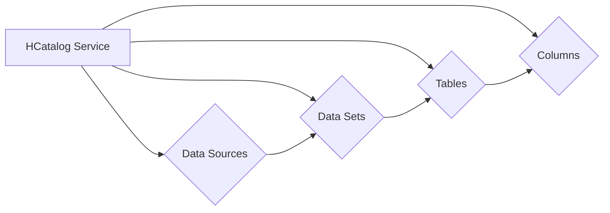

# HCatalog原理与代码实例讲解

> 关键词：HCatalog, 数据治理, 分布式计算, Hadoop, YARN, Hive, Impala, 元数据管理

## 1. 背景介绍

随着大数据时代的到来，数据治理和分布式计算成为了企业数据管理和分析的核心挑战。Hadoop作为分布式计算框架的先驱，已经广泛应用于各类大数据场景。然而，随着数据量的激增和存储系统的复杂性增加，如何有效地管理这些数据成为了关键问题。HCatalog应运而生，它是一个元数据管理服务，旨在解决大数据环境下元数据的管理和共享问题。

### 1.1 问题的由来

在传统的数据仓库和大数据系统中，元数据通常以分散的方式存储在不同的系统和服务中。这导致元数据的管理和共享变得复杂，难以实现跨系统的一致性。例如，数据源、数据集、表、列等元数据的定义、格式、存储位置等信息需要在不同工具和系统中重复配置，这不仅增加了管理成本，还容易导致数据不一致和错误。

### 1.2 研究现状

为了解决上述问题，Apache Hadoop生态系统引入了HCatalog。HCatalog作为一个通用的元数据存储和管理系统，可以与Hadoop生态系统中的其他组件（如Hive、Impala、HDFS等）无缝集成，提供统一的元数据视图。

### 1.3 研究意义

HCatalog的研究和实施对于大数据生态系统具有重要意义：

- **简化元数据管理**：通过集中式管理元数据，减少重复配置和维护工作。
- **提高数据共享性**：允许不同系统和用户共享相同的元数据，减少数据孤岛。
- **增强数据治理**：提供元数据审计和监控，提升数据治理能力。
- **促进系统集成**：作为Hadoop生态系统的一部分，HCatalog可以与其他组件集成，构建统一的数据管理平台。

### 1.4 本文结构

本文将分为以下几个部分：

- 核心概念与联系：介绍HCatalog的核心概念和架构。
- 核心算法原理 & 具体操作步骤：讲解HCatalog的工作原理和操作步骤。
- 数学模型和公式 & 详细讲解 & 举例说明：分析HCatalog的数学模型和公式。
- 项目实践：代码实例和详细解释说明：通过实例展示如何使用HCatalog。
- 实际应用场景：探讨HCatalog在实际应用中的场景和案例。
- 工具和资源推荐：推荐学习HCatalog的资源。
- 总结：未来发展趋势与挑战：总结HCatalog的现状和未来方向。

## 2. 核心概念与联系

### 2.1 核心概念

- **元数据**：关于数据的数据，描述了数据集的结构、格式、来源等信息。
- **数据源**：数据的来源，可以是文件系统、数据库、外部服务等。
- **数据集**：一组相关的数据，可以是表、文件等。
- **表**：存储在数据存储系统中的数据结构。
- **列**：表中的数据字段。

### 2.2 架构

HCatalog的架构如下所示：



HCatalog服务是一个中心化的元数据存储和管理系统，它与数据源、数据集、表和列进行交互。HCatalog提供了API，允许用户查询、更新和删除元数据。

## 3. 核心算法原理 & 具体操作步骤

### 3.1 算法原理概述

HCatalog通过以下步骤实现元数据的存储和管理：

1. **元数据存储**：将元数据存储在关系数据库或NoSQL数据库中。
2. **元数据查询**：提供RESTful API或Thrift接口，允许用户查询元数据。
3. **元数据更新**：允许用户更新元数据，并确保一致性。
4. **元数据权限管理**：提供元数据的权限控制，确保安全性。

### 3.2 算法步骤详解

1. **初始化HCatalog服务**：配置HCatalog服务，包括元数据存储方式和端口等。
2. **注册数据源**：将数据源注册到HCatalog服务中，包括数据源的名称、类型、访问信息等。
3. **创建数据集**：在HCatalog中创建数据集，指定数据源和表。
4. **创建表**：在数据集中创建表，指定表的 schema、存储格式、分区等。
5. **添加列**：在表中添加列，指定列的数据类型、注释等信息。
6. **查询元数据**：使用HCatalog API查询元数据，包括数据源、数据集、表和列。
7. **更新元数据**：更新元数据，例如修改表的 schema 或列的注释。

### 3.3 算法优缺点

**优点**：

- **集中式管理**：简化了元数据的管理和共享。
- **跨系统兼容**：可以与Hadoop生态系统中的其他组件集成。
- **可扩展性**：支持多种元数据存储方式。

**缺点**：

- **性能开销**：元数据存储和查询可能会增加一定的性能开销。
- **学习曲线**：对于新用户来说，可能需要一些时间来学习如何使用HCatalog。

### 3.4 算法应用领域

HCatalog适用于以下场景：

- **数据仓库**：管理数据仓库中的元数据。
- **大数据平台**：管理大数据平台中的数据源、数据集、表和列。
- **数据湖**：管理数据湖中的数据资产。

## 4. 数学模型和公式 & 详细讲解 & 举例说明

### 4.1 数学模型构建

HCatalog使用关系数据库或NoSQL数据库作为元数据存储。以下是关系数据库中常见的元数据表结构：

- **Data Sources**：存储数据源的元数据。
- **Data Sets**：存储数据集的元数据。
- **Tables**：存储表的元数据。
- **Columns**：存储列的元数据。

### 4.2 公式推导过程

由于HCatalog主要处理元数据，因此不涉及复杂的数学推导。以下是列的元数据表结构的示例：

```latex
\begin{align*}
\text{Columns} &= (\text{column_id}, \text{table_id}, \text{column_name}, \text{column_type}, \text{comment}) \\
\end{align*}
```

### 4.3 案例分析与讲解

假设我们需要查询名为`sales`的表的列信息。以下是一个使用HCatalog API进行查询的Python代码示例：

```python
import requests

url = 'http://hcatalog.example.com/columns?table_id=sales'
response = requests.get(url)
columns = response.json()
for column in columns:
    print(f"Column ID: {column['column_id']}, Name: {column['column_name']}, Type: {column['column_type']}, Comment: {column['comment']}")
```

## 5. 项目实践：代码实例和详细解释说明

### 5.1 开发环境搭建

要使用HCatalog，你需要以下环境：

- Java开发环境
- Hadoop集群
- HCatalog客户端

### 5.2 源代码详细实现

以下是一个使用Java编写的小程序，用于查询HCatalog中的表信息：

```java
import org.apache.hadoop.conf.Configuration;
import org.apache.hcatalog.client.HCatClient;
import org.apache.hcatalog.common.HCatException;
import org.apache.hcatalog.data.schema.HCatTableSchema;
import org.apache.hcatalog管理体系.HCatManager;

public class HCatalogExample {
    public static void main(String[] args) {
        Configuration conf = new Configuration();
        conf.addResource(new Path("/path/to/hcatalog-site.xml"));
        HCatClient client = HCatClient.create(conf);
        try {
            HCatTableSchema schema = client.getTableSchema("database_name.table_name");
            System.out.println("Table Schema:");
            for (int i = 0; i < schema.size(); i++) {
                System.out.println(schema.getColumn(i).getName() + " - " + schema.getColumn(i).getDatatype().getDatatypeName());
            }
        } catch (HCatException e) {
            e.printStackTrace();
        } finally {
            client.close();
        }
    }
}
```

### 5.3 代码解读与分析

- `Configuration`：配置Hadoop集群。
- `HCatClient`：创建HCatalog客户端。
- `getTableSchema`：获取表的schema。
- `getColumn`：获取列的名称和数据类型。

### 5.4 运行结果展示

运行上述Java程序，将输出`sales`表的列名称和类型信息。

## 6. 实际应用场景

### 6.1 数据仓库管理

HCatalog可以用于管理数据仓库中的元数据，包括数据源、数据集、表和列。通过HCatalog，管理员可以轻松地查看和管理数据仓库中的所有数据资产。

### 6.2 大数据平台管理

在大数据平台中，HCatalog可以用于管理各种数据存储系统和数据源。通过HCatalog，用户可以方便地查询和访问不同数据源中的数据。

### 6.3 数据湖管理

在数据湖中，HCatalog可以用于管理海量数据的元数据。通过HCatalog，用户可以轻松地查找和访问数据湖中的数据。

## 7. 工具和资源推荐

### 7.1 学习资源推荐

- Apache HCatalog官方文档
- 《Hadoop权威指南》

### 7.2 开发工具推荐

- Eclipse
- IntelliJ IDEA

### 7.3 相关论文推荐

- 《HCatalog: A Scalable and Secure Data Management Service for Hadoop》

## 8. 总结：未来发展趋势与挑战

### 8.1 研究成果总结

HCatalog作为Hadoop生态系统的一部分，为大数据环境中的元数据管理提供了有效的解决方案。它简化了元数据的管理和共享，提高了数据治理能力。

### 8.2 未来发展趋势

- 与云服务集成
- 提高性能
- 扩展元数据类型

### 8.3 面临的挑战

- 性能优化
- 安全性
- 可扩展性

### 8.4 研究展望

HCatalog将在大数据领域发挥越来越重要的作用，为数据治理和数据分析提供强有力的支持。

## 9. 附录：常见问题与解答

**Q1：HCatalog与Hive的关系是什么？**

A：HCatalog是Hive的一个组件，用于管理Hive元数据。Hive使用HCatalog存储表的schema、分区、存储信息等元数据。

**Q2：HCatalog是否支持多种数据源？**

A：是，HCatalog支持多种数据源，包括HDFS、HBase、Amazon S3等。

**Q3：HCatalog如何保证元数据的一致性？**

A：HCatalog通过事务机制保证元数据的一致性。在更新元数据时，HCatalog会先锁定相关的数据，然后再进行更新操作。

**Q4：如何使用HCatalog进行数据迁移？**

A：使用HCatalog的数据源注册功能，将源数据源注册到HCatalog中，然后使用HCatalog的API进行数据迁移。

---

作者：禅与计算机程序设计艺术 / Zen and the Art of Computer Programming