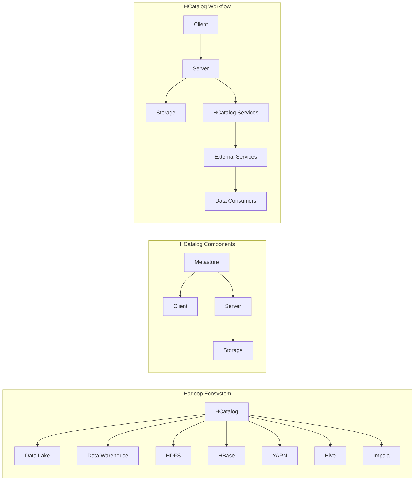

# HCatalog原理与代码实例讲解

> 关键词：HCatalog，数据治理，数据仓库，元数据，Hadoop，YARN，Hive，Impala

## 1. 背景介绍

随着大数据时代的到来，数据仓库和数据湖在企业和组织中变得越来越重要。然而，随着数据量的快速增长和来源的多样化，数据治理和元数据的统一管理成为了数据工程师面临的重大挑战。HCatalog应运而生，它是一个用于Hadoop生态系统中数据管理和元数据管理的工具，旨在简化数据仓库和数据湖的管理，提高数据治理的效率。

### 1.1 问题的由来

在传统的数据仓库和大数据平台中，数据通常存储在不同的系统中，如Hive、HBase、Spark等。这些系统各自维护自己的元数据，导致数据孤岛现象，增加了数据管理和维护的复杂度。同时，数据治理成为了数据工程师面临的一大难题，包括数据质量、数据一致性、数据安全等问题。

### 1.2 研究现状

HCatalog作为Apache Hadoop生态系统的一部分，旨在解决上述问题。它提供了一个统一的元数据存储和查询接口，使得不同的Hadoop组件可以共享元数据。HCatalog支持多种数据存储格式和访问方式，如HDFS、HBase、Hive、Impala等，并且可以与YARN集成，实现资源的统一管理和调度。

### 1.3 研究意义

HCatalog的研究意义在于：

- 简化数据治理：通过统一的元数据管理，降低数据治理的复杂度。
- 提高数据共享：不同系统可以共享相同的元数据，促进数据共享和协作。
- 改善数据质量：提供数据质量监控和管理的工具，提升数据质量。
- 提高资源利用率：通过YARN集成，实现资源的统一管理和调度。

### 1.4 本文结构

本文将分为以下几个部分：

- 介绍HCatalog的核心概念和架构。
- 深入讲解HCatalog的算法原理和操作步骤。
- 通过代码实例演示HCatalog的使用方法。
- 探讨HCatalog的实际应用场景和未来发展趋势。
- 提供学习资源和开发工具推荐。
- 总结HCatalog的未来发展趋势和挑战。

## 2. 核心概念与联系

### 2.1 核心概念

- **元数据**：描述数据的数据，如数据表结构、数据类型、数据源等。
- **数据仓库**：用于存储、管理和分析数据的系统。
- **数据湖**：用于存储大量结构化和非结构化数据的分布式存储系统。
- **Hadoop**：一个开源的大数据处理框架。
- **YARN**：Hadoop的资源管理器，负责调度和管理集群资源。
- **Hive**：Hadoop的数据仓库工具，用于数据存储、查询和分析。
- **Impala**：Hadoop上的高性能、低延迟的大数据查询引擎。

### 2.2 架构的Mermaid流程图



## 3. 核心算法原理 & 具体操作步骤

### 3.1 算法原理概述

HCatalog通过以下原理实现元数据管理和数据共享：

- **元数据存储**：HCatalog使用HDFS存储元数据，确保元数据的持久性和高可用性。
- **元数据服务**：HCatalog服务器提供元数据的查询和更新服务，客户端通过API与服务器交互。
- **数据访问控制**：HCatalog支持数据访问控制，确保数据安全。
- **数据源集成**：HCatalog可以集成不同的数据源，如HDFS、HBase、Hive等。

### 3.2 算法步骤详解

1. **初始化**：启动HCatalog服务，并配置元数据存储位置。
2. **定义数据源**：在HCatalog中定义数据源，包括数据源的名称、类型、访问模式等。
3. **定义表**：在数据源下定义表，包括表的结构、数据类型、分区信息等。
4. **数据导入**：将数据导入到HCatalog管理的数据源中。
5. **查询和访问**：通过HCatalog查询和访问数据。

### 3.3 算法优缺点

#### 优点：

- 简化数据治理：提供统一的元数据管理，降低数据治理的复杂度。
- 提高数据共享：不同系统可以共享相同的元数据，促进数据共享和协作。
- 改善数据质量：提供数据质量监控和管理的工具，提升数据质量。

#### 缺点：

- 学习成本：HCatalog的使用需要一定的学习成本。
- 性能开销：HCatalog的服务器可能会带来一定的性能开销。

### 3.4 算法应用领域

HCatalog适用于以下应用领域：

- 数据仓库和数据湖的管理
- 大数据平台的元数据管理
- 数据治理
- 数据共享

## 4. 数学模型和公式 & 详细讲解 & 举例说明

### 4.1 数学模型构建

HCatalog的数学模型主要涉及到元数据的管理和查询。以下是一个简单的数学模型：

$$
\text{HCatalog} = \{ \text{Metastore}, \text{Client}, \text{Server}, \text{Storage} \}
$$

其中：

- Metastore：元数据存储，用于存储元数据。
- Client：客户端，用于查询和更新元数据。
- Server：服务器，提供元数据的查询和更新服务。
- Storage：存储，用于存储元数据。

### 4.2 公式推导过程

HCatalog的公式推导过程主要涉及到元数据的存储和查询。以下是一个简单的推导过程：

1. **存储元数据**：将元数据存储到Metastore中。
2. **查询元数据**：客户端向服务器发送查询请求。
3. **处理查询**：服务器根据查询请求从Metastore中检索元数据。
4. **返回结果**：服务器将查询结果返回给客户端。

### 4.3 案例分析与讲解

假设我们需要查询一个名为"employees"的表的元数据，以下是使用HCatalog进行查询的步骤：

1. 启动HCatalog服务器。
2. 连接到HCatalog客户端。
3. 执行查询语句：`DESCRIBE employees;`
4. 查看查询结果，包括表的结构、数据类型、分区信息等。

## 5. 项目实践：代码实例和详细解释说明

### 5.1 开发环境搭建

1. 安装Hadoop集群。
2. 安装HCatalog。
3. 配置HCatalog的元数据存储位置。

### 5.2 源代码详细实现

以下是一个简单的HCatalog客户端代码示例，用于创建数据源：

```java
import org.apache.hcatalog.client.HCatClient;
import org.apache.hcatalog.client.HCatStorageDescriptor;
import org.apache.hcatalog.common.HCatException;

public class HCatalogExample {
    public static void main(String[] args) {
        String hcatalogUri = "thrift://localhost:9083";
        HCatClient client = new HCatClient(hcatalogUri);
        
        try {
            HCatStorageDescriptor sd = new HCatStorageDescriptor();
            sd.setLocations(new String[]{"/user/hive/warehouse"});
            client.createStorageDescriptor("my_data_source", sd);
            
            System.out.println("Data source created successfully.");
        } catch (HCatException e) {
            e.printStackTrace();
        }
        
        client.close();
    }
}
```

### 5.3 代码解读与分析

上述代码创建了一个名为"my_data_source"的数据源，并将其存储位置设置为"/user/hive/warehouse"。代码首先创建了一个HCatClient实例，并连接到HCatalog服务器。然后，创建了一个HCatStorageDescriptor实例，并设置了数据源的存储位置。最后，调用HCatalog客户端的createStorageDescriptor方法创建数据源。

### 5.4 运行结果展示

执行上述代码后，将在HCatalog中创建一个名为"my_data_source"的数据源。

## 6. 实际应用场景

### 6.1 数据仓库和数据湖管理

HCatalog可以用于管理和维护数据仓库和数据湖中的元数据，包括数据源、表、列等。

### 6.2 大数据平台的元数据管理

HCatalog可以集成到大数据平台中，实现元数据的统一管理和共享。

### 6.3 数据治理

HCatalog可以用于监控和管理数据质量，确保数据的一致性和准确性。

## 7. 工具和资源推荐

### 7.1 学习资源推荐

- Apache HCatalog官方文档
- Hadoop官方文档
- Hive官方文档
- Impala官方文档

### 7.2 开发工具推荐

- Eclipse
- IntelliJ IDEA
- PyCharm

### 7.3 相关论文推荐

- Apache HCatalog: A System for Unified Data Management in Hadoop
- Hadoop: A Framework for Data-Intensive Distributed Computing

## 8. 总结：未来发展趋势与挑战

### 8.1 研究成果总结

HCatalog是一个强大的数据管理和元数据管理工具，可以简化数据治理，提高数据共享，改善数据质量。

### 8.2 未来发展趋势

未来，HCatalog将更加注重以下发展趋势：

- 更好的集成和兼容性
- 更高的性能和可扩展性
- 更丰富的元数据管理功能
- 更强的数据治理能力

### 8.3 面临的挑战

HCatalog面临的挑战包括：

- 学习成本
- 性能开销
- 与其他数据管理工具的兼容性

### 8.4 研究展望

HCatalog将继续发展，为大数据时代的元数据管理和数据治理提供更好的解决方案。

## 9. 附录：常见问题与解答

**Q1：HCatalog与其他元数据管理工具相比有什么优势？**

A: HCatalog的主要优势在于与Hadoop生态系统的集成，可以方便地与其他Hadoop组件协同工作。

**Q2：HCatalog是否支持非Hadoop生态系统中的数据源？**

A: HCatalog主要支持Hadoop生态系统中的数据源，但也可以通过扩展的方式支持其他数据源。

**Q3：如何使用HCatalog进行数据质量监控？**

A: 可以使用HCatalog提供的元数据功能，结合其他数据质量管理工具，进行数据质量监控。

**Q4：HCatalog是否支持多租户？**

A: HCatalog支持多租户，可以实现对不同数据源的隔离和管理。

作者：禅与计算机程序设计艺术 / Zen and the Art of Computer Programming