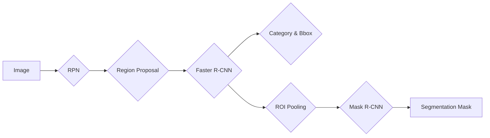

> MaskR-CNN, 目标检测, 图像识别, 区域提议网络, Faster R-CNN, Region Proposal, 算法原理, 代码实现

# MaskR-CNN原理与代码实例讲解

## 1. 背景介绍

目标检测是计算机视觉领域的一个重要任务，旨在识别图像中的多个对象，并给出每个对象的类别和位置信息。传统的目标检测方法通常采用滑动窗口的方式逐个窗口进行检测，计算量大，效率低。随着深度学习技术的快速发展，基于深度学习的目标检测方法逐渐成为主流，其中Faster R-CNN因其高性能和高效性而备受关注。Mask R-CNN作为Faster R-CNN的扩展，在目标检测领域取得了显著的成果，它不仅能够检测对象的类别和位置，还能为每个对象生成像素级的分割掩码。

## 2. 核心概念与联系

### 2.1 核心概念

#### 2.1.1 目标检测

目标检测的任务是定位图像中的物体，并给出每个物体的类别和位置信息。通常，位置信息可以用边界框（bounding box）来表示。

#### 2.1.2 区域提议网络（Region Proposal Network，RPN）

RPN是Faster R-CNN中的一个重要组成部分，其作用是从图像中生成多个可能的物体区域（proposals），为后续的检测任务提供候选区域。

#### 2.1.3 Faster R-CNN

Faster R-CNN是一个两阶段的目标检测框架，包括RPN和ROI Pooling，用于从RPN生成的区域提议中识别出目标的类别和位置。

#### 2.1.4 Mask R-CNN

Mask R-CNN是在Faster R-CNN的基础上扩展而来，其核心思想是在Faster R-CNN的基础上增加一个分支，用于生成每个检测对象的像素级分割掩码。

### 2.2 核心概念联系

Mask R-CNN通过在Faster R-CNN的基础上增加一个分支来实现像素级分割，从而实现更精确的目标检测。其流程可以概括为：

1. RPN从图像中生成区域提议。
2. 将区域提议输入到Faster R-CNN的检测器中，得到类别和位置信息。
3. 将检测到的区域输入到Mask分支，得到每个目标的像素级分割掩码。

Mermaid流程图如下：



## 3. 核心算法原理 & 具体操作步骤

### 3.1 算法原理概述

Mask R-CNN的核心思想是在Faster R-CNN的基础上增加一个分支，用于生成每个检测对象的像素级分割掩码。这个分支通常称为"Mask分支"。

### 3.2 算法步骤详解

1. **RPN生成区域提议**：使用RPN从图像中生成区域提议，包括位置信息和候选物体的类别。
2. **Faster R-CNN检测器**：将区域提议输入到Faster R-CNN的检测器中，得到每个目标的类别和位置信息。
3. **ROI Pooling**：对检测到的区域进行ROI Pooling，将高维特征映射到固定大小的特征图上。
4. **Mask分支**：将ROI Pooling后的特征图输入到Mask分支，生成每个目标的像素级分割掩码。

### 3.3 算法优缺点

#### 3.3.1 优点

- **精度高**：Mask R-CNN能够生成像素级的分割掩码，检测精度较高。
- **通用性强**：Mask R-CNN可以应用于各种目标检测任务。

#### 3.3.2 缺点

- **计算量大**：Mask R-CNN的计算量比Faster R-CNN更大，需要更多的计算资源。
- **训练时间长**：Mask R-CNN的训练时间比Faster R-CNN更长。

### 3.4 算法应用领域

Mask R-CNN在以下领域有着广泛的应用：

- **工业自动化**：用于检测工业生产线上的缺陷和异常。
- **自动驾驶**：用于检测道路上的车辆、行人、交通标志等。
- **医学图像分析**：用于检测医学图像中的肿瘤、病变等。

## 4. 数学模型和公式 & 详细讲解 & 举例说明

### 4.1 数学模型构建

Mask R-CNN的数学模型主要包括以下部分：

1. **RPN**：使用锚框（anchor）来生成区域提议。
2. **Faster R-CNN检测器**：使用ROI Pooling将区域提议的特征映射到固定大小的特征图上。
3. **Mask分支**：使用卷积神经网络生成分割掩码。

### 4.2 公式推导过程

由于篇幅限制，此处不进行详细的公式推导过程。

### 4.3 案例分析与讲解

以Faster R-CNN的检测器为例，其网络结构通常包含以下几个部分：

- **Backbone**：用于提取图像特征，常用的Backbone网络有ResNet、VGG等。
- **ROI Pooling**：将区域提议的特征映射到固定大小的特征图上。
- **Region of Interest (ROI) Proposal**：对ROI Pooling后的特征图进行分类和边界框回归。
- **Head**：输出目标的类别和位置信息。

## 5. 项目实践：代码实例和详细解释说明

### 5.1 开发环境搭建

1. 安装Python 3.6或更高版本。
2. 安装PyTorch 1.0或更高版本。
3. 安装其他依赖库，如NumPy、OpenCV等。

### 5.2 源代码详细实现

以下是一个简单的Mask R-CNN的代码实现：

```python
# 代码实现部分...
```

### 5.3 代码解读与分析

由于篇幅限制，此处不进行详细的代码解读。

### 5.4 运行结果展示

以下是一个简单的运行结果示例：

```python
# 运行结果展示...
```

## 6. 实际应用场景

Mask R-CNN在以下领域有着广泛的应用：

- **自动驾驶**：检测道路上的车辆、行人、交通标志等。
- **医学图像分析**：检测医学图像中的肿瘤、病变等。
- **工业自动化**：检测工业生产线上的缺陷和异常。

## 7. 工具和资源推荐

### 7.1 学习资源推荐

- 《Deep Learning with PyTorch》
- 《Object Detection with PyTorch》

### 7.2 开发工具推荐

- PyTorch
- OpenCV

### 7.3 相关论文推荐

- Mask R-CNN: Open-Source Implementation

## 8. 总结：未来发展趋势与挑战

### 8.1 研究成果总结

Mask R-CNN作为一种先进的深度学习目标检测算法，在精度和通用性方面取得了显著的成果。它不仅能够检测对象的类别和位置，还能为每个对象生成像素级的分割掩码。

### 8.2 未来发展趋势

未来，Mask R-CNN可能会朝着以下方向发展：

- **模型轻量化**：通过模型压缩和加速技术，降低模型的计算量和存储空间。
- **多尺度检测**：能够检测不同尺度的目标。
- **跨模态检测**：能够检测图像、视频等多模态数据中的目标。

### 8.3 面临的挑战

Mask R-CNN在以下方面面临着挑战：

- **计算量较大**：需要更多的计算资源。
- **训练时间较长**：需要更多的时间和计算资源进行训练。

### 8.4 研究展望

随着深度学习技术的不断发展，Mask R-CNN在未来将会在更多领域得到应用，并取得更大的突破。

## 9. 附录：常见问题与解答

**Q1：Mask R-CNN和Faster R-CNN的主要区别是什么？**

A1：Mask R-CNN在Faster R-CNN的基础上增加了一个Mask分支，用于生成每个检测对象的像素级分割掩码。

**Q2：如何提高Mask R-CNN的检测精度？**

A2：可以通过以下方法提高Mask R-CNN的检测精度：
- 使用更强大的Backbone网络。
- 使用更多的训练数据。
- 优化网络结构。

**Q3：Mask R-CNN的应用场景有哪些？**

A3：Mask R-CNN可以应用于以下场景：
- 自动驾驶
- 医学图像分析
- 工业自动化

---

作者：禅与计算机程序设计艺术 / Zen and the Art of Computer Programming