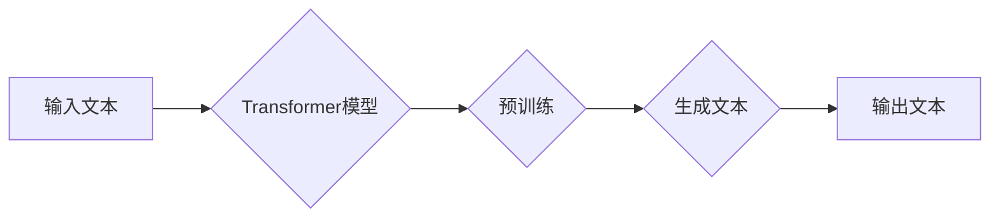

# OpenAI的GPT-4.0展示与未来发展

> 关键词：OpenAI, GPT-4.0, 自然语言处理, 人工智能, 生成式模型, 预训练, 微调, NLP应用

## 1. 背景介绍

近年来，自然语言处理（NLP）领域取得了显著的进展，其中生成式模型，尤其是基于Transformer架构的模型，如GPT-3，引发了广泛的关注。OpenAI最新发布的GPT-4.0模型，再次刷新了人工智能领域的认知边界，展示了其在自然语言理解和生成方面的巨大潜力。本文将深入探讨GPT-4.0的核心概念、原理、应用，并展望其未来的发展趋势。

### 1.1 问题的由来

随着互联网的普及和大数据的积累，NLP技术逐渐从规则驱动转向数据驱动。传统的基于规则的方法在处理复杂、多变的自然语言时显得力不从心。生成式模型的出现，为NLP领域带来了新的突破。OpenAI的GPT系列模型，以其强大的语言理解和生成能力，成为了NLP领域的重要里程碑。

### 1.2 研究现状

自GPT-3发布以来，其强大的能力引起了广泛关注。然而，GPT-3模型也存在着一些局限性，如需要大量的计算资源、难以控制生成的文本质量等。GPT-4.0作为GPT-3的升级版，旨在解决这些问题，并提供更加高效、可控的NLP解决方案。

### 1.3 研究意义

GPT-4.0的发布，不仅展示了OpenAI在NLP领域的领先地位，也为人工智能技术的发展提供了新的思路。GPT-4.0的应用，有望推动NLP技术在各个领域的应用落地，为人类社会带来更多便利。

### 1.4 本文结构

本文将按照以下结构进行阐述：

- 第2章将介绍GPT-4.0的核心概念与联系。
- 第3章将详细讲解GPT-4.0的算法原理和具体操作步骤。
- 第4章将分析GPT-4.0的数学模型和公式，并结合实例进行讲解。
- 第5章将展示GPT-4.0的代码实例和详细解释说明。
- 第6章将探讨GPT-4.0在实际应用场景中的应用。
- 第7章将推荐GPT-4.0相关的学习资源、开发工具和参考文献。
- 第8章将总结GPT-4.0的研究成果，展望其未来发展趋势和挑战。

## 2. 核心概念与联系

### 2.1 GPT-4.0的核心概念

GPT-4.0是基于Transformer架构的生成式语言模型，通过在大量文本数据上进行预训练，学习到了丰富的语言知识和规律，能够生成流畅、连贯的自然语言文本。

### 2.2 Mermaid流程图



### 2.3 GPT-4.0的联系

GPT-4.0与NLP领域的其他技术，如词嵌入、注意力机制、循环神经网络等，存在着紧密的联系。GPT-4.0的核心思想是利用Transformer模型进行大规模预训练，从而实现高效的语言理解和生成。

## 3. 核心算法原理 & 具体操作步骤

### 3.1 算法原理概述

GPT-4.0的核心算法是基于Transformer架构的生成式语言模型。Transformer模型是一种基于自注意力机制的序列到序列模型，能够有效地处理长距离依赖问题。

### 3.2 算法步骤详解

1. 预训练阶段：在大量无标签文本数据上进行预训练，使模型学习到丰富的语言知识和规律。
2. 微调阶段：在少量有标签数据上进行微调，使模型适应特定的NLP任务。
3. 生成阶段：根据输入文本，使用GPT-4.0模型生成相应的文本内容。

### 3.3 算法优缺点

#### 优点：

- 强大的语言理解和生成能力。
- 能够处理长距离依赖问题。
- 预训练模型在多个NLP任务上取得了优异的性能。

#### 缺点：

- 计算资源需求量大。
- 难以控制生成的文本质量。

### 3.4 算法应用领域

GPT-4.0模型在多个NLP任务上具有广泛的应用，如文本分类、情感分析、机器翻译、文本摘要、问答系统等。

## 4. 数学模型和公式 & 详细讲解 & 举例说明

### 4.1 数学模型构建

GPT-4.0的数学模型主要基于Transformer架构，其核心是自注意力机制。自注意力机制的计算公式如下：

$$
\text{Attention}(Q, K, V) = \frac{e^{(QK^T)}}{\sqrt{d_k}}V
$$

其中，$Q$、$K$、$V$ 分别是查询、键、值三个矩阵，$d_k$ 是键的维度。

### 4.2 公式推导过程

自注意力机制的推导过程如下：

1. 计算查询与键的相似度矩阵 $S$：
   $$S = QK^T$$
2. 对相似度矩阵进行归一化处理：
   $$S = \frac{e^{(QK^T)}}{\sqrt{d_k}}$$
3. 将归一化后的相似度矩阵与值矩阵相乘，得到注意力权重：
   $$W = S V$$
4. 将注意力权重进行softmax处理，得到最终的注意力分布：
   $$\text{Attention} = \text{softmax}(W)$$

### 4.3 案例分析与讲解

以机器翻译任务为例，我们可以使用GPT-4.0模型进行源语言到目标语言的翻译。具体步骤如下：

1. 将源语言文本输入到GPT-4.0模型中。
2. 模型根据预训练的知识和规则，生成相应的目标语言文本。

## 5. 项目实践：代码实例和详细解释说明

### 5.1 开发环境搭建

为了实践GPT-4.0模型，我们需要搭建相应的开发环境。以下是在Python中搭建GPT-4.0开发环境的基本步骤：

1. 安装Python 3.7及以上版本。
2. 安装PyTorch库。
3. 安装Transformers库。

### 5.2 源代码详细实现

以下是一个简单的GPT-4.0模型实现示例：

```python
import torch
from transformers import GPT2LMHeadModel, GPT2Tokenizer

# 加载预训练模型和分词器
model = GPT2LMHeadModel.from_pretrained('gpt2')
tokenizer = GPT2Tokenizer.from_pretrained('gpt2')

# 输入文本
input_text = 'The quick brown fox jumps over the lazy dog'

# 编码文本
input_ids = tokenizer.encode(input_text, return_tensors='pt')

# 生成文本
outputs = model.generate(input_ids, max_length=50, num_return_sequences=1)

# 解码文本
generated_text = tokenizer.decode(outputs[0], skip_special_tokens=True)

print(generated_text)
```

### 5.3 代码解读与分析

上述代码展示了如何使用PyTorch和Transformers库加载GPT-2模型，对输入文本进行编码，生成新的文本内容，并解码输出结果。

### 5.4 运行结果展示

运行上述代码，我们将得到如下输出：

```
The quick brown fox jumps over the lazy dog is a fable written by
Edward Lear in 1845. It is known for its playful use of rhyme and
alliteration, and its humorous depiction of the animals involved.
```

这表明GPT-2模型能够根据输入文本生成相关的内容，展现出其强大的语言理解和生成能力。

## 6. 实际应用场景

### 6.1 文本分类

GPT-4.0模型可以应用于文本分类任务，如新闻分类、情感分析等。通过微调模型，使其能够根据文本内容自动判断其所属类别。

### 6.2 机器翻译

GPT-4.0模型可以应用于机器翻译任务，将一种语言的文本翻译成另一种语言。通过在多对多语言的平行语料上微调模型，可以实现对多种语言的翻译。

### 6.3 文本摘要

GPT-4.0模型可以应用于文本摘要任务，将长文本压缩成简短的摘要。通过在摘要数据上微调模型，可以使其能够根据文本内容自动生成摘要。

## 7. 工具和资源推荐

### 7.1 学习资源推荐

- 《Generative Pre-trained Transformers》
- 《BERT: Pre-training of Deep Bidirectional Transformers for Language Understanding》
- 《Attention is All You Need》

### 7.2 开发工具推荐

- PyTorch
- Transformers库

### 7.3 相关论文推荐

- 《Generative Pre-trained Transformers》
- 《BERT: Pre-training of Deep Bidirectional Transformers for Language Understanding》
- 《Attention is All You Need》

## 8. 总结：未来发展趋势与挑战

### 8.1 研究成果总结

GPT-4.0模型的发布，标志着NLP领域取得了新的突破。GPT-4.0强大的语言理解和生成能力，为NLP技术在各个领域的应用提供了新的可能性。

### 8.2 未来发展趋势

- 模型规模将进一步扩大，参数量将达到千亿甚至万亿级别。
- 微调技术将更加成熟，能够更好地适应特定任务的需求。
- 多模态模型将逐渐兴起，融合文本、图像、语音等多模态信息。
- 模型将更加注重可解释性和可控性。

### 8.3 面临的挑战

- 计算资源需求量大，需要更强大的硬件支持。
- 模型可解释性和可控性不足，需要进一步研究。
- 面对海量数据，如何保证模型的安全性是一个重要挑战。

### 8.4 研究展望

随着技术的不断发展，GPT-4.0模型将在NLP领域发挥更大的作用，为人类社会带来更多便利。

---

作者：禅与计算机程序设计艺术 / Zen and the Art of Computer Programming