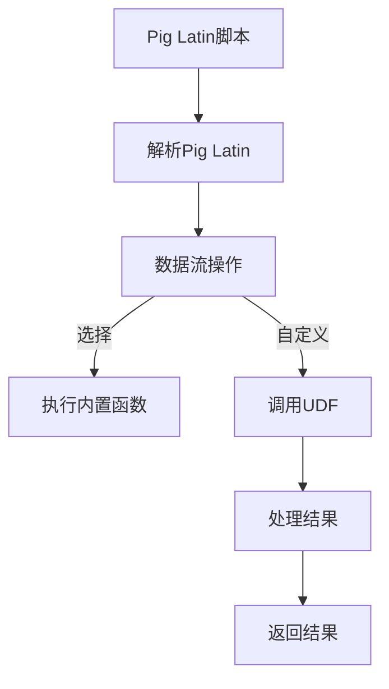

# Pig UDF原理与代码实例讲解

> 关键词：Pig, UDF, 自定义函数, Hadoop, 大数据分析, MapReduce

## 1. 背景介绍

随着大数据时代的到来，Hadoop和其生态系统中的Pig成为处理大规模数据集的强大工具。Pig是一种高级的数据处理语言，它允许用户使用类似SQL的语法来处理Hadoop中的数据，而不需要编写复杂的MapReduce代码。Pig的一个重要特性是用户自定义函数（UDF），它允许用户根据特定需求扩展Pig的功能。

### 1.1 问题的由来

在数据分析过程中，我们经常遇到一些特定业务场景，这些场景下的数据处理需求无法直接通过Pig内置函数实现。例如，某些业务逻辑需要根据特定规则计算新的列值，或者需要对数据进行复杂的模式匹配。这时，UDF应运而生，它允许用户将自定义的Java或Python代码嵌入到Pig脚本中，以实现定制化的数据处理。

### 1.2 研究现状

Pig UDF在Hadoop生态系统中已经得到了广泛的应用，特别是在需要自定义数据处理逻辑的场景中。随着Pig的发展，社区也涌现出许多基于不同语言的UDF实现，如PHP、Ruby等。然而，Java和Python仍然是开发UDF的最常用语言，因为它们具有丰富的库支持和较强的表达能力。

### 1.3 研究意义

研究Pig UDF不仅能够帮助开发者更好地利用Pig处理复杂的数据分析任务，还能够促进Hadoop生态系统的繁荣发展。通过UDF，用户可以轻松地扩展Pig的功能，使得Pig成为更加灵活和强大的大数据处理工具。

### 1.4 本文结构

本文将系统地介绍Pig UDF的原理和代码实例。以下是文章的结构：

- 第2部分，介绍Pig UDF的核心概念和架构。
- 第3部分，详细讲解Pig UDF的算法原理和具体操作步骤。
- 第4部分，介绍Pig UDF的数学模型和公式，并结合实例进行讲解。
- 第5部分，提供Pig UDF的代码实例和详细解释说明。
- 第6部分，探讨Pig UDF的实际应用场景和未来应用展望。
- 第7部分，推荐Pig UDF相关的学习资源、开发工具和参考文献。
- 第8部分，总结Pig UDF的未来发展趋势与挑战。
- 第9部分，附录中包含常见问题与解答。

## 2. 核心概念与联系

Pig UDF的核心概念包括：

- **Pig Latin**：Pig的高级数据流语言，用于描述数据处理逻辑。
- **Pig Latin语法**：包括数据类型、运算符、数据流操作等。
- **UDF**：用户自定义函数，允许用户在Pig脚本中嵌入自定义的Java或Python代码。
- **Hadoop生态系统**：包括Hadoop、Pig、Hive等工具，用于处理大规模数据集。

以下是Pig UDF的Mermaid流程图：



在这个流程图中，Pig Latin脚本被解析为数据流操作，其中可以选择执行内置函数或调用UDF。处理结果最终返回给用户。

## 3. 核心算法原理 & 具体操作步骤

### 3.1 算法原理概述

Pig UDF的原理是将自定义的Java或Python代码作为函数封装在Pig脚本中。当Pig运行到UDF调用时，系统会动态加载相应的函数实现，并执行其逻辑。

### 3.2 算法步骤详解

1. **定义UDF**：使用Java或Python编写自定义函数，并实现特定的功能。
2. **加载UDF**：在Pig脚本中，使用LOAD命令加载自定义函数。
3. **调用UDF**：在Pig脚本中，使用自定义函数对数据集进行操作。
4. **处理结果**：UDF处理数据后，将结果返回给Pig脚本。

### 3.3 算法优缺点

**优点**：

- **扩展性强**：可以轻松扩展Pig的功能，满足特定业务需求。
- **灵活性高**：可以编写复杂的逻辑，处理各种数据处理任务。
- **易用性高**：使用Pig脚本即可调用UDF，无需编写复杂的MapReduce代码。

**缺点**：

- **性能开销**：UDF通常比内置函数慢，因为它们需要额外的Java或Python运行时开销。
- **开发难度**：编写UDF需要一定的编程技能，对于不熟悉Java或Python的开发者来说可能有一定的门槛。

### 3.4 算法应用领域

Pig UDF可以应用于以下领域：

- **数据清洗**：处理缺失值、异常值等。
- **数据转换**：转换数据格式、类型等。
- **复杂计算**：实现特定的算法或统计计算。
- **自定义分析**：根据特定业务需求进行数据分析。

## 4. 数学模型和公式 & 详细讲解 & 举例说明

### 4.1 数学模型构建

Pig UDF的数学模型通常取决于其实现的功能。以下是一个简单的例子，使用Java编写一个UDF，将字符串转换为整数。

```java
import org.apache.pig.EvalFunc;
import org.apache.pig.data.Tuple;
import java.io.IOException;

public class StringToIntUDF extends EvalFunc<Integer> {
    public Integer exec(Tuple input) throws IOException {
        if (input == null || input.size() == 0) {
            return null;
        }
        String str = input.get(0).toString();
        try {
            return Integer.parseInt(str);
        } catch (NumberFormatException e) {
            return null;
        }
    }
}
```

### 4.2 公式推导过程

在这个例子中，UDF接受一个字符串作为输入，并尝试将其解析为整数。如果解析成功，则返回解析后的整数；如果失败，则返回null。

### 4.3 案例分析与讲解

假设我们有一个包含字符串类型数字的Pig数据集，我们需要将其转换为整数类型。以下是一个使用StringToIntUDF的Pig脚本示例：

```pig
A = LOAD 'input_data.txt' AS (line:chararray);
B = FOREACH A GENERATE StringToIntUDF(line) AS number;
DUMP B;
```

在这个脚本中，我们首先加载一个名为`input_data.txt`的数据集，然后使用StringToIntUDF UDF将每一行的字符串转换为整数。最后，我们打印转换后的结果。

## 5. 项目实践：代码实例和详细解释说明

### 5.1 开发环境搭建

要在本地开发Pig UDF，需要以下环境：

- Java开发环境：安装Java SDK和IDE（如Eclipse或IntelliJ IDEA）。
- Hadoop环境：安装Hadoop集群，并配置好Pig。
- Maven或SBT：用于构建和打包Java项目。

### 5.2 源代码详细实现

以下是一个简单的Java UDF，用于计算两个整数的和。

```java
import org.apache.pig.EvalFunc;
import org.apache.pig.data.Tuple;
import java.io.IOException;

public class SumUDF extends EvalFunc<Integer> {
    public Integer exec(Tuple input) throws IOException {
        if (input == null || input.size() < 2) {
            return null;
        }
        Integer num1 = (Integer) input.get(0);
        Integer num2 = (Integer) input.get(1);
        return num1 + num2;
    }
}
```

### 5.3 代码解读与分析

在这个例子中，SumUDF UDF接受两个整数作为输入，并返回它们的和。如果输入不完整或类型不正确，则返回null。

### 5.4 运行结果展示

以下是一个使用SumUDF的Pig脚本示例：

```pig
A = LOAD 'input_data.txt' AS (num1:INT, num2:INT);
B = FOREACH A GENERATE SumUDF(num1, num2) AS sum;
DUMP B;
```

在这个脚本中，我们首先加载一个名为`input_data.txt`的数据集，其中包含两个整数。然后，我们使用SumUDF UDF计算每一对整数的和，并打印结果。

## 6. 实际应用场景

Pig UDF在以下实际应用场景中非常有用：

- **金融数据分析**：处理交易数据、客户信息等。
- **日志分析**：分析Web日志、系统日志等。
- **社交媒体分析**：处理用户评论、帖子等。
- **电子商务分析**：处理商品信息、用户行为等。

### 6.4 未来应用展望

随着大数据技术的发展，Pig UDF的应用将会越来越广泛。未来，以下趋势值得关注：

- **多语言支持**：支持更多的编程语言，如Python、JavaScript等。
- **性能优化**：提高UDF的执行效率，减少性能开销。
- **易用性提升**：简化UDF的开发和部署流程。
- **安全性增强**：提高UDF的安全性，防止恶意代码的注入。

## 7. 工具和资源推荐

### 7.1 学习资源推荐

- 《Hadoop in Action》
- 《Pig in Action》
- Apache Pig官方文档
- Hadoop和Pig社区论坛

### 7.2 开发工具推荐

- Eclipse
- IntelliJ IDEA
- Maven
- SBT

### 7.3 相关论文推荐

- “Pig: A Platform for High-Level Data Processing on Large Clusters” by Christopher Dean et al.
- “Pig Latin: A Not-So-Slow Data Processing Language” by Christopher Dean et al.

## 8. 总结：未来发展趋势与挑战

### 8.1 研究成果总结

本文介绍了Pig UDF的原理和代码实例，探讨了其在实际应用场景中的价值。通过Pig UDF，用户可以轻松扩展Pig的功能，实现复杂的数据处理任务。

### 8.2 未来发展趋势

Pig UDF的未来发展趋势包括多语言支持、性能优化、易用性提升和安全性增强。

### 8.3 面临的挑战

Pig UDF面临的挑战包括性能开销、开发难度和安全性问题。

### 8.4 研究展望

为了克服Pig UDF的挑战，未来的研究需要关注性能优化、易用性提升和安全性增强等方面。

## 9. 附录：常见问题与解答

**Q1：为什么需要Pig UDF？**

A：Pig UDF允许用户扩展Pig的功能，满足特定业务需求，处理复杂的数据处理任务。

**Q2：如何开发Pig UDF？**

A：可以使用Java或Python编写Pig UDF，并使用相应的编程语言环境进行开发。

**Q3：Pig UDF的性能如何？**

A：Pig UDF的性能通常比内置函数慢，因为它们需要额外的Java或Python运行时开销。

**Q4：如何提高Pig UDF的性能？**

A：可以通过优化Java或Python代码、减少函数调用次数等方式提高Pig UDF的性能。

**Q5：Pig UDF的安全吗？**

A：Pig UDF可能存在安全风险，如代码注入攻击。因此，开发Pig UDF时需要确保代码的安全性。

作者：禅与计算机程序设计艺术 / Zen and the Art of Computer Programming