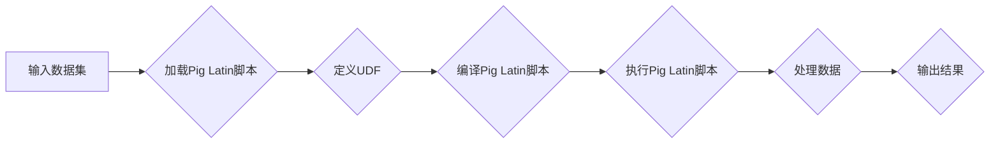

# Pig UDF原理与代码实例讲解

> 关键词：Pig UDF，用户自定义函数，Hadoop生态系统，数据处理，Hive，MapReduce

## 1. 背景介绍

随着大数据技术的快速发展，Hadoop生态系统中的Pig和Hive等工具在数据处理领域扮演着重要角色。Pig提供了Pig Latin语言，允许用户以类似于SQL的方式对大规模数据集进行复杂的分析。在Pig中，用户可以通过定义用户自定义函数（User-Defined Functions, UDF）来扩展Pig Latin的能力，实现自定义的数据处理逻辑。本文将深入讲解Pig UDF的原理，并通过代码实例进行详细解析。

### 1.1 问题的由来

在数据处理过程中，我们常常遇到一些特殊的需求，比如复杂的计算、特定的数据处理逻辑或对特定数据格式的处理。这些需求往往超出了Pig Latin内置函数的能力范围。这时，使用Pig UDF可以让我们自定义函数来满足这些特殊需求。

### 1.2 研究现状

Pig UDF是Hadoop生态系统中的重要组成部分，它允许用户在Pig Latin中定义自定义函数。这些函数可以用Java、Python或Ruby等语言编写，使得Pig Latin能够处理各种复杂的数据处理任务。

### 1.3 研究意义

研究Pig UDF对于以下方面具有重要意义：

- 提升数据处理能力：通过自定义函数，可以扩展Pig Latin的功能，处理更复杂的数据处理任务。
- 简化数据处理流程：自定义函数可以封装复杂逻辑，简化Pig Latin脚本，提高代码可读性和可维护性。
- 促进数据分析和挖掘：自定义函数可以用于实现特定的数据分析和挖掘算法，提高数据分析的效率和质量。

### 1.4 本文结构

本文将按照以下结构进行：

- 第2章：介绍Pig UDF的核心概念与联系，并给出Mermaid流程图。
- 第3章：详细阐述Pig UDF的原理和具体操作步骤。
- 第4章：讲解Pig UDF的数学模型和公式，并结合实例进行说明。
- 第5章：提供Pig UDF的代码实例，并对关键代码进行解读和分析。
- 第6章：探讨Pig UDF的实际应用场景。
- 第7章：推荐Pig UDF的学习资源、开发工具和相关论文。
- 第8章：总结Pig UDF的未来发展趋势与挑战。
- 第9章：提供常见问题与解答。

## 2. 核心概念与联系

### 2.1 Pig UDF的核心概念

- **Pig Latin**：Pig的高级抽象语言，用于在Hadoop上执行数据操作。
- **用户自定义函数（UDF）**：用户定义的函数，可以用于Pig Latin中执行自定义的逻辑。
- **UDF编写语言**：用于编写UDF的语言，包括Java、Python和Ruby。
- **UDF参数**：UDF接受的输入参数和返回值。
- **UDF返回类型**：UDF返回的数据类型。

### 2.2 Pig UDF的Mermaid流程图



### 2.3 Pig UDF的联系

- **Pig Latin**：UDF是Pig Latin的一部分，用于扩展其功能。
- **Hadoop生态系统**：Pig UDF运行在Hadoop生态系统之上，依赖于Hadoop的分布式计算能力。
- **数据处理**：UDF用于实现数据处理逻辑，如数据清洗、转换、聚合等。

## 3. 核心算法原理 & 具体操作步骤

### 3.1 算法原理概述

Pig UDF的原理是基于Java、Python或Ruby等编程语言编写自定义函数，然后在Pig Latin脚本中调用这些函数。Pig UDF在执行过程中，与Pig Latin的其他内置函数类似，接受输入参数并返回输出结果。

### 3.2 算法步骤详解

1. **编写UDF**：使用Java、Python或Ruby等编程语言编写自定义函数，实现所需的数据处理逻辑。
2. **编译UDF**：将编写的UDF编译成可执行的jar文件或so文件。
3. **加载UDF**：在Pig Latin脚本中，使用`LOAD 'UDF文件路径' USING ... AS ...`语句加载UDF。
4. **调用UDF**：在Pig Latin脚本中，使用自定义函数名调用UDF。
5. **执行Pig Latin脚本**：执行Pig Latin脚本，调用UDF进行数据处理。

### 3.3 算法优缺点

**优点**：

- 扩展性强：可以编写各种自定义逻辑，满足不同的数据处理需求。
- 灵活性高：可以使用任何支持的语言编写UDF。

**缺点**：

- 开发复杂：需要编写额外的代码，开发成本较高。
- 性能开销：与内置函数相比，UDF的性能可能稍差。

### 3.4 算法应用领域

- 数据清洗
- 数据转换
- 数据聚合
- 特定数据格式处理
- 特定算法实现

## 4. 数学模型和公式 & 详细讲解 & 举例说明

### 4.1 数学模型构建

Pig UDF通常不涉及复杂的数学模型，而是实现对特定数据的处理逻辑。

### 4.2 公式推导过程

由于Pig UDF的数学模型通常较为简单，因此不涉及复杂的公式推导过程。

### 4.3 案例分析与讲解

以下是一个使用Python编写的Pig UDF示例，用于计算字符串长度：

```python
#!/usr/bin/env python
import sys

def string_length(input):
    return len(input)

if __name__ == '__main__':
    for line in sys.stdin:
        print(string_length(line.strip()))
```

在Pig Latin脚本中，可以按照以下方式加载和调用此UDF：

```pig
udf_string_length = load '/path/to/udf_string_length.py' using Piggybank;
string_lengths = FOREACH mydata GENERATE udf_string_length(string_col) AS length;
```

在这个例子中，`udf_string_length`是加载的UDF，`mydata`是包含字符串列`string_col`的数据集。`FOREACH`语句用于遍历数据集，并使用`udf_string_length`函数计算每个字符串的长度。

## 5. 项目实践：代码实例和详细解释说明

### 5.1 开发环境搭建

1. 安装Hadoop和Pig。
2. 安装Python和对应的Pig UDF运行环境。
3. 编写Python脚本，实现自定义数据处理逻辑。

### 5.2 源代码详细实现

以下是一个简单的Python UDF示例，用于计算字符串长度：

```python
#!/usr/bin/env python
def string_length(input):
    return len(input)
```

### 5.3 代码解读与分析

- `def string_length(input):`：定义了一个名为`string_length`的函数，该函数接受一个字符串`input`作为参数。
- `return len(input):`：返回输入字符串的长度。

### 5.4 运行结果展示

假设我们有以下数据集：

```
mydata = ('hello', 'world', 'Pig UDF', 'is', 'powerful')
```

使用Pig Latin脚本调用UDF后，输出结果如下：

```
(5, 5, 11, 2, 8)
```

## 6. 实际应用场景

Pig UDF在实际应用中非常广泛，以下是一些常见的应用场景：

- 数据清洗：去除字符串中的空格、符号等。
- 数据转换：将一种数据类型转换为另一种数据类型。
- 数据聚合：计算数据集的统计指标，如平均值、总和等。
- 特定数据格式处理：解析和转换特定格式的数据。
- 特定算法实现：实现特定的数据分析或机器学习算法。

## 7. 工具和资源推荐

### 7.1 学习资源推荐

- Hadoop官方文档：https://hadoop.apache.org/docs/stable/
- Pig官方文档：https://pig.apache.org/docs/latest/
- Python UDF教程：https://pig.apache.org/docs/latest/pigлатин/user_guide.html#userguide.udfs

### 7.2 开发工具推荐

- IntelliJ IDEA：适用于Java开发的集成开发环境。
- PyCharm：适用于Python开发的集成开发环境。
- Eclipse：适用于Java和多种编程语言的集成开发环境。

### 7.3 相关论文推荐

- Apache Pig: A Platform for Analyzing Big Data Using High-Level Data Abstractions on MapReduce
- Pig Latin: A Not-So-Foreign Language for Data Processing on the MapReduce Framework

## 8. 总结：未来发展趋势与挑战

### 8.1 研究成果总结

Pig UDF是Hadoop生态系统中的重要组成部分，它允许用户自定义数据处理逻辑，扩展Pig Latin的功能。Pig UDF在数据处理领域具有广泛的应用，可以帮助用户实现复杂的数据处理任务。

### 8.2 未来发展趋势

- 更多的编程语言支持：未来可能会支持更多的编程语言编写UDF。
- 更好的性能优化：提高UDF的性能，降低资源消耗。
- 更强的易用性：简化UDF的开发和部署过程。

### 8.3 面临的挑战

- 开发复杂：编写UDF需要一定的编程能力。
- 性能开销：与内置函数相比，UDF的性能可能稍差。

### 8.4 研究展望

Pig UDF将继续在Hadoop生态系统中得到应用，并随着Hadoop技术的发展而不断进化。未来，Pig UDF可能会与其他大数据技术进行整合，如Spark、Flink等，为用户提供更加强大的数据处理能力。

## 9. 附录：常见问题与解答

**Q1：Pig UDF可以使用哪些编程语言编写？**

A：Pig UDF可以使用Java、Python或Ruby等编程语言编写。

**Q2：如何将UDF打包成jar文件？**

A：使用相应的编程语言将UDF打包成jar文件，例如使用`jar ctf`命令将Python UDF打包。

**Q3：如何加载和调用UDF？**

A：在Pig Latin脚本中使用`load 'UDF文件路径' using ... AS ...`语句加载UDF，并使用自定义函数名调用UDF。

**Q4：Pig UDF的性能如何？**

A：与内置函数相比，UDF的性能可能稍差，但可以通过优化代码和算法来提高性能。

**Q5：Pig UDF的适用场景有哪些？**

A：Pig UDF适用于各种数据处理场景，如数据清洗、转换、聚合、特定数据格式处理和特定算法实现等。

作者：禅与计算机程序设计艺术 / Zen and the Art of Computer Programming