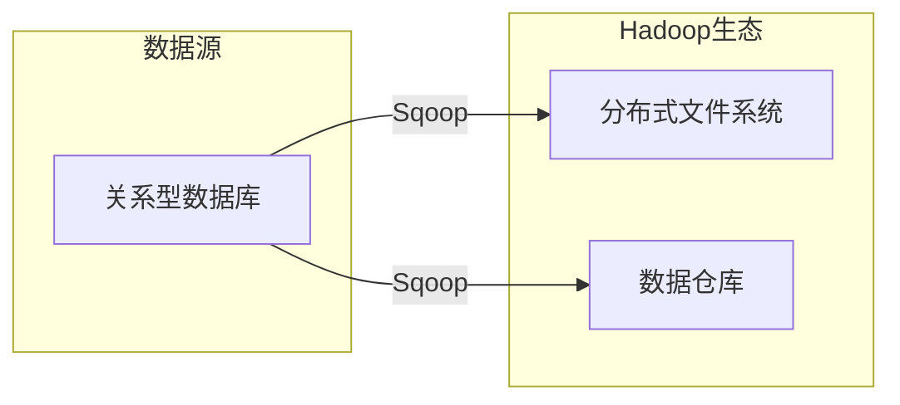

# Sqoop原理与代码实例讲解

> 关键词：Sqoop, Hadoop, 数据迁移, 大数据, 数据仓库, Apache, 代码实例

## 1. 背景介绍

随着数据量的爆发式增长，大数据处理和分析已经成为现代企业的重要需求。Hadoop生态系统提供了一套强大的数据处理框架，使得大规模数据存储和处理成为可能。然而，Hadoop生态系统与传统的数据库和数据分析工具之间的数据交互仍然是一个挑战。Sqoop正是为了解决这个问题而诞生的，它允许用户在Hadoop生态系统中轻松地将数据从关系型数据库迁移到Hadoop的存储系统中，如HDFS或Hive。

### 1.1 问题的由来

在传统的数据仓库架构中，数据通常存储在关系型数据库中。随着数据量的增长，需要对数据进行更复杂的大数据分析，这时就需要将数据迁移到Hadoop生态系统中。然而，手动导出和导入数据不仅费时费力，而且容易出错。

### 1.2 研究现状

Sqoop是Apache软件基金会的一个开源项目，它提供了一个高效的数据迁移解决方案。Sqoop支持多种关系型数据库，如MySQL、Oracle、PostgreSQL等，以及多种数据存储格式，如Avro、Parquet、ORC等。

### 1.3 研究意义

Sqoop在数据迁移领域具有重要的研究意义，它简化了数据迁移过程，提高了数据处理的效率，并降低了错误率。通过Sqoop，企业可以更快速地将数据从传统的数据源迁移到Hadoop生态系统中，以便进行大数据分析和处理。

### 1.4 本文结构

本文将分为以下几个部分：
- 介绍Sqoop的核心概念和原理。
- 详细讲解Sqoop的安装和配置过程。
- 通过代码实例演示Sqoop的基本操作。
- 探讨Sqoop的应用场景和未来发展方向。

## 2. 核心概念与联系

### 2.1 核心概念

- **Hadoop**：一个开源的分布式计算框架，用于处理大规模数据集。
- **HDFS**：Hadoop分布式文件系统，用于存储大规模数据。
- **Hive**：一个建立在Hadoop上的数据仓库工具，用于处理大规模数据集。
- **Sqoop**：一个用于在Hadoop与关系型数据库之间进行数据迁移的工具。

### 2.2 架构流程图



### 2.3 核心概念联系

Sqoop作为连接关系型数据库和Hadoop生态系统的桥梁，通过将数据从数据库迁移到HDFS或Hive，实现了数据在Hadoop生态系统中的存储和处理。

## 3. 核心算法原理 & 具体操作步骤

### 3.1 算法原理概述

Sqoop的核心原理是将关系型数据库中的数据导出到HDFS或Hive支持的格式中，然后通过Hadoop的MapReduce或Spark等计算框架进行数据处理。

### 3.2 算法步骤详解

1. **连接数据库**：使用Sqoop的JDBC驱动连接到关系型数据库。
2. **选择数据**：指定需要迁移的表或查询。
3. **导出数据**：将数据导出到HDFS或Hive支持的格式中。
4. **处理数据**：使用Hadoop的MapReduce或Spark对数据进行处理。

### 3.3 算法优缺点

#### 优点

- **高效**：利用Hadoop的分布式计算能力，可以高效地处理大规模数据迁移。
- **灵活**：支持多种数据格式和关系型数据库。
- **易于使用**：提供简单的命令行界面和配置文件。

#### 缺点

- **复杂性**：对于复杂的迁移任务，配置可能比较复杂。
- **性能**：对于小规模数据迁移，性能可能不如直接使用数据库工具。

### 3.4 算法应用领域

- **数据仓库构建**：将数据从关系型数据库迁移到Hive，用于构建数据仓库。
- **大数据分析**：将数据从关系型数据库迁移到HDFS，用于大数据分析。
- **数据备份**：将数据从关系型数据库迁移到HDFS，用于数据备份。

## 4. 数学模型和公式 & 详细讲解 & 举例说明

### 4.1 数学模型构建

Sqoop的数据迁移过程可以抽象为一个数据流模型，其中数据从源系统流向目标系统。

### 4.2 公式推导过程

由于Sqoop的数据迁移过程主要涉及数据的读取和写入，因此数学模型较为简单。

### 4.3 案例分析与讲解

假设我们需要将一个包含1000万条记录的MySQL数据库表迁移到HDFS中。以下是一个简单的Sqoop命令示例：

```bash
sqoop import --connect jdbc:mysql://localhost:3306/database_name --username username --password password --table table_name --target-dir hdfs://namenode:8020/path/to/directory --as-textfile
```

在这个例子中，`--connect`指定了数据库连接信息，`--username`和`--password`指定了数据库用户名和密码，`--table`指定了需要迁移的表，`--target-dir`指定了数据在HDFS中的目标目录，`--as-textfile`指定了数据以文本文件的格式存储。

## 5. 项目实践：代码实例和详细解释说明

### 5.1 开发环境搭建

首先，需要在Hadoop集群上安装Sqoop。以下是安装步骤：

1. 下载Sqoop的安装包。
2. 解压安装包。
3. 将Sqoop添加到Hadoop的`$HADOOP_HOME/lib`目录下。
4. 配置Sqoop的环境变量。

### 5.2 源代码详细实现

Sqoop的源代码主要包含以下几个模块：

- `sqoop-core`：核心功能模块。
- `sqoop-metastore`：元数据存储模块。
- `sqoop-tools`：命令行工具模块。
- `sqoop-server`：服务器端模块。

### 5.3 代码解读与分析

Sqoop的源代码主要使用Java编写，利用了JDBC连接数据库，并使用了Hadoop的MapReduce框架进行数据迁移。

### 5.4 运行结果展示

在执行Sqoop命令后，数据将被迁移到指定的HDFS目录中。可以使用Hadoop命令行工具或Hadoop的Web界面查看迁移后的数据。

## 6. 实际应用场景

### 6.1 数据仓库构建

Sqoop可以用于将数据从关系型数据库迁移到Hive中，用于构建数据仓库。

### 6.2 大数据分析

Sqoop可以用于将数据从关系型数据库迁移到HDFS中，以便进行大数据分析。

### 6.3 数据备份

Sqoop可以用于将数据从关系型数据库迁移到HDFS中，用于数据备份。

## 7. 工具和资源推荐

### 7.1 学习资源推荐

- Apache Sqoop官方文档：https://sqoop.apache.org/
- Hadoop官方文档：https://hadoop.apache.org/docs/
- 《Hadoop实战》

### 7.2 开发工具推荐

- IntelliJ IDEA：一款强大的Java开发工具，支持Hadoop和Sqoop开发。
- IntelliJ IDEA Ultimate：包含了对Hadoop和Sqoop的支持。

### 7.3 相关论文推荐

- “Sqoop: An Open Source Tool for Moving Data Between Relational Databases and Hadoop”
- “Hadoop: A Framework for Large-Scale Data Processing”

## 8. 总结：未来发展趋势与挑战

### 8.1 研究成果总结

Sqoop作为Hadoop生态系统中的重要工具，为数据迁移提供了便捷的解决方案。它简化了数据迁移过程，提高了数据处理的效率，并降低了错误率。

### 8.2 未来发展趋势

- Sqoop将继续与Hadoop生态系统保持同步，支持更多数据格式和关系型数据库。
- Sqoop将与其他数据迁移工具进行整合，提供更加全面的数据迁移解决方案。
- Sqoop将支持更加复杂的数据迁移任务，如数据同步、数据转换等。

### 8.3 面临的挑战

- **性能优化**：随着数据规模的不断扩大，Sqoop的性能优化成为了一个重要挑战。
- **安全性**：随着数据安全意识的提高，Sqoop的数据传输安全性需要进一步提升。
- **易用性**：对于复杂的迁移任务，Sqoop的易用性需要得到改善。

### 8.4 研究展望

Sqoop将继续在数据迁移领域发挥重要作用，为大数据时代的数据处理提供有力支持。

## 9. 附录：常见问题与解答

**Q1：Sqoop支持哪些关系型数据库？**

A：Sqoop支持多种关系型数据库，如MySQL、Oracle、PostgreSQL、SQL Server等。

**Q2：如何配置Sqoop的连接信息？**

A：可以使用Sqoop的配置文件`sqoop-site.xml`配置连接信息。

**Q3：如何将数据从HDFS迁移回关系型数据库？**

A：可以使用Sqoop的导出功能，将HDFS中的数据导入到关系型数据库中。

**Q4：Sqoop如何处理大数据量迁移？**

A：Sqoop使用MapReduce框架处理大数据量迁移，可以利用Hadoop的分布式计算能力提高迁移效率。

**Q5：Sqoop如何处理数据转换？**

A：Sqoop提供了多种数据转换功能，如字段映射、数据格式转换等。

作者：禅与计算机程序设计艺术 / Zen and the Art of Computer Programming