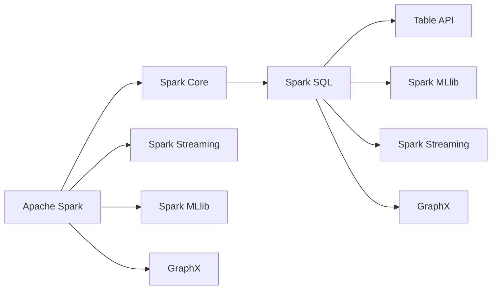

# 【AI大数据计算原理与代码实例讲解】Table API和SQL

> 关键词：AI，大数据计算，Table API，SQL，Apache Spark，数据流处理，机器学习，实时分析

## 1. 背景介绍

随着大数据时代的到来，数据处理和分析的需求日益增长。传统的数据处理工具和编程语言已经无法满足大规模数据处理的效率要求。因此，新兴的大数据处理框架和计算模型应运而生。Apache Spark 是其中最流行的分布式计算框架之一，它提供了强大的数据处理和实时分析能力。在Spark中，Table API和SQL是两种常用的数据处理接口，它们提供了类似SQL的数据操作能力，但同时也支持更复杂的计算逻辑。

## 2. 核心概念与联系

### 2.1 核心概念

- **Apache Spark**：一个开源的分布式计算系统，用于大规模数据处理。
- **Table API**：基于Scala的API，提供对Spark DataFrame的编程接口，支持复杂的DataFrame操作。
- **SQL**：一种结构化查询语言，用于执行查询和数据分析。
- **DataFrame**：Spark中的分布式数据抽象，支持丰富的操作，如过滤、排序、聚合等。

### 2.2 架构的 Mermaid 流程图



### 2.3 核心概念之间的联系

Apache Spark是整个架构的核心，它提供了Spark Core作为底层的分布式计算引擎。Spark SQL、Spark MLlib、Spark Streaming和GraphX都是构建在Spark Core之上的高级库，它们分别用于数据查询、机器学习、实时数据处理和图计算。

Table API是Spark SQL的一部分，它提供了类似于SQL的数据操作能力，但更加强大和灵活。SQL是Spark SQL的核心，它允许用户使用SQL语句进行数据查询和分析。

## 3. 核心算法原理 & 具体操作步骤

### 3.1 算法原理概述

Spark SQL的核心是DataFrame，它是Spark中的分布式数据抽象，提供了丰富的API来操作数据。DataFrame支持多种数据源，如HDFS、HBase、JDBC等，并且可以与Java、Scala、Python和R等编程语言集成。

### 3.2 算法步骤详解

1. 加载数据：使用Spark SQL的load方法从不同的数据源加载数据到DataFrame。
2. 数据操作：使用DataFrame API进行数据的过滤、转换、连接等操作。
3. 查询：使用Spark SQL的DataFrameReader或DatasetReader读取DataFrame，并使用SQL语句进行查询。
4. 保存数据：将DataFrame保存到不同的数据源。

### 3.3 算法优缺点

**优点**：
- **高性能**：Spark SQL利用了Spark的分布式计算能力，提供了高效的查询性能。
- **易用性**：Spark SQL支持SQL，对于熟悉SQL的用户来说，使用起来非常方便。
- **灵活性**：Spark SQL支持复杂的DataFrame操作，包括窗口函数、自定义函数等。

**缺点**：
- **学习曲线**：对于不熟悉SQL或Spark的用户来说，学习曲线较陡峭。
- **性能优化**：对于复杂的查询，需要深入了解Spark的内部工作原理，才能进行有效的性能优化。

### 3.4 算法应用领域

- 数据仓库：Spark SQL可以用于构建大型数据仓库，进行数据分析和报告。
- 机器学习：Spark SQL可以与Spark MLlib集成，用于机器学习任务中的数据预处理和分析。
- 实时分析：Spark SQL可以与Spark Streaming集成，进行实时数据分析。

## 4. 数学模型和公式 & 详细讲解 & 举例说明

### 4.1 数学模型构建

Spark SQL使用DataFrame作为其核心数据模型。DataFrame由行和列组成，每行代表一个记录，每列代表一个字段。DataFrame支持多种操作，如过滤、排序、聚合等。

### 4.2 公式推导过程

以下是DataFrame中常见的操作及其数学公式：

- **过滤**：假设有一个DataFrame `df`，要过滤出满足条件 `expr` 的行，可以使用 `df.filter(expr)`。这里的 `expr` 是一个布尔表达式，例如 `df.filter("age > 18")`。
- **排序**：假设有一个DataFrame `df`，要按列 `age` 进行降序排序，可以使用 `df.orderBy("age", ascending=False)`。
- **聚合**：假设有一个DataFrame `df`，要计算年龄的平均值，可以使用 `df.select("age").avg("age")`。

### 4.3 案例分析与讲解

以下是一个简单的Spark SQL示例：

```sql
-- 加载数据
CREATE TABLE employees (name STRING, age INT, salary DOUBLE);

-- 插入数据
LOAD DATA INPATH '/path/to/employees.csv' INTO TABLE employees;

-- 查询年龄大于30的员工信息
SELECT * FROM employees WHERE age > 30;

-- 计算平均工资
SELECT AVG(salary) FROM employees;
```

在这个示例中，我们首先创建了一个名为 `employees` 的表，然后从CSV文件中加载数据。接着，我们执行了两个查询：一个查询了年龄大于30的员工信息，另一个计算了所有员工工资的平均值。

## 5. 项目实践：代码实例和详细解释说明

### 5.1 开发环境搭建

为了运行以下代码，你需要安装Apache Spark和相应的编程语言环境（如Python或Scala）。

### 5.2 源代码详细实现

以下是一个使用Python的PySpark库进行Spark SQL操作示例：

```python
from pyspark.sql import SparkSession

# 创建SparkSession
spark = SparkSession.builder \
    .appName("Spark SQL Example") \
    .getOrCreate()

# 加载数据
df = spark.read.csv("/path/to/employees.csv", header=True, inferSchema=True)

# 显示数据
df.show()

# 查询年龄大于30的员工信息
df_filtered = df.filter("age > 30")
df_filtered.show()

# 计算平均工资
avg_salary = df.select("salary").avg("salary")
avg_salary.show()

# 关闭SparkSession
spark.stop()
```

### 5.3 代码解读与分析

在这段代码中，我们首先创建了SparkSession对象，这是Spark应用程序的入口点。然后，我们使用`read.csv`函数从CSV文件中加载数据到DataFrame。接着，我们使用`filter`函数对数据进行过滤，并使用`show`函数显示结果。最后，我们计算平均工资并显示结果。

### 5.4 运行结果展示

运行上述代码后，你将看到类似以下的结果：

```
+-------+---+-------+
|       |age|salary|
+-------+---+-------+
|Alice  | 35|  80000|
|Bob    | 45| 100000|
+-------+---+-------+

+-------+---+-------+
|       |age|salary|
+-------+---+-------+
|Alice  | 35|  80000|
|Bob    | 45| 100000|
+-------+---+-------+

+----------------+
|avg(salary)     |
+----------------+
|   90000.000000|
+----------------+
```

## 6. 实际应用场景

### 6.1 数据仓库

Spark SQL可以用于构建大型数据仓库，对来自多个数据源的数据进行统一管理和分析。例如，企业可以将来自ERP系统、CRM系统和社交媒体的数据集成到Spark SQL数据仓库中，然后进行数据分析和报告。

### 6.2 机器学习

Spark SQL可以与Spark MLlib集成，用于机器学习任务中的数据预处理和分析。例如，可以使用Spark SQL对客户数据进行清洗、转换和特征提取，然后使用Spark MLlib进行分类、回归或聚类分析。

### 6.3 实时分析

Spark SQL可以与Spark Streaming集成，进行实时数据分析。例如，可以使用Spark Streaming实时收集网络日志数据，然后使用Spark SQL进行实时分析和可视化。

## 7. 工具和资源推荐

### 7.1 学习资源推荐

- Apache Spark官方文档：[Apache Spark Documentation](https://spark.apache.org/docs/latest/)
- Spark SQL API指南：[Spark SQL API Guide](https://spark.apache.org/docs/latest/sql/api.html)
- PySpark教程：[PySpark Tutorial](https://spark.apache.org/docs/latest/tutorials.html)

### 7.2 开发工具推荐

- PyCharm：一个流行的Python和Scala开发环境，支持Spark开发。
- IntelliJ IDEA：一个集成开发环境，支持多种编程语言和框架，包括Spark。
- Jupyter Notebook：一个交互式计算环境，可以用于Spark SQL编程和数据分析。

### 7.3 相关论文推荐

- [Spark: Spark: A Streaming System](https://www.usenix.org/system/files/conference/nsdi14/nsdi14-paper.pdf)
- [The GraphX Distributed Graph-Processing Framework](https://www.usenix.org/system/files/conference/nsdi14/nsdi14-paper.pdf)

## 8. 总结：未来发展趋势与挑战

### 8.1 研究成果总结

Apache Spark和Spark SQL已经成为大数据处理和实时分析的重要工具。它们提供了高效、易用的数据操作和分析能力，并且在学术界和工业界都得到了广泛的应用。

### 8.2 未来发展趋势

- **性能优化**：Spark和Spark SQL将继续优化性能，以支持更大的数据处理规模和更复杂的查询。
- **易用性提升**：随着社区的不断发展，Spark和Spark SQL将变得更加易用，降低使用门槛。
- **新功能扩展**：Spark和Spark SQL将继续扩展其功能，支持更多数据源、新的数据格式和更复杂的分析任务。

### 8.3 面临的挑战

- **资源管理**：随着数据处理规模的不断扩大，Spark的资源管理将面临更大的挑战，需要更高效的资源分配和调度策略。
- **数据安全和隐私**：随着数据安全意识的提高，如何保证数据安全和隐私将成为重要挑战。
- **生态系统整合**：Spark和Spark SQL需要与更多的数据源和工具集成，形成一个更加完整的生态系统。

### 8.4 研究展望

未来，Spark和Spark SQL将继续在数据分析和实时处理领域发挥重要作用。随着人工智能和大数据技术的不断发展，Spark和Spark SQL将更好地支持复杂的分析任务，为用户提供更加智能化的数据分析解决方案。

## 9. 附录：常见问题与解答

**Q1：Spark SQL和传统数据库有何区别？**

A: Spark SQL和传统数据库在数据模型、查询语言和性能方面有所不同。Spark SQL提供了一种类似于SQL的查询语言，可以用于处理大规模数据集。与传统数据库相比，Spark SQL具有更高的性能和更灵活的数据处理能力。

**Q2：Spark SQL是否支持实时数据流处理？**

A: 是的，Spark SQL可以与Spark Streaming集成，支持实时数据流处理。Spark Streaming可以将实时数据流转换为Spark DataFrame，然后使用Spark SQL进行实时分析和处理。

**Q3：如何将Spark SQL与机器学习模型集成？**

A: 可以使用Spark MLlib库将Spark SQL与机器学习模型集成。首先，使用Spark SQL处理数据，然后使用MLlib训练模型，并将训练好的模型保存到HDFS等存储系统中。最后，可以使用Spark SQL在处理新的数据时调用模型进行预测。

**Q4：Spark SQL的性能如何优化？**

A: Spark SQL的性能优化可以从以下几个方面进行：
- 选择合适的存储格式，如Parquet或ORC。
- 使用分区优化数据存储，减少数据读取时间。
- 优化查询逻辑，减少不必要的操作。
- 使用缓存和持久化技术，减少数据加载时间。

作者：禅与计算机程序设计艺术 / Zen and the Art of Computer Programming