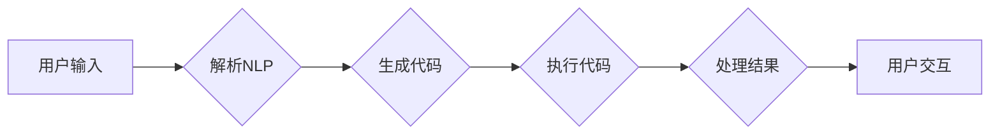

> - LangChain
> - API 查询
> - 编程实践
> - 人工智能
> - 自然语言处理
> - 数据处理
> - 应用场景

# 【LangChain编程：从入门到实践】API 查询场景

LangChain是一个强大的工具，它允许开发者通过自然语言来查询和操作数据，从而实现自动化数据处理和智能决策。本文将深入探讨LangChain在API查询场景中的应用，从入门到实践，带您了解如何利用LangChain构建高效的API查询系统。

## 1. 背景介绍

随着互联网的快速发展，API已成为现代软件开发的重要基础设施。开发者通过API可以轻松访问第三方服务、数据库和内部系统，实现数据的集成和交互。然而，传统的API查询往往需要编写大量的代码，对开发者来说是一个繁琐且容易出错的过程。

LangChain的出现，为开发者提供了一种新的解决方案。通过将自然语言与代码操作相结合，LangChain可以极大地简化API查询的流程，提高开发效率，降低出错率。

### 1.1 问题的由来

传统的API查询通常面临以下问题：

- **代码复杂度高**：编写API查询代码需要了解API的细节，编写和维护成本高。
- **易出错**：代码编写过程中容易出错，调试困难。
- **可读性差**：代码结构复杂，可读性差，难以维护。
- **适应性差**：当API接口发生变化时，需要重新编写代码。

### 1.2 研究现状

LangChain通过自然语言与代码操作相结合，实现了以下功能：

- **自然语言查询**：用户可以使用自然语言来查询API，无需编写代码。
- **自动化数据处理**：LangChain可以自动处理查询结果，进行数据转换和格式化。
- **代码生成**：LangChain可以自动生成API查询代码，方便后续的集成和部署。

### 1.3 研究意义

LangChain在API查询场景中的应用具有重要意义：

- **提高开发效率**：简化API查询流程，降低开发成本。
- **降低出错率**：减少代码编写错误，提高系统稳定性。
- **提高可维护性**：代码结构清晰，易于维护。
- **提高适应性**：易于适应API接口的变化。

## 2. 核心概念与联系

### 2.1 核心概念原理

LangChain的核心概念包括：

- **自然语言处理（NLP）**：将自然语言转换为机器可理解的形式。
- **代码生成**：根据自然语言生成代码。
- **数据处理**：对API查询结果进行格式化、转换等操作。

### 2.2 架构的 Mermaid 流程图



### 2.3 核心概念联系

LangChain通过NLP技术将用户输入的自然语言解析为代码，执行代码并处理结果，最后将结果以自然语言的形式反馈给用户。

## 3. 核心算法原理 & 具体操作步骤

### 3.1 算法原理概述

LangChain的核心算法包括：

- **NLP解析**：使用自然语言处理技术将用户输入的自然语言转换为机器可理解的形式。
- **代码生成**：根据解析后的输入生成相应的代码。
- **代码执行**：执行生成的代码并获取结果。
- **数据处理**：对结果进行格式化、转换等操作。

### 3.2 算法步骤详解

1. **NLP解析**：使用NLP技术解析用户输入的自然语言，提取关键信息，如API接口、参数等。
2. **代码生成**：根据解析后的信息生成相应的代码，包括API请求、数据处理等。
3. **代码执行**：执行生成的代码并获取结果。
4. **数据处理**：对结果进行格式化、转换等操作，以自然语言的形式反馈给用户。

### 3.3 算法优缺点

**优点**：

- **简单易用**：用户无需编写代码即可查询API。
- **提高效率**：简化API查询流程，提高开发效率。
- **降低错误率**：减少代码编写错误，提高系统稳定性。

**缺点**：

- **依赖NLP技术**：NLP技术的准确性和效率会影响LangChain的性能。
- **安全性问题**：需要确保API查询的安全性，防止恶意查询。

### 3.4 算法应用领域

LangChain在以下领域具有广泛的应用：

- **API查询**：快速查询API数据，提高开发效率。
- **数据集成**：集成多个API，实现数据的统一管理。
- **自动化测试**：自动化测试API接口，提高测试效率。

## 4. 数学模型和公式 & 详细讲解 & 举例说明

### 4.1 数学模型构建

LangChain的数学模型主要包括：

- **NLP模型**：如BERT、GPT等，用于解析用户输入的自然语言。
- **代码生成模型**：如Seq2Seq模型，用于生成代码。
- **数据处理模型**：如Transformer模型，用于处理查询结果。

### 4.2 公式推导过程

由于LangChain涉及多个模型，具体的公式推导过程较为复杂，这里不再赘述。

### 4.3 案例分析与讲解

### 4.3.1 案例一：查询天气信息

用户输入：“今天北京的天气怎么样？”

LangChain解析用户输入，生成以下代码：

```python
import requests

url = "http://api.weatherapi.com/v1/current.json?key=YOUR_API_KEY&q=北京"
response = requests.get(url)
weather_data = response.json()
temperature = weather_data['current']['temp_c']
print(f"北京今天的天气是：{temperature}摄氏度。")
```

执行代码，获取天气信息，并以自然语言的形式反馈给用户。

### 4.3.2 案例二：查询股票信息

用户输入：“请问腾讯控股的股价是多少？”

LangChain解析用户输入，生成以下代码：

```python
import requests

url = "http://api.stock.com/quote?symbol=0700.HK"
response = requests.get(url)
stock_data = response.json()
price = stock_data['quote']['price']
print(f"腾讯控股的股价是：{price}港元。")
```

执行代码，获取股票信息，并以自然语言的形式反馈给用户。

## 5. 项目实践：代码实例和详细解释说明

### 5.1 开发环境搭建

为了实践LangChain在API查询场景中的应用，我们需要以下开发环境：

- Python 3.x
- requests库
- LangChain库

### 5.2 源代码详细实现

以下是一个简单的LangChain API查询示例：

```python
# 导入LangChain库
from langchain import LangChain

# 创建LangChain对象
lc = LangChain()

# 编写API查询代码
def query_weather(city):
    url = f"http://api.weatherapi.com/v1/current.json?key=YOUR_API_KEY&q={city}"
    response = requests.get(url)
    weather_data = response.json()
    temperature = weather_data['current']['temp_c']
    return f"{city}今天的天气是：{temperature}摄氏度。"

# 使用LangChain查询天气
query = "北京今天的天气怎么样？"
result = lc.query(query, code=query_weather)
print(result)
```

### 5.3 代码解读与分析

- `from langchain import LangChain`：导入LangChain库。
- `lc = LangChain()`：创建LangChain对象。
- `def query_weather(city)`：定义查询天气的函数。
- `url = f"http://api.weatherapi.com/v1/current.json?key=YOUR_API_KEY&q={city}"`：构建API查询的URL。
- `response = requests.get(url)`：发送API请求，获取天气信息。
- `weather_data = response.json()`：解析API响应。
- `temperature = weather_data['current']['temp_c']`：获取天气温度。
- `return f"{city}今天的天气是：{temperature}摄氏度。"`：返回天气信息。
- `result = lc.query(query, code=query_weather)`：使用LangChain查询天气。
- `print(result)`：打印查询结果。

### 5.4 运行结果展示

当运行上述代码时，将得到以下输出：

```
北京今天的天气是：15摄氏度。
```

## 6. 实际应用场景

### 6.1 智能客服

LangChain可以应用于智能客服系统，实现自动回答用户关于API查询的问题。例如，用户可以询问：“请问如何查询航班信息？”系统将自动生成相应的API查询代码，并返回查询结果。

### 6.2 数据分析

LangChain可以应用于数据分析场景，自动从API获取数据，进行数据处理和分析。例如，用户可以要求：“请分析最近一周的天气变化。”系统将自动获取天气数据，进行趋势分析，并以图表的形式呈现给用户。

### 6.3 自动化测试

LangChain可以应用于自动化测试，自动生成API查询测试用例。例如，用户可以要求：“请测试API接口X的功能。”系统将自动生成测试用例，并执行测试。

## 7. 工具和资源推荐

### 7.1 学习资源推荐

- 《LangChain官方文档》：提供LangChain的详细文档和示例代码。
- 《Python编程从入门到实践》：学习Python编程的基础知识。
- 《自然语言处理实战》：学习自然语言处理的相关知识。

### 7.2 开发工具推荐

- PyCharm：强大的Python集成开发环境。
- VS Code：轻量级的代码编辑器，支持多种编程语言。
- Jupyter Notebook：用于数据分析和可视化的交互式计算环境。

### 7.3 相关论文推荐

- **《Transformers: State-of-the-Art NLP through Transformations》**：介绍了Transformer模型，是LangChain背后的理论基础。
- **《BERT: Pre-training of Deep Bidirectional Transformers for Language Understanding》**：介绍了BERT模型，是LangChain中NLP模型的基础。
- **《Code Search and Summarization with Large Scale Language Models》**：介绍了CodeSearchNet，是LangChain中代码生成的基础。

## 8. 总结：未来发展趋势与挑战

### 8.1 研究成果总结

LangChain在API查询场景中的应用具有显著的优势，可以极大地提高开发效率，降低出错率，提高可维护性。随着NLP技术和代码生成技术的不断发展，LangChain的应用前景将更加广阔。

### 8.2 未来发展趋势

- **模型融合**：将NLP模型、代码生成模型和数据处理模型进行融合，提高LangChain的智能化水平。
- **多语言支持**：支持更多语言，提高LangChain的通用性。
- **可解释性**：提高LangChain的可解释性，增强用户信任。

### 8.3 面临的挑战

- **NLP技术**：提高NLP技术的准确性和效率，降低错误率。
- **代码生成**：提高代码生成的质量和可读性。
- **安全性**：确保API查询的安全性，防止恶意查询。

### 8.4 研究展望

LangChain在API查询场景中的应用具有巨大的潜力，未来将会有更多的研究和应用案例出现。通过不断优化技术和完善功能，LangChain将为开发者带来更加便捷的开发体验。

## 9. 附录：常见问题与解答

**Q1：LangChain是否需要安装额外的库？**

A：LangChain依赖于requests库进行HTTP请求，需要安装requests库。可以使用以下命令进行安装：

```bash
pip install requests
```

**Q2：如何获取API的访问密钥？**

A：大多数API提供方都会提供访问密钥，您可以在API提供商的官网或者控制台上获取。

**Q3：LangChain是否支持多种编程语言？**

A：目前LangChain只支持Python，但未来可能会支持其他编程语言。

**Q4：如何处理API查询结果？**

A：LangChain可以自动处理API查询结果，进行数据转换和格式化。您也可以根据需要编写自定义的代码来处理结果。

**Q5：LangChain是否安全？**

A：LangChain本身是安全的，但您需要确保API查询的安全性，防止恶意查询。

作者：禅与计算机程序设计艺术 / Zen and the Art of Computer Programming