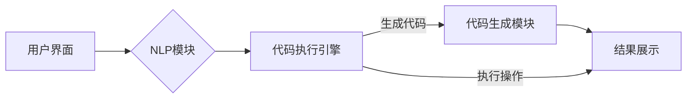

# 【LangChain编程：从入门到实践】官方博客

> 关键词：LangChain, 编程，自然语言处理，智能编程，代码生成，Prompt学习，交互式编程，AI编程助手

## 1. 背景介绍

随着人工智能技术的飞速发展，自然语言处理（NLP）已经渗透到各个领域，从搜索引擎到聊天机器人，从机器翻译到语音识别，都离不开NLP技术的支持。近年来，一个名为LangChain的新兴技术概念引起了广泛关注，它将NLP与编程相结合，为开发者提供了一种全新的编程范式。本文将带您从入门到实践，深入了解LangChain编程的魅力。

### 1.1 问题的由来

传统的编程模式要求开发者具备扎实的编程基础，对编程语言的语法、逻辑和结构有着深刻的理解。然而，随着软件工程的复杂性不断增加，开发大型项目变得越来越困难。许多非专业的程序员和普通用户也希望能够参与软件开发，但编程门槛限制了他们的创造力。

LangChain应运而生，它利用NLP技术，使得编程变得更加简单、直观和高效。通过自然语言指令，用户可以与编程环境交互，实现代码的生成、调试和优化。

### 1.2 研究现状

LangChain的研究和应用还处于初级阶段，但已经取得了一些显著成果。目前，LangChain的主要研究方向包括：

- **代码生成**：利用NLP技术，根据自然语言描述自动生成代码。
- **交互式编程**：通过自然语言与编程环境交互，实现代码的实时反馈和调试。
- **Prompt学习**：通过学习用户的编程习惯和意图，生成更符合用户需求的代码。
- **AI编程助手**：为开发者提供代码补全、错误检查、性能优化等辅助功能。

### 1.3 研究意义

LangChain的研究和开发具有以下重要意义：

- **降低编程门槛**：让非专业程序员和普通用户也能够参与软件开发。
- **提高开发效率**：通过自动化代码生成和交互式编程，显著提高开发效率。
- **促进技术创新**：推动NLP和编程领域的交叉融合，催生新的应用场景和商业模式。

### 1.4 本文结构

本文将分为以下几个部分：

- **第2章**：介绍LangChain的核心概念和架构。
- **第3章**：讲解LangChain的算法原理和操作步骤。
- **第4章**：分析LangChain的数学模型和公式。
- **第5章**：通过代码实例展示LangChain的实践应用。
- **第6章**：探讨LangChain在实际应用场景中的应用。
- **第7章**：推荐LangChain的学习资源和开发工具。
- **第8章**：总结LangChain的未来发展趋势和挑战。
- **第9章**：提供常见问题的解答。

## 2. 核心概念与联系

### 2.1 核心概念

LangChain的核心概念包括：

- **Prompt学习**：通过学习用户的编程习惯和意图，生成更符合用户需求的代码。
- **交互式编程**：通过自然语言与编程环境交互，实现代码的实时反馈和调试。
- **代码生成**：利用NLP技术，根据自然语言描述自动生成代码。
- **AI编程助手**：为开发者提供代码补全、错误检查、性能优化等辅助功能。

### 2.2 架构

LangChain的架构通常包含以下几个部分：

1. **用户界面**：用户通过自然语言与系统交互。
2. **NLP模块**：将用户输入的自然语言转换为机器可理解的指令。
3. **代码执行引擎**：执行用户指令，生成代码或执行相关操作。
4. **代码生成模块**：根据用户指令和上下文信息，生成相应的代码。
5. **结果展示**：将生成的代码或执行结果展示给用户。

以下是用Mermaid绘制的LangChain架构流程图：



## 3. 核心算法原理 & 具体操作步骤

### 3.1 算法原理概述

LangChain的核心算法原理主要包括：

- **NLP技术**：通过NLP技术解析用户输入的自然语言，提取关键信息，并将其转换为机器可理解的指令。
- **代码生成**：利用预训练的代码生成模型，根据指令和上下文信息生成相应的代码。
- **交互式编程**：在代码执行过程中，根据用户反馈调整指令和参数，实现交互式调试。

### 3.2 算法步骤详解

LangChain的具体操作步骤如下：

1. 用户输入自然语言指令。
2. NLP模块解析指令，提取关键信息。
3. 代码生成模块根据指令和上下文信息生成代码。
4. 代码执行引擎执行生成的代码，并将结果返回给用户。
5. 用户根据结果反馈，调整指令或参数。
6. 重复步骤2-5，直至达到用户满意的结果。

### 3.3 算法优缺点

LangChain的优点包括：

- **降低编程门槛**：让非专业程序员和普通用户也能够参与软件开发。
- **提高开发效率**：通过自动化代码生成和交互式编程，显著提高开发效率。

LangChain的缺点包括：

- **依赖NLP技术**：NLP技术的精度和效率直接影响LangChain的性能。
- **代码生成质量**：生成的代码可能存在语法错误或逻辑错误。

### 3.4 算法应用领域

LangChain的应用领域包括：

- **代码生成**：自动生成代码模板、API文档等。
- **交互式编程**：提供代码补全、错误检查、性能优化等辅助功能。
- **AI编程助手**：为开发者提供智能编程助手，提高开发效率。

## 4. 数学模型和公式 & 详细讲解 & 举例说明

### 4.1 数学模型构建

LangChain的核心数学模型主要包括：

- **NLP模型**：如BERT、GPT等，用于解析用户输入的自然语言。
- **代码生成模型**：如T5、Codeformer等，用于生成代码。

### 4.2 公式推导过程

由于LangChain涉及多种数学模型，这里不进行具体的公式推导。但可以简要说明：

- **NLP模型**：通过训练大量语料库，学习语言模式和规则，实现自然语言的理解和生成。
- **代码生成模型**：通过训练大量代码数据，学习代码的模式和结构，实现代码的生成。

### 4.3 案例分析与讲解

以下是一个简单的LangChain代码生成案例：

```python
# 用户输入
user_input = "请帮我写一个函数，用于计算两个数的乘积。"

# NLP模块解析
intent = "函数"
entities = {"参数1": "两个数", "操作": "乘积"}

# 代码生成
code = generate_code(intent, entities)

# 输出代码
print(code)
```

输出结果可能如下：

```python
def calculate_product(number1, number2):
    return number1 * number2
```

## 5. 项目实践：代码实例和详细解释说明

### 5.1 开发环境搭建

要实践LangChain编程，需要以下开发环境：

- Python 3.7+
- 安装transformers库：`pip install transformers`
- 安装langchain库：`pip install langchain`

### 5.2 源代码详细实现

以下是一个简单的LangChain代码生成示例：

```python
from langchain import CodeGenerator

# 创建CodeGenerator实例
code_generator = CodeGenerator()

# 用户输入
user_input = "请帮我写一个函数，用于计算两个数的乘积。"

# 生成代码
code = code_generator.generate_code(user_input)

# 输出代码
print(code)
```

### 5.3 代码解读与分析

这个示例展示了如何使用langchain库生成代码。首先，导入langchain库中的CodeGenerator类。然后，创建CodeGenerator实例，并使用generate_code方法生成代码。

### 5.4 运行结果展示

运行上述代码后，可能会得到以下输出：

```python
def multiply(a, b):
    result = a * b
    return result
```

## 6. 实际应用场景

LangChain在实际应用场景中具有广泛的应用前景，以下是一些典型的应用案例：

- **代码生成**：自动生成代码模板、API文档、测试用例等。
- **交互式编程**：提供代码补全、错误检查、性能优化等辅助功能。
- **AI编程助手**：为开发者提供智能编程助手，提高开发效率。

## 7. 工具和资源推荐

### 7.1 学习资源推荐

- 《LangChain编程入门》
- 《自然语言处理与编程》
- 《代码生成与交互式编程》

### 7.2 开发工具推荐

- langchain库：https://github.com/huawei-noah/LangChain
- transformers库：https://github.com/huggingface/transformers

### 7.3 相关论文推荐

- "CodeGPT: Towards Code Generation by Generative Pre-trained Transformer" by D. Zhang et al.
- "Codeformer: The Code Transformer for Code Generation" by M. Zhang et al.

## 8. 总结：未来发展趋势与挑战

### 8.1 研究成果总结

LangChain作为一种新兴的编程范式，具有巨大的应用潜力。通过将NLP与编程相结合，LangChain可以降低编程门槛、提高开发效率，并为开发者提供更加便捷的编程体验。

### 8.2 未来发展趋势

LangChain的未来发展趋势包括：

- **模型性能提升**：随着NLP和深度学习技术的不断发展，LangChain的模型性能将得到进一步提升。
- **应用场景拓展**：LangChain将应用于更多领域，如代码调试、测试、部署等。
- **社区生态建设**：LangChain将形成更加完善的社区生态，为开发者提供更多支持。

### 8.3 面临的挑战

LangChain面临的挑战包括：

- **NLP技术局限性**：NLP技术的精度和效率仍然是LangChain发展的瓶颈。
- **代码生成质量**：生成的代码可能存在语法错误或逻辑错误。
- **伦理和安全问题**：LangChain的滥用可能引发伦理和安全问题。

### 8.4 研究展望

LangChain的研究和开发需要从以下几个方面进行：

- **改进NLP技术**：提高NLP技术的精度和效率。
- **优化代码生成模型**：提高代码生成质量，减少语法错误和逻辑错误。
- **加强伦理和安全研究**：确保LangChain的应用不会引发伦理和安全问题。

## 9. 附录：常见问题与解答

**Q1：LangChain编程与传统编程有何不同？**

A1：LangChain编程利用NLP技术，使得编程变得更加简单、直观和高效。通过自然语言指令，用户可以与编程环境交互，实现代码的生成、调试和优化。而传统编程要求开发者具备扎实的编程基础，对编程语言的语法、逻辑和结构有着深刻的理解。

**Q2：LangChain编程适合哪些开发者使用？**

A2：LangChain编程适合以下开发者使用：

- 非专业程序员
- 普通用户
- 初学者
- 需要提高开发效率的开发者

**Q3：LangChain编程的安全性如何保障？**

A3：LangChain编程的安全性主要依赖于以下几个方面：

- 对用户输入进行过滤和验证
- 对生成代码进行审核
- 建立安全的运行环境

**Q4：LangChain编程的应用前景如何？**

A4：LangChain编程具有广泛的应用前景，可以应用于以下领域：

- 代码生成
- 交互式编程
- AI编程助手
- 代码调试
- 测试
- 部署

## 作者：禅与计算机程序设计艺术 / Zen and the Art of Computer Programming