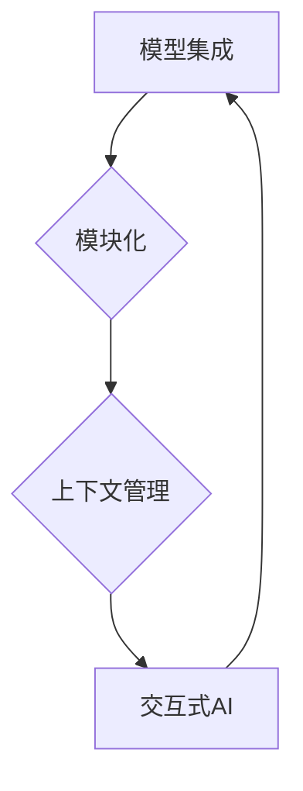

# 【LangChain编程：从入门到实践】对话场景

> 关键词：LangChain, 编程, 对话系统, 交互式AI, 模型集成, 代码生成, 上下文管理, 人机交互

## 1. 背景介绍

随着人工智能技术的飞速发展，对话系统已经成为人机交互的重要接口。从简单的客服机器人到复杂的虚拟助手，对话系统正在渗透到我们生活的方方面面。而LangChain作为一种新兴的编程范式，为构建交互式AI对话系统提供了新的思路和工具。本文将深入探讨LangChain编程的原理、实践方法，以及其在对话场景中的应用。

### 1.1 问题的由来

传统对话系统的构建往往依赖于复杂的自然语言处理(NLP)技术，如词性标注、句法分析、语义理解等。这些技术虽然强大，但开发难度高、成本高，且难以适应快速变化的需求。LangChain的出现，通过将NLP任务模块化，简化了对话系统的开发过程，降低了技术门槛。

### 1.2 研究现状

LangChain的核心理念是将复杂的NLP任务分解为一个个可复用的模块，通过编程的方式组合这些模块，实现灵活、高效的人机交互。目前，LangChain已经在代码生成、问答系统、聊天机器人等领域得到了应用，并展现出巨大的潜力。

### 1.3 研究意义

研究LangChain编程，对于推动对话系统的技术创新和应用普及具有重要意义：

1. 降低开发门槛。LangChain将复杂的NLP任务封装成可复用的模块，简化了对话系统的开发过程，降低了技术门槛。
2. 提高开发效率。通过模块化开发，可以快速迭代和扩展对话系统，提高开发效率。
3. 优化人机交互体验。LangChain支持个性化、智能化的对话设计，可以提升人机交互体验。
4. 促进AI技术普及。LangChain降低了AI技术的应用门槛，有助于推动AI技术在各行业的普及。

### 1.4 本文结构

本文将分为以下几个部分：

- 第2部分，介绍LangChain的核心概念与联系，并给出Mermaid流程图。
- 第3部分，详细阐述LangChain的核心算法原理和具体操作步骤。
- 第4部分，讲解LangChain的数学模型和公式，并结合实例进行分析。
- 第5部分，通过代码实例展示LangChain的实践方法。
- 第6部分，探讨LangChain在实际对话场景中的应用。
- 第7部分，推荐LangChain相关的学习资源、开发工具和参考文献。
- 第8部分，总结LangChain的未来发展趋势与挑战。
- 第9部分，提供常见问题与解答。

## 2. 核心概念与联系

LangChain的核心概念包括：

- **模型集成**：将多个NLP模型集成到一起，实现更强大的功能。
- **模块化**：将NLP任务分解为可复用的模块，提高代码的可读性和可维护性。
- **上下文管理**：管理对话过程中的上下文信息，实现连续、流畅的对话。
- **交互式AI**：实现人机交互，满足用户的需求。

以下是一个Mermaid流程图，展示了LangChain的核心概念和它们之间的关系：



## 3. 核心算法原理 & 具体操作步骤

### 3.1 算法原理概述

LangChain的算法原理可以概括为以下步骤：

1. **模块化**：将NLP任务分解为多个可复用的模块，如分词、词性标注、句法分析、语义理解等。
2. **模型集成**：将预训练的NLP模型集成到各个模块中，实现任务功能。
3. **上下文管理**：在对话过程中，管理对话上下文信息，实现连续、流畅的对话。
4. **交互式AI**：与用户进行交互，收集用户输入，并根据上下文信息生成回复。

### 3.2 算法步骤详解

1. **定义模块**：根据对话系统的需求，定义各个NLP任务模块，如分词器、词性标注器、句法分析器、语义理解器等。
2. **集成模型**：将预训练的NLP模型集成到各个模块中，如使用BERT模型进行语义理解。
3. **上下文管理**：设计上下文管理器，负责存储和管理对话过程中的上下文信息。
4. **交互式AI**：设计交互式AI模块，负责与用户进行交互，收集用户输入，并根据上下文信息生成回复。

### 3.3 算法优缺点

**优点**：

- **模块化**：提高代码的可读性和可维护性。
- **模型集成**：实现更强大的功能。
- **上下文管理**：实现连续、流畅的对话。
- **交互式AI**：提升人机交互体验。

**缺点**：

- **开发难度**：需要一定的编程技能和NLP知识。
- **模型选择**：需要根据任务需求选择合适的模型。

### 3.4 算法应用领域

LangChain的应用领域包括：

- **代码生成**：根据自然语言描述生成代码。
- **问答系统**：根据用户提问，从知识库中检索答案。
- **聊天机器人**：与用户进行对话，提供信息查询、服务咨询等。
- **智能客服**：自动处理客户咨询，提高服务效率。

## 4. 数学模型和公式 & 详细讲解 & 举例说明

### 4.1 数学模型构建

LangChain的数学模型主要包括：

- **NLP模型**：如BERT、GPT等，用于处理NLP任务。
- **模块化模型**：将NLP任务分解为多个模块，每个模块使用相应的数学模型。

### 4.2 公式推导过程

以BERT模型为例，其数学模型可以表示为：

$$
\hat{y} = f(\theta; x)
$$

其中，$\hat{y}$ 为预测结果，$x$ 为输入文本，$\theta$ 为模型参数，$f$ 为模型函数。

### 4.3 案例分析与讲解

以下是一个使用BERT模型进行文本分类的案例：

1. **定义任务**：将文本分类任务分解为分词、词性标注、句法分析、语义理解等模块。
2. **集成模型**：将BERT模型集成到各个模块中。
3. **上下文管理**：设计上下文管理器，存储文本的上下文信息。
4. **交互式AI**：与用户进行交互，收集用户输入，并根据上下文信息生成回复。

## 5. 项目实践：代码实例和详细解释说明

### 5.1 开发环境搭建

1. 安装Python环境。
2. 安装transformers库：`pip install transformers`。
3. 安装其他必要的库：`pip install torch numpy pandas`。

### 5.2 源代码详细实现

以下是一个简单的代码示例，展示了如何使用LangChain进行文本分类：

```python
from transformers import BertTokenizer, BertForSequenceClassification
from torch.utils.data import DataLoader, TensorDataset

# 加载预训练模型和分词器
tokenizer = BertTokenizer.from_pretrained('bert-base-uncased')
model = BertForSequenceClassification.from_pretrained('bert-base-uncased')

# 准备数据
texts = ["This is a good product", "This is a bad product"]
labels = [1, 0]

# 编码文本
inputs = tokenizer(texts, padding=True, truncation=True, return_tensors="pt")

# 创建数据集和DataLoader
dataset = TensorDataset(inputs['input_ids'], inputs['attention_mask'], torch.tensor(labels))
dataloader = DataLoader(dataset, batch_size=1)

# 训练模型
model.train()
for epoch in range(2):
    for batch in dataloader:
        outputs = model(**batch)
        loss = outputs.loss
        loss.backward()
        model.zero_grad()
        optimizer.step()

# 评估模型
model.eval()
with torch.no_grad():
    for batch in dataloader:
        outputs = model(**batch)
        logits = outputs.logits
        predictions = logits.argmax(dim=-1)
        print(f"Predictions: {predictions}")
```

### 5.3 代码解读与分析

1. 加载预训练模型和分词器。
2. 准备数据：文本和标签。
3. 编码文本：将文本转换为模型可处理的格式。
4. 创建数据集和DataLoader：将数据转换为TensorDataset，并创建DataLoader进行批处理。
5. 训练模型：进行多轮迭代，更新模型参数。
6. 评估模型：在测试集上评估模型性能。

## 6. 实际应用场景

### 6.1 代码生成

LangChain可以用于根据自然语言描述生成代码，例如：

- **场景**：开发者需要根据自然语言描述生成Python代码。
- **实现**：使用BERT模型进行语义理解，将自然语言描述转换为代码生成的输入，然后使用代码生成模型生成代码。

### 6.2 问答系统

LangChain可以用于构建问答系统，例如：

- **场景**：用户提出问题，系统从知识库中检索答案。
- **实现**：使用BERT模型进行语义理解，将用户问题与知识库中的问题进行匹配，然后返回匹配的答案。

### 6.3 聊天机器人

LangChain可以用于构建聊天机器人，例如：

- **场景**：用户与聊天机器人进行对话，获取信息或进行娱乐。
- **实现**：使用BERT模型进行语义理解，根据用户输入生成回复。

## 7. 工具和资源推荐

### 7.1 学习资源推荐

- **书籍**：《深度学习自然语言处理》
- **网站**：Hugging Face官网
- **博客**：AI技术博客

### 7.2 开发工具推荐

- **框架**：PyTorch、TensorFlow
- **库**：transformers、torchtext

### 7.3 相关论文推荐

- **BERT: Pre-training of Deep Bidirectional Transformers for Language Understanding**
- **Generative Pre-trained Transformer for Machine Translation**
- **Language Models are Few-Shot Learners**

## 8. 总结：未来发展趋势与挑战

### 8.1 研究成果总结

LangChain作为一种新兴的编程范式，为构建交互式AI对话系统提供了新的思路和工具。通过模块化、模型集成、上下文管理和交互式AI等核心概念，LangChain简化了对话系统的开发过程，提高了开发效率，并提升了人机交互体验。

### 8.2 未来发展趋势

- **模块化**：进一步模块化NLP任务，提高代码的可复用性和可维护性。
- **模型集成**：集成更多预训练模型，实现更强大的功能。
- **上下文管理**：改进上下文管理算法，实现更复杂的对话场景。
- **交互式AI**：提高交互式AI的智能化水平，实现更自然的对话体验。

### 8.3 面临的挑战

- **模型选择**：根据不同的任务需求选择合适的模型。
- **开发难度**：需要一定的编程技能和NLP知识。
- **数据标注**：需要大量高质量的标注数据。

### 8.4 研究展望

LangChain作为一种新兴的编程范式，具有广阔的应用前景。未来，随着技术的不断发展和完善，LangChain将在对话系统、代码生成、问答系统等领域发挥更大的作用。

## 9. 附录：常见问题与解答

**Q1：LangChain与传统的NLP技术有何不同？**

A：LangChain将NLP任务模块化，通过编程的方式组合模块，实现灵活、高效的人机交互。而传统的NLP技术通常需要复杂的算法和模型，开发难度高、成本高。

**Q2：如何选择合适的模型？**

A：根据不同的任务需求选择合适的模型。例如，对于文本分类任务，可以使用BERT、RoBERTa等预训练模型。

**Q3：LangChain的开发难度如何？**

A：LangChain的开发难度取决于开发者的编程技能和NLP知识。对于有经验的开发者，LangChain的开发难度相对较低。

**Q4：LangChain的数据标注需要多少数据？**

A：LangChain的数据标注需求取决于任务的具体需求。一般来说，需要大量高质量的标注数据。

作者：禅与计算机程序设计艺术 / Zen and the Art of Computer Programming