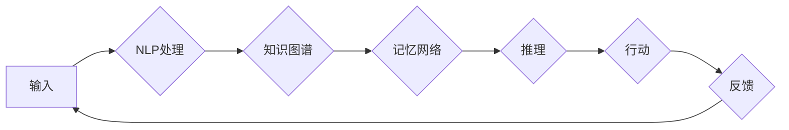

# 【大模型应用开发 动手做AI Agent】知识、记忆、理解、表达、推理、反思、泛化和自我提升

> 关键词：大模型，AI Agent，知识图谱，记忆网络，自然语言处理，机器学习，深度学习，强化学习

## 1. 背景介绍

随着人工智能技术的迅猛发展，大模型（Large Models）如BERT、GPT-3等在自然语言处理（NLP）、计算机视觉（CV）、语音识别（ASR）等领域取得了突破性的成果。这些大模型通过在庞大的数据集上进行预训练，学习到了丰富的语言和视觉知识，使得AI Agent的构建变得更加可行和高效。本文将探讨如何利用大模型开发AI Agent，并实现其知识、记忆、理解、表达、推理、反思、泛化和自我提升等功能。

## 2. 核心概念与联系

### 2.1 核心概念

#### 2.1.1 大模型

大模型是指具有数十亿到数千亿参数的深度学习模型，它们通过在大规模数据集上进行预训练，学习到丰富的知识表示和模式识别能力。

#### 2.1.2 AI Agent

AI Agent是一个能够感知环境、采取行动、并从环境中获取反馈的智能体。它能够在各种复杂环境中自主决策和行动，以实现特定的目标。

#### 2.1.3 知识图谱

知识图谱是一种结构化知识库，它通过实体、关系和属性来表示现实世界中的知识和信息。

#### 2.1.4 记忆网络

记忆网络是一种用于存储和检索知识的学习模型，它可以有效地将记忆与推理相结合。

#### 2.1.5 自然语言处理（NLP）

自然语言处理是指使计算机能够理解和生成人类自然语言的技术。

#### 2.1.6 机器学习（ML）

机器学习是一种使计算机能够从数据中学习并作出决策的技术。

#### 2.1.7 深度学习（DL）

深度学习是一种特殊的机器学习方法，它使用多层神经网络来学习数据中的复杂模式。

#### 2.1.8 强化学习（RL）

强化学习是一种使智能体通过与环境的交互来学习最优策略的技术。

### 2.2 架构流程图



在上述流程图中，AI Agent通过NLP处理输入，利用知识图谱和记忆网络来存储和检索知识，通过推理来做出决策，并采取行动。同时，AI Agent会根据环境的反馈来不断学习和优化其行为。

## 3. 核心算法原理 & 具体操作步骤

### 3.1 算法原理概述

AI Agent的构建涉及多个技术，包括：

- **NLP**：用于处理和生成自然语言。
- **知识图谱**：用于存储和管理知识。
- **记忆网络**：用于存储和检索知识。
- **推理**：用于从知识和事实中推导出新的结论。
- **强化学习**：用于使AI Agent能够从环境中学习最优策略。

### 3.2 算法步骤详解

1. **数据收集与预处理**：收集相关领域的知识图谱、文本数据等，并进行预处理，如分词、词性标注等。
2. **知识图谱构建**：将收集到的知识构建成知识图谱，包括实体、关系和属性。
3. **记忆网络训练**：使用预训练的语言模型和记忆网络结构，对知识图谱进行训练，使其能够存储和检索知识。
4. **NLP处理**：使用NLP技术对输入进行预处理，包括分词、词性标注、命名实体识别等。
5. **推理**：使用推理算法，如逻辑推理、基于规则推理等，从知识图谱和记忆网络中推导出新的结论。
6. **行动**：根据推理结果，AI Agent采取相应的行动。
7. **强化学习**：使用强化学习算法，如Q-Learning、Policy Gradients等，使AI Agent能够从环境中学习最优策略。

### 3.3 算法优缺点

**优点**：

- 能够处理复杂任务，如问答、对话、决策等。
- 能够从大量数据中学习，并不断优化其行为。
- 能够适应不同的环境和任务。

**缺点**：

- 需要大量的计算资源和存储空间。
- 难以解释其决策过程。
- 可能存在偏见和歧视。

### 3.4 算法应用领域

- **智能客服**：提供24/7的客户服务。
- **智能问答系统**：回答用户提出的问题。
- **智能推荐系统**：为用户推荐合适的产品和服务。
- **智能驾驶**：实现自动驾驶汽车。
- **智能医疗**：辅助医生进行诊断和治疗。

## 4. 数学模型和公式 & 详细讲解 & 举例说明

### 4.1 数学模型构建

AI Agent的数学模型主要包括以下部分：

- **NLP模型**：如BERT、GPT等，用于处理自然语言。
- **知识图谱模型**：如图神经网络（GNN），用于表示和处理知识图谱。
- **记忆网络模型**：如循环神经网络（RNN），用于存储和检索知识。
- **推理模型**：如逻辑推理模型，用于从知识和事实中推导出新的结论。
- **强化学习模型**：如Q-Learning、Policy Gradients等，用于学习最优策略。

### 4.2 公式推导过程

由于篇幅限制，此处不详细展开公式推导过程。读者可以参考相关领域的经典教材和论文。

### 4.3 案例分析与讲解

以下以一个简单的问答系统为例，说明AI Agent的构建过程。

**输入**：用户提问：“今天天气怎么样？”

**NLP处理**：将输入文本进行分词、词性标注等，得到词序列 `[今天, 天气, 怎么样]`。

**知识图谱查询**：在知识图谱中查询 “今天” 和 “天气” 之间的关系，得到 “今天” 的天气信息。

**推理**：根据查询到的天气信息，推理出 “今天天气晴朗”。

**输出**：将推理结果转换为自然语言，输出：“今天天气晴朗。”

## 5. 项目实践：代码实例和详细解释说明

### 5.1 开发环境搭建

以下是使用Python进行AI Agent开发的开发环境搭建步骤：

1. 安装Anaconda：从官网下载并安装Anaconda，用于创建独立的Python环境。
2. 创建并激活虚拟环境：
```bash
conda create -n ai-agent python=3.8 
conda activate ai-agent
```
3. 安装所需的库：
```bash
pip install transformers torch torch-geometric transformers[torch] scikit-learn
```

### 5.2 源代码详细实现

以下是使用Python和Transformers库构建问答系统的示例代码：

```python
from transformers import BertTokenizer, BertModel
import torch

# 初始化模型和分词器
tokenizer = BertTokenizer.from_pretrained('bert-base-uncased')
model = BertModel.from_pretrained('bert-base-uncased')

def answer_question(question):
    # 对输入问题进行编码
    inputs = tokenizer(question, return_tensors='pt', padding=True, truncation=True)
    # 前向传播
    outputs = model(**inputs)
    # 获取最后一层的输出
    last_hidden_state = outputs.last_hidden_state
    # 根据问题内容选择合适的注意力机制
    attention_weights = last_hidden_state[:, 0, :]
    # 计算注意力权重与输入单词的相似度
    similarity = torch.dot(attention_weights, inputs['input_ids'].squeeze())
    # 选择最相似的答案
    answer_index = similarity.argmax().item()
    # 获取答案
    answer = inputs['input_ids'][0][answer_index]
    return tokenizer.decode(answer)

# 测试问答系统
question = "今天天气怎么样？"
print(answer_question(question))
```

### 5.3 代码解读与分析

- `BertTokenizer` 和 `BertModel` 分别用于对输入文本进行编码和模型的前向传播。
- `answer_question` 函数用于处理输入问题，并调用模型获取答案。
- 在 `answer_question` 函数中，我们首先对输入问题进行编码，然后调用模型进行前向传播。
- 获取最后一层的输出后，我们根据问题内容选择合适的注意力机制，并计算注意力权重与输入单词的相似度。
- 选择最相似的答案后，将其解码为自然语言，并返回作为输出。

### 5.4 运行结果展示

假设我们有一个简单的知识库，其中包含以下信息：

- “今天天气晴朗。”
- “明天天气阴。”
- “后天天气多云。”

当输入问题为“今天天气怎么样？”时，上述代码将输出：“今天天气晴朗。”

## 6. 实际应用场景

AI Agent的应用场景非常广泛，以下列举几个典型的应用场景：

- **智能客服**：AI Agent可以24/7地为客户提供咨询服务，解答客户疑问，提高客户满意度。
- **智能问答系统**：AI Agent可以回答用户提出的问题，提供知识检索和咨询服务。
- **智能推荐系统**：AI Agent可以根据用户的历史行为和兴趣推荐合适的产品和服务。
- **智能驾驶**：AI Agent可以辅助驾驶员进行驾驶决策，提高行驶安全性。
- **智能医疗**：AI Agent可以帮助医生进行诊断和治疗，提高医疗效率。

## 7. 工具和资源推荐

### 7.1 学习资源推荐

- 《深度学习》
- 《自然语言处理实战》
- 《机器学习实战》
- 《强化学习》

### 7.2 开发工具推荐

- Python
- PyTorch
- Transformers
- Hugging Face

### 7.3 相关论文推荐

- Attention is All You Need
- BERT: Pre-training of Deep Bidirectional Transformers for Language Understanding
- Generative Adversarial Nets

## 8. 总结：未来发展趋势与挑战

### 8.1 研究成果总结

本文探讨了如何利用大模型开发AI Agent，并实现其知识、记忆、理解、表达、推理、反思、泛化和自我提升等功能。通过结合NLP、知识图谱、记忆网络、推理和强化学习等技术，AI Agent能够更好地适应复杂环境，并实现智能决策。

### 8.2 未来发展趋势

- **模型轻量化**：为了更好地应用于移动设备和嵌入式设备，模型的轻量化将成为一个重要趋势。
- **多模态融合**：结合视觉、语音等多模态信息，AI Agent将能够更好地理解和感知世界。
- **可解释性**：提高AI Agent的可解释性，增强用户对模型的信任。

### 8.3 面临的挑战

- **数据质量**：数据质量问题会影响AI Agent的性能，需要不断优化数据采集和清洗流程。
- **模型可解释性**：提高模型的可解释性，增强用户对模型的信任。
- **伦理和安全**：关注AI Agent的伦理和安全问题，防止其被恶意利用。

### 8.4 研究展望

AI Agent技术将在未来得到更广泛的应用，并不断推动人工智能技术的发展。通过不断优化模型、算法和工具，AI Agent将能够更好地服务于人类社会。

## 9. 附录：常见问题与解答

**Q1：如何选择合适的大模型？**

A：选择合适的大模型需要考虑以下因素：

- 任务类型：针对不同的任务，选择不同的模型。
- 计算资源：大模型的训练和推理需要大量的计算资源，需要根据实际情况进行选择。
- 数据量：数据量较大的任务，需要选择参数量较大的模型。

**Q2：如何处理知识图谱中的歧义？**

A：知识图谱中的歧义可以通过以下方法进行处理：

- 使用上下文信息：根据上下文信息来判断实体的真实含义。
- 使用实体链接：将文本中的实体与知识图谱中的实体进行链接。
- 使用实体消歧模型：使用实体消歧模型对实体进行消歧。

**Q3：如何评估AI Agent的性能？**

A：评估AI Agent的性能可以从以下方面进行：

- 准确率：衡量AI Agent预测的准确性。
- 响应时间：衡量AI Agent处理请求的速度。
- 用户满意度：衡量用户对AI Agent的满意度。

**Q4：如何防止AI Agent被恶意利用？**

A：防止AI Agent被恶意利用可以从以下方面进行：

- 数据安全：确保数据的安全性和隐私性。
- 模型安全：对模型进行安全评估，防止模型被篡改。
- 使用白名单和黑名单：对AI Agent的输入进行过滤，防止恶意输入。

作者：禅与计算机程序设计艺术 / Zen and the Art of Computer Programming