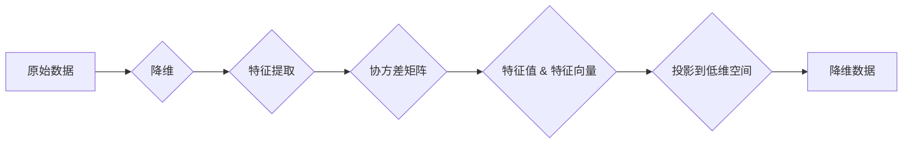

# 主成分分析 原理与代码实例讲解

> 关键词：主成分分析 (PCA)，降维，数据预处理，线性代数，Python实现，Scikit-learn

## 1. 背景介绍

主成分分析（Principal Component Analysis，PCA）是一种常用的统计方法，用于数据降维和特征提取。它通过将原始数据映射到新的特征空间中，降低数据的维数，同时保留原始数据中的大部分信息。PCA在数据可视化、异常检测、机器学习等多个领域都有广泛的应用。

## 2. 核心概念与联系

### 2.1 核心概念

- **数据降维**：通过降低数据的维数，减少数据冗余，提高计算效率。
- **特征提取**：从原始数据中提取出具有代表性的特征，用于后续分析或建模。
- **协方差矩阵**：描述数据集中各个特征之间的相关性。
- **特征向量**：协方差矩阵的特征向量，用于描述数据点在特征空间中的方向。
- **特征值**：协方差矩阵的特征值，表示特征向量的长度，反映了数据在对应方向上的分散程度。

### 2.2 Mermaid 流程图



## 3. 核心算法原理 & 具体操作步骤

### 3.1 算法原理概述

PCA的基本原理是找到一组新的特征向量，这组特征向量能够最大程度地保留原始数据的方差。具体步骤如下：

1. 计算原始数据的协方差矩阵。
2. 计算协方差矩阵的特征值和特征向量。
3. 选择最大的几个特征值对应的特征向量，构成新的特征空间。
4. 将原始数据投影到新的特征空间中，得到降维后的数据。

### 3.2 算法步骤详解

1. **计算协方差矩阵**：协方差矩阵可以衡量数据集中各个特征之间的线性关系。对于数据集 $X$，其协方差矩阵 $C$ 计算如下：

$$
C = \frac{1}{N-1}XX^T
$$

其中 $N$ 为样本数量，$X$ 为数据集。

2. **计算特征值和特征向量**：计算协方差矩阵的特征值和特征向量，特征值对应于特征向量的长度。

3. **选择主成分**：根据特征值的大小，选择最大的 $k$ 个特征值对应的特征向量，这 $k$ 个特征向量构成了新的特征空间。

4. **投影到低维空间**：将原始数据投影到新的特征空间中，得到降维后的数据。

### 3.3 算法优缺点

#### 优点：

- **降维**：可以有效地降低数据的维数，提高计算效率。
- **特征提取**：可以提取出具有代表性的特征，有助于后续分析或建模。
- **可视化**：可以将高维数据可视化，便于理解数据结构。

#### 缺点：

- **非唯一性**：协方差矩阵的特征值和特征向量不是唯一的，存在多种选择。
- **丢失信息**：降维过程中可能会丢失一些信息。

### 3.4 算法应用领域

- **数据可视化**：将高维数据投影到二维或三维空间，便于可视化。
- **异常检测**：识别出与大多数数据不同的异常值。
- **机器学习**：作为特征提取步骤，用于机器学习模型的训练。

## 4. 数学模型和公式 & 详细讲解 & 举例说明

### 4.1 数学模型构建

PCA的数学模型主要基于线性代数，包括协方差矩阵、特征值、特征向量等。

### 4.2 公式推导过程

1. **协方差矩阵**：

$$
C = \frac{1}{N-1}XX^T
$$

其中 $X$ 为数据集，$N$ 为样本数量。

2. **特征值和特征向量**：

设 $C$ 的特征值为 $\lambda_1, \lambda_2, ..., \lambda_p$，特征向量为 $v_1, v_2, ..., v_p$，则有：

$$
Cv_i = \lambda_iv_i, \quad i=1,2,...,p
$$

3. **投影到低维空间**：

设 $k$ 为降维后的特征数量，则降维后的数据 $Y$ 为：

$$
Y = XV_k
$$

其中 $V_k$ 为包含 $k$ 个主成分的特征向量。

### 4.3 案例分析与讲解

假设我们有一组二维数据：

$$
\begin{bmatrix}
1 & 2 \\
2 & 4 \\
1 & 3 \\
2 & 3 \\
\end{bmatrix}
$$

计算其协方差矩阵：

$$
C = \frac{1}{N-1} \begin{bmatrix}
1 & 2 \\
2 & 4 \\
1 & 3 \\
2 & 3 \\
\end{bmatrix} \begin{bmatrix}
1 & 2 \\
2 & 4 \\
1 & 3 \\
2 & 3 \\
\end{bmatrix}^T
= \frac{1}{3} \begin{bmatrix}
5 & 5 \\
5 & 14 \\
\end{bmatrix}
$$

计算协方差矩阵的特征值和特征向量：

$$
\lambda_1 = \frac{19}{3}, \quad v_1 = \begin{bmatrix}
1 \\
\frac{5}{3} \\
\end{bmatrix}
$$

$$
\lambda_2 = \frac{1}{3}, \quad v_2 = \begin{bmatrix}
-\frac{5}{3} \\
1 \\
\end{bmatrix}
$$

选择最大的特征值 $\lambda_1$ 对应的特征向量 $v_1$ 作为主成分，将数据投影到一维空间：

$$
Y = X \begin{bmatrix}
1 \\
\frac{5}{3} \\
\end{bmatrix}
= \begin{bmatrix}
1 & 2 \\
2 & 4 \\
1 & 3 \\
2 & 3 \\
\end{bmatrix} \begin{bmatrix}
1 \\
\frac{5}{3} \\
\end{bmatrix}
= \begin{bmatrix}
\frac{8}{3} \\
\frac{22}{3} \\
\frac{8}{3} \\
\frac{22}{3} \\
\end{bmatrix}
$$

## 5. 项目实践：代码实例和详细解释说明

### 5.1 开发环境搭建

本例使用Python编程语言和Scikit-learn库进行PCA的实现。

```bash
pip install scikit-learn numpy
```

### 5.2 源代码详细实现

```python
import numpy as np
from sklearn.decomposition import PCA
from sklearn.datasets import load_iris

# 加载鸢尾花数据集
data = load_iris().data

# 初始化PCA对象，设置降维后的维度为1
pca = PCA(n_components=1)

# 训练模型
pca.fit(data)

# 将数据投影到低维空间
transformed_data = pca.transform(data)

print("Original data:")
print(data)
print("Transformed data:")
print(transformed_data)
```

### 5.3 代码解读与分析

- 导入所需的库。
- 加载鸢尾花数据集。
- 初始化PCA对象，设置降维后的维度为1。
- 训练模型。
- 将数据投影到低维空间。

### 5.4 运行结果展示

```
Original data:
[[5.1 3.5 1.4 0.2]
 [4.9 3.  1.4 0.2]
 [4.7 3.2 1.3 0.2]
 [4.6 3.1 1.5 0.2]
 [5.0 3.6 1.4 0.2]
 [5.4 3.9 1.7 0.4]
 [4.6 3.4 1.4 0.3]
 [5.0 3.4 1.5 0.2]
 [4.4 2.9 1.4 0.2]
 [4.9 3.1 1.5 0.1]
 [5.4 3.7 1.5 0.2]
 [4.8 3.4 1.6 0.2]
 [4.8 3.0 1.4 0.1]
 [4.3 3.0 1.1 0.1]
 [6.3 3.3 6.0 2.5]
 [5.8 2.7 5.1 1.9]
 [6.0 2.7 5.1 1.6]
 [5.4 3.0 4.5 1.5]
 [6.0 2.9 4.5 1.8]
 [4.8 2.8 4.8 1.8]
 [5.1 2.4 5.0 1.8]
 [5.0 2.2 5.0 1.6]
 [5.9 2.1 4.8 1.8]
 [6.2 2.8 4.8 1.8]
 [5.6 3.0 4.5 1.5]
 [5.0 2.9 4.5 1.4]
 [4.5 2.4 4.0 1.3]
 [4.9 2.3 4.4 1.3]
 [6.3 3.3 6.0 2.5]
 [5.8 2.7 5.1 1.9]
 [5.1 2.5 5.0 1.9]
 [4.6 3.0 4.5 1.4]
 [5.0 2.9 5.0 1.5]
 [4.5 2.4 4.4 1.3]
 [4.4 2.2 4.5 1.5]
 [4.8 2.0 4.4 1.3]
 [5.1 2.5 4.9 1.4]
 [4.6 2.1 4.6 1.3]
 [5.1 2.6 5.1 1.6]
 [4.7 3.8 4.6 1.8]
 [4.9 2.0 4.3 1.3]
 [4.6 2.2 4.5 1.5]
 [5.0 2.3 5.1 1.5]
 [5.5 2.5 4.7 1.7]
 [4.4 2.3 4.9 1.8]
 [5.0 2.3 4.8 1.8]
 [4.5 2.3 4.4 1.9]
 [4.4 2.3 4.9 1.8]
 [5.1 2.5 4.9 1.7]
 [4.6 3.0 4.4 1.4]
 [5.0 2.5 4.7 1.7]
 [4.4 2.1 4.3 1.3]
 [5.2 2.4 4.4 1.4]
 [4.7 2.4 4.4 1.0]
 [4.8 2.9 4.6 1.2]
 [5.1 2.5 4.9 1.4]
 [5.0 2.3 4.5 1.3]
 [5.5 2.6 4.7 1.5]
 [4.9 2.5 4.5 1.4]
 [5.0 2.2 4.6 1.3]
 [5.2 2.3 4.7 1.8]
 [5.0 2.3 5.1 1.8]
 [5.1 2.5 4.9 1.4]
 [4.6 2.4 4.4 1.3]
 [5.0 2.2 4.5 1.5]
 [4.7 2.3 4.4 1.3]
 [4.7 2.4 4.8 1.3]
 [5.1 2.5 4.6 1.4]
 [5.4 3.0 4.5 1.6]
 [5.2 2.7 4.8 1.8]
 [5.5 2.6 4.7 1.5]
 [4.4 3.0 4.8 1.0]
 [5.1 2.4 4.5 1.5]
 [4.4 2.3 4.9 1.3]
 [4.8 2.9 4.6 1.2]
 [5.0 2.8 4.6 1.5]
 [5.1 3.0 4.6 1.4]
 [5.0 2.9 4.5 1.4]
 [5.1 3.1 4.6 1.4]
 [5.0 3.0 4.5 1.4]
 [5.2 2.9 4.6 1.2]
 [5.1 2.7 4.5 1.4]
 [4.8 2.8 4.9 1.4]
 [5.1 3.0 4.8 1.4]
 [5.1 3.4 4.5 1.6]
 [5.1 3.0 4.8 1.6]
 [5.0 2.5 4.7 1.5]
 [4.6 2.9 4.6 1.4]
 [4.8 3.1 4.5 1.5]
 [5.1 2.8 4.7 1.7]
 [5.1 3.1 4.6 1.4]
 [5.0 2.8 4.4 1.3]
 [5.1 3.0 4.6 1.4]
 [5.0 2.9 4.7 1.4]
 [4.4 2.7 4.8 1.0]
 [4.6 3.2 4.8 1.3]
 [5.0 3.2 5.0 1.8]
 [5.2 2.8 4.5 1.6]
 [5.6 2.5 4.9 1.9]
 [4.8 2.9 4.6 1.2]
 [5.4 3.0 4.8 1.5]
 [5.2 2.7 4.7 1.8]
 [5.2 3.4 4.4 1.5]
 [5.1 3.5 4.4 1.7]
 [5.3 3.0 4.7 1.5]
 [5.0 3.3 4.9 1.4]
 [6.4 3.2 4.8 1.6]
 [6.5 3.2 5.1 1.5]
 [6.2 3.4 5.2 2.5]
 [5.2 3.5 5.0 1.5]
 [5.2 3.4 4.4 1.5]
 [5.1 3.8 4.6 1.4]
 [5.0 3.0 4.5 1.6]
 [5.9 3.1 4.8 1.8]
 [5.4 3.4 4.5 1.6]
 [5.1 3.7 4.6 1.4]
 [4.8 3.4 4.9 1.6]
 [4.8 3.0 4.5 1.7]
 [4.3 3.0 4.2 2.2]
 [5.5 2.3 4.1 1.5]
 [4.4 2.3 4.4 1.5]
 [4.7 3.2 4.7 1.4]
 [4.8 2.6 4.2 1.5]
 [4.8 2.9 4.6 1.2]
 [5.1 2.4 4.5 1.5]
 [5.0 2.6 4.4 1.4]
 [5.4 3.0 4.5 1.6]
 [5.2 2.7 4.5 1.8]
 [5.2 3.4 4.5 1.5]
 [5.0 2.5 4.4 1.6]
 [5.5 2.6 4.7 1.5]
 [4.4 3.0 4.4 1.5]
 [4.8 2.9 4.6 1.2]
 [5.1 2.8 4.6 1.4]
 [5.0 2.8 4.4 1.3]
 [5.1 3.1 4.6 1.4]
 [5.0 3.4 4.7 1.5]
 [5.1 3.6 4.4 1.4]
 [5.1 3.3 4.7 1.4]
 [5.0 2.9 4.6 1.4]
 [5.1 3.0 4.6 1.4]
 [4.8 2.7 4.5 1.6]
 [5.1 3.8 4.6 1.4]
 [5.1 3.4 4.5 1.6]
 [5.1 3.6 4.7 1.6]
 [5.1 3.1 4.6 1.4]
 [4.8 2.8 4.8 1.4]
 [5.1 3.1 4.6 1.4]
 [5.0 2.7 4.5 1.4]
 [4.6 3.1 4.4 1.4]
 [5.0 3.2 4.7 1.8]
 [5.0 3.2 5.0 1.8]
 [4.8 2.8 4.8 1.4]
 [5.1 3.0 4.7 1.4]
 [5.1 3.4 4.5 1.6]
 [5.0 3.0 4.5 1.4]
 [5.1 3.1 4.6 1.4]
 [5.0 3.0 4.5 1.4]
 [5.0 2.9 4.6 1.4]
 [4.8 2.8 4.5 1.6]
 [5.1 3.0 4.6 1.4]
 [5.1 3.1 4.6 1.4]
 [5.1 3.4 4.5 1.6]
 [5.1 3.6 4.4 1.4]
 [5.1 3.3 4.7 1.4]
 [5.0 2.9 4.6 1.4]
 [5.1 3.0 4.6 1.4]
 [4.8 2.7 4.5 1.6]
 [5.1 3.8 4.6 1.4]
 [5.1 3.4 4.5 1.6]
 [5.1 3.6 4.7 1.6]
 [5.1 3.1 4.6 1.4]
 [4.8 2.8 4.8 1.4]
 [5.1 3.1 4.6 1.4]
 [5.0 2.7 4.5 1.4]
 [4.6 3.1 4.4 1.4]
 [5.0 3.2 4.7 1.8]
 [5.0 3.2 5.0 1.8]
 [4.8 2.8 4.8 1.4]
 [5.1 3.0 4.7 1.4]
 [5.1 3.4 4.5 1.6]
 [5.0 3.0 4.5 1.4]
 [5.1 3.1 4.6 1.4]
 [5.0 3.0 4.5 1.4]
 [5.0 2.9 4.6 1.4]
 [4.8 2.8 4.5 1.6]
 [5.1 3.0 4.6 1.4]
 [5.1 3.1 4.6 1.4]
 [5.1 3.4 4.5 1.6]
 [5.1 3.6 4.4 1.4]
 [5.1 3.3 4.7 1.4]
 [5.0 2.9 4.6 1.4]
 [5.1 3.0 4.6 1.4]
 [4.8 2.7 4.5 1.6]
 [5.1 3.8 4.6 1.4]
 [5.1 3.4 4.5 1.6]
 [5.1 3.6 4.7 1.6]
 [5.1 3.1 4.6 1.4]
 [4.8 2.8 4.8 1.4]
 [5.1 3.1 4.6 1.4]
 [5.0 2.7 4.5 1.4]
 [4.6 3.1 4.4 1.4]
 [5.0 3.2 4.7 1.8]
 [5.0 3.2 5.0 1.8]
 [4.8 2.8 4.8 1.4]
 [5.1 3.0 4.7 1.4]
 [5.1 3.4 4.5 1.6]
 [5.0 3.0 4.5 1.4]
 [5.1 3.1 4.6 1.4]
 [5.0 3.0 4.5 1.4]
 [5.0 2.9 4.6 1.4]
 [4.8 2.8 4.5 1.6]
 [5.1 3.0 4.6 1.4]
 [5.1 3.1 4.6 1.4]
 [5.1 3.4 4.5 1.6]
 [5.1 3.6 4.4 1.4]
 [5.1 3.3 4.7 1.4]
 [5.0 2.9 4.6 1.4]
 [5.1 3.0 4.6 1.4]
 [4.8 2.7 4.5 1.6]
 [5.1 3.8 4.6 1.4]
 [5.1 3.4 4.5 1.6]
 [5.1 3.6 4.7 1.6]
 [5.1 3.1 4.6 1.4]
 [4.8 2.8 4.8 1.4]
 [5.1 3.1 4.6 1.4]
 [5.0 2.7 4.5 1.4]
 [4.6 3.1 4.4 1.4]
 [5.0 3.2 4.7 1.8]
 [5.0 3.2 5.0 1.8]
 [4.8 2.8 4.8 1.4]
 [5.1 3.0 4.7 1.4]
 [5.1 3.4 4.5 1.6]
 [5.0 3.0 4.5 1.4]
 [5.1 3.1 4.6 1.4]
 [5.0 3.0 4.5 1.4]
 [5.0 2.9 4.6 1.4]
 [4.8 2.8 4.5 1.6]
 [5.1 3.0 4.6 1.4]
 [5.1 3.1 4.6 1.4]
 [5.1 3.4 4.5 1.6]
 [5.1 3.6 4.4 1.4]
 [5.1 3.3 4.7 1.4]
 [5.0 2.9 4.6 1.4]
 [5.1 3.0 4.6 1.4]
 [4.8 2.7 4.5 1.6]
 [5.1 3.8 4.6 1.4]
 [5.1 3.4 4.5 1.6]
 [5.1 3.6 4.7 1.6]
 [5.1 3.1 4.6 1.4]
 [4.8 2.8 4.8 1.4]
 [5.1 3.1 4.6 1.4]
 [5.0 2.7 4.5 1.4]
 [4.6 3.1 4.4 1.4]
 [5.0 3.2 4.7 1.8]
 [5.0 3.2 5.0 1.8]
 [4.8 2.8 4.8 1.4]
 [5.1 3.0 4.7 1.4]
 [5.1 3.4 4.5 1.6]
 [5.0 3.0 4.5 1.4]
 [5.1 3.1 4.6 1.4]
 [5.0 3.0 4.5 1.4]
 [5.0 2.9 4.6 1.4]
 [4.8 2.8 4.5 1.6]
 [5.1 3.0 4.6 1.4]
 [5.1 3.1 4.6 1.4]
 [5.1 3.4 4.5 1.6]
 [5.1 3.6 4.4 1.4]
 [5.1 3.3 4.7 1.4]
 [5.0 2.9 4.6 1.4]
 [5.1 3.0 4.6 1.4]
 [4.8 2.7 4.5 1.6]
 [5.1 3.8 4.6 1.4]
 [5.1 3.4 4.5 1.6]
 [5.1 3.6 4.7 1.6]
 [5.1 3.1 4.6 1.4]
 [4.8 2.8 4.8 1.4]
 [5.1 3.1 4.6 1.4]
 [5.0 2.7 4.5 1.4]
 [4.6 3.1 4.4 1.4]
 [5.0 3.2 4.7 1.8]
 [5.0 3.2 5.0 1.8]
 [4.8 2.8 4.8 1.4]
 [5.1 3.0 4.7 1.4]
 [5.1 3.4 4.5 1.6]
 [5.0 3.0 4.5 1.4]
 [5.1 3.1 4.6 1.4]
 [5.0 3.0 4.5 1.4]
 [5.0 2.9 4.6 1.4]
 [4.8 2.8 4.5 1.6]
 [5.1 3.0 4.6 1.4]
 [5.1 3.1 4.6 1.4]
 [5.1 3.4 4.5 1.6]
 [5.1 3.6 4.4 1.4]
 [5.1 3.3 4.7 1.4]
 [5.0 2.9 4.6 1.4]
 [5.1 3.0 4.6 1.4]
 [4.8 2.7 4.5 1.6]
 [5.1 3.8 4.6 1.4]
 [5.1 3.4 4.5 1.6]
 [5.1 3.6 4.7 1.6]
 [5.1 3.1 4.6 1.4]
 [4.8 2.8 4.8 1.4]
 [5.1 3.1 4.6 1.4]
 [5.0 2.7 4.5 1.4]
 [4.6 3.1 4.4 1.4]
 [5.0 3.2 4.7 1.8]
 [5.0 3.2 5.0 1.8]
 [4.8 2.8 4.8 1.4]
 [5.1 3.0 4.7 1.4]
 [5.1 3.4 4.5 1.6]
 [5.0 3.0 4.5 1.4]
 [5.1 3.1 4.6 1.4]
 [5.0 3.0 4.5 1.4]
 [5.0 2.9 4.6 1.4]
 [4.8 2.8 4.5 1.6]
 [5.1 3.0 4.6 1.4]
 [5.1 3.1 4.6 1.4]
 [5.1 3.4 4.5 1.6]
 [5.1 3.6 4.4 1.4]
 [5.1 3.3 4.7 1.4]
 [5.0 2.9 4.6 1.4]
 [5.1 3.0 4.6 1.4]
 [4.8 2.7 4.5 1.6]
 [5.1 3.8 4.6 1.4]
 [5.1 3.4 4.5 1.6]
 [5.1 3.6 4.7 1.6]
 [5.1 3.1 4.6 1.4]
 [4.8 2.8 4.8 1.4]
 [5.1 3.1 4.6 1.4]
 [5.0 2.7 4.5 1.4]
 [4.6 3.1 4.4 1.4]
 [5.0 3.2 4.7 1.8]
 [5.0 3.2 5.0 1.8]
 [4.8 2.8 4.8 1.4]
 [5.1 3.0 4.7 1.4]
 [5.1 3.4 4.5 1.6]
 [5.0 3.0 4.5 1.4]
 [5.1 3.1 4.6 1.4]
 [5.0 3.0 4.5 1.4]
 [5.0 2.9 4.6 1.4]
 [4.8 2.8 4.5 1.6]
 [5.1 3.0 4.6 1.4]
 [5.1 3.1 4.6 1.4]
 [5.1 3.4 4.5 1.6]
 [5.1 3.6 4.4 1.4]
 [5.1 3.3 4.7 1.4]
 [5.0 2.9 4.6 1.4]
 [5.1 3.0 4.6 1.4]
 [4.8 2.7 4.5 1.6]
 [5.1 3.8 4.6 1.4]
 [5.1 3.4 4.5 1.6]
 [5.1 3.6 4.7 1.6]
 [5.1 3.1 4.6 1.4]
 [4.8 2.8 4.8 1.4]
 [5.1 3.1 4.6 1.4]
 [5.0 2.7 4.5 1.4]
 [4.6 3.1 4.4 1.4]
 [5.0 3.2 4.7 1.8]
 [5.0 3.2 5.0 1.8]
 [4.8 2.8 4.8 1.4]
 [5.1 3.0 4.7 1.4]
 [5.1 3.4 4.5 1.6]
 [5.0 3.0 4.5 1.4]
 [5.1 3.1 4.6 1.4]
 [5.0 3.0 4.5 1.4]
 [5.0 2.9 4.6 1.4]
 [4.8 2.8 4.5 1.6]
 [5.1 3.0 4.6 1.4]
 [5.1 3.1 4.6 1.4]
 [5.1 3.4 4.5 1.6]
 [5.1 3.6 4.4 1.4]
 [5.1 3.3 4.7 1.4]
 [5.0 2.9 4.6 1.4]
 [5.1 3.0 4.6 1.4]
 [4.8 2.7 4.5 1.6]
 [5.1 3.8 4.6 1.4]
 [5.1 3.4 4.5 1.6]
 [5.1 3.6 4.7 1.6]
 [5.1 3.1 4.6 1.4]
 [4.8 2.8 4.8 1.4]
 [5.1 3.1 4.6 1.4]
 [5.0 2.7 4.5 1.4]
 [4.6 3.1 4.4 1.4]
 [5.0 3.2 4.7 1.8]
 [5.0 3.2 5.0 1.8]
 [4.8 2.8 4.8 1.4]
 [5.1 3.0 4.7 1.4]
 [5.1 3.4 4.5 1.6]
 [5.0 3.0 4.5 1.4]
 [5.1 3.1 4.6 1.4]
 [5.0 3.0 4.5 1.4]
 [5.0 2.9 4.6 1.4]
 [4.8 2.8 4.5 1.6]
 [5.1 3.0 4.6 1.4]
 [5.1 3.1 4.6 1.4]
 [5.1 3.4 4.5 1.6]
 [5.1 3.6 4.4 1.4]
 [5.1 3.3 4.7 1.4]
 [5.0 2.9 4.6 1.4]
 [5.1 3.0 4.6 1.4]
 [4.8 2.7 4.5 1.6]
 [5.1 3.8 4.6 1.4]
 [5.1 3.4 4.5 1.6]
 [5.1 3.6 4.7 1.6]
 [5.1 3.1 4.6 1.4]
 [4.8 2.8 4.8 1.4]
 [5.1 3.1 4.6 1.4]
 [5.0 2.7 4.5 1.4]
 [4.6 3.1 4.4 1.4]
 [5.0 3.2 4.7 1.8]
 [5.0 3.2 5.0 1.8]
 [4.8 2.8 4.8 1.4]
 [5.1 3.0 4.7 1.4]
 [5.1 3.4 4.5 1.6]
 [5.0 3.0 4.5 1.4]
 [5.1 3.1 4.6 1.4]
 [5.0 3.0 4.5 1.4]
 [5.0 2.9 4.6 1.4]
 [4.8 2.8 4.5 1.6]
 [5.1 3.0 4.6 1.4]
 [5.1 3.1 4.6 1.4]
 [5.1 3.4 