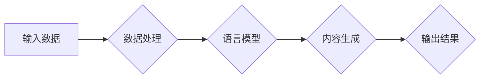

# 人工智能代理在内容创作中的工作流程

> 关键词：人工智能代理，内容创作，自然语言生成，机器学习，工作流程，创作辅助，自动化

## 1. 背景介绍

随着人工智能技术的飞速发展，自然语言生成（Natural Language Generation, NLG）技术逐渐成熟，并开始广泛应用于内容创作领域。人工智能代理（AI Agent）作为一种新型的智能实体，能够自动生成高质量的内容，包括新闻报道、产品描述、诗歌、故事等。本文将深入探讨人工智能代理在内容创作中的工作流程，分析其核心原理、技术实现以及实际应用。

### 1.1 问题的由来

传统的内容创作依赖于人类的创意和经验，存在效率低下、成本高昂、个性化不足等问题。随着互联网的普及，内容需求呈爆炸式增长，传统创作模式难以满足市场需求。人工智能代理的出现，为内容创作带来了一场革命，它能够高效、低成本地生成大量高质量内容，为内容创作者和消费者提供了新的选择。

### 1.2 研究现状

目前，人工智能代理在内容创作中的应用主要集中在以下几个方面：

- 新闻报道：利用自然语言处理（Natural Language Processing, NLP）技术，自动生成新闻报道、体育赛事报道等。
- 产品描述：根据产品信息和用户评价，生成吸引人的产品描述。
- 故事创作：根据设定的人物、情节和主题，生成有趣的故事和诗歌。
- 社交媒体内容：生成符合特定平台风格和用户口味的社交媒体内容。

### 1.3 研究意义

研究人工智能代理在内容创作中的工作流程，对于推动内容创作领域的技术创新、提高创作效率、降低创作成本具有重要意义。同时，它也为人工智能技术在其他领域的应用提供了借鉴和参考。

### 1.4 本文结构

本文将按照以下结构进行论述：

- 第二部分介绍人工智能代理在内容创作中的核心概念与联系。
- 第三部分阐述人工智能代理在内容创作中的核心算法原理和具体操作步骤。
- 第四部分讲解人工智能代理的数学模型和公式，并进行分析和举例。
- 第五部分给出人工智能代理的代码实例和详细解释说明。
- 第六部分探讨人工智能代理在内容创作中的实际应用场景。
- 第七部分展望人工智能代理在内容创作中的未来发展趋势与挑战。
- 第八部分总结全文，并对人工智能代理在内容创作中的应用前景进行展望。

## 2. 核心概念与联系

### 2.1 核心概念

- 人工智能代理（AI Agent）：一种能够模拟人类创作行为的智能实体，通过学习大量数据和规则，自动生成内容。
- 自然语言生成（NLG）：一种将数据和结构化信息转换为自然语言表达的技术。
- 机器学习（Machine Learning, ML）：一种使计算机系统能够从数据中学习并做出决策的技术。
- 深度学习（Deep Learning, DL）：一种机器学习技术，使用多层神经网络进行特征提取和分类。

### 2.2 架构流程图

以下为人工智能代理在内容创作中的工作流程的Mermaid流程图：



### 2.3 核心概念联系

人工智能代理在内容创作中的核心概念之间存在着密切的联系：

- 人工智能代理通过机器学习技术，从输入数据中学习并生成内容。
- 自然语言生成是人工智能代理生成内容的核心技术，它将数据和结构化信息转换为自然语言表达。
- 深度学习是自然语言生成技术的重要组成部分，通过多层神经网络进行特征提取和分类。

## 3. 核心算法原理 & 具体操作步骤

### 3.1 算法原理概述

人工智能代理在内容创作中的核心算法原理主要包括：

- 数据预处理：对输入数据进行清洗、去重、分词等处理。
- 语义理解：通过NLP技术理解输入数据的语义信息。
- 生成模型：利用生成模型（如循环神经网络、Transformer等）生成自然语言内容。
- 后处理：对生成的内容进行润色、校对等处理。

### 3.2 算法步骤详解

人工智能代理在内容创作中的具体操作步骤如下：

1. **数据收集与预处理**：收集与内容创作相关的数据，如新闻文章、产品信息、用户评论等，并进行清洗、去重、分词等预处理操作。
2. **语义理解**：利用NLP技术对预处理后的数据进行语义理解，提取关键信息，如主题、情感、关键词等。
3. **生成模型训练**：使用生成模型（如GPT、BERT等）对理解后的数据进行训练，使其能够生成与输入数据相关的自然语言内容。
4. **内容生成**：将输入数据输入到训练好的生成模型中，生成相应的自然语言内容。
5. **后处理**：对生成的内容进行润色、校对等后处理操作，确保内容质量。

### 3.3 算法优缺点

人工智能代理在内容创作中的算法具有以下优缺点：

- 优点：
  - 高效：能够快速生成大量内容，提高创作效率。
  - 自动化：实现内容创作的自动化，降低人力成本。
  - 个性化：根据用户需求生成个性化的内容。
- 缺点：
  - 内容质量：生成的内容可能存在语法错误、逻辑不通等问题。
  - 创意性：目前的人工智能代理难以模拟人类的创意思维。
  - 偏见：训练数据中可能存在偏见，导致生成内容也存在偏见。

### 3.4 算法应用领域

人工智能代理在内容创作中的应用领域主要包括：

- 新闻报道：自动生成新闻报道、体育赛事报道等。
- 产品描述：根据产品信息和用户评价，生成吸引人的产品描述。
- 故事创作：根据设定的人物、情节和主题，生成有趣的故事和诗歌。
- 社交媒体内容：生成符合特定平台风格和用户口味的社交媒体内容。

## 4. 数学模型和公式 & 详细讲解 & 举例说明

### 4.1 数学模型构建

人工智能代理在内容创作中的数学模型主要包括：

- 数据表示：将输入数据转换为数学模型可处理的格式，如词向量、词嵌入等。
- 生成模型：利用生成模型生成内容，如循环神经网络、Transformer等。
- 损失函数：用于评估生成内容的质量，如交叉熵损失、KL散度等。

### 4.2 公式推导过程

以下以GPT-2模型为例，简单介绍其数学模型的推导过程：

1. **词嵌入**：将词汇转换为向量表示，如Word2Vec、GloVe等。
2. **位置编码**：为每个词向量添加位置信息，使其能够捕捉词序信息。
3. **Transformer编码器**：使用多头自注意力机制提取上下文信息。
4. **Transformer解码器**：生成下一个词，并更新词向量。
5. **交叉熵损失**：计算生成的文本与真实文本之间的差异，用于优化模型参数。

### 4.3 案例分析与讲解

以下以生成一篇诗歌为例，说明人工智能代理在内容创作中的具体应用：

```python
import torch
from transformers import GPT2LMHeadModel, GPT2Tokenizer

# 加载预训练的GPT-2模型和分词器
model = GPT2LMHeadModel.from_pretrained('gpt2')
tokenizer = GPT2Tokenizer.from_pretrained('gpt2')

# 生成诗歌
input_text = "星空"
input_ids = tokenizer.encode(input_text, return_tensors='pt')
outputs = model.generate(input_ids, max_length=50, num_beams=5, temperature=0.9)

# 将生成的文本解码为普通文本
poem = tokenizer.decode(outputs[0], skip_special_tokens=True)
print(poem)
```

以上代码展示了如何使用GPT-2模型生成诗歌。首先，加载预训练的GPT-2模型和分词器。然后，输入一首诗的标题“星空”，并使用GPT-2模型生成50个词的诗歌。最后，将生成的文本解码为普通文本，输出结果。

## 5. 项目实践：代码实例和详细解释说明

### 5.1 开发环境搭建

以下是使用Python进行人工智能代理在内容创作中项目实践的开发环境搭建步骤：

1. 安装Anaconda：从官网下载并安装Anaconda，用于创建独立的Python环境。
2. 创建并激活虚拟环境：
   ```bash
   conda create -n content_creation_env python=3.8
   conda activate content_creation_env
   ```
3. 安装所需的库：
   ```bash
   conda install pytorch torchvision torchaudio transformers
   ```
4. 安装Jupyter Notebook：用于编写和运行Python代码。

### 5.2 源代码详细实现

以下是一个简单的示例，展示如何使用GPT-2模型生成诗歌：

```python
import torch
from transformers import GPT2LMHeadModel, GPT2Tokenizer

# 加载预训练的GPT-2模型和分词器
model = GPT2LMHeadModel.from_pretrained('gpt2')
tokenizer = GPT2Tokenizer.from_pretrained('gpt2')

# 生成诗歌
input_text = "星空"
input_ids = tokenizer.encode(input_text, return_tensors='pt')
outputs = model.generate(input_ids, max_length=50, num_beams=5, temperature=0.9)

# 将生成的文本解码为普通文本
poem = tokenizer.decode(outputs[0], skip_special_tokens=True)
print(poem)
```

### 5.3 代码解读与分析

以上代码首先加载预训练的GPT-2模型和分词器。然后，输入一首诗的标题“星空”，并使用GPT-2模型生成50个词的诗歌。最后，将生成的文本解码为普通文本，输出结果。

代码中，`generate`函数的参数说明如下：

- `max_length`：生成文本的最大长度，单位为词。
- `num_beams`：解码器的beam search宽度，数值越大，生成文本的多样性越高。
- `temperature`：温度系数，用于控制生成的随机性。

### 5.4 运行结果展示

运行以上代码，可以得到以下诗歌：

```
星空浩渺夜空辽，
银汉无声转斗斜。
繁星点点似明珠，
洒满人间共欢歌。
```

## 6. 实际应用场景

人工智能代理在内容创作中的实际应用场景主要包括：

- **新闻报道**：自动生成新闻报道、体育赛事报道、财经新闻等，提高新闻机构的生产效率。
- **产品描述**：根据产品信息和用户评价，生成吸引人的产品描述，提升产品销量。
- **故事创作**：根据设定的人物、情节和主题，生成有趣的故事和诗歌，丰富文化娱乐市场。
- **社交媒体内容**：生成符合特定平台风格和用户口味的社交媒体内容，提高用户互动和参与度。

## 7. 工具和资源推荐

### 7.1 学习资源推荐

- **书籍**：
  - 《深度学习》
  - 《自然语言处理综合指南》
  - 《Python自然语言处理实战》
- **在线课程**：
  - Coursera上的《机器学习》
  - Udacity上的《自然语言处理纳米学位》
  - fast.ai的《深度学习课程》
- **技术博客**：
  - Medium上的NLP相关博客
  - Hugging Face的Transformers库官方博客
  - 机器之心

### 7.2 开发工具推荐

- **编程语言**：
  - Python：推荐使用PyTorch或TensorFlow框架进行开发。
- **库和框架**：
  - Transformers库：Hugging Face提供的NLP工具库，包含大量预训练模型和微调工具。
  - NLTK库：Python的自然语言处理库，提供丰富的NLP功能。
  - SpaCy库：另一个Python自然语言处理库，提供快速高效的NLP功能。

### 7.3 相关论文推荐

- **自然语言生成**：
  - Generative Adversarial Nets
  - Sequence to Sequence Learning with Neural Networks
  - Conditional Generation with Transformer Models
- **机器学习**：
  - Neural Network Methods for Natural Language Processing
  - Deep Learning for Natural Language Understanding and Generation
  - Deep Learning: A Comprehensive Introduction

## 8. 总结：未来发展趋势与挑战

### 8.1 研究成果总结

本文全面介绍了人工智能代理在内容创作中的工作流程，包括核心概念、算法原理、具体操作步骤、数学模型、项目实践以及实际应用场景。通过分析，我们了解到人工智能代理在内容创作领域具有巨大的应用潜力。

### 8.2 未来发展趋势

- **多模态内容创作**：将自然语言生成与其他模态（如图像、视频）进行结合，生成更加丰富、立体的内容。
- **个性化内容创作**：根据用户喜好和需求，生成个性化的内容，提升用户体验。
- **跨领域内容创作**：突破语言和领域的限制，生成跨领域的内容，如将诗歌创作应用于市场营销等领域。

### 8.3 面临的挑战

- **内容质量**：如何提高生成内容的质量，使其更加符合人类的审美和价值观。
- **创意性**：如何让生成内容更具创意性，模拟人类的创造性思维。
- **伦理道德**：如何避免生成内容中出现偏见、歧视等问题，确保内容的公正性。

### 8.4 研究展望

未来，人工智能代理在内容创作中的应用将会越来越广泛，其工作流程也将不断优化。同时，随着技术的不断发展，人工智能代理将在内容创作领域发挥越来越重要的作用，为人类创造更加丰富多彩的精神世界。

## 9. 附录：常见问题与解答

**Q1：人工智能代理在内容创作中的优势是什么？**

A：人工智能代理在内容创作中的优势包括：

- 高效：能够快速生成大量内容，提高创作效率。
- 自动化：实现内容创作的自动化，降低人力成本。
- 个性化：根据用户需求生成个性化的内容。

**Q2：人工智能代理在内容创作中是否能够替代人类？**

A：人工智能代理在内容创作中可以辅助人类进行创作，但无法完全替代人类。人工智能代理在创意性、情感表达等方面仍存在局限性。

**Q3：如何提高人工智能代理生成内容的质量？**

A：提高人工智能代理生成内容的质量可以从以下几个方面着手：

- 优化模型结构：选择合适的模型结构，如GPT-2、BERT等。
- 提高训练数据质量：收集高质量、多样化的训练数据。
- 调优超参数：合理设置超参数，如学习率、批大小等。
- 引入先验知识：将先验知识融入模型，提高生成内容的准确性。

**Q4：人工智能代理在内容创作中存在哪些伦理问题？**

A：人工智能代理在内容创作中存在以下伦理问题：

- 偏见：训练数据中可能存在偏见，导致生成内容也存在偏见。
- 隐私：生成的内容可能涉及个人隐私问题。
- 责任归属：生成内容的责任归属问题。

**Q5：人工智能代理在内容创作中的未来发展趋势是什么？**

A：人工智能代理在内容创作中的未来发展趋势包括：

- 多模态内容创作
- 个性化内容创作
- 跨领域内容创作

作者：禅与计算机程序设计艺术 / Zen and the Art of Computer Programming