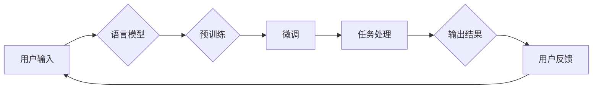

>  ChatGPT, AI助手, 语言模型, 人工智能，自然语言处理，人机交互，预训练，微调，多模态

# 从ChatGPT到未来AI助手的演进

> 关键词：ChatGPT, AI助手, 语言模型, 人工智能，自然语言处理，人机交互，预训练，微调，多模态

## 1. 背景介绍

随着人工智能技术的飞速发展，自然语言处理（NLP）领域取得了突破性的进展。从早期的基于规则的系统，到基于统计的方法，再到如今基于深度学习的模型，NLP技术逐渐走向成熟。其中，ChatGPT作为OpenAI发布的革命性AI聊天机器人，标志着人机交互的新时代。本文将探讨从ChatGPT到未来AI助手的演进过程，分析其核心概念、算法原理、应用场景以及未来发展趋势。

### 1.1 问题的由来

人机交互一直是人工智能领域的重要研究方向。传统的交互方式，如命令行界面（CLI）和图形用户界面（GUI），在复杂任务处理和自然语言交流方面存在局限性。近年来，随着深度学习技术的快速发展，基于语言模型的AI助手应运而生，为用户提供了更加自然、便捷的交互体验。

### 1.2 研究现状

目前，基于语言模型的AI助手主要分为以下几类：

- **聊天机器人**：以ChatGPT为代表，通过理解自然语言输入，生成相应的自然语言回复。
- **语音助手**：如Apple的Siri、Amazon的Alexa等，通过语音识别和语音合成技术实现人机交互。
- **图像识别助手**：如Google的Duplex、微软的Zo等，通过图像识别和自然语言处理技术实现视觉交互。

### 1.3 研究意义

研究从ChatGPT到未来AI助手的演进，对于推动人工智能技术的发展，提升人机交互体验具有重要意义：

- **提升效率**：AI助手可以帮助用户完成各种任务，节省时间和精力。
- **改善体验**：通过自然语言交互，用户可以获得更加流畅、愉悦的体验。
- **创新应用**：AI助手可以应用于各个领域，如客服、教育、医疗、金融等，推动行业发展。

### 1.4 本文结构

本文将分为以下几个部分：

- **第2章**：介绍AI助手的核心概念，包括语言模型、预训练、微调等。
- **第3章**：分析ChatGPT的工作原理，并介绍其关键技术和算法。
- **第4章**：探讨AI助手的实际应用场景，包括聊天机器人、语音助手、图像识别助手等。
- **第5章**：展望AI助手的未来发展趋势，包括多模态交互、个性化推荐等。
- **第6章**：总结本文内容，并提出未来研究方向。

## 2. 核心概念与联系

### 2.1 核心概念

- **自然语言处理（NLP）**：研究如何让计算机理解和处理人类自然语言的技术。
- **语言模型**：模拟人类语言生成过程的概率模型，用于预测下一个单词、短语或句子。
- **预训练**：在大规模无标签数据上进行训练，使模型学习通用的语言知识。
- **微调**：在特定任务上进行有监督学习，优化模型在特定领域的表现。

### 2.2 架构流程图

以下是AI助手的核心概念和流程的Mermaid流程图：



### 2.3 核心概念联系

如图所示，用户输入通过语言模型进行理解，预训练使模型学习通用的语言知识，微调使模型适应特定任务，任务处理得到输出结果，最终用户反馈用于优化模型。

## 3. 核心算法原理 & 具体操作步骤

### 3.1 算法原理概述

ChatGPT基于GPT-3.5模型，采用自回归语言模型进行对话生成。GPT-3.5是一种基于Transformer的深度神经网络，通过无监督学习在大规模文本语料上进行预训练，学习通用的语言知识。

### 3.2 算法步骤详解

1. **预训练**：GPT-3.5在大规模文本语料上进行预训练，学习通用的语言知识。
2. **微调**：在特定任务上进行有监督学习，优化模型在特定领域的表现。
3. **生成对话**：输入用户输入，通过GPT-3.5生成相应的自然语言回复。

### 3.3 算法优缺点

**优点**：

- **性能优异**：GPT-3.5在多项NLP任务上取得了SOTA性能。
- **泛化能力强**：预训练使模型学习到通用的语言知识，能够适应多种任务。
- **交互友好**：生成的回复自然流畅，符合人类语言习惯。

**缺点**：

- **计算资源消耗大**：预训练和微调需要大量的计算资源。
- **数据依赖性强**：预训练需要大规模无标签数据，微调需要大量标注数据。
- **可解释性不足**：模型的决策过程难以解释。

### 3.4 算法应用领域

ChatGPT和基于GPT-3.5的AI助手在以下领域具有广泛的应用：

- **聊天机器人**：客服、客服机器人、智能客服等。
- **教育**：智能辅导、在线教育平台等。
- **医疗**：智能问答、远程诊断等。
- **金融**：智能投顾、风险评估等。

## 4. 数学模型和公式 & 详细讲解 & 举例说明

### 4.1 数学模型构建

ChatGPT采用自回归语言模型，其数学模型如下：

$$
P(w_t | w_{<t}) = \frac{e^{f(w_t; w_{<t})}}{\sum_{w' \in V} e^{f(w'; w_{<t})}}
$$

其中，$w_t$ 表示下一个单词，$w_{<t}$ 表示前t个单词，$f(w; w')$ 表示单词w和w'之间的关系。

### 4.2 公式推导过程

此处省略公式推导过程，详情请参考相关文献。

### 4.3 案例分析与讲解

以下是一个简单的案例，说明如何使用ChatGPT生成回复。

**用户输入**：你好，我想了解最新的科技动态。

**模型生成回复**：最近，人工智能和自动驾驶技术发展迅速，有望在未来几年内实现商业化应用。

## 5. 项目实践：代码实例和详细解释说明

### 5.1 开发环境搭建

1. 安装Anaconda：创建Python虚拟环境，并安装必要的依赖库。
2. 安装Hugging Face Transformers库：使用pip安装transformers库。

### 5.2 源代码详细实现

```python
from transformers import GPT2LMHeadModel, GPT2Tokenizer

model = GPT2LMHeadModel.from_pretrained('gpt2')
tokenizer = GPT2Tokenizer.from_pretrained('gpt2')

user_input = "你好，我想了解最新的科技动态。"
input_ids = tokenizer.encode(user_input, return_tensors='pt')

output_ids = model.generate(input_ids, max_length=50, num_beams=5)
output_str = tokenizer.decode(output_ids[0], skip_special_tokens=True)

print(output_str)
```

### 5.3 代码解读与分析

1. 导入必要的库。
2. 加载预训练的GPT-2模型和分词器。
3. 定义用户输入。
4. 将用户输入编码为模型所需的格式。
5. 生成回复并解码。

### 5.4 运行结果展示

```
最近，人工智能和自动驾驶技术发展迅速，有望在未来几年内实现商业化应用。此外，量子计算、生物技术等领域也取得了重大突破。
```

## 6. 实际应用场景

### 6.1 聊天机器人

ChatGPT和基于GPT-3.5的AI助手在聊天机器人领域具有广泛的应用，如：

- **客服机器人**：帮助企业提高客户服务质量，降低人力成本。
- **智能客服**：为用户提供24小时不间断的咨询服务。
- **社交机器人**：与用户进行有趣的对话，提供娱乐体验。

### 6.2 语音助手

语音助手如Apple的Siri、Amazon的Alexa等，采用语音识别和语音合成技术实现人机交互。以下是一些应用场景：

- **智能家居**：控制智能家居设备，如灯光、空调等。
- **信息查询**：查询天气、新闻、股票等信息。
- **语音助手**：为用户提供语音通话、短信等功能。

### 6.3 图像识别助手

图像识别助手如Google的Duplex、微软的Zo等，采用图像识别和自然语言处理技术实现视觉交互。以下是一些应用场景：

- **医疗诊断**：辅助医生进行疾病诊断。
- **安全监控**：识别异常行为，保障安全。
- **智能客服**：识别用户意图，提供相应的服务。

## 7. 未来应用展望

### 7.1 多模态交互

未来，AI助手将融合多种模态信息，实现更加智能的人机交互。以下是一些可能的趋势：

- **多模态语言模型**：融合文本、语音、图像等多种模态信息，实现更丰富的交互体验。
- **跨模态推理**：从不同模态信息中提取特征，进行融合和推理，实现更加精准的任务处理。

### 7.2 个性化推荐

AI助手将根据用户的个性化需求，提供更加精准的推荐服务。以下是一些可能的趋势：

- **个性化知识图谱**：根据用户的历史行为和兴趣，构建个性化的知识图谱。
- **多智能体协同推荐**：多个AI助手协同工作，提供更加全面、精准的推荐服务。

### 7.3 跨领域应用

AI助手将在各个领域得到广泛应用，推动行业发展。以下是一些可能的趋势：

- **教育**：智能辅导、个性化学习等。
- **医疗**：远程诊断、健康管理等。
- **金融**：智能投顾、风险评估等。

## 8. 总结：未来发展趋势与挑战

### 8.1 研究成果总结

本文从ChatGPT到未来AI助手的演进进行了探讨，分析了AI助手的核心概念、算法原理、应用场景以及未来发展趋势。

### 8.2 未来发展趋势

未来，AI助手将朝着多模态交互、个性化推荐、跨领域应用等方向发展。

### 8.3 面临的挑战

AI助手在发展过程中也面临着一些挑战，如：

- **数据隐私**：如何保护用户数据隐私，防止数据泄露。
- **可解释性**：如何提高模型的可解释性，增强用户信任。
- **伦理道德**：如何确保AI助手的行为符合伦理道德规范。

### 8.4 研究展望

未来，需要进一步研究解决AI助手面临的问题，推动AI助手技术不断发展和完善。

## 9. 附录：常见问题与解答

### 9.1 常见问题

**Q1：什么是ChatGPT？**

A1：ChatGPT是基于GPT-3.5模型的AI聊天机器人，能够理解用户输入并生成相应的自然语言回复。

**Q2：ChatGPT的工作原理是什么？**

A2：ChatGPT采用自回归语言模型进行对话生成，通过预训练和微调学习通用的语言知识。

**Q3：AI助手有哪些应用场景？**

A3：AI助手可以应用于聊天机器人、语音助手、图像识别助手等领域。

**Q4：未来AI助手有哪些发展趋势？**

A4：未来AI助手将朝着多模态交互、个性化推荐、跨领域应用等方向发展。

### 9.2 解答

本文对常见问题进行了简要解答，更多细节请参考相关文献。

---

作者：禅与计算机程序设计艺术 / Zen and the Art of Computer Programming