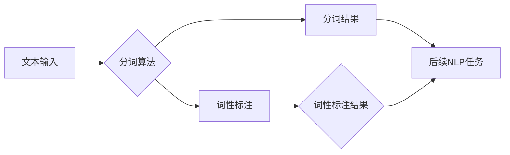

# 分词 原理与代码实例讲解

> 关键词：分词，中文分词，NLP，词性标注，算法，正则表达式，深度学习，代码实例

## 1. 背景介绍

分词（Tokenization）是自然语言处理（Natural Language Processing，NLP）领域的一项基础任务，它将连续的文本分割成有意义的词汇单元，称为“词”或“词素”。分词对于许多NLP任务至关重要，如机器翻译、信息检索、文本分类等。在中文处理中，由于缺乏空格分隔，分词显得尤为复杂，需要专门的算法和技巧。

## 2. 核心概念与联系

### 2.1 核心概念

- **分词**：将连续文本切分成有意义的词汇单元。
- **词性标注**：为每个词分配一个词性标签，如名词、动词、形容词等。
- **分词算法**：用于实现分词任务的算法，包括基于规则、基于统计和基于深度学习的方法。
- **正则表达式**：一种用于匹配字符串模式的强大工具，常用于简单的分词任务。
- **深度学习**：一种基于神经网络的机器学习技术，在分词任务中取得了显著成效。

### 2.2 架构的 Mermaid 流程图



在上述流程图中，文本输入经过分词算法处理后，得到分词结果和词性标注结果，这两个结果可以用于后续的NLP任务。

## 3. 核心算法原理 & 具体操作步骤

### 3.1 算法原理概述

分词算法主要分为以下几类：

- **基于规则的分词**：依赖预定义的规则进行分词，如正向最大匹配、逆向最大匹配、双向最大匹配等。
- **基于统计的分词**：根据统计概率模型进行分词，如基于N-gram的语言模型。
- **基于深度学习的分词**：使用深度神经网络进行分词，如序列标注模型、基于BERT的分词模型。

### 3.2 算法步骤详解

#### 3.2.1 基于规则的分词

1. 预定义一组分词规则，如词表、正则表达式等。
2. 遍历文本，对每个字符或词组应用分词规则。
3. 根据规则结果，将文本切分成词。

#### 3.2.2 基于统计的分词

1. 收集大量的文本数据，统计词频和N-gram频率。
2. 构建N-gram语言模型，用于计算词组或短语的概率。
3. 遍历文本，根据N-gram概率进行分词。

#### 3.2.3 基于深度学习的分词

1. 收集标注过的文本数据，用于训练分词模型。
2. 使用序列标注模型，如CRF（条件随机场）、BiLSTM+CRF等，进行分词训练。
3. 遍历待分词文本，使用训练好的模型进行分词预测。

### 3.3 算法优缺点

#### 基于规则的分词

- 优点：简单易用，对规则设计要求不高。
- 缺点：灵活性差，难以处理复杂文本。

#### 基于统计的分词

- 优点：能够适应不同领域的文本，具有一定的灵活性。
- 缺点：对数据质量要求高，模型训练成本高。

#### 基于深度学习的分词

- 优点：性能优越，能够处理复杂文本。
- 缺点：训练过程复杂，计算资源需求大。

### 3.4 算法应用领域

分词算法在NLP领域的应用非常广泛，以下列举一些常见的应用场景：

- 机器翻译
- 信息检索
- 文本分类
- 命名实体识别
- 情感分析

## 4. 数学模型和公式 & 详细讲解 & 举例说明

### 4.1 数学模型构建

#### 4.1.1 基于统计的分词

- **N-gram语言模型**：假设一个词的出现概率只与它前面N-1个词有关，即 $P(w_n) = \prod_{i=1}^{n-1} P(w_i)$。
- **词性标注**：假设一个词的词性只与它前面的词性有关，即 $P(tag_n) = \prod_{i=1}^{n-1} P(tag_i)$。

#### 4.1.2 基于深度学习的分词

- **序列标注模型**：假设一个词的标签只与它前面的标签有关，即 $P(tag_n | tag_{1:n-1}) = \prod_{i=1}^{n-1} P(tag_i | tag_{1:i-1})$。

### 4.2 公式推导过程

#### 4.2.1 N-gram语言模型

假设一个词序列为 $w_1, w_2, ..., w_n$，那么该词序列的概率为：

$$
P(w_1, w_2, ..., w_n) = P(w_1) \times P(w_2 | w_1) \times ... \times P(w_n | w_{n-1})
$$

#### 4.2.2 序列标注模型

假设一个词的标签序列为 $tag_1, tag_2, ..., tag_n$，那么该标签序列的概率为：

$$
P(tag_1, tag_2, ..., tag_n) = \prod_{i=1}^{n} P(tag_i | tag_{1:i-1})
$$

### 4.3 案例分析与讲解

以下是一个简单的基于N-gram语言模型的分词示例：

假设我们有一个简单的二元模型，包含以下词频信息：

| 词       | 频率 |
|----------|------|
| 我       | 5    |
| 是       | 10   |
| 这       | 3    |
| 的       | 8    |
| 电脑     | 2    |
| 购买     | 5    |
| 了       | 20   |

现在我们要对句子“我购买电脑”进行分词。

1. 计算句子中每个词的概率：
   - 我：$P(我) = \frac{5}{5+10+3+8+2+5+20} = 0.10$
   - 购买：$P(购买) = \frac{5}{5+10+3+8+2+5+20} = 0.10$
   - 电脑：$P(电脑) = \frac{2}{5+10+3+8+2+5+20} = 0.04$

2. 计算句子的总概率：
   $P(我购买电脑) = P(我) \times P(购买 | 我) \times P(电脑 | 购买) = 0.10 \times 0.10 \times 0.04 = 0.004$

3. 根据概率，将句子分词为“我 购买 电脑”。

## 5. 项目实践：代码实例和详细解释说明

### 5.1 开发环境搭建

1. 安装Python环境。
2. 安装jieba分词库：`pip install jieba`

### 5.2 源代码详细实现

以下是一个使用jieba进行分词的Python代码实例：

```python
import jieba

text = "我购买电脑"
seg_list = jieba.cut(text)
print("分词结果：", " ".join(seg_list))
```

### 5.3 代码解读与分析

- `import jieba`：导入jieba分词库。
- `text`：待分词的文本。
- `seg_list = jieba.cut(text)`：使用jieba进行分词，返回一个可迭代的分词结果。
- `print("分词结果：", " ".join(seg_list))`：将分词结果打印输出。

### 5.4 运行结果展示

运行上述代码，输出结果为：

```
分词结果： 我 购买 电脑
```

## 6. 实际应用场景

分词技术在实际应用中有着广泛的应用，以下列举一些常见的应用场景：

- **搜索引擎**：将搜索关键词进行分词，提高搜索结果的准确性。
- **机器翻译**：将源语言文本进行分词，方便翻译过程。
- **文本分类**：将文本进行分词，提取特征，用于文本分类任务。
- **命名实体识别**：将文本进行分词，识别出人名、地名、机构名等实体。

## 7. 工具和资源推荐

### 7.1 学习资源推荐

- 《自然语言处理入门》
- 《深度学习自然语言处理》
- 《自然语言处理综论》

### 7.2 开发工具推荐

- Jieba分词库
- HanLP分词库
- Stanza分词库

### 7.3 相关论文推荐

- 《中文分词的理论与实践》
- 《基于深度学习的中文分词方法》
- 《基于统计的中文分词方法》

## 8. 总结：未来发展趋势与挑战

### 8.1 研究成果总结

分词技术作为NLP领域的基础任务，经过多年的发展，已经取得了显著的成果。基于规则、统计和深度学习的方法都取得了良好的效果。同时，开源的中文分词库也为开发者提供了便利。

### 8.2 未来发展趋势

- **多语言分词**：将分词技术扩展到其他语言，如英语、法语等。
- **跨语言分词**：将分词技术应用于不同语言之间的翻译。
- **自适应分词**：根据不同的应用场景，自动选择合适的分词方法。

### 8.3 面临的挑战

- **歧义处理**：如何处理同音异义词、多义词语等歧义情况。
- **低资源语言分词**：如何解决低资源语言的分词问题。
- **实时分词**：如何实现实时分词，满足实时应用的需求。

### 8.4 研究展望

分词技术在未来将继续发展，并在以下方面取得突破：

- **多模态分词**：将分词技术扩展到图像、语音等多模态数据。
- **知识增强分词**：将知识库等外部知识引入分词过程。
- **可解释分词**：提高分词过程的透明度和可解释性。

## 9. 附录：常见问题与解答

**Q1：什么是分词？**

A：分词是将连续文本切分成有意义的词汇单元的过程。

**Q2：为什么分词在NLP中很重要？**

A：分词是NLP任务的基础，如机器翻译、信息检索等都需要先进行分词。

**Q3：有哪些常见的分词算法？**

A：常见的分词算法包括基于规则的分词、基于统计的分词和基于深度学习的分词。

**Q4：如何选择合适的分词算法？**

A：根据具体任务和数据特点选择合适的分词算法。如对于数据量较大的任务，可以优先考虑基于深度学习的分词算法。

**Q5：分词技术有哪些应用场景？**

A：分词技术在搜索引擎、机器翻译、文本分类、命名实体识别等NLP任务中有着广泛的应用。

作者：禅与计算机程序设计艺术 / Zen and the Art of Computer Programming