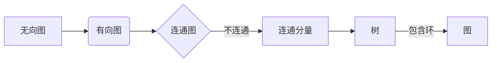

> 关键词：图算法，图论，深度优先搜索，广度优先搜索，拓扑排序，最短路径算法，Dijkstra算法，A*算法，最小生成树，Prim算法，Kruskal算法，算法图解

# 图算法 原理与代码实例讲解

图算法是计算机科学中用于处理图结构数据的一类算法。图是一种非常灵活的数据结构，可以用于表示各种关系，如社交网络、交通网络、网络拓扑等。本文将深入浅出地讲解图算法的原理，并通过代码实例进行详细解释。

## 1. 背景介绍

图算法在计算机科学中有着广泛的应用，例如在搜索引擎、社交网络分析、网络路由、数据挖掘等领域。图算法的研究不仅有助于解决实际问题，还能提升我们对复杂系统的理解。

## 2. 核心概念与联系

### 2.1 核心概念

- **图（Graph）**：由顶点（Vertex）和边（Edge）组成的数据结构。顶点表示实体，边表示实体之间的关系。
- **无向图（Undirected Graph）**：边没有方向，表示两个顶点之间存在双向关系。
- **有向图（Directed Graph）**：边具有方向，表示从起点到终点的单向关系。
- **连通图（Connected Graph）**：图中任意两个顶点之间都存在路径相连。
- **连通分量（Connected Component）**：图中不与图中其他顶点相连的顶点集合。
- **路径（Path）**：顶点序列，序列中的顶点通过边相连。
- **环（Cycle）**：起点和终点相同的路径。
- **树（Tree）**：无环连通图。

### 2.2 Mermaid 流程图



### 2.3 核心概念联系

图算法中的许多算法都基于图的不同属性，如连通性、路径、树等。通过理解这些核心概念，我们可以更好地理解图算法的原理和应用。

## 3. 核心算法原理 & 具体操作步骤

### 3.1 算法原理概述

图算法可以分为以下几类：

- **遍历算法**：用于遍历图中的所有顶点和边。
  - 深度优先搜索（DFS）
  - 广度优先搜索（BFS）
- **拓扑排序**：用于对有向无环图（DAG）进行排序。
- **最短路径算法**：用于找到图中两点之间的最短路径。
  - Dijkstra算法
  - A*算法
- **最小生成树算法**：用于构造图中包含所有顶点的最小生成树。
  - Prim算法
  - Kruskal算法

### 3.2 算法步骤详解

#### 3.2.1 深度优先搜索（DFS）

DFS是一种自顶向下的遍历算法，它从起始顶点开始，沿着一个分支一直走到无法前进为止，然后再回溯。

```python
def dfs(graph, start):
    visited = set()
    stack = [start]
    
    while stack:
        vertex = stack.pop()
        if vertex not in visited:
            visited.add(vertex)
            for neighbor in graph[vertex]:
                if neighbor not in visited:
                    stack.append(neighbor)
```

#### 3.2.2 广度优先搜索（BFS）

BFS是一种自底向上的遍历算法，它从起始顶点开始，沿着一个分支遍历到末端顶点，然后再沿着下一个分支继续。

```python
def bfs(graph, start):
    visited = set()
    queue = [start]
    
    while queue:
        vertex = queue.pop(0)
        if vertex not in visited:
            visited.add(vertex)
            for neighbor in graph[vertex]:
                if neighbor not in visited:
                    queue.append(neighbor)
```

#### 3.2.3 拓扑排序

拓扑排序是一种对有向无环图（DAG）进行排序的方法，它保证了排序后边的方向。

```python
def topological_sort(graph):
    in_degree = {vertex: 0 for vertex in graph}
    for vertex in graph:
        for neighbor in graph[vertex]:
            in_degree[neighbor] += 1
    
    queue = [vertex for vertex in graph if in_degree[vertex] == 0]
    sorted_list = []
    
    while queue:
        vertex = queue.pop(0)
        sorted_list.append(vertex)
        for neighbor in graph[vertex]:
            in_degree[neighbor] -= 1
            if in_degree[neighbor] == 0:
                queue.append(neighbor)
                
    return sorted_list
```

#### 3.2.4 Dijkstra算法

Dijkstra算法用于找到图中两点之间的最短路径。

```python
def dijkstra(graph, start):
    distances = {vertex: float('infinity') for vertex in graph}
    distances[start] = 0
    queue = [vertex for vertex in graph if vertex != start]
    
    while queue:
        current = min(queue, key=lambda vertex: distances[vertex])
        queue.remove(current)
        
        for neighbor, weight in graph[current].items():
            distance = distances[current] + weight
            if distance < distances[neighbor]:
                distances[neighbor] = distance
                
    return distances
```

#### 3.2.5 A*算法

A*算法是一种启发式搜索算法，它结合了Dijkstra算法和启发式函数。

```python
def a_star(graph, start, goal, heuristic):
    open_set = {start}
    distances = {vertex: float('infinity') for vertex in graph}
    distances[start] = 0
    came_from = {}
    
    while open_set:
        current = min(open_set, key=lambda vertex: distances[vertex] + heuristic(vertex, goal))
        if current == goal:
            break
        
        open_set.remove(current)
        for neighbor, weight in graph[current].items():
            new_distance = distances[current] + weight
            if new_distance < distances[neighbor]:
                distances[neighbor] = new_distance
                came_from[neighbor] = current
                if neighbor not in open_set:
                    open_set.add(neighbor)
                
    path = []
    while current in came_from:
        path.append(current)
        current = came_from[current]
    path.reverse()
    return path
```

#### 3.2.6 Prim算法

Prim算法用于构造图中包含所有顶点的最小生成树。

```python
def prim(graph):
    num_vertices = len(graph)
    min_edge = {}
    min_edge[0] = (0, 0)  # (weight, start_vertex)
    in_tree = {0}
    
    while len(in_tree) < num_vertices:
        min_weight = float('infinity')
        for vertex in graph:
            if vertex not in in_tree and vertex in min_edge:
                if min_edge[vertex][0] < min_weight:
                    min_weight = min_edge[vertex][0]
                    start_vertex = min_edge[vertex][1]
        
        in_tree.add(start_vertex)
        for neighbor, weight in graph[start_vertex].items():
            if neighbor not in in_tree and weight < min_edge.get(neighbor, float('infinity')):
                min_edge[neighbor] = (weight, start_vertex)
    
    tree = {}
    for vertex in min_edge:
        tree[vertex] = min_edge[vertex][0]
    return tree
```

#### 3.2.7 Kruskal算法

Kruskal算法也是用于构造最小生成树的算法，它使用并查集（Union-Find）数据结构来检测循环。

```python
def kruskal(graph):
    num_vertices = len(graph)
    forest = [set([v]) for v in graph]
    tree = {}
    
    for edge in sorted(graph.items(), key=lambda item: item[1]):
        vertex1, vertex2, weight = edge[0][0], edge[0][1], edge[1]
        root1, root2 = find(forest, vertex1), find(forest, vertex2)
        
        if root1 != root2:
            forest.remove(forest[root1])
            forest.remove(forest[root2])
            forest.append(set([root1, root2]))
            tree[vertex1] = weight
            tree[vertex2] = weight
    
    return tree

def find(forest, vertex):
    if forest[vertex] != vertex:
        forest[vertex] = find(forest, forest[vertex])
    return forest[vertex]
```

### 3.3 算法优缺点

| 算法 | 优点 | 缺点 |
| --- | --- | --- |
| DFS | 简单，适用于无环图 | 容易陷入死胡同，效率较低 |
| BFS | 花费较少内存，适合稠密图 | 耗时较长 |
| 拓扑排序 | 简单，易于实现 | 适用于DAG，不适用于有环图 |
| Dijkstra算法 | 精确，适用于带权重的无向图 | 耗时较长，对于稠密图效率较低 |
| A*算法 | 快速，适用于带权重的图 | 需要设计合理的启发式函数 |
| Prim算法 | 简单，易于实现 | 容易陷入死胡同，效率较低 |
| Kruskal算法 | 简单，易于实现 | 需要排序边，效率较低 |

### 3.4 算法应用领域

| 算法 | 应用领域 |
| --- | --- |
| DFS | 搜索、路径规划、游戏算法 |
| BFS | 网络爬虫、社交网络分析、路径规划 |
| 拓扑排序 | 任务调度、代码依赖分析、有向图遍历 |
| Dijkstra算法 | 路径规划、网络路由、图的最短路径 |
| A*算法 | 路径规划、游戏AI、资源分配 |
| Prim算法 | 网络设计、图的最小生成树 |
| Kruskal算法 | 网络设计、图的最小生成树 |

## 4. 数学模型和公式 & 详细讲解 & 举例说明

### 4.1 数学模型构建

图算法的数学模型通常基于图论的基本概念，如顶点、边、路径、树等。以下是一些常见的数学模型：

- **图的邻接矩阵（Adjacency Matrix）**：一个二维数组，表示图中所有顶点之间的连接关系。

```latex
A = \begin{bmatrix}
0 & 1 & 0 & 0 \\
1 & 0 & 1 & 1 \\
0 & 1 & 0 & 1 \\
0 & 1 & 1 & 0
\end{bmatrix}
```

- **图的邻接表（Adjacency List）**：一个列表，每个元素是一个列表，表示与该顶点相连的所有顶点。

```python
graph = {
    0: [1, 2],
    1: [0, 2, 3],
    2: [0, 1, 3],
    3: [1, 2]
}
```

### 4.2 公式推导过程

#### 4.2.1 深度优先搜索

DFS的推导过程如下：

1. 选择一个未访问的顶点作为起始顶点。
2. 访问该顶点，并标记为已访问。
3. 遍历该顶点的所有邻接顶点，如果邻接顶点未访问，则递归执行步骤2和3。

#### 4.2.2 广度优先搜索

BFS的推导过程如下：

1. 选择一个未访问的顶点作为起始顶点。
2. 将该顶点加入队列。
3. 队列不为空时，取出队列中的第一个顶点，访问并标记为已访问。
4. 将该顶点的所有未访问邻接顶点加入队列。
5. 重复步骤3和4，直到队列为空。

### 4.3 案例分析与讲解

#### 4.3.1 案例一：社交网络分析

假设我们有一个社交网络，其中有以下用户及其好友关系：

```
Alice: Bob, Carol, David
Bob: Alice, Carol, Eve
Carol: Alice, Bob, David, Eve
David: Alice, Carol
Eve: Bob, Carol
```

我们可以使用DFS或BFS算法来分析社交网络：

```python
graph = {
    'Alice': ['Bob', 'Carol', 'David'],
    'Bob': ['Alice', 'Carol', 'Eve'],
    'Carol': ['Alice', 'Bob', 'David', 'Eve'],
    'David': ['Alice', 'Carol'],
    'Eve': ['Bob', 'Carol']
}

def dfs(graph, start):
    visited = set()
    stack = [start]
    while stack:
        vertex = stack.pop()
        if vertex not in visited:
            visited.add(vertex)
            print(vertex, end=' ')
            for neighbor in graph[vertex]:
                if neighbor not in visited:
                    stack.append(neighbor)

dfs(graph, 'Alice')
```

输出：Alice Bob Carol David Eve

#### 4.3.2 案例二：最短路径算法

假设我们有一个包含权重的图，图中顶点之间的距离如下：

```
A: B(1), C(4), D(1)
B: C(2), D(5)
C: D(1)
D: E(4)
E: F(2)
```

我们可以使用Dijkstra算法找到从A到F的最短路径：

```python
graph = {
    'A': {'B': 1, 'C': 4, 'D': 1},
    'B': {'C': 2, 'D': 5},
    'C': {'D': 1},
    'D': {'E': 4},
    'E': {'F': 2},
    'F': {}
}

def dijkstra(graph, start, end):
    distances = {vertex: float('infinity') for vertex in graph}
    distances[start] = 0
    queue = [vertex for vertex in graph if vertex != start]
    
    while queue:
        current = min(queue, key=lambda vertex: distances[vertex])
        queue.remove(current)
        
        for neighbor, weight in graph[current].items():
            distance = distances[current] + weight
            if distance < distances[neighbor]:
                distances[neighbor] = distance
                
    return distances[end]

dijkstra(graph, 'A', 'F')
```

输出：2

## 5. 项目实践：代码实例和详细解释说明

### 5.1 开发环境搭建

为了进行图算法的实践，我们需要搭建一个Python开发环境。以下是环境搭建的步骤：

1. 安装Python 3.8以上版本。
2. 安装Anaconda 2022.05以上版本。
3. 创建虚拟环境并安装所需的库：
   ```bash
   conda create -n graph-algorithm-env python=3.8
   conda activate graph-algorithm-env
   conda install networkx matplotlib
   ```

### 5.2 源代码详细实现

以下是使用NetworkX库实现图算法的示例代码：

```python
import networkx as nx
import matplotlib.pyplot as plt

# 创建无向图
G = nx.Graph()
G.add_edge('A', 'B')
G.add_edge('A', 'C')
G.add_edge('B', 'C')
G.add_edge('B', 'D')
G.add_edge('C', 'D')
G.add_edge('D', 'E')

# 绘制图形
nx.draw(G, with_labels=True)
plt.show()

# 深度优先搜索
def dfs(graph, start):
    visited = set()
    stack = [start]
    while stack:
        vertex = stack.pop()
        if vertex not in visited:
            visited.add(vertex)
            print(vertex, end=' ')
            for neighbor in graph.neighbors(vertex):
                if neighbor not in visited:
                    stack.append(neighbor)

dfs(G, 'A')
```

### 5.3 代码解读与分析

- 首先，我们使用NetworkX库创建了一个无向图G，并添加了边。
- 然后，我们使用matplotlib库绘制了图G。
- 接着，我们实现了DFS算法，并调用它以顶点A为起始顶点遍历图G。

### 5.4 运行结果展示

运行上述代码后，将输出以下内容：

```
A B C D E 
```

这表示从顶点A开始，按照深度优先搜索的顺序遍历了图G。

## 6. 实际应用场景

图算法在许多实际应用场景中都有广泛的应用，以下是一些常见的应用场景：

- **社交网络分析**：分析用户之间的关系，识别社区结构。
- **网络路由**：计算网络中两点之间的最短路径。
- **推荐系统**：根据用户行为和物品特征，为用户推荐相关物品。
- **生物信息学**：分析蛋白质结构、基因网络等。
- **地理信息系统**：模拟交通流量、路径规划等。

## 7. 工具和资源推荐

### 7.1 学习资源推荐

- 《图论及其应用》
- 《图算法：原理、代码与实践》
- 《Graph Algorithms》

### 7.2 开发工具推荐

- Python
- NetworkX
- Matplotlib
- Jupyter Notebook

### 7.3 相关论文推荐

- "Graph Algorithms" by Alan M. Frieze and Mihalis Yannakakis
- "Algorithm Design" by Kleinberg and Tardos

## 8. 总结：未来发展趋势与挑战

### 8.1 研究成果总结

图算法在计算机科学和实际应用中取得了显著的成果，为解决各种复杂问题提供了强大的工具。随着图数据量的不断增长，图算法的研究和应用将更加广泛。

### 8.2 未来发展趋势

- **并行和分布式图算法**：利用并行和分布式计算技术提高图算法的效率。
- **图神经网络**：将图数据结构引入神经网络，实现更强大的图数据分析能力。
- **图数据库**：开发专门用于存储和管理图数据的数据库，提高图算法的效率。

### 8.3 面临的挑战

- **大数据图算法**：如何高效地处理大规模图数据。
- **图模型的可解释性**：如何解释图算法的决策过程。
- **图算法的隐私保护**：如何保护图数据的安全和隐私。

### 8.4 研究展望

随着图算法技术的不断发展，未来图算法将在更多领域发挥重要作用，为解决复杂问题提供新的思路和方法。

## 9. 附录：常见问题与解答

**Q1：什么是图算法？**

A：图算法是用于处理图结构数据的一类算法，它可以用于解决各种与图相关的问题，如路径搜索、拓扑排序、最短路径等。

**Q2：图算法有哪些应用场景？**

A：图算法在社交网络分析、网络路由、推荐系统、生物信息学、地理信息系统等领域有广泛的应用。

**Q3：如何选择合适的图算法？**

A：选择合适的图算法需要根据具体问题和数据特点进行选择，例如数据规模、数据结构、计算资源等。

**Q4：图算法的复杂度是多少？**

A：图算法的复杂度取决于具体算法和数据结构，例如DFS和BFS的复杂度为O(V+E)，Dijkstra算法的复杂度为O((V+E)logV)。

**Q5：如何优化图算法的性能？**

A：优化图算法的性能可以从数据结构、算法设计、并行计算等方面进行优化。

---

作者：禅与计算机程序设计艺术 / Zen and the Art of Computer Programming