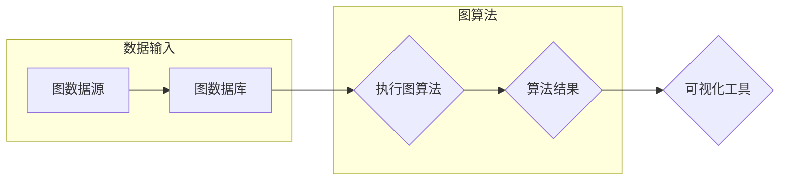
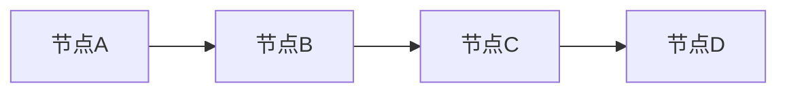

# 图计算引擎 原理与代码实例讲解

> 关键词：图计算，图数据库，图算法，图引擎，图神经网络，图遍历，图计算框架

## 1. 背景介绍

随着互联网和大数据技术的发展，图结构数据在社交网络、推荐系统、生物信息学、交通网络等领域得到了广泛应用。图结构数据具有复杂的关系网络，传统的计算模型难以有效处理。图计算作为一种专门针对图结构数据的计算范式，能够有效地挖掘图中的隐含关系和模式。本文将深入探讨图计算引擎的原理、实现方法和应用场景，并通过代码实例进行详细讲解。

## 2. 核心概念与联系

### 2.1 图数据

图数据是由节点（Vertex）和边（Edge）组成的集合。节点代表图中的实体，边代表实体之间的关系。图数据可以表示各种复杂的关系网络，如社交网络、知识图谱、交通网络等。

### 2.2 图数据库

图数据库是一种专门用于存储和管理图结构数据的数据库。常见的图数据库包括Neo4j、ArangoDB、OrientDB等。图数据库支持复杂的图操作，如图遍历、路径查询、社区发现等。

### 2.3 图算法

图算法是一系列用于处理图数据的算法，如最短路径搜索、社交网络分析、社区发现、聚类分析等。常见的图算法包括Dijkstra算法、A*算法、BFS和BFS算法等。

### 2.4 图引擎

图引擎是一种专门用于执行图算法的软件框架。图引擎可以对图数据进行分析和处理，提取图中的模式和知识。常见的图引擎包括Apache Giraph、Apache Flink、Apache Spark等。

### 2.5 Mermaid 流程图

以下是一个简单的Mermaid流程图，展示了图计算引擎的基本架构：



## 3. 核心算法原理 & 具体操作步骤

### 3.1 算法原理概述

图计算的核心是图遍历。图遍历是一种遍历图结构数据的方法，可以用来找到图中的所有节点和边。常见的图遍历算法有深度优先搜索（DFS）和广度优先搜索（BFS）。

### 3.2 算法步骤详解

以下是一个使用BFS算法进行图遍历的Python代码实例：

```python
from collections import deque

def bfs(graph, start_vertex):
    visited = set()
    queue = deque([start_vertex])

    while queue:
        vertex = queue.popleft()
        if vertex not in visited:
            visited.add(vertex)
            print(vertex, end=' ')

            for neighbor in graph[vertex]:
                if neighbor not in visited:
                    queue.append(neighbor)
```

### 3.3 算法优缺点

- BFS算法具有简单、易于实现等优点，但其时间复杂度为O(V+E)，其中V是节点数，E是边数，当图规模较大时，效率较低。
- Dijkstra算法适用于带权重的图，可以找到最短路径，但其时间复杂度较高，对于大规模图可能无法高效运行。

### 3.4 算法应用领域

图遍历算法在多个领域都有广泛应用，如：

- 社交网络分析：用于识别社交网络中的关键节点、社区发现等。
- 生物信息学：用于基因序列分析、蛋白质相互作用网络分析等。
- 交通网络分析：用于交通流量预测、路径规划等。

## 4. 数学模型和公式 & 详细讲解 & 举例说明

### 4.1 数学模型构建

图计算通常使用图论中的数学模型来描述。以下是一个简单的图模型：



### 4.2 公式推导过程

对于图遍历算法，以下是一个简单的BFS算法的公式推导：

- 设G=(V,E)为一个无向图，V为节点集，E为边集。
- 设S为起始节点，Q为队列，用于存储待访问的节点。
- 设visited为一个集合，用于存储已访问的节点。

算法步骤：

1. 将S加入visited集合，并将S加入Q。
2. 当Q不为空时，执行以下步骤：
    - 从Q中取出一个节点v。
    - 访问节点v，并将其相邻的未访问节点加入Q和visited集合。
3. 当Q为空时，算法结束。

### 4.3 案例分析与讲解

以下是一个使用BFS算法进行社交网络分析的经典案例：

- 假设我们有一个社交网络，节点代表用户，边代表用户之间的关注关系。
- 我们想要找到距离某个特定用户3步以内的所有用户。
- 我们可以使用BFS算法遍历社交网络，直到找到距离为3的用户。

## 5. 项目实践：代码实例和详细解释说明

### 5.1 开发环境搭建

为了进行图计算引擎的项目实践，我们需要准备以下开发环境：

- Python 3.x
- 安装pip：`pip install pip`
- 安装网络X工具：`pip install networkx`
- 安装Graphviz：`pip install graphviz`

### 5.2 源代码详细实现

以下是一个使用NetworkX库进行图计算的项目实例：

```python
import networkx as nx
import matplotlib.pyplot as plt

# 创建图
G = nx.Graph()

# 添加节点和边
G.add_edge('A', 'B')
G.add_edge('B', 'C')
G.add_edge('C', 'D')

# 绘制图
nx.draw(G, with_labels=True)
plt.show()
```

### 5.3 代码解读与分析

以上代码使用NetworkX库创建了一个简单的无向图G，并添加了三个节点和三条边。然后使用matplotlib库绘制了图的结构。

### 5.4 运行结果展示

运行以上代码，将得到一个简单的无向图，其中包含三个节点和三条边。

## 6. 实际应用场景

### 6.1 社交网络分析

社交网络分析是图计算的重要应用场景之一。通过分析社交网络，我们可以：

- 识别社交网络中的关键节点，如影响力最大的用户。
- 发现社交网络中的社区结构，了解用户的社交圈子。
- 分析用户之间的关系，预测用户的行为。

### 6.2 交通网络分析

交通网络分析是图计算的另一个重要应用场景。通过分析交通网络，我们可以：

- 预测交通流量，优化交通信号灯控制。
- 识别交通拥堵的热点区域，制定缓解措施。
- 找到最优的路径规划方案，减少出行时间。

## 7. 工具和资源推荐

### 7.1 学习资源推荐

- 《图计算：原理与实践》
- 《图算法》：https://zhuanlan.zhihu.com/p/32198489
- NetworkX官方文档：https://networkx.org/

### 7.2 开发工具推荐

- Python 3.x
- NetworkX
- Graphviz
- Neo4j

### 7.3 相关论文推荐

- "Graph neural networks" by William L. Hamilton
- "Community detection in networks" by M. E. J. Newman
- "PageRank" by Lawrence Page, Sergey Brin, Rajeev Motwani, and Jerry Yang

## 8. 总结：未来发展趋势与挑战

### 8.1 研究成果总结

本文深入探讨了图计算引擎的原理、实现方法和应用场景。通过理论讲解和代码实例，读者可以了解到图计算的基本概念和操作步骤，并能够将图计算应用于实际项目中。

### 8.2 未来发展趋势

随着图计算技术的不断发展，未来将呈现以下趋势：

- 图计算框架将更加高效、易用。
- 图计算算法将更加多样化，满足不同场景的需求。
- 图计算将与其他人工智能技术相结合，如机器学习、深度学习等。

### 8.3 面临的挑战

图计算技术仍面临以下挑战：

- 图数据的存储和管理。
- 图计算算法的优化和效率提升。
- 图计算的应用拓展。

### 8.4 研究展望

未来，图计算技术将在以下领域取得突破：

- 生物信息学：用于基因序列分析、蛋白质相互作用网络分析等。
- 社交网络分析：用于识别社交网络中的关键节点、社区发现等。
- 交通网络分析：用于交通流量预测、路径规划等。

## 9. 附录：常见问题与解答

**Q1：什么是图计算？**

A：图计算是一种专门针对图结构数据的计算范式，可以有效地挖掘图中的隐含关系和模式。

**Q2：图计算有哪些应用场景？**

A：图计算的应用场景非常广泛，包括社交网络分析、交通网络分析、生物信息学、推荐系统等。

**Q3：如何选择合适的图计算框架？**

A：选择合适的图计算框架需要根据具体的应用场景和需求来决定。常见的图计算框架包括Apache Giraph、Apache Flink、Apache Spark等。

**Q4：如何进行图数据的存储和管理？**

A：图数据的存储和管理可以使用图数据库，如Neo4j、ArangoDB、OrientDB等。

**Q5：如何进行图遍历？**

A：图遍历可以使用深度优先搜索（DFS）或广度优先搜索（BFS）算法进行。

作者：禅与计算机程序设计艺术 / Zen and the Art of Computer Programming