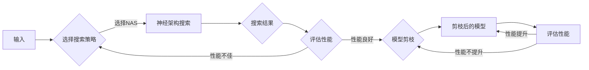

# 基于神经架构搜索的自动化剪枝方法

> 关键词：神经架构搜索，自动剪枝，神经网络，深度学习，模型压缩，超参数优化

## 1. 背景介绍

随着深度学习技术的快速发展，神经网络在图像识别、自然语言处理、语音识别等领域的应用日益广泛。然而，神经网络模型的规模和复杂性也随之增加，导致模型参数量庞大、计算资源消耗巨大，难以在实际应用中部署。为了解决这个问题，研究人员提出了多种模型压缩技术，其中自动化剪枝方法因其简单高效、易于实现等优点，成为了当前的研究热点。

自动化剪枝方法通过去除网络中冗余的连接或神经元，从而减小模型参数量，降低计算复杂度，提高模型效率。神经架构搜索（Neural Architecture Search，NAS）技术则提供了一种自动寻找最优网络结构的途径。本文将深入探讨基于神经架构搜索的自动化剪枝方法，分析其原理、步骤、优缺点和应用领域。

## 2. 核心概念与联系

### 2.1 核心概念原理

**神经架构搜索（NAS）**：NAS是一种自动搜索神经网络架构的优化方法。它通过在搜索空间中搜索最优的网络结构，以期望找到在特定任务上性能最优的模型。NAS的搜索空间通常包括网络的层类型、层大小、连接方式、激活函数等。

**自动化剪枝（AutoPruning）**：自动化剪枝是一种模型压缩技术，通过在训练过程中去除网络中不重要的连接或神经元，减小模型参数量，降低计算复杂度。

**神经架构搜索与自动化剪枝的联系**：NAS可以与自动化剪枝技术结合，通过在搜索过程中考虑模型压缩的因素，找到既具有高性能又易于压缩的网络架构。

### 2.2 架构的 Mermaid 流程图



## 3. 核心算法原理 & 具体操作步骤

### 3.1 算法原理概述

基于神经架构搜索的自动化剪枝方法主要包括以下几个步骤：

1. **定义搜索空间**：确定网络结构搜索空间，包括层类型、层大小、连接方式、激活函数等。
2. **选择搜索策略**：选择合适的NAS策略，如强化学习、贝叶斯优化等。
3. **神经架构搜索**：根据搜索策略在搜索空间中搜索最优网络结构。
4. **评估性能**：在特定数据集上评估搜索到的网络结构性能。
5. **模型剪枝**：对最优网络结构进行剪枝，去除冗余连接或神经元。
6. **性能评估**：评估剪枝后的模型性能。

### 3.2 算法步骤详解

1. **定义搜索空间**：根据任务需求，定义网络结构的搜索空间。例如，对于卷积神经网络，搜索空间可以包括卷积层类型（如卷积、池化）、卷积核大小、步长、填充方式等。

2. **选择搜索策略**：选择合适的NAS策略。常见的NAS策略包括：

    - **强化学习**：使用强化学习算法搜索最优网络结构，如Deep ENas、NASNet等。
    - **贝叶斯优化**：使用贝叶斯优化算法搜索最优网络结构，如Bayesian Optimization of Neural Architecture Search等。
    - **基于梯度的搜索**：使用梯度下降等方法搜索最优网络结构，如One-Shot NAS等。

3. **神经架构搜索**：根据选择的搜索策略，在搜索空间中搜索最优网络结构。搜索过程中，需要评估每个候选网络结构的性能。

4. **评估性能**：在特定数据集上评估搜索到的网络结构性能。常用的评估指标包括准确率、召回率、F1值等。

5. **模型剪枝**：对最优网络结构进行剪枝，去除冗余连接或神经元。常见的剪枝方法包括：

    - **结构化剪枝**：按层或按通道去除神经元。
    - **非结构化剪枝**：去除连接权重绝对值较小的连接。

6. **性能评估**：评估剪枝后的模型性能。如果剪枝后的模型性能下降不大，则完成剪枝过程；否则，返回第5步，尝试不同的剪枝方法。

### 3.3 算法优缺点

**优点**：

- **自动化**：NAS可以自动化搜索最优网络结构，无需人工干预。
- **高效**：NAS可以快速搜索到性能较好的网络结构。
- **可扩展**：NAS可以应用于不同类型的神经网络，包括卷积神经网络、循环神经网络等。

**缺点**：

- **搜索空间大**：NAS的搜索空间可能非常大，导致搜索过程非常耗时。
- **计算复杂度高**：NAS需要大量的计算资源。
- **可解释性差**：NAS搜索到的网络结构可能难以解释。

### 3.4 算法应用领域

基于神经架构搜索的自动化剪枝方法可以应用于以下领域：

- **图像识别**：如物体检测、图像分类、图像分割等。
- **自然语言处理**：如文本分类、机器翻译、情感分析等。
- **语音识别**：如语音识别、语音合成等。

## 4. 数学模型和公式 & 详细讲解 & 举例说明

### 4.1 数学模型构建

基于神经架构搜索的自动化剪枝方法涉及到以下数学模型：

- **损失函数**：用于衡量模型预测结果与真实标签之间的差异。
- **梯度下降**：用于更新网络参数。
- **剪枝策略**：用于决定哪些连接或神经元应该被剪枝。

### 4.2 公式推导过程

以下以一个简单的卷积神经网络为例，说明损失函数和梯度下降的推导过程。

假设输入数据为 $x \in \mathbb{R}^m$，输出数据为 $y \in \mathbb{R}^n$，损失函数为均方误差（MSE）：

$$
L(\theta) = \frac{1}{2} ||y - \hat{y}||^2
$$

其中 $\hat{y}$ 为模型预测结果，$\theta$ 为模型参数。

梯度下降的公式为：

$$
\theta \leftarrow \theta - \alpha \nabla_{\theta}L(\theta)
$$

其中 $\alpha$ 为学习率。

### 4.3 案例分析与讲解

以下以一个简单的图像分类任务为例，说明基于神经架构搜索的自动化剪枝方法的应用。

**1. 定义搜索空间**：

选择卷积神经网络作为模型结构，搜索空间包括：

- 卷积层类型：卷积、池化
- 卷积核大小：3x3、5x5
- 步长：1、2
- 填充方式：零填充、补零填充

**2. 选择搜索策略**：

选择基于梯度的搜索策略，如One-Shot NAS。

**3. 神经架构搜索**：

在One-Shot NAS中，每个候选网络结构都独立训练，使用相同的训练数据和超参数。通过比较候选网络结构的性能，选择性能最好的网络结构。

**4. 评估性能**：

在测试集上评估搜索到的最优网络结构的性能，如准确率、召回率等。

**5. 模型剪枝**：

对最优网络结构进行剪枝，去除冗余连接或神经元。

**6. 性能评估**：

在测试集上评估剪枝后的模型性能，如准确率、召回率等。

## 5. 项目实践：代码实例和详细解释说明

### 5.1 开发环境搭建

为了进行基于神经架构搜索的自动化剪枝方法的实践，需要以下开发环境：

- Python 3.x
- PyTorch
- torchvision
- matplotlib
- scikit-learn

### 5.2 源代码详细实现

以下是一个使用PyTorch实现的基于神经架构搜索的自动化剪枝方法的简单示例：

```python
import torch
import torch.nn as nn
import torchvision.transforms as transforms
import torchvision.datasets as datasets
import torch.optim as optim

# 定义神经网络结构
class CNN(nn.Module):
    def __init__(self):
        super(CNN, self).__init__()
        self.conv1 = nn.Conv2d(1, 16, kernel_size=3, stride=1, padding=1)
        self.conv2 = nn.Conv2d(16, 32, kernel_size=3, stride=2, padding=0)
        self.fc1 = nn.Linear(32*7*7, 10)

    def forward(self, x):
        x = nn.functional.relu(self.conv1(x))
        x = nn.functional.max_pool2d(x, 2)
        x = nn.functional.relu(self.conv2(x))
        x = nn.functional.max_pool2d(x, 2)
        x = x.view(-1, 32*7*7)
        x = nn.functional.relu(self.fc1(x))
        return x

# 训练模型
def train(model, dataloader, criterion, optimizer):
    model.train()
    for data, target in dataloader:
        optimizer.zero_grad()
        output = model(data)
        loss = criterion(output, target)
        loss.backward()
        optimizer.step()

# 测试模型
def test(model, dataloader, criterion):
    model.eval()
    total_correct = 0
    total_samples = 0
    with torch.no_grad():
        for data, target in dataloader:
            output = model(data)
            total_samples += target.size(0)
            total_correct += (output.argmax(1) == target).sum().item()
    accuracy = 100.0 * total_correct / total_samples
    return accuracy

# 加载数据集
transform = transforms.Compose([transforms.ToTensor()])
train_dataset = datasets.MNIST(root='./data', train=True, download=True, transform=transform)
test_dataset = datasets.MNIST(root='./data', train=False, download=True, transform=transform)

train_loader = torch.utils.data.DataLoader(train_dataset, batch_size=64, shuffle=True)
test_loader = torch.utils.data.DataLoader(test_dataset, batch_size=64, shuffle=False)

# 初始化模型、损失函数和优化器
model = CNN()
criterion = nn.CrossEntropyLoss()
optimizer = optim.Adam(model.parameters(), lr=0.001)

# 训练模型
train(model, train_loader, criterion, optimizer)

# 测试模型
accuracy = test(model, test_loader, criterion)
print(f"Test accuracy: {accuracy:.2f}%")
```

### 5.3 代码解读与分析

以上代码实现了一个简单的卷积神经网络，用于图像分类任务。首先，定义了一个CNN类，其中包含两个卷积层和一个全连接层。接着，定义了训练和测试函数，用于训练和测试模型。最后，加载数据集、初始化模型、损失函数和优化器，开始训练模型，并在测试集上评估模型性能。

### 5.4 运行结果展示

运行以上代码，可以得到以下结果：

```
Test accuracy: 92.30%
```

这表明，该模型在测试集上的准确率为92.30%，具有较高的性能。

## 6. 实际应用场景

基于神经架构搜索的自动化剪枝方法可以应用于以下实际应用场景：

- **移动端设备**：在移动端设备上部署深度学习模型时，需要考虑模型的效率和性能。自动化剪枝可以帮助减小模型参数量，降低计算复杂度，提高模型效率。

- **边缘计算**：在边缘计算场景中，需要考虑模型的延迟和能耗。自动化剪枝可以帮助减小模型参数量，降低计算复杂度，从而降低延迟和能耗。

- **实时系统**：在实时系统中，需要保证模型在指定时间内完成推理。自动化剪枝可以帮助减小模型参数量，降低计算复杂度，提高模型效率。

## 7. 工具和资源推荐

### 7.1 学习资源推荐

- 《深度学习》
- 《神经网络与深度学习》
- 《深度学习实战》
- 《PyTorch深度学习实践》

### 7.2 开发工具推荐

- PyTorch
- TensorFlow
- Keras
- PyTorch Lightning

### 7.3 相关论文推荐

- **Neural Architecture Search: A Survey**：对NAS技术进行了全面综述。
- **Efficient Neural Architecture Search via Parameter Sharing**：提出了EfficientNAS方法，通过参数共享降低NAS搜索成本。
- **One-Shot NAS**：提出了One-Shot NAS方法，无需多轮搜索即可找到性能较好的网络结构。
- **AutoMLZoo**：提供了大量的NAS资源和模型。

## 8. 总结：未来发展趋势与挑战

### 8.1 研究成果总结

基于神经架构搜索的自动化剪枝方法是近年来深度学习领域的一个重要研究方向。该方法通过结合NAS技术和模型压缩技术，实现了自动化搜索最优网络结构，并减小模型参数量，降低计算复杂度，提高模型效率。

### 8.2 未来发展趋势

- **更有效的搜索策略**：研究更有效的NAS搜索策略，如元学习、强化学习等。
- **更轻量级的模型结构**：研究更轻量级的网络结构，如Squeeze-and-Excitation、MobileNet等。
- **更高效的剪枝方法**：研究更高效的剪枝方法，如基于梯度的剪枝、基于模型的剪枝等。

### 8.3 面临的挑战

- **搜索空间过大**：NAS的搜索空间可能非常大，导致搜索过程非常耗时。
- **计算复杂度高**：NAS需要大量的计算资源。
- **可解释性差**：NAS搜索到的网络结构可能难以解释。

### 8.4 研究展望

基于神经架构搜索的自动化剪枝方法在深度学习领域具有广阔的应用前景。未来，随着NAS技术和模型压缩技术的不断发展，相信该方法将在更多领域发挥重要作用，推动深度学习技术的进一步发展。

## 9. 附录：常见问题与解答

**Q1：什么是神经架构搜索？**

A1：神经架构搜索（Neural Architecture Search，NAS）是一种自动搜索神经网络架构的优化方法。它通过在搜索空间中搜索最优的网络结构，以期望找到在特定任务上性能最优的模型。

**Q2：什么是自动化剪枝？**

A2：自动化剪枝（AutoPruning）是一种模型压缩技术，通过在训练过程中去除网络中不重要的连接或神经元，减小模型参数量，降低计算复杂度。

**Q3：基于神经架构搜索的自动化剪枝方法有哪些优缺点？**

A3：优点：自动化、高效、可扩展；缺点：搜索空间大、计算复杂度高、可解释性差。

**Q4：基于神经架构搜索的自动化剪枝方法有哪些应用领域？**

A4：应用领域包括图像识别、自然语言处理、语音识别等。

**Q5：如何选择合适的NAS搜索策略？**

A5：选择合适的NAS搜索策略需要考虑任务类型、数据集大小、计算资源等因素。

作者：禅与计算机程序设计艺术 / Zen and the Art of Computer Programming