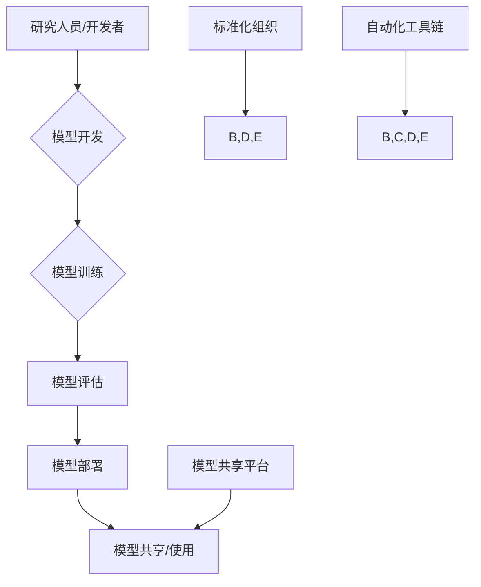

# 基础模型的公共基础设施

> 关键词：基础模型，公共基础设施，模型共享，标准化，自动化，生态系统，机器学习，深度学习

## 1. 背景介绍

随着深度学习技术的迅猛发展，基础模型（Foundation Models）已成为推动人工智能进步的核心动力。基础模型通过在海量数据上进行训练，学习到了丰富的知识和技能，能够完成各种复杂的任务，如自然语言处理、计算机视觉、语音识别等。然而，基础模型的高效利用和普及却面临着一系列挑战，如模型共享的障碍、标准化程度的不足、自动化工具的缺乏等。本文将探讨基础模型的公共基础设施，旨在为这些挑战提供解决方案，并展望未来发展趋势。

### 1.1 问题的由来

#### 1.1.1 模型共享的障碍

基础模型通常需要大量的计算资源和数据集进行训练，这使得模型的开发成本极高。然而，许多研究机构和企业由于资源限制，难以独立构建和维护自己的基础模型。此外，由于缺乏共享机制，即便是拥有资源的机构也可能因为版权、隐私等问题，难以共享自己的模型。

#### 1.1.2 标准化程度的不足

基础模型的训练和应用缺乏统一的标准，不同模型之间的接口、评估方法、部署方式等存在差异，这使得模型的互操作性和可移植性受到限制。

#### 1.1.3 自动化工具的缺乏

基础模型的开发和维护需要复杂的工具链，包括数据预处理、模型训练、评估、部署等。然而，目前市场上缺乏完善的自动化工具，这使得模型开发过程繁琐、效率低下。

### 1.2 研究现状

为了解决上述问题，学术界和产业界都在积极构建基础模型的公共基础设施。以下是一些代表性工作：

- **模型共享平台**：如Hugging Face的Transformers库，提供了一系列预训练模型和训练工具，降低了模型开发的门槛。
- **标准化组织**：如OpenAI、Google AI、微软等，致力于推动基础模型的标准化，以促进模型的可互操作性和可移植性。
- **自动化工具链**：如TensorFlow、PyTorch等深度学习框架，提供了丰富的工具和库，简化了模型的开发、训练和部署过程。

### 1.3 研究意义

构建基础模型的公共基础设施对于人工智能的发展具有重要意义：

- 降低开发门槛：提供共享的模型、数据和工具，降低基础模型的开发门槛，促进人工智能技术的普及。
- 提高效率：简化模型开发流程，提高开发效率，加快人工智能技术的应用。
- 促进创新：促进模型的复用和交叉创新，推动人工智能技术的快速发展。
- 推动标准化：推动基础模型的标准化，提高模型的互操作性和可移植性。

## 2. 核心概念与联系

为了更好地理解基础模型的公共基础设施，本节将介绍几个核心概念及其相互关系。

### 2.1 核心概念

- **基础模型**：指经过大规模数据训练，具备通用能力和迁移能力的模型，如BERT、GPT等。
- **模型共享平台**：指提供模型下载、使用、共享的平台，如Hugging Face的Transformers库。
- **标准化组织**：指推动基础模型标准化的组织，如OpenAI、Google AI、微软等。
- **自动化工具链**：指简化模型开发、训练、评估和部署的自动化工具，如TensorFlow、PyTorch等。

### 2.2 架构流程图

以下是基于基础模型的公共基础设施的Mermaid流程图：



在上述流程图中，研究人员/开发者通过模型开发、训练、评估和部署流程，将模型共享到模型共享平台，供其他研究人员/开发者使用。标准化组织和自动化工具链则为模型开发过程提供支持。

## 3. 核心算法原理 & 具体操作步骤

### 3.1 算法原理概述

基础模型的公共基础设施的核心是提供一套完整的工具链和标准，以简化模型开发、训练、评估和部署过程。

### 3.2 算法步骤详解

#### 3.2.1 模型开发

1. **确定任务**：明确模型的任务目标，如自然语言处理、计算机视觉等。
2. **选择模型**：根据任务需求选择合适的预训练模型。
3. **数据准备**：收集、清洗和预处理数据。
4. **模型调整**：根据任务需求调整模型结构。
5. **模型训练**：使用训练数据训练模型。

#### 3.2.2 模型评估

1. **选择评估指标**：根据任务需求选择合适的评估指标。
2. **评估模型**：在测试集上评估模型性能。
3. **模型优化**：根据评估结果调整模型参数。

#### 3.2.3 模型部署

1. **选择部署平台**：根据应用场景选择合适的部署平台。
2. **模型导出**：将训练好的模型导出为可部署的格式。
3. **模型部署**：将模型部署到部署平台。

#### 3.2.4 模型共享

1. **模型注册**：在模型共享平台上注册模型。
2. **模型分享**：将模型分享给其他研究人员/开发者。

### 3.3 算法优缺点

#### 3.3.1 优点

- 降低开发门槛：提供共享的模型、数据和工具，降低基础模型的开发门槛。
- 提高效率：简化模型开发流程，提高开发效率。
- 促进创新：促进模型的复用和交叉创新。
- 推动标准化：推动基础模型的标准化。

#### 3.3.2 缺点

- 需要高质量的数据和计算资源：模型开发需要高质量的数据和计算资源。
- 标准化程度有限：目前基础模型的标准化程度有限。

### 3.4 算法应用领域

基础模型的公共基础设施适用于所有需要使用基础模型的领域，如自然语言处理、计算机视觉、语音识别等。

## 4. 数学模型和公式 & 详细讲解 & 举例说明

### 4.1 数学模型构建

基础模型的公共基础设施中的数学模型主要包括：

- **损失函数**：用于衡量模型预测值与真实值之间的差异。
- **优化算法**：用于更新模型参数，使得模型预测值更接近真实值。

### 4.2 公式推导过程

#### 4.2.1 损失函数

以交叉熵损失函数为例，其公式如下：

$$
\mathcal{L}(y,\hat{y}) = -[y\log \hat{y} + (1-y)\log (1-\hat{y})]
$$

其中 $y$ 为真实标签，$\hat{y}$ 为模型预测值。

#### 4.2.2 优化算法

以梯度下降算法为例，其公式如下：

$$
\theta = \theta - \alpha \nabla_{\theta}\mathcal{L}(\theta)
$$

其中 $\theta$ 为模型参数，$\alpha$ 为学习率，$\nabla_{\theta}\mathcal{L}(\theta)$ 为损失函数对参数 $\theta$ 的梯度。

### 4.3 案例分析与讲解

以Hugging Face的Transformers库为例，其提供了丰富的预训练模型和训练工具，简化了模型开发过程。

#### 4.3.1 模型选择

```python
from transformers import BertForSequenceClassification

model = BertForSequenceClassification.from_pretrained('bert-base-uncased')
```

#### 4.3.2 数据准备

```python
from transformers import BertTokenizer

tokenizer = BertTokenizer.from_pretrained('bert-base-uncased')

encoded_input = tokenizer("Hello, my dog is cute", return_tensors='pt')
```

#### 4.3.3 模型训练

```python
from transformers import AdamW

optimizer = AdamW(model.parameters(), lr=1e-5)

model.train()
for epoch in range(3):
    for input_ids, labels in dataloader:
        optimizer.zero_grad()
        outputs = model(input_ids, labels=labels)
        loss = outputs.loss
        loss.backward()
        optimizer.step()
```

#### 4.3.4 模型评估

```python
model.eval()
for input_ids, labels in dataloader:
    with torch.no_grad():
        outputs = model(input_ids, labels=labels)
        _, preds = torch.max(outputs.logits, dim=1)
        correct = (preds == labels).sum().item()
```

## 5. 项目实践：代码实例和详细解释说明

### 5.1 开发环境搭建

为了进行基础模型的公共基础设施项目实践，需要以下开发环境：

- Python 3.6或更高版本
- PyTorch或TensorFlow
- Hugging Face的Transformers库

### 5.2 源代码详细实现

以下是一个基于Hugging Face的Transformers库进行模型微调的示例代码：

```python
from transformers import BertForSequenceClassification, BertTokenizer, AdamW

model = BertForSequenceClassification.from_pretrained('bert-base-uncased')
tokenizer = BertTokenizer.from_pretrained('bert-base-uncased')

# 数据准备
train_texts = ["This is a sample text", "Another sample text", ...]
train_labels = [0, 1, ...]

# 编码数据
train_encodings = tokenizer(train_texts, truncation=True, padding=True)

# 创建DataLoader
train_dataloader = DataLoader(train_encodings['input_ids'], train_encodings['attention_mask'], train_labels, batch_size=32, shuffle=True)

# 定义优化器
optimizer = AdamW(model.parameters(), lr=1e-5)

# 训练模型
model.train()
for epoch in range(3):
    for batch in train_dataloader:
        optimizer.zero_grad()
        outputs = model(batch['input_ids'], attention_mask=batch['attention_mask'], labels=batch['labels'])
        loss = outputs.loss
        loss.backward()
        optimizer.step()
```

### 5.3 代码解读与分析

上述代码展示了使用Hugging Face的Transformers库进行BERT模型微调的基本流程。

- 首先，加载预训练的BERT模型和分词器。
- 然后，准备训练数据，包括文本和标签。
- 接着，将文本编码为模型输入格式。
- 创建DataLoader，用于批量加载训练数据。
- 定义优化器，用于更新模型参数。
- 开始训练，通过反向传播更新模型参数。

### 5.4 运行结果展示

在训练过程中，可以使用TensorBoard等工具可视化训练过程中的损失和准确率，以便观察模型性能。

## 6. 实际应用场景

基础模型的公共基础设施在实际应用场景中具有广泛的应用，以下是一些典型的应用场景：

- **自然语言处理**：文本分类、情感分析、机器翻译、问答系统等。
- **计算机视觉**：图像分类、目标检测、图像分割等。
- **语音识别**：语音识别、语音合成等。
- **推荐系统**：个性化推荐、内容推荐等。

## 7. 工具和资源推荐

### 7.1 学习资源推荐

- 《深度学习》
- 《动手学深度学习》
- 《Hugging Face Transformers官方文档》
- 《自然语言处理入门教程》

### 7.2 开发工具推荐

- PyTorch
- TensorFlow
- Hugging Face Transformers
- Jupyter Notebook

### 7.3 相关论文推荐

- BERT: Pre-training of Deep Bidirectional Transformers for Language Understanding
- Generative Adversarial Text to Image Synthesis
- The Lottery Ticket Hypothesis: Finding Sparse, Trainable Neural Networks

## 8. 总结：未来发展趋势与挑战

### 8.1 研究成果总结

本文探讨了基础模型的公共基础设施，分析了其核心概念、算法原理、应用场景等，并推荐了相关学习资源和开发工具。

### 8.2 未来发展趋势

未来，基础模型的公共基础设施将朝着以下方向发展：

- **模型共享机制的完善**：建立更加完善、便捷的模型共享机制，降低模型共享的障碍。
- **标准化程度的提升**：推动基础模型的标准化和规范化，提高模型的互操作性和可移植性。
- **自动化工具链的丰富**：开发更加智能化、自动化的工具链，简化模型开发、训练、评估和部署过程。
- **模型可解释性和安全性**：提高模型的可解释性和安全性，使模型更加可靠和可信。

### 8.3 面临的挑战

尽管基础模型的公共基础设施取得了显著进展，但仍面临以下挑战：

- **数据隐私和安全性**：如何保护数据隐私和安全，防止数据泄露和滥用。
- **模型偏见和歧视**：如何减少模型偏见和歧视，提高模型的公平性和公正性。
- **模型可解释性和透明度**：如何提高模型的可解释性和透明度，增强用户对模型的信任。
- **跨模态和跨领域应用**：如何实现跨模态和跨领域的模型应用，提高模型的通用性。

### 8.4 研究展望

未来，基础模型的公共基础设施研究将朝着以下方向展开：

- **建立更加完善的模型共享平台**：提供更加便捷、安全的模型共享机制。
- **推动基础模型的标准化**：制定统一的模型接口、评估方法和部署规范。
- **开发更加智能化的自动化工具链**：提高模型开发、训练、评估和部署的自动化程度。
- **研究模型的可解释性和安全性**：提高模型的可解释性和安全性，增强用户对模型的信任。

通过不断努力，基础模型的公共基础设施将为人工智能的发展提供更加坚实的基础，推动人工智能技术更好地服务于人类社会。

## 9. 附录：常见问题与解答

### 9.1 问题1：什么是基础模型？

基础模型是指经过大规模数据训练，具备通用能力和迁移能力的模型，如BERT、GPT等。

### 9.2 问题2：什么是模型共享平台？

模型共享平台是指提供模型下载、使用、共享的平台，如Hugging Face的Transformers库。

### 9.3 问题3：如何提高模型的可解释性？

提高模型的可解释性可以通过以下方法：

- 使用可解释性模型，如LIME、SHAP等。
- 对模型进行可视化分析，如可视化模型结构、可视化输入输出等。
- 分析模型的决策过程，如分析模型的注意力机制等。

### 9.4 问题4：如何提高模型的安全性？

提高模型的安全性可以通过以下方法：

- 使用对抗训练，提高模型的鲁棒性。
- 对模型进行安全测试，识别潜在的安全漏洞。
- 对模型进行加密，保护模型免受攻击。

作者：禅与计算机程序设计艺术 / Zen and the Art of Computer Programming