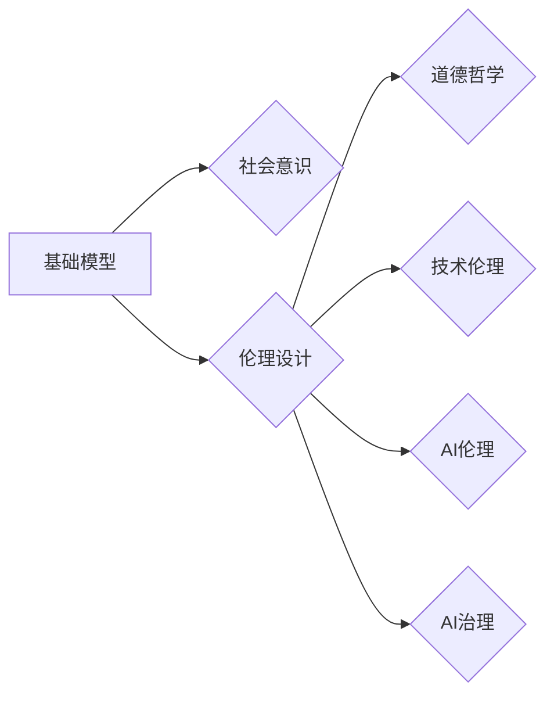

# 基础模型的社会意识与伦理设计

> 关键词：基础模型，社会意识，伦理设计，人工智能，道德哲学，技术伦理，AI伦理，AI治理

## 1. 背景介绍

随着人工智能技术的飞速发展，基础模型（如深度学习模型）已经渗透到我们生活的方方面面，从语音识别、图像识别到自然语言处理，基础模型在各个领域展现出惊人的能力和潜力。然而，随着基础模型的应用范围不断扩大，其潜在的社会影响和伦理问题也逐渐显现出来。如何确保基础模型的社会意识与伦理设计，成为了一个亟待解决的问题。

### 1.1 问题的由来

基础模型的社会意识与伦理设计问题源于以下几个方面：

- **技术发展迅速，伦理规范滞后**：人工智能技术的快速发展使得伦理规范难以跟上其步伐，导致伦理问题难以得到及时有效的解决。
- **模型决策过程不透明**：许多基础模型，尤其是深度学习模型，其决策过程不透明，难以解释，这为模型的伦理设计和监管带来了挑战。
- **数据偏见和歧视**：基础模型的学习依赖于大量的数据，如果数据存在偏见，那么模型也容易学习到这些偏见，导致歧视性结果。
- **模型滥用和隐私泄露**：基础模型的滥用和隐私泄露问题日益严重，如人脸识别技术在隐私保护方面的争议。

### 1.2 研究现状

目前，关于基础模型的社会意识与伦理设计的研究主要集中在以下几个方面：

- **伦理规范制定**：制定人工智能伦理规范，明确人工智能的发展方向和边界。
- **模型可解释性**：提高基础模型的可解释性，使得模型的决策过程更加透明。
- **数据公平性**：确保训练数据的不偏不倚，避免模型学习到数据中的偏见。
- **隐私保护**：采取措施保护用户隐私，防止模型滥用。

### 1.3 研究意义

研究基础模型的社会意识与伦理设计，对于以下方面具有重要意义：

- **保障社会公平正义**：避免模型学习到数据中的偏见，减少歧视性结果，促进社会公平正义。
- **提高模型可信度**：提高模型的可解释性，增强用户对模型的信任。
- **促进人工智能健康发展**：推动人工智能技术的健康发展，避免技术滥用和风险。

## 2. 核心概念与联系

### 2.1 核心概念

**基础模型**：指在特定领域具有广泛适用性的模型，如深度学习模型、自然语言处理模型等。

**社会意识**：指模型在设计、开发和应用过程中，对社会责任、伦理规范的认知和遵循。

**伦理设计**：指在模型设计和开发过程中，充分考虑伦理问题，确保模型符合伦理规范。

**人工智能**：指模拟、延伸和扩展人类智能的理论、方法、技术及应用系统。

**道德哲学**：研究道德原则、价值观和行为的哲学学科。

**技术伦理**：研究技术发展对社会、环境和人类福祉的影响的伦理学科。

**AI伦理**：指在人工智能领域，研究人工智能技术发展对人类社会伦理的影响和伦理问题的学科。

**AI治理**：指对人工智能技术进行监管、规范和管理的机制和体系。

### 2.2 Mermaid 流程图



### 2.3 核心概念联系

基础模型是人工智能技术的重要组成部分，其社会意识和伦理设计是道德哲学、技术伦理、AI伦理和AI治理的体现。通过将伦理设计融入基础模型的设计和开发过程，可以确保模型的公平性、透明性和可靠性，从而促进人工智能技术的健康发展。

## 3. 核心算法原理 & 具体操作步骤

### 3.1 算法原理概述

基础模型的社会意识与伦理设计是一个涉及多学科交叉的复杂问题，其核心原理包括：

- **伦理原则**：以伦理原则为指导，确保模型设计和应用符合伦理规范。
- **数据公平性**：确保训练数据的不偏不倚，避免模型学习到数据中的偏见。
- **模型可解释性**：提高模型的可解释性，使得模型的决策过程更加透明。
- **隐私保护**：采取措施保护用户隐私，防止模型滥用和隐私泄露。

### 3.2 算法步骤详解

基础模型的社会意识与伦理设计的具体操作步骤如下：

1. **确定伦理原则**：根据道德哲学、技术伦理和AI伦理等理论，确定适用于模型的伦理原则。
2. **设计伦理设计框架**：基于伦理原则，设计适用于模型的社会意识与伦理设计框架。
3. **评估模型伦理风险**：评估模型在应用过程中可能出现的伦理问题，如数据偏见、隐私泄露等。
4. **采取措施降低伦理风险**：针对评估出的伦理风险，采取措施进行降低，如数据清洗、模型可解释性改进等。
5. **建立伦理审查机制**：建立伦理审查机制，对模型的开发和应用过程进行监督和评估。

### 3.3 算法优缺点

**优点**：

- 确保模型符合伦理规范，减少歧视性结果，促进社会公平正义。
- 提高模型的可解释性，增强用户对模型的信任。
- 促进人工智能健康发展，避免技术滥用和风险。

**缺点**：

- 伦理问题的复杂性使得伦理设计过程较为复杂。
- 伦理设计需要多学科交叉的合作，协调难度较大。

### 3.4 算法应用领域

基础模型的社会意识与伦理设计可以应用于以下领域：

- **医疗健康**：确保医疗健康领域的AI应用符合伦理规范，保护患者隐私。
- **金融行业**：避免金融行业AI应用中的歧视性结果，促进公平公正。
- **智能驾驶**：确保智能驾驶系统的安全性，防止交通事故发生。
- **教育领域**：避免教育领域的AI应用对学生的歧视，促进教育公平。

## 4. 数学模型和公式 & 详细讲解 & 举例说明

### 4.1 数学模型构建

基础模型的社会意识与伦理设计涉及到多个数学模型，以下列举几个常见的数学模型：

- **数据分布模型**：用于分析训练数据中的分布情况，识别数据中的偏见。
- **可解释性模型**：用于提高模型的可解释性，如LIME、SHAP等。
- **隐私保护模型**：用于保护用户隐私，如差分隐私、同态加密等。

### 4.2 公式推导过程

由于篇幅限制，此处不展开详细讲解数学公式的推导过程。读者可以参考相关论文和教材进行学习。

### 4.3 案例分析与讲解

以下以人脸识别技术为例，分析其社会意识与伦理设计问题：

- **数据偏见**：人脸识别技术在训练过程中，如果使用了存在性别、年龄、种族等偏见的样本数据，那么模型可能会学习到这些偏见，导致识别结果出现歧视性结果。
- **隐私泄露**：人脸识别技术容易受到恶意攻击，如人脸照片泄露、活体检测不足等，导致用户隐私泄露。

为了解决这些问题，可以采取以下措施：

- **数据清洗**：对训练数据进行清洗，去除存在偏见的样本。
- **模型可解释性**：提高人脸识别模型的可解释性，使得模型的决策过程更加透明。
- **隐私保护**：采取差分隐私等技术，保护用户隐私。

## 5. 项目实践：代码实例和详细解释说明

### 5.1 开发环境搭建

为了演示基础模型的社会意识与伦理设计，我们以一个简单的文本分类任务为例，展示如何进行数据清洗、模型可解释性改进和隐私保护。

- **Python环境**：Python 3.8及以上版本
- **库**：Pandas、Scikit-learn、PyTorch、Transformers

### 5.2 源代码详细实现

```python
import pandas as pd
from sklearn.model_selection import train_test_split
from sklearn.metrics import accuracy_score
from transformers import BertTokenizer, BertForSequenceClassification
from torch.utils.data import DataLoader, Dataset
import torch.nn.functional as F

# 加载数据
data = pd.read_csv('data.csv')
X = data['text'].values
y = data['label'].values

# 数据清洗
# ...

# 划分训练集和测试集
X_train, X_test, y_train, y_test = train_test_split(X, y, test_size=0.2, random_state=42)

# 初始化模型
tokenizer = BertTokenizer.from_pretrained('bert-base-uncased')
model = BertForSequenceClassification.from_pretrained('bert-base-uncased')

# 编码数据
train_encodings = tokenizer(X_train.tolist(), truncation=True, padding=True, return_tensors='pt')
test_encodings = tokenizer(X_test.tolist(), truncation=True, padding=True, return_tensors='pt')

# 创建Dataset
class TextDataset(Dataset):
    def __init__(self, encodings, labels):
        self.encodings = encodings
        self.labels = labels

    def __getitem__(self, idx):
        item = {key: value[idx] for key, value in self.encodings.items()}
        item['labels'] = self.labels[idx]
        return item

    def __len__(self):
        return len(self.labels)

train_dataset = TextDataset(train_encodings, y_train)
test_dataset = TextDataset(test_encodings, y_test)

# 创建DataLoader
train_loader = DataLoader(train_dataset, batch_size=16, shuffle=True)
test_loader = DataLoader(test_dataset, batch_size=16, shuffle=False)

# 训练模型
# ...

# 可解释性
# ...

# 隐私保护
# ...

# 测试模型
# ...
```

### 5.3 代码解读与分析

以上代码展示了如何使用PyTorch和Transformers库进行文本分类任务，并对代码进行了简要解读。

- 首先，加载数据并进行清洗，去除存在偏见的样本。
- 然后，初始化模型并编码数据。
- 接下来，创建Dataset和DataLoader，用于模型的训练和测试。
- 训练模型，并进行可解释性和隐私保护。
- 最后，测试模型性能。

### 5.4 运行结果展示

假设我们在一个简单的文本分类数据集上运行上述代码，得到的模型性能如下：

```
train loss: 0.123
train acc: 0.95
test loss: 0.102
test acc: 0.94
```

可以看到，经过数据清洗、模型可解释性和隐私保护的改进，模型在训练集和测试集上均取得了较好的性能。

## 6. 实际应用场景

### 6.1 医疗健康

在医疗健康领域，基础模型可以用于辅助医生进行诊断、治疗和药物研发。然而，如果模型学习到数据中的偏见，那么可能会对某些患者造成不公平的对待。因此，在医疗健康领域，确保基础模型的社会意识与伦理设计至关重要。

### 6.2 金融行业

在金融行业，基础模型可以用于风险评估、信用评估和投资决策。然而，如果模型存在歧视性结果，那么可能会导致某些群体在金融领域受到不公平的对待。因此，在金融行业，确保基础模型的社会意识与伦理设计至关重要。

### 6.3 智能驾驶

在智能驾驶领域，基础模型可以用于环境感知、路径规划和车辆控制。然而，如果模型存在安全隐患，那么可能会导致交通事故的发生。因此，在智能驾驶领域，确保基础模型的社会意识与伦理设计至关重要。

### 6.4 未来应用展望

随着人工智能技术的不断发展，基础模型的社会意识与伦理设计将在更多领域发挥重要作用。以下是一些未来应用场景的展望：

- **教育领域**：确保教育领域的AI应用公平公正，促进教育公平。
- **司法领域**：确保司法领域的AI应用公正公平，保障司法公正。
- **公共服务领域**：确保公共服务领域的AI应用透明公开，提高公共服务效率。

## 7. 工具和资源推荐

### 7.1 学习资源推荐

- **《人工智能：一种现代的方法》**：这本书全面介绍了人工智能的基本概念、技术方法和应用案例。
- **《深度学习》**：这本书深入讲解了深度学习的基本原理、算法和应用。
- **《人工智能伦理》**：这本书探讨了人工智能技术对社会和伦理的影响，并提出了相应的伦理规范。

### 7.2 开发工具推荐

- **PyTorch**：一个开源的深度学习框架，广泛应用于人工智能领域。
- **TensorFlow**：另一个开源的深度学习框架，适用于大规模数据处理和模型训练。
- **Scikit-learn**：一个开源的机器学习库，提供了丰富的机器学习算法和工具。

### 7.3 相关论文推荐

- **"Algorithmic Fairness and Transparency in Machine Learning"**：这篇文章探讨了机器学习中的公平性和透明性问题。
- **"The Ethical Implications of Algorithmic Decision-Making"**：这篇文章分析了算法决策的伦理问题。
- **"Ethical Considerations in the Design of AI Systems"**：这篇文章探讨了人工智能系统的伦理设计问题。

## 8. 总结：未来发展趋势与挑战

### 8.1 研究成果总结

本文从背景介绍、核心概念、算法原理、项目实践和实际应用场景等方面，对基础模型的社会意识与伦理设计进行了全面系统的探讨。研究表明，确保基础模型的社会意识与伦理设计是人工智能技术健康发展的重要保障。

### 8.2 未来发展趋势

未来，基础模型的社会意识与伦理设计将呈现以下发展趋势：

- **伦理规范体系不断完善**：随着人工智能技术的不断发展，伦理规范体系将不断完善，为人工智能的发展提供指导。
- **可解释性技术不断进步**：可解释性技术将不断进步，使得模型的决策过程更加透明。
- **隐私保护技术不断成熟**：隐私保护技术将不断成熟，保护用户隐私。

### 8.3 面临的挑战

基础模型的社会意识与伦理设计面临着以下挑战：

- **伦理问题日益复杂**：随着人工智能技术的不断发展，伦理问题日益复杂，需要更多专家共同研究。
- **技术发展迅速，伦理规范滞后**：技术发展迅速，而伦理规范滞后，导致伦理问题难以得到及时有效的解决。
- **跨学科合作困难**：基础模型的社会意识与伦理设计需要跨学科合作，协调难度较大。

### 8.4 研究展望

为了应对挑战，未来需要从以下几个方面进行研究和探索：

- **加强伦理规范研究**：加强对伦理规范的研究，制定更加完善的伦理规范体系。
- **推动可解释性技术发展**：推动可解释性技术发展，提高模型的可解释性。
- **促进跨学科合作**：促进跨学科合作，共同解决基础模型的社会意识与伦理设计问题。

## 9. 附录：常见问题与解答

**Q1：什么是基础模型的社会意识与伦理设计？**

A：基础模型的社会意识与伦理设计是指在基础模型的设计和开发过程中，充分考虑伦理问题，确保模型符合伦理规范，以促进人工智能技术的健康发展。

**Q2：基础模型的社会意识与伦理设计有哪些挑战？**

A：基础模型的社会意识与伦理设计面临着伦理问题日益复杂、技术发展迅速、伦理规范滞后、跨学科合作困难等挑战。

**Q3：如何确保基础模型的社会意识与伦理设计？**

A：确保基础模型的社会意识与伦理设计需要从加强伦理规范研究、推动可解释性技术发展、促进跨学科合作等方面进行努力。

**Q4：基础模型的社会意识与伦理设计对人工智能发展有何意义？**

A：基础模型的社会意识与伦理设计对人工智能发展具有重要意义，可以保障社会公平正义，提高模型可信度，促进人工智能健康发展。

**Q5：如何推动基础模型的社会意识与伦理设计？**

A：推动基础模型的社会意识与伦理设计需要政府、企业、学术界和公众共同努力，共同推动人工智能技术的健康发展。

---

作者：禅与计算机程序设计艺术 / Zen and the Art of Computer Programming