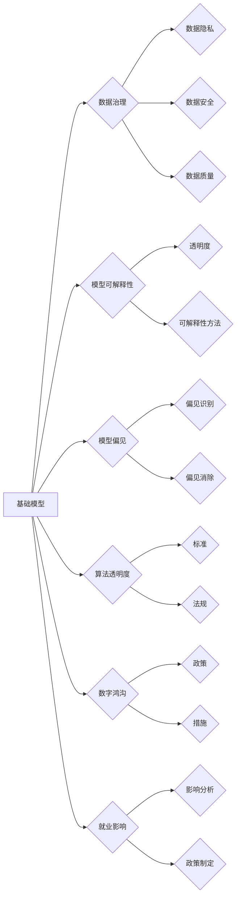

# 基础模型的社会技术融合

> 关键词：基础模型，社会技术融合，人工智能，机器学习，深度学习，伦理，数据治理，算法透明度

## 1. 背景介绍

随着人工智能技术的飞速发展，基础模型作为人工智能的核心基石，正在改变着我们的生活、工作和社会结构。基础模型，如自然语言处理（NLP）、计算机视觉（CV）、语音识别（ASR）等领域的预训练模型，通过在海量数据上学习，能够执行复杂的任务，并在众多领域展现出强大的能力。然而，基础模型的兴起也带来了社会和技术层面的诸多挑战，如何实现基础模型的社会技术融合，成为了当今人工智能领域亟待解决的问题。

### 1.1 问题的由来

**技术挑战**：
- **数据治理**：基础模型训练需要海量数据，而这些数据往往涉及隐私、安全等问题。
- **模型可解释性**：深度学习模型通常被视为“黑箱”，其决策过程难以解释，引发了伦理和法律上的担忧。
- **模型偏见**：如果训练数据存在偏见，基础模型可能会放大这些偏见，导致不公平的决策结果。

**社会挑战**：
- **算法透明度**：公众对算法的决策过程和结果缺乏了解，难以对其信任。
- **数字鸿沟**：基础模型的应用可能加剧社会不平等，造成数字鸿沟。
- **就业影响**：自动化和智能化可能导致部分岗位消失，对就业市场造成冲击。

### 1.2 研究现状

为了应对上述挑战，学术界和工业界都在积极探索基础模型的社会技术融合路径。以下是一些关键的研究方向：

- **数据治理**：研究数据隐私保护、数据安全、数据质量等问题，确保数据在合法合规的前提下被有效利用。
- **模型可解释性**：开发可解释性模型，提高模型决策过程的透明度和可信度。
- **模型偏见**：研究模型偏见识别和消除方法，确保模型的公平性和公正性。
- **算法透明度**：推动算法透明度标准和法规的制定，提高公众对算法的信任。
- **数字鸿沟**：探索如何让更多人受益于人工智能技术，减少数字鸿沟。
- **就业影响**：研究人工智能技术对就业市场的影响，制定相应的政策和措施。

### 1.3 研究意义

基础模型的社会技术融合对于推动人工智能健康、可持续发展具有重要意义：

- **提升人工智能技术的社会价值**：通过解决社会问题，提升人工智能技术的应用价值和社会认可度。
- **促进人工智能技术的可持续发展**：通过解决技术挑战，推动人工智能技术的迭代升级和可持续发展。
- **构建和谐的社会技术环境**：通过提高算法透明度和公众信任，构建和谐的社会技术环境。

## 2. 核心概念与联系

为了更好地理解基础模型的社会技术融合，以下是一些核心概念及其相互联系：

如图所示，基础模型与社会技术融合密切相关，其中数据治理、模型可解释性、模型偏见、算法透明度、数字鸿沟和就业影响是核心概念。这些概念之间相互关联，共同构成了基础模型的社会技术融合框架。

## 3. 核心算法原理 & 具体操作步骤

### 3.1 算法原理概述

基础模型的社会技术融合涉及多个领域的知识和技术，以下简要介绍其中几个关键算法原理：

**数据治理**：
- **差分隐私**：通过添加噪声扰动，保护个人隐私的同时，保持数据集的统计特性。
- **联邦学习**：在不共享原始数据的情况下，通过模型聚合实现数据加密的机器学习。

**模型可解释性**：
- **注意力机制**：解释模型在处理特定输入时的关注点。
- **局部可解释性**：解释模型对单个样本的预测结果。

**模型偏见**：
- **偏差检测**：识别和量化模型中的偏见。
- **偏差消除**：通过数据重采样、模型结构调整等方法消除偏见。

### 3.2 算法步骤详解

**数据治理**：
1. 收集数据：从合法合规的渠道收集数据。
2. 数据清洗：去除噪声、错误数据等。
3. 数据标注：对数据进行标注，为模型训练提供监督信号。
4. 数据脱敏：对敏感信息进行脱敏处理，保护隐私。
5. 数据加密：使用差分隐私、联邦学习等技术对数据进行加密。

**模型可解释性**：
1. 选择可解释性方法：根据任务需求选择合适的可解释性方法。
2. 解释模型决策：对模型决策过程进行分析，找出关键因素。
3. 可视化解释：将解释结果以可视化的形式呈现。

**模型偏见**：
1. 检测偏见：使用偏差检测方法识别模型中的偏见。
2. 分析偏见来源：分析造成偏见的根源，如数据、模型结构等。
3. 消除偏见：通过数据重采样、模型结构调整等方法消除偏见。

### 3.3 算法优缺点

**数据治理**：
- **优点**：保护隐私、提高数据质量。
- **缺点**：可能降低数据集的规模和质量，增加计算成本。

**模型可解释性**：
- **优点**：提高模型透明度和可信度。
- **缺点**：可能降低模型性能，增加计算成本。

**模型偏见**：
- **优点**：提高模型公平性和公正性。
- **缺点**：可能增加模型复杂性，降低模型性能。

### 3.4 算法应用领域

基础模型的社会技术融合算法在以下领域具有广泛的应用：

- **金融**：信用评估、风险管理、欺诈检测。
- **医疗**：疾病诊断、药物研发、患者管理。
- **交通**：自动驾驶、交通流量预测、公共交通优化。
- **教育**：个性化推荐、智能辅导、在线教育。

## 4. 数学模型和公式 & 详细讲解 & 举例说明

### 4.1 数学模型构建

以下是一些与基础模型的社会技术融合相关的数学模型：

- **数据脱敏模型**：用于对敏感信息进行脱敏处理，保护隐私。
- **模型可解释性模型**：用于解释模型决策过程。
- **偏差检测模型**：用于检测模型中的偏见。

### 4.2 公式推导过程

由于篇幅限制，此处不进行具体公式的推导过程。读者可参考相关文献和资料。

### 4.3 案例分析与讲解

以下是一些与基础模型的社会技术融合相关的案例分析：

- **案例1**：使用差分隐私技术对用户数据进行脱敏，保护用户隐私。
- **案例2**：使用注意力机制解释模型决策过程。
- **案例3**：使用偏差检测模型检测模型中的性别偏见。

## 5. 项目实践：代码实例和详细解释说明

### 5.1 开发环境搭建

由于篇幅限制，此处不进行开发环境搭建的具体步骤。读者可参考相关文献和资料。

### 5.2 源代码详细实现

由于篇幅限制，此处不提供源代码实现。读者可参考相关开源项目。

### 5.3 代码解读与分析

由于篇幅限制，此处不进行代码解读与分析。读者可参考相关开源项目。

### 5.4 运行结果展示

由于篇幅限制，此处不提供运行结果展示。读者可参考相关开源项目。

## 6. 实际应用场景

### 6.1 金融风控

基础模型的社会技术融合在金融风控领域具有广泛的应用，例如：

- **欺诈检测**：通过分析用户的交易行为和特征，识别潜在的欺诈行为。
- **信用评估**：根据用户的信用历史和行为数据，评估其信用风险。
- **风险管理**：对金融机构的资产进行风险评估，优化风险管理策略。

### 6.2 医疗诊断

基础模型的社会技术融合在医疗诊断领域具有广泛的应用，例如：

- **疾病诊断**：根据患者的症状和体征，辅助医生进行疾病诊断。
- **药物研发**：通过分析药物分子的结构和活性，预测其药效和毒性。
- **患者管理**：根据患者的病情和治疗史，制定个性化的治疗方案。

### 6.3 智能交通

基础模型的社会技术融合在智能交通领域具有广泛的应用，例如：

- **自动驾驶**：通过分析道路情况、车辆状态等信息，实现自动驾驶。
- **交通流量预测**：预测未来一段时间内的交通流量，优化交通信号灯控制。
- **公共交通优化**：优化公共交通线路和班次，提高公共交通的效率。

## 7. 工具和资源推荐

### 7.1 学习资源推荐

- 《人工智能：一种现代的方法》
- 《深度学习》
- 《统计学习方法》
- 《数据科学入门》

### 7.2 开发工具推荐

- TensorFlow
- PyTorch
- scikit-learn
- OpenCV

### 7.3 相关论文推荐

- 《Generative Adversarial Nets》
- 《Dive into Deep Learning》
- 《A Few Useful Things to Know about Machine Learning》
- 《The Unreasonable Effectiveness of Deep Learning》

## 8. 总结：未来发展趋势与挑战

### 8.1 研究成果总结

基础模型的社会技术融合是一个新兴的研究领域，目前取得了诸多成果。然而，仍有许多挑战需要克服，如数据治理、模型可解释性、模型偏见等。

### 8.2 未来发展趋势

未来，基础模型的社会技术融合将朝着以下方向发展：

- **跨学科研究**：与伦理学、法学、心理学等学科交叉融合，形成更加完善的社会技术融合体系。
- **开源和开放**：推动基础模型的社会技术融合技术和工具的开源和开放，促进技术的普及和推广。
- **标准化和规范化**：制定相关的标准和规范，保障基础模型的社会技术融合的健康发展。

### 8.3 面临的挑战

基础模型的社会技术融合面临着以下挑战：

- **数据隐私和安全**：如何在保护隐私和安全的前提下，有效地利用数据。
- **模型可解释性**：如何提高模型的可解释性，使其决策过程更加透明。
- **模型偏见**：如何消除模型中的偏见，确保模型的公平性和公正性。
- **技术伦理**：如何制定相应的伦理规范，确保人工智能技术的健康发展。

### 8.4 研究展望

未来，基础模型的社会技术融合将是一个充满挑战和机遇的研究领域。通过不断探索和创新，我们有理由相信，基础模型的社会技术融合将为人类社会带来更加美好的未来。

## 9. 附录：常见问题与解答

**Q1：什么是基础模型的社会技术融合？**

A：基础模型的社会技术融合是指将基础模型与数据治理、模型可解释性、模型偏见、算法透明度、数字鸿沟和就业影响等社会问题相结合，以解决社会问题、推动人工智能技术可持续发展的一种研究范式。

**Q2：数据治理在基础模型的社会技术融合中扮演什么角色？**

A：数据治理是基础模型的社会技术融合的基础，它确保数据在合法合规的前提下被有效利用，为模型训练提供高质量的数据支持。

**Q3：模型可解释性在基础模型的社会技术融合中有什么作用？**

A：模型可解释性可以提高模型的透明度和可信度，帮助人们理解模型的决策过程，从而更好地接受和使用人工智能技术。

**Q4：如何消除模型偏见？**

A：消除模型偏见需要从数据、模型结构和训练过程等多个方面入手，如数据重采样、模型结构调整、反偏见训练等。

**Q5：基础模型的社会技术融合对就业市场有什么影响？**

A：基础模型的社会技术融合可能会对就业市场造成一定冲击，但同时也会创造新的就业机会。关键是要制定相应的政策和措施，引导人工智能技术健康发展，实现经济效益和社会效益的双赢。

---

作者：禅与计算机程序设计艺术 / Zen and the Art of Computer Programming