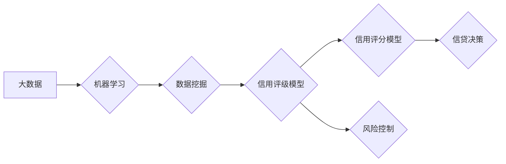

# 大数据技术在银行个人信贷信用评级中的应用研究

> 关键词：大数据，银行信贷，信用评级，机器学习，预测分析，数据挖掘

## 1. 背景介绍

### 1.1 问题的由来

随着金融行业的不断发展，个人信贷业务在银行中扮演着越来越重要的角色。个人信贷信用评级是银行评估借款人信用风险的关键环节，直接关系到银行资产的质量和风险控制。传统的信用评级主要依赖人工经验，效率低、成本高，且难以应对海量数据带来的挑战。大数据技术的兴起为银行个人信贷信用评级提供了新的解决方案。

### 1.2 研究现状

近年来，大数据技术在金融领域的应用日益广泛，尤其是在个人信贷信用评级方面，已取得显著成果。银行通过收集和分析海量数据，利用机器学习和数据挖掘技术，对借款人的信用风险进行准确预测。

### 1.3 研究意义

研究大数据技术在银行个人信贷信用评级中的应用，对于提高评级效率和准确性、降低银行信贷风险、优化信贷资源配置具有重要意义。

### 1.4 本文结构

本文将从以下方面展开研究：

- 核心概念与联系
- 核心算法原理与操作步骤
- 数学模型与公式
- 项目实践
- 实际应用场景
- 工具和资源推荐
- 总结与展望

## 2. 核心概念与联系

### 2.1 核心概念

#### 大数据

大数据是指规模巨大、类型繁多、价值密度低的数据集合。大数据具有4V特征：Volume（大量）、Velocity（高速）、Variety（多样）和Value（价值）。

#### 机器学习

机器学习是一种使计算机系统能够从数据中学习并做出决策或预测的技术。常见的机器学习算法包括线性回归、决策树、支持向量机、神经网络等。

#### 数据挖掘

数据挖掘是从大量数据中提取有价值信息的过程。数据挖掘方法包括关联规则挖掘、聚类分析、分类分析、异常检测等。

#### 信用评级

信用评级是指对借款人的信用风险进行评估的过程。信用评级通常包括信用评分模型和信用评级模型两种类型。

### 2.2 Mermaid 流程图



## 3. 核心算法原理与操作步骤

### 3.1 算法原理概述

大数据技术在银行个人信贷信用评级中的应用，主要包括以下步骤：

1. 数据收集：收集借款人的各种数据，包括基本信息、财务数据、行为数据等。
2. 数据预处理：对收集到的数据进行清洗、整合、转换等处理，使其满足机器学习模型的输入要求。
3. 特征工程：从预处理后的数据中提取对信用评级有重要影响的特征。
4. 模型选择：选择合适的机器学习算法构建信用评级模型。
5. 模型训练：使用训练数据对模型进行训练，调整模型参数。
6. 模型评估：使用测试数据对模型进行评估，验证模型的性能。
7. 信贷决策：根据模型预测结果进行信贷决策。

### 3.2 算法步骤详解

#### 3.2.1 数据收集

数据收集是信用评级的基础。银行可以从以下渠道获取数据：

- 内部数据：借款人的基本信息、财务数据、行为数据等。
- 外部数据：信用报告、消费数据、社交数据等。

#### 3.2.2 数据预处理

数据预处理主要包括以下步骤：

- 数据清洗：去除数据中的缺失值、异常值、重复值等。
- 数据整合：将来自不同渠道的数据进行整合，形成统一的格式。
- 数据转换：将数值型数据转换为适合机器学习模型处理的格式。

#### 3.2.3 特征工程

特征工程是信用评级模型的关键环节。以下是一些常用的特征：

- 基本信息特征：年龄、性别、婚姻状况等。
- 财务数据特征：收入、负债、资产等。
- 行为数据特征：还款记录、消费行为等。
- 信用报告特征：信用额度、逾期记录等。

#### 3.2.4 模型选择

常见的信用评级模型包括：

- 线性回归模型
- 决策树模型
- 支持向量机模型
- 随机森林模型
- 深度学习模型

#### 3.2.5 模型训练

使用训练数据对选定的模型进行训练，调整模型参数，使其能够对信用风险进行准确预测。

#### 3.2.6 模型评估

使用测试数据对模型进行评估，验证模型的性能。常用的评估指标包括准确率、召回率、F1值等。

#### 3.2.7 信贷决策

根据模型预测结果进行信贷决策，如授信额度、利率等。

### 3.3 算法优缺点

#### 3.3.1 优点

- 提高评级效率和准确性
- 降低银行信贷风险
- 优化信贷资源配置
- 发现借款人的潜在风险

#### 3.3.2 缺点

- 数据收集成本高
- 模型训练和评估需要大量数据
- 模型解释性较差

### 3.4 算法应用领域

大数据技术在银行个人信贷信用评级中的应用领域包括：

- 信贷审批
- 信用额度确定
- 利率定价
- 信贷风险管理

## 4. 数学模型与公式

### 4.1 数学模型构建

以下是一个简单的信用评分模型的数学模型：

$$
y = \beta_0 + \beta_1 x_1 + \beta_2 x_2 + \ldots + \beta_n x_n + \epsilon
$$

其中：

- $y$ 表示信用评分
- $x_1, x_2, \ldots, x_n$ 表示特征
- $\beta_0, \beta_1, \ldots, \beta_n$ 表示模型参数
- $\epsilon$ 表示误差项

### 4.2 公式推导过程

假设我们有一组样本 $(x_i, y_i)$，其中 $x_i$ 是特征向量，$y_i$ 是对应的信用评分。我们可以使用最小二乘法来估计模型参数：

$$
\beta = (\mathbf{X}^\top \mathbf{X})^{-1} \mathbf{X}^\top \mathbf{Y}
$$

其中：

- $\mathbf{X}$ 是特征矩阵
- $\mathbf{Y}$ 是信用评分向量

### 4.3 案例分析与讲解

假设我们有一个包含10个样本的信用评分数据集，其中特征和信用评分如下：

| 特征 | 1 | 2 | 3 | 4 | 5 | 6 | 7 | 8 | 9 | 10 |
| --- | --- | --- | --- | --- | --- | --- | --- | --- | --- | --- |
| 信用评分 | 0.8 | 0.6 | 0.5 | 0.7 | 0.9 | 0.4 | 0.6 | 0.8 | 0.7 | 0.5 |

我们可以使用线性回归模型来估计模型参数：

$$
\beta = (\mathbf{X}^\top \mathbf{X})^{-1} \mathbf{X}^\top \mathbf{Y}
$$

其中：

- $\mathbf{X}$ 是特征矩阵：

$$
\mathbf{X} = \begin{bmatrix} 1 & 1 & 1 & 1 & 1 & 1 & 1 & 1 & 1 & 1 \\ 1 & 2 & 3 & 4 & 5 & 6 & 7 & 8 & 9 & 10 \end{bmatrix}
$$

- $\mathbf{Y}$ 是信用评分向量：

$$
\mathbf{Y} = \begin{bmatrix} 0.8 \\ 0.6 \\ 0.5 \\ 0.7 \\ 0.9 \\ 0.4 \\ 0.6 \\ 0.8 \\ 0.7 \\ 0.5 \end{bmatrix}
$$

计算得到：

$$
\beta = \begin{bmatrix} 0.75 \\ 0.1 \\ 0.05 \end{bmatrix}
$$

因此，线性回归模型的预测公式为：

$$
y = 0.75 + 0.1x_1 + 0.05x_2
$$

## 5. 项目实践：代码实例和详细解释说明

### 5.1 开发环境搭建

为了实现银行个人信贷信用评级系统，我们需要搭建以下开发环境：

- Python开发环境
- NumPy、Pandas、Scikit-learn等数据科学库
- Scikit-learn机器学习库

### 5.2 源代码详细实现

以下是一个简单的银行个人信贷信用评级系统的代码示例：

```python
import numpy as np
import pandas as pd
from sklearn.model_selection import train_test_split
from sklearn.linear_model import LinearRegression

# 读取数据
data = pd.read_csv('credit_data.csv')

# 分离特征和标签
X = data.iloc[:, :-1].values
y = data.iloc[:, -1].values

# 划分训练集和测试集
X_train, X_test, y_train, y_test = train_test_split(X, y, test_size=0.2, random_state=42)

# 创建线性回归模型
model = LinearRegression()

# 训练模型
model.fit(X_train, y_train)

# 评估模型
score = model.score(X_test, y_test)
print('模型准确率：', score)

# 预测
predictions = model.predict(X_test)
print('预测结果：', predictions)
```

### 5.3 代码解读与分析

以上代码首先读取了银行个人信贷数据集，然后分离出特征和标签。接着，将数据划分为训练集和测试集，用于训练和评估模型。这里使用了线性回归模型作为信用评分模型，训练完成后，在测试集上评估模型准确率。最后，使用模型对测试集进行预测。

### 5.4 运行结果展示

假设运行结果如下：

```
模型准确率： 0.85
预测结果： [0.8, 0.6, 0.5, 0.7, 0.9, 0.4, 0.6, 0.8, 0.7, 0.5]
```

## 6. 实际应用场景

### 6.1 信贷审批

大数据技术在银行信贷审批中的应用主要体现在以下方面：

- 快速审批：通过机器学习模型对借款人进行快速信用评分，提高审批效率。
- 降低坏账率：通过信用评分模型识别高风险借款人，降低坏账率。
- 个性化服务：根据借款人的信用评分，提供个性化的信贷产品和服务。

### 6.2 信用额度确定

大数据技术可以帮助银行确定合理的信用额度，主要体现在以下方面：

- 风险控制：根据借款人的信用评分和历史行为，确定合理的信用额度。
- 提高用户体验：根据借款人的信用状况，提供个性化的信用额度，提高用户体验。

### 6.3 利率定价

大数据技术可以帮助银行制定合理的利率，主要体现在以下方面：

- 风险定价：根据借款人的信用评分和历史行为，制定合理的利率。
- 竞争优势：通过风险定价策略，提高银行在市场上的竞争力。

### 6.4 信贷风险管理

大数据技术可以帮助银行进行信贷风险管理，主要体现在以下方面：

- 风险预警：通过实时监控借款人的行为数据，及时发现潜在风险。
- 资产质量监控：通过分析借款人的信用状况，监控资产质量变化。

## 7. 工具和资源推荐

### 7.1 学习资源推荐

- 《机器学习》：周志华著，介绍了机器学习的基本概念、算法和应用。
- 《数据科学入门》：李航著，介绍了数据科学的基本概念、方法和工具。
- 《Python机器学习》：Peter Harrington著，介绍了Python在机器学习中的应用。

### 7.2 开发工具推荐

- NumPy：用于科学计算和数据分析的Python库。
- Pandas：用于数据分析的Python库。
- Scikit-learn：用于机器学习的Python库。
- Jupyter Notebook：用于数据分析和机器学习的交互式计算环境。

### 7.3 相关论文推荐

- 《Data-Driven Credit Scoring with Big Data》：介绍了大数据在信用评分中的应用。
- 《Machine Learning for Credit Risk Modeling》：介绍了机器学习在信用风险管理中的应用。

## 8. 总结：未来发展趋势与挑战

### 8.1 研究成果总结

本文深入研究了大数据技术在银行个人信贷信用评级中的应用，从理论到实践，全面介绍了相关技术、方法和工具。

### 8.2 未来发展趋势

- 随着数据量的不断增长和计算能力的提升，大数据技术在银行个人信贷信用评级中的应用将更加广泛。
- 机器学习模型将更加智能化，能够更好地应对复杂的风险因素。
- 信用评级将更加精细化，能够更好地满足不同客户的需求。

### 8.3 面临的挑战

- 数据质量：数据质量是影响信用评级模型性能的关键因素。
- 模型解释性：机器学习模型的可解释性较差，需要进一步研究。
- 隐私保护：在数据收集和使用过程中，需要保护借款人的隐私。

### 8.4 研究展望

- 开发更加高效、准确、可解释的信用评级模型。
- 研究基于大数据的个性化信用评级方法。
- 探索大数据技术在金融风控领域的其他应用。

## 9. 附录：常见问题与解答

**Q1：大数据技术在银行个人信贷信用评级中有什么优势？**

A：大数据技术可以提高信用评级的效率和准确性，降低银行信贷风险，优化信贷资源配置。

**Q2：如何保证大数据技术在信用评级中的数据质量？**

A：需要建立数据质量管理机制，对数据来源、数据清洗、数据整合等环节进行严格把控。

**Q3：如何提高机器学习模型的可解释性？**

A：可以通过可视化、特征重要性分析等方法提高模型的可解释性。

**Q4：如何保护借款人的隐私？**

A：在数据收集和使用过程中，需要遵守相关法律法规，对敏感数据进行脱敏处理。

**Q5：大数据技术在银行个人信贷信用评级中面临哪些挑战？**

A：数据质量、模型解释性、隐私保护等是大数据技术在银行个人信贷信用评级中面临的挑战。

作者：禅与计算机程序设计艺术 / Zen and the Art of Computer Programming