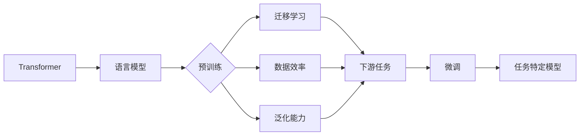

# 大规模语言模型从理论到实践 绪论

> 关键词：大规模语言模型，自然语言处理，预训练，微调，Transformer，BERT，迁移学习

## 1. 背景介绍

自然语言处理（Natural Language Processing，NLP）是人工智能领域的一个重要分支，旨在使计算机能够理解和生成人类语言。随着深度学习技术的快速发展，NLP领域取得了显著的进展。其中，大规模语言模型（Large Language Models，LLMs）作为一种能够理解和生成自然语言的强大工具，正日益受到广泛关注。

大规模语言模型通过对海量文本数据进行预训练，学习到丰富的语言知识和模式，从而在多种NLP任务上展现出惊人的能力。本文将从理论到实践，全面介绍大规模语言模型，包括其核心概念、算法原理、应用场景、发展趋势等，旨在帮助读者深入了解这一前沿技术。

## 2. 核心概念与联系

### 2.1 核心概念

#### 2.1.1 语言模型

语言模型（Language Model，LM）是NLP领域的基础，用于预测下一个单词或词组。在深度学习时代，神经网络语言模型成为主流，能够捕捉到更复杂的语言规律。

#### 2.1.2 预训练

预训练（Pre-training）是指在大量无标注数据上进行模型训练，以学习通用的语言表示。预训练模型在NLP任务中具有以下优势：

- **迁移学习**：预训练模型可以迁移到不同的NLP任务中，提高模型在具体任务上的性能。
- **数据效率**：预训练模型可以减少对标注数据的依赖，降低数据收集和标注成本。
- **泛化能力**：预训练模型能够学习到更通用的语言知识，提高模型在不同领域的适应性。

#### 2.1.3 微调

微调（Fine-tuning）是指在预训练模型的基础上，使用特定任务的有标签数据进行进一步训练。微调的目标是使模型在特定任务上表现出更好的性能。

#### 2.1.4 Transformer

Transformer是一种基于自注意力机制的深度神经网络模型，自2017年提出以来，在NLP领域取得了巨大的成功。Transformer模型具有以下特点：

- **并行处理**：Transformer模型能够并行处理序列数据，提高计算效率。
- **捕捉长距离依赖**：自注意力机制能够捕捉到序列中的长距离依赖关系。
- **结构简洁**：Transformer模型结构简洁，易于理解和实现。

#### 2.1.5 BERT

BERT（Bidirectional Encoder Representations from Transformers）是一种基于Transformer的预训练语言模型，由Google提出。BERT模型通过掩码语言模型（Masked Language Model，MLM）和下一句预测（Next Sentence Prediction，NSP）两种预训练任务，学习到丰富的语言知识。

### 2.2 核心概念原理和架构的 Mermaid 流程图



## 3. 核心算法原理 & 具体操作步骤

### 3.1 算法原理概述

大规模语言模型的训练过程通常分为两个阶段：

1. **预训练阶段**：在大量无标注数据上进行预训练，学习通用的语言表示。
2. **微调阶段**：在特定任务的有标签数据上进行微调，使模型在特定任务上表现出更好的性能。

### 3.2 算法步骤详解

#### 3.2.1 预训练阶段

预训练阶段的步骤如下：

1. **数据准备**：收集大量无标注文本数据，如书籍、新闻、网页等。
2. **模型初始化**：选择合适的预训练模型架构，如BERT、GPT等。
3. **预训练任务设计**：设计预训练任务，如掩码语言模型、下一句预测等。
4. **模型训练**：在无标注数据上进行模型训练，学习通用的语言表示。

#### 3.2.2 微调阶段

微调阶段的步骤如下：

1. **数据准备**：收集特定任务的有标签数据。
2. **模型调整**：调整预训练模型的架构，如添加特定任务的输出层。
3. **模型微调**：在特定任务的有标签数据上进行模型微调，使模型在特定任务上表现出更好的性能。

### 3.3 算法优缺点

#### 3.3.1 优点

- **强大的语言理解能力**：大规模语言模型能够理解复杂的语言结构和语义。
- **广泛的适用性**：大规模语言模型可以应用于各种NLP任务。
- **高效的迁移能力**：预训练模型可以迁移到不同的NLP任务中，提高模型在具体任务上的性能。

#### 3.3.2 缺点

- **计算资源需求大**：大规模语言模型需要大量的计算资源进行训练。
- **数据依赖性强**：预训练模型需要大量无标注数据进行训练。
- **模型可解释性差**：大规模语言模型的内部工作机制难以解释。

### 3.4 算法应用领域

大规模语言模型在以下NLP任务上取得了显著成果：

- **文本分类**：如情感分析、主题分类等。
- **命名实体识别**：如人名识别、地名识别等。
- **机器翻译**：如中英互译、英日互译等。
- **问答系统**：如事实问答、对话式问答等。
- **文本摘要**：如新闻摘要、文章摘要等。

## 4. 数学模型和公式 & 详细讲解 & 举例说明

### 4.1 数学模型构建

大规模语言模型的数学模型通常基于神经网络，包括以下主要组件：

- **输入层**：接收文本数据。
- **嵌入层**：将文本数据转换为向量表示。
- **隐藏层**：使用神经网络进行特征提取和变换。
- **输出层**：根据输入数据生成预测结果。

### 4.2 公式推导过程

以下以BERT模型为例，介绍其数学模型的推导过程。

#### 4.2.1 词嵌入

BERT模型使用WordPiece算法将文本数据分割成单词或子词（subword），并将每个单词或子词转换为向量表示。

#### 4.2.2 自注意力机制

BERT模型使用自注意力机制捕捉序列中的长距离依赖关系。

#### 4.2.3 Softmax层

BERT模型的输出层使用Softmax层生成预测结果。

### 4.3 案例分析与讲解

以下以BERT模型在文本分类任务上的应用为例，讲解其具体实现过程。

1. **数据准备**：收集文本数据和对应的标签。
2. **模型初始化**：加载预训练的BERT模型。
3. **模型调整**：在预训练模型的顶层添加Softmax层。
4. **模型微调**：在文本数据和标签上进行模型微调。
5. **模型评估**：在测试集上评估模型性能。

## 5. 项目实践：代码实例和详细解释说明

### 5.1 开发环境搭建

以下是使用Python进行大规模语言模型微调的常用工具和库：

- **Python**：编程语言。
- **PyTorch**：深度学习框架。
- **transformers**：Hugging Face开发的NLP工具库。

### 5.2 源代码详细实现

以下是一个使用PyTorch和transformers库对BERT模型进行微调的简单示例：

```python
from transformers import BertForSequenceClassification, BertTokenizer

# 加载预训练的BERT模型和分词器
model = BertForSequenceClassification.from_pretrained('bert-base-uncased')
tokenizer = BertTokenizer.from_pretrained('bert-base-uncased')

# 编码文本数据
encoded_inputs = tokenizer(texts, return_tensors='pt')

# 模型微调
outputs = model(**encoded_inputs, labels=labels)
loss = outputs.loss
```

### 5.3 代码解读与分析

以上代码展示了使用PyTorch和transformers库对BERT模型进行微调的基本流程。

1. 加载预训练的BERT模型和分词器。
2. 使用分词器将文本数据编码成模型所需的格式。
3. 将编码后的文本数据和标签输入模型进行微调。
4. 计算损失函数并更新模型参数。

### 5.4 运行结果展示

在测试集上评估模型性能，例如计算准确率、召回率和F1值等指标。

## 6. 实际应用场景

大规模语言模型在以下实际应用场景中取得了显著成果：

- **智能客服**：通过理解用户的问题，智能客服能够快速响应用户，提高服务质量。
- **机器翻译**：将一种语言的文本翻译成另一种语言，促进跨文化交流。
- **文本摘要**：将长篇文章或新闻摘要成简短的摘要，提高信息获取效率。
- **问答系统**：通过回答用户的问题，提供有价值的信息。
- **语音识别**：将语音信号转换成文本，方便用户进行信息检索和搜索。

## 7. 工具和资源推荐

### 7.1 学习资源推荐

- **书籍**：
  - 《深度学习自然语言处理》（Goodfellow, Bengio, Courville）
  - 《BERT：大规模预训练语言模型的原理与实践》（Devlin, Chang, Lee, & Toutanova）
- **在线课程**：
  - Coursera上的“自然语言处理与深度学习”课程
  - fast.ai上的“NLP with Transformers”课程
- **技术博客**：
  - Hugging Face Blog
  - Medium上的NLP相关博客

### 7.2 开发工具推荐

- **深度学习框架**：
  - PyTorch
  - TensorFlow
  - JAX
- **NLP工具库**：
  - Hugging Face Transformers
  - NLTK
  - spaCy
- **代码托管平台**：
  - GitHub

### 7.3 相关论文推荐

- **BERT**：
  - Devlin, J., Chang, M. W., Lee, K., & Toutanova, K. (2019). Bert: Pre-training of deep bidirectional transformers for language understanding. In Proceedings of the 2019 conference of the North American chapter of the association for computational linguistics: human language technologies, volume 1 (long and short papers) (pp. 4171-4186).
- **GPT-2**：
  - Radford, A., Narang, S., Salimans, T., & Sutskever, I. (2019). Improving language understanding by generative pre-training. In Advances in neural information processing systems (pp. 10990-11001).
- **RoBERTa**：
  - Liu, P., et al. (2019). Roberta: A robustly optimized bert pretraining approach. In Proceedings of the 2019 conference of the north american chapter of the association for computational linguistics: human language technologies, volume 1 (long and short papers) (pp. 3161-3171).

## 8. 总结：未来发展趋势与挑战

### 8.1 研究成果总结

大规模语言模型在NLP领域取得了显著的成果，推动了NLP技术的快速发展。预训练和微调技术的结合，使得模型能够学习到丰富的语言知识，并在各种NLP任务上取得了优异的性能。

### 8.2 未来发展趋势

未来，大规模语言模型的发展趋势包括：

- **模型规模进一步扩大**：模型规模将不断扩大，以学习更丰富的语言知识。
- **模型结构更加复杂**：模型结构将更加复杂，以更好地捕捉语言特征。
- **多模态融合**：大规模语言模型将与其他模态数据（如图像、音频）进行融合，实现多模态理解。

### 8.3 面临的挑战

大规模语言模型在发展过程中也面临着以下挑战：

- **计算资源需求**：模型规模扩大，计算资源需求也随之增加。
- **数据质量**：数据质量对模型性能至关重要，需要确保数据的准确性和多样性。
- **模型可解释性**：大规模语言模型的内部工作机制难以解释，需要提高模型的可解释性。

### 8.4 研究展望

未来，大规模语言模型的研究将重点关注以下方向：

- **轻量化模型**：开发轻量化模型，降低计算资源需求。
- **可解释性**：提高模型的可解释性，使模型更易于理解和信任。
- **知识增强**：将知识库等外部知识引入模型，提高模型的知识水平。

## 9. 附录：常见问题与解答

**Q1：什么是大规模语言模型？**

A：大规模语言模型是一种能够理解和生成自然语言的强大工具，通过对海量文本数据进行预训练，学习到丰富的语言知识和模式。

**Q2：什么是预训练？**

A：预训练是指在大量无标注数据上进行模型训练，以学习通用的语言表示。

**Q3：什么是微调？**

A：微调是指在预训练模型的基础上，使用特定任务的有标签数据进行进一步训练。

**Q4：什么是Transformer？**

A：Transformer是一种基于自注意力机制的深度神经网络模型，自2017年提出以来，在NLP领域取得了巨大的成功。

**Q5：什么是BERT？**

A：BERT是一种基于Transformer的预训练语言模型，由Google提出。

**Q6：大规模语言模型有哪些应用场景？**

A：大规模语言模型可以应用于文本分类、命名实体识别、机器翻译、问答系统、文本摘要等多种NLP任务。

**Q7：大规模语言模型面临哪些挑战？**

A：大规模语言模型面临计算资源需求大、数据质量要求高、模型可解释性差等挑战。

作者：禅与计算机程序设计艺术 / Zen and the Art of Computer Programming