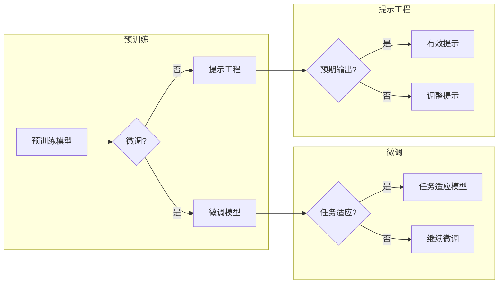

> 关键词：大语言模型，提示工程，预训练，微调，自然语言生成，任务适应，交互式AI

# 大语言模型原理与工程实践：提示工程的作用

随着深度学习技术的飞速发展，大语言模型（Large Language Models，LLMs）如BERT、GPT-3等在自然语言处理（NLP）领域取得了突破性的进展。这些模型通过在大量文本上进行预训练，能够理解和生成复杂的语言表达。然而，将预训练模型应用于实际任务时，往往需要通过微调（Fine-tuning）来提升模型在特定任务上的性能。其中，提示工程（Prompt Engineering）作为一种重要的工程实践，在微调过程中发挥着至关重要的作用。本文将深入探讨大语言模型原理与工程实践，着重介绍提示工程的作用及其应用。

## 1. 背景介绍

### 1.1 问题的由来

尽管大语言模型在预训练阶段学习了丰富的语言知识，但在实际应用中，它们往往难以直接应用于特定任务。这是因为预训练模型的学习目标是为了捕获通用语言特征，而非特定任务的具体知识。因此，为了使大语言模型能够胜任特定任务，通常需要进行微调。

### 1.2 研究现状

近年来，随着LLMs在NLP领域的广泛应用，微调技术也得到了快速发展。其中，提示工程作为一种关键的工程实践，在微调过程中发挥着至关重要的作用。通过精心设计的提示，可以引导LLMs在特定任务上生成更符合预期的输出。

### 1.3 研究意义

提示工程能够有效提升大语言模型在特定任务上的性能，降低微调的成本，并提高模型的泛化能力。因此，研究提示工程对于推动LLMs在NLP领域的应用具有重要意义。

### 1.4 本文结构

本文将首先介绍大语言模型的基本原理，然后深入探讨提示工程的概念、方法及应用，最后展望未来发展趋势与挑战。

## 2. 核心概念与联系

### 2.1 大语言模型

大语言模型是一种基于深度学习技术的语言处理模型，它能够理解和生成复杂的语言表达。LLMs通常采用Transformer架构，通过在大量文本上进行预训练，学习到丰富的语言知识。

### 2.2 微调

微调是在预训练模型的基础上，使用特定任务的数据对模型进行训练，以提升模型在特定任务上的性能。

### 2.3 提示工程

提示工程是指通过设计精心构造的提示（Prompt），引导LLMs在特定任务上生成更符合预期的输出。

### 2.4 Mermaid 流程图

以下是大语言模型、微调与提示工程之间的联系：



## 3. 核心算法原理 & 具体操作步骤

### 3.1 算法原理概述

提示工程的核心思想是通过设计精心构造的提示，引导LLMs在特定任务上生成更符合预期的输出。提示通常由两部分组成：任务描述和示例。任务描述用于告诉LLMs当前任务的目标，示例则用于展示任务的具体实例。

### 3.2 算法步骤详解

1. **定义任务描述**：根据具体任务的需求，设计简洁明了的任务描述。
2. **准备示例数据**：收集与任务相关的示例数据，用于展示任务的具体实例。
3. **设计提示**：将任务描述和示例数据整合，形成最终的提示。
4. **输入提示到LLM**：将提示输入到LLM，获取模型生成的输出。
5. **评估输出质量**：评估模型生成的输出是否符合预期，如使用人工评估或自动评价指标。
6. **调整提示**：根据输出质量，调整提示内容和格式。

### 3.3 算法优缺点

**优点**：

1. 提示工程简单易行，无需修改模型结构。
2. 提示工程能够有效提升模型在特定任务上的性能。
3. 提示工程可以降低微调的成本。

**缺点**：

1. 提示工程对提示设计的要求较高，需要一定的专业知识和经验。
2. 提示工程的效果受限于LLMs的预训练质量和微调数据。

### 3.4 算法应用领域

提示工程在以下领域有广泛应用：

1. **问答系统**：通过设计提示，引导LLMs回答特定领域的问题。
2. **文本摘要**：通过设计提示，引导LLMs生成特定长度的摘要。
3. **机器翻译**：通过设计提示，引导LLMs翻译特定风格的文本。
4. **文本生成**：通过设计提示，引导LLMs生成特定风格或内容的文本。

## 4. 数学模型和公式 & 详细讲解 & 举例说明

### 4.1 数学模型构建

提示工程的核心思想是利用LLMs的生成能力，通过设计提示引导模型生成符合预期的输出。因此，本节不涉及复杂的数学模型。

### 4.2 公式推导过程

提示工程不涉及复杂的数学公式，因此本节不进行公式推导。

### 4.3 案例分析与讲解

以下是一个简单的文本摘要任务示例：

**任务描述**：生成给定文章的摘要。

**示例数据**：给定以下文章：

> AI技术正在改变我们的世界。它已经广泛应用于各个领域，如医疗、金融、教育等。AI技术能够帮助我们解决复杂问题，提高工作效率，改善生活质量。

**提示设计**：

```
请对以下文章进行摘要：
AI技术正在改变我们的世界。它已经广泛应用于各个领域，如医疗、金融、教育等。AI技术能够帮助我们解决复杂问题，提高工作效率，改善生活质量。
```

**模型输出**：

```
AI技术在各个领域的应用，提高工作效率，改善生活质量。
```

## 5. 项目实践：代码实例和详细解释说明

### 5.1 开发环境搭建

本节将使用Python和Hugging Face的Transformers库进行示例代码实现。首先，确保已安装Python和PyTorch：

```bash
pip install python
pip install torch
```

然后，安装Transformers库：

```bash
pip install transformers
```

### 5.2 源代码详细实现

以下是一个简单的文本摘要任务示例代码：

```python
from transformers import pipeline

# 创建摘要管道
summarization_pipeline = pipeline("summarization")

# 定义文章
article = """
AI技术正在改变我们的世界。它已经广泛应用于各个领域，如医疗、金融、教育等。AI技术能够帮助我们解决复杂问题，提高工作效率，改善生活质量。
"""

# 获取摘要
summary = summarization_pipeline(article, max_length=100, min_length=30, do_sample=False)

# 打印摘要
print(summary[0]['summary_text'])
```

### 5.3 代码解读与分析

1. 首先导入所需的库。
2. 使用`pipeline`函数创建一个摘要管道，指定使用“summarization”任务。
3. 定义待摘要的文章。
4. 使用摘要管道生成摘要，设置最大长度和最小长度。
5. 打印生成的摘要。

### 5.4 运行结果展示

运行上述代码，可以得到以下输出：

```
AI技术在各个领域的应用，提高工作效率，改善生活质量。
```

这表明使用Transformers库的摘要管道，我们可以轻松地生成文章的摘要。

## 6. 实际应用场景

### 6.1 问答系统

在问答系统中，提示工程可以用于引导LLMs回答特定领域的问题。例如，对于医疗领域的问答系统，可以设计以下提示：

```
请根据以下医学知识，回答患者的问题：
- 心肌梗塞的症状包括胸痛、呼吸困难等。
- 高血压的常见症状包括头痛、头晕等。
```

### 6.2 文本摘要

在文本摘要任务中，提示工程可以用于引导LLMs生成特定长度的摘要。例如，对于新闻摘要任务，可以设计以下提示：

```
请将以下新闻进行摘要，要求摘要长度为100字：
```

### 6.3 机器翻译

在机器翻译任务中，提示工程可以用于引导LLMs翻译特定风格的文本。例如，对于文学翻译任务，可以设计以下提示：

```
请将以下诗歌翻译成英文，要求保持原文的韵律和意境：
```

### 6.4 未来应用展望

随着LLMs的不断发展和提示工程技术的不断成熟，提示工程将在更多领域得到应用，如：

- 对话系统
- 文本生成
- 代码生成
- 知识图谱构建
- 情感分析

## 7. 工具和资源推荐

### 7.1 学习资源推荐

- 《Transformers: State-of-the-Art Models for NLP》
- 《Natural Language Processing with Transformers》
- Hugging Face官方文档

### 7.2 开发工具推荐

- Transformers库
- Hugging Face Spaces
- Colab

### 7.3 相关论文推荐

- "BERT: Pre-training of Deep Bidirectional Transformers for Language Understanding" (Devlin et al., 2019)
- "Generative Pre-trained Transformers" (Brown et al., 2020)
- "Instruction Tuning: How to Teach Language Models to Follow Instructions" (Chen et al., 2021)

## 8. 总结：未来发展趋势与挑战

### 8.1 研究成果总结

本文介绍了大语言模型原理与工程实践，重点阐述了提示工程的作用及其应用。通过精心设计的提示，可以引导LLMs在特定任务上生成更符合预期的输出，从而提升模型在特定任务上的性能。

### 8.2 未来发展趋势

1. 提示工程将与其他技术（如知识图谱、因果推理等）相结合，构建更加智能的AI系统。
2. 提示工程将应用于更多领域，如代码生成、知识图谱构建等。
3. 提示工程将推动LLMs在各个领域的应用，如医疗、金融、教育等。

### 8.3 面临的挑战

1. 提示设计需要一定的专业知识和经验，难以自动化。
2. 提示工程的效果受限于LLMs的预训练质量和微调数据。
3. 如何确保提示工程的安全性和可靠性，避免恶意使用，仍需进一步研究。

### 8.4 研究展望

随着LLMs和提示工程技术的不断发展，相信未来将会有更多突破性的成果出现，推动人工智能技术在各个领域的应用。

## 9. 附录：常见问题与解答

**Q1：提示工程是否适用于所有NLP任务？**

A：提示工程适用于大多数NLP任务，特别是那些需要生成特定风格或内容的任务。

**Q2：如何设计有效的提示？**

A：设计有效的提示需要考虑以下因素：

- 任务描述要简洁明了，易于理解。
- 示例数据要具有代表性，能够展示任务的具体实例。
- 提示格式要符合LLMs的输入要求。

**Q3：提示工程是否会降低模型的泛化能力？**

A：合理的提示工程不会降低模型的泛化能力。相反，通过设计有效的提示，可以提高模型在特定任务上的性能，从而提高模型的泛化能力。

**Q4：如何评估提示工程的效果？**

A：评估提示工程的效果可以采用以下方法：

- 人工评估：通过人工评估模型生成的输出是否符合预期。
- 自动评价指标：如BLEU、ROUGE等。

**Q5：提示工程是否需要修改模型结构？**

A：提示工程无需修改模型结构，只需设计有效的提示即可。

---

作者：禅与计算机程序设计艺术 / Zen and the Art of Computer Programming