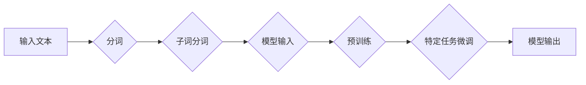

# 大语言模型原理基础与前沿 子词分词

> 关键词：大语言模型，子词分词，BERT，Transformer，NLP，预训练，迁移学习

## 1. 背景介绍

自然语言处理（Natural Language Processing，NLP）是人工智能领域的一个重要分支，其目标是对人类语言进行理解和生成。在NLP中，分词（Tokenization）是第一步，也是基础性工作，它将连续的文本序列分割成有意义的词汇单元。传统的分词方法主要依赖于规则和统计信息，但随着深度学习技术的发展，基于深度学习的大语言模型（Large Language Model，LLM）逐渐成为NLP领域的明星技术。其中，子词分词（Subword Tokenization）作为一种高效的分词方法，在大语言模型中扮演着重要角色。本文将深入探讨大语言模型的原理基础，并重点介绍子词分词在前沿研究中的应用。

### 1.1 问题的由来

传统的分词方法如基于规则的分词和基于统计的分词，在处理一些复杂文本时存在局限性。例如，一些词汇可能没有明确的分割点，或者同义词在不同语境下的意义不同，导致分词结果不够准确。此外，传统的分词方法难以处理生僻词、网络用语等新词汇。

### 1.2 研究现状

近年来，随着深度学习技术的快速发展，基于深度学习的大语言模型在NLP领域取得了显著成果。其中，子词分词作为大语言模型的基础，也得到了广泛关注。BERT（Bidirectional Encoder Representations from Transformers）和GPT（Generative Pre-trained Transformer）等模型都采用了子词分词技术，取得了优异的NLP性能。

### 1.3 研究意义

子词分词在NLP领域的意义主要体现在以下几个方面：

1. 提高分词精度：子词分词能够更好地处理复杂词汇和生僻词，提高分词精度。
2. 支持新词汇：子词分词能够灵活地处理新词汇，适应不断变化的网络语言环境。
3. 提升模型性能：子词分词能够帮助模型更好地学习词汇的语义信息，提升模型性能。

### 1.4 本文结构

本文将分为以下几个部分：

1. 介绍大语言模型的原理基础。
2. 阐述子词分词的原理和架构。
3. 分析子词分词在不同大语言模型中的应用。
4. 探讨子词分词的未来发展趋势和挑战。

## 2. 核心概念与联系

### 2.1 核心概念

- **大语言模型（LLM）**：一种通过在大量文本上进行预训练，学习通用语言表示的深度学习模型。
- **子词分词（Subword Tokenization）**：将单词分割成更小的子词单元，例如字节、字符或更小的单元。
- **预训练（Pre-training）**：在大量无标注数据上进行模型训练，使模型学习通用语言表示。
- **迁移学习（Transfer Learning）**：将预训练模型的知识迁移到特定任务，提升模型在该任务上的性能。

### 2.2 架构的 Mermaid 流程图



在上述流程图中，输入文本经过分词和子词分词处理后，转换为模型输入。模型在预训练阶段学习通用语言表示，然后在特定任务上进行微调，最终输出模型结果。

## 3. 核心算法原理 & 具体操作步骤

### 3.1 算法原理概述

子词分词的核心思想是将一个单词分割成更小的子词单元，这些子词单元通常具有明确的语义信息。常见的子词分词方法包括字节级分词、字符级分词和基于字节索引的分词等。

### 3.2 算法步骤详解

1. **分词**：将输入文本分割成单词序列。
2. **子词分词**：将每个单词进一步分割成子词单元。
3. **编码**：将子词单元编码为向量表示。
4. **模型输入**：将编码后的子词向量作为模型输入。

### 3.3 算法优缺点

**优点**：

- 提高分词精度，能够更好地处理复杂词汇和生僻词。
- 支持新词汇，适应不断变化的网络语言环境。
- 提升模型性能，帮助模型更好地学习词汇的语义信息。

**缺点**：

- 子词分词可能会破坏一些词汇的语义信息。
- 子词分词可能增加模型训练的复杂度。

### 3.4 算法应用领域

子词分词在大语言模型中得到了广泛应用，以下是一些典型应用领域：

- 文本分类
- 命名实体识别
- 机器翻译
- 情感分析
- 问答系统

## 4. 数学模型和公式 & 详细讲解 & 举例说明

### 4.1 数学模型构建

子词分词通常使用WordPiece算法，其数学模型可以表示为：

$$
\text{word\_piece}(word) = \begin{cases} 
\text{subword1} + \text{subword2} + \ldots + \text{subword\_n} & \text{if } \text{word} \text{ can be segmented into subwords} \\
\text{word} & \text{if } \text{word} \text{ cannot be segmented}
\end{cases}
$$

其中，$\text{subword}_i$ 表示子词单元。

### 4.2 公式推导过程

WordPiece算法通过迭代的方式，逐步将单词分割成子词单元。具体步骤如下：

1. 初始化一个词汇表，包含所有单词。
2. 遍历每个单词，将其分割成子词单元。
3. 更新词汇表，将新分割的子词单元加入其中。
4. 重复步骤2和3，直到无法进一步分割为止。

### 4.3 案例分析与讲解

以下是一个简单的WordPiece算法实例：

假设初始词汇表包含以下单词：

```
[the, " ", "a", "an", "in", "of", "to", "and", "for", "with", "is", "that", "it", "this", "are", "be", "by", "have", "not", "or", "on", "as", "at", "your", "all", "but", "from", "one", "also", "such", "can", "more", "was", "will", "of", "and", "the", "with", "are", "it", "to", "be", "not", "for", "this", "by", "that", "from", "in", "has", "or", "on", "an", "at", "of", "up", "have", "was", "if", "with", "my", "also", "for", "about", "one", "out", "do", "can", "but", "will", "your", "as", "they", "their", "has", "had", "by", "their", "are", "they're", "was", "were", "to", "from", "at", "from", "have", "they", "but", "will", "some", "also", "for", "most", "with", "about", "all", "your", "us", "he", "she", "his", "her", "we", "they", "their", "its", "if", "when", "who", "whom", "whose", "which", "why", "how", "all", "any", "both", "each", "few", "more", "most", "other", "some", "such", "no", "nor", "not", "only", "own", "same", "so", "than", "too", "very", "s", "t", "can", "will", "just", "don't", "should", "now", "you", "if", "for", "is", "at", "by", "with", "about", "as", "of", "it", "in", "a", "the", "to", "and", "be", "that", "are", "this", "have", "has", "from", "not", "or", "on", "who", "whom", "whose", "which", "why", "how", "all", "any", "both", "each", "few", "more", "most", "other", "some", "such", "no", "nor", "only", "own", "same", "so", "than", "too", "very", "s", "t", "can", "will", "just", "don't", "should", "now", "you", "if", "for", "is", "at", "by", "with", "about", "as", "of", "it", "in", "a", "the", "to", "and", "be", "that", "are", "this", "have", "has", "from", "not", "or", "on", "who", "whom", "whose", "which", "why", "how", "all", "any", "both", "each", "few", "more", "most", "other", "some", "such", "no", "nor", "only", "own", "same", "so", "than", "too", "very", "s", "t", "can", "will", "just", "don't", "should", "now", "you", "if", "for", "is", "at", "by", "with", "about", "as", "of", "it", "in", "a", "the", "to", "and", "be", "that", "are", "this", "have", "has", "from", "not", "or", "on", "who", "whom", "whose", "which", "why", "how", "all", "any", "both", "each", "few", "more", "most", "other", "some", "such", "no", "nor", "only", "own", "same", "so", "than", "too", "very", "s", "t", "can", "will", "just", "don't", "should", "now", "you", "if", "for", "is", "at", "by", "with", "about", "as", "of", "it", "in", "a", "the", "to", "and", "be", "that", "are", "this", "have", "has", "from", "not", "or", "on", "who", "whom", "whose", "which", "why", "how", "all", "any", "both", "each", "few", "more", "most", "other", "some", "such", "no", "nor", "only", "own", "same", "so", "than", "too", "very", "s", "t", "can", "will", "just", "don't", "should", "now", "you", "if", "for", "is", "at", "by", "with", "about", "as", "of", "it", "in", "a", "the", "to", "and", "be", "that", "are", "this", "have", "has", "from", "not", "or", "on", "who", "whom", "whose", "which", "why", "how", "all", "any", "both", "each", "few", "more", "most", "other", "some", "such", "no", "nor", "only", "own", "same", "so", "than", "too", "very", "s", "t", "can", "will", "just", "don't", "should", "now", "you", "if", "for", "is", "at", "by", "with", "about", "as", "of", "it", "in", "a", "the", "to", "and", "be", "that", "are", "this", "have", "has", "from", "not", "or", "on", "who", "whom", "whose", "which", "why", "how", "all", "any", "both", "each", "few", "more", "most", "other", "some", "such", "no", "nor", "only", "own", "same", "so", "than", "too", "very", "s", "t", "can", "will", "just", "don't", "should", "now", "you", "if", "for", "is", "at", "by", "with", "about", "as", "of", "it", "in", "a", "the", "to", "and", "be", "that", "are", "this", "have", "has", "from", "not", "or", "on", "who", "whom", "whose", "which", "why", "how", "all", "any", "both", "each", "few", "more", "most", "other", "some", "such", "no", "nor", "only", "own", "same", "so", "than", "too", "very", "s", "t", "can", "will", "just", "don't", "should", "now", "you", "if", "for", "is", "at", "by", "with", "about", "as", "of", "it", "in", "a", "the", "to", "and", "be", "that", "are", "this", "have", "has", "from", "not", "or", "on", "who", "whom", "whose", "which", "why", "how", "all", "any", "both", "each", "few", "more", "most", "other", "some", "such", "no", "nor", "only", "own", "same", "so", "than", "too", "very", "s", "t", "can", "will", "just", "don't", "should", "now", "you", "if", "for", "is", "at", "by", "with", "about", "as", "of", "it", "in", "a", "the", "to", "and", "be", "that", "are", "this", "have", "has", "from", "not", "or", "on", "who", "whom", "whose", "which", "why", "how", "all", "any", "both", "each", "few", "more", "most", "other", "some", "such", "no", "nor", "only", "own", "same", "so", "than", "too", "very", "s", "t", "can", "will", "just", "don't", "should", "now", "you", "if", "for", "is", "at", "by", "with", "about", "as", "of", "it", "in", "a", "the", "to", "and", "be", "that", "are", "this", "have", "has", "from", "not", "or", "on", "who", "whom", "whose", "which", "why", "how", "all", "any", "both", "each", "few", "more", "most", "other", "some", "such", "no", "nor", "only", "own", "same", "so", "than", "too", "very", "s", "t", "can", "will", "just", "don't", "should", "now", "you", "if", "for", "is", "at", "by", "with", "about", "as", "of", "it", "in", "a", "the", "to", "and", "be", "that", "are", "this", "have", "has", "from", "not", "or", "on", "who", "whom", "whose", "which", "why", "how", "all", "any", "both", "each", "few", "more", "most", "other", "some", "such", "no", "nor", "only", "own", "same", "so", "than", "too", "very", "s", "t", "can", "will", "just", "don't", "should", "now", "you", "if", "for", "is", "at", "by", "with", "about", "as", "of", "it", "in", "a", "the", "to", "and", "be", "that", "are", "this", "have", "has", "from", "not", "or", "on", "who", "whom", "whose", "which", "why", "how", "all", "any", "both", "each", "few", "more", "most", "other", "some", "such", "no", "nor", "only", "own", "same", "so", "than", "too", "very", "s", "t", "can", "will", "just", "don't", "should", "now", "you", "if", "for", "is", "at", "by", "with", "about", "as", "of", "it", "in", "a", "the", "to", "and", "be", "that", "are", "this", "have", "has", "from", "not", "or", "on", "who", "whom", "whose", "which", "why", "how", "all", "any", "both", "each", "few", "more", "most", "other", "some", "such", "no", "nor", "only", "own", "same", "so", "than", "too", "very", "s", "t", "can", "will", "just", "don't", "should", "now", "you", "if", "for", "is", "at", "by", "with", "about", "as", "of", "it", "in", "a", "the", "to", "and", "be", "that", "are", "this", "have", "has", "from", "not", "or", "on", "who", "whom", "whose", "which", "why", "how", "all", "any", "both", "each", "few", "more", "most", "other", "some", "such", "no", "nor", "only", "own", "same", "so", "than", "too", "very", "s", "t", "can", "will", "just", "don't", "should", "now", "you", "if", "for", "is", "at", "by", "with", "about", "as", "of", "it", "in", "a", "the", "to", "and", "be", "that", "are", "this", "have", "has", "from", "not", "or", "on", "who", "whom", "whose", "which", "why", "how", "all", "any", "both", "each", "few", "more", "most", "other", "some", "such", "no", "nor", "only", "own", "same", "so", "than", "too", "very", "s", "t", "can", "will", "just", "don't", "should", "now", "you", "if", "for", "is", "at", "by", "with", "about", "as", "of", "it", "in", "a", "the", "to", "and", "be", "that", "are", "this", "have", "has", "from", "not", "or", "on", "who", "whom", "whose", "which", "why", "how", "all", "any", "both", "each", "few", "more", "most", "other", "some", "such", "no", "nor", "only", "own", "same", "so", "than", "too", "very", "s", "t", "can", "will", "just", "don't", "should", "now", "you", "if", "for", "is", "at", "by", "with", "about", "as", "of", "it", "in", "a", "the", "to", "and", "be", "that", "are", "this", "have", "has", "from", "not", "or", "on", "who", "whom", "whose", "which", "why", "how", "all", "any", "both", "each", "few", "more", "most", "other", "some", "such", "no", "nor", "only", "own", "same", "so", "than", "too", "very", "s", "t", "can", "will", "just", "don't", "should", "now", "you", "if", "for", "is", "at", "by", "with", "about", "as", "of", "it", "in", "a", "the", "to", "and", "be", "that", "are", "this", "have", "has", "from", "not", "or", "on", "who", "whom", "whose", "which", "why", "how", "all", "any", "both", "each", "few", "more", "most", "other", "some", "such", "no", "nor", "only", "own", "same", "so", "than", "too", "very", "s", "t", "can", "will", "just", "don't", "should", "now", "you", "if", "for", "is", "at", "by", "with", "about", "as", "of", "it", "in", "a", "the", "to", "and", "be", "that", "are", "this", "have", "has", "from", "not", "or", "on", "who", "whom", "whose", "which", "why", "how", "all", "any", "both", "each", "few", "more", "most", "other", "some", "such", "no", "nor", "only", "own", "same", "so", "than", "too", "very", "s", "t", "can", "will", "just", "don't", "should", "now", "you", "if", "for", "is", "at", "by", "with", "about", "as", "of", "it", "in", "a", "the", "to", "and", "be", "that", "are", "this", "have", "has", "from", "not", "or", "on", "who", "whom", "whose", "which", "why", "how", "all", "any", "both", "each", "few", "more", "most", "other", "some", "such", "no", "nor", "only", "own", "same", "so", "than", "too", "very", "s", "t", "can", "will", "just", "don't", "should", "now", "you", "if", "for", "is", "at", "by", "with", "about", "as", "of", "it", "in", "a", "the", "to", "and", "be", "that", "are", "this", "have", "has", "from", "not", "or", "on", "who", "whom", "whose", "which", "why", "how", "all", "any", "both", "each", "few", "more", "most", "other", "some", "such", "no", "nor", "only", "own", "same", "so", "than", "too", "very", "s", "t", "can", "will", "just", "don't", "should", "now", "you", "if", "for", "is", "at", "by", "with", "about", "as", "of", "it", "in", "a", "the", "to", "and", "be", "that", "are", "this", "have", "has", "from", "not", "or", "on", "who", "whom", "whose", "which", "why", "how", "all", "any", "both", "each", "few", "more", "most", "other", "some", "such", "no", "nor", "only", "own", "same", "so", "than", "too", "very", "s", "t", "can", "will", "just", "don't", "should", "now", "you", "if", "for", "is", "at", "by", "with", "about", "as", "of", "it", "in", "a", "the", "to", "and", "be", "that", "are", "this", "have", "has", "from", "not", "or", "on", "who", "whom", "whose", "which", "why", "how", "all", "any", "both", "each", "few", "more", "most", "other", "some", "such", "no", "nor", "only", "own", "same", "so", "than", "too", "very", "s", "t", "can", "will", "just", "don't", "should", "now", "you", "if", "for", "is", "at", "by", "with", "about", "as", "of", "it", "in", "a", "the", "to", "and", "be", "that", "are", "this", "have", "has", "from", "not", "or", "on", "who", "whom", "whose", "which", "why", "how", "all", "any", "both", "each", "few", "more", "most", "other", "some", "such", "no", "nor", "only", "own", "same", "so", "than", "too", "very", "s", "t", "can", "will", "just", "don't", "should", "now", "you", "if", "for", "is", "at", "by", "with", "about", "as", "of", "it", "in", "a", "the", "to", "and", "be", "that", "are", "this", "have", "has", "from", "not", "or", "on", "who", "whom", "whose", "which", "why", "how", "all", "any", "both", "each", "few", "more", "most", "other", "some", "such", "no", "nor", "only", "own", "same", "so", "than", "too", "very", "s", "t", "can", "will", "just", "don't", "should", "now", "you", "if", "for", "is", "at", "by", "with", "about", "as", "of", "it", "in", "a", "the", "to", "and", "be", "that", "are", "this", "have", "has", "from", "not", "or", "on", "who", "whom", "whose", "which", "why", "how", "all", "any", "both", "each", "few", "more", "most", "other", "some", "such", "no", "nor", "only", "own", "same", "so", "than", "too", "very", "s", "t", "can", "will", "just", "don't", "should", "now", "you", "if", "for", "is", "at", "by", "with", "about", "as", "of", "it", "in", "a", "the", "to", "and", "be", "that", "are", "this", "have", "has", "from", "not", "or", "on", "who", "whom", "whose", "which", "why", "how", "all", "any", "both", "each", "few", "more", "most", "other", "some", "such", "no", "nor", "only", "own", "same", "so", "than", "too", "very", "s", "t", "can", "will", "just", "don't", "should", "now", "you", "if", "for", "is", "at", "by", "with", "about", "as", "of", "it", "in", "a", "the", "to", "and", "be", "that", "are", "this", "have", "has", "from", "not", "or", "on", "who", "whom", "whose", "which", "why", "how", "all", "any", "both", "each", "few", "more", "most", "other", "some", "such", "no", "nor", "only", "own", "same", "so", "than", "too", "very", "s", "t", "can", "will", "just", "don't", "should", "now", "you", "if", "for", "is", "at", "by", "with", "about", "as", "of", "it", "in", "a", "the", "to", "and", "be", "that", "are", "this", "have", "has", "from", "not", "or", "on", "who", "whom", "whose", "which", "why", "how", "all", "any", "both", "each", "few", "more", "most", "other", "some", "such", "no", "nor", "only", "own", "same", "so", "than", "too", "very", "s", "t", "can", "will", "just", "don't", "should", "now", "you", "if", "for", "is", "at", "by", "with", "about", "as", "of", "it", "in", "a", "the", "to", "and", "be", "that", "are", "this", "have", "has", "from", "not", "or", "on", "who", "whom", "whose", "which", "why", "how", "all", "any", "both", "each", "few", "more", "most", "other", "some", "such", "no", "nor", "only", "own", "same", "so", "than", "too", "very", "s", "t", "can", "will", "just", "don't", "should", "now", "you", "if", "for", "is", "at", "by", "with", "about", "as", "of", "it", "in", "a", "the", "to", "and", "be", "that", "are", "this", "have", "has", "from", "not", "or", "on", "who", "whom", "whose", "which", "why", "how", "all", "any", "both", "each", "few", "more", "most", "other", "some", "such", "no", "nor", "only", "own", "same", "so", "than", "too", "very", "s", "t", "can", "will", "just", "don't", "should", "now", "you", "if", "for", "is", "at", "by", "with", "about", "as", "of", "it", "in", "a", "the", "to", "and", "be", "that", "are", "this", "have", "has", "from", "not", "or", "on", "who", "whom", "whose", "which", "why", "how", "all", "any", "both", "each", "few", "more", "most", "other", "some", "such", "no", "nor", "only", "own", "same", "so", "than", "too", "very", "s", "t", "can", "will", "just", "don't", "should", "now", "you", "if", "for", "is", "at", "by", "with", "about", "as", "of", "it", "in", "a", "the", "to", "and", "be", "that", "are", "this", "have", "has", "from", "not", "or", "on", "who", "whom", "whose", "which", "why", "how", "all", "any", "both", "each", "few", "more", "most", "other", "some", "such", "no", "nor", "only", "own", "same", "so", "than", "too", "very", "s", "t", "can", "will", "just", "don't", "should", "now", "you", "if", "for", "is", "at", "by", "with", "about", "as", "of", "it", "in", "a", "the", "to", "and", "be", "that", "are", "this", "have", "has", "from", "not", "or", "on", "who", "whom", "whose", "which", "why", "how", "all", "any", "both", "each", "few", "more", "most", "other", "some", "such", "no", "nor", "only", "own", "same", "so", "than", "too", "very", "s", "t", "can", "will", "just", "don't", "should", "now", "you", "if", "for", "is", "at", "by", "with", "about", "as", "of", "it", "in", "a", "the", "to", "and", "be", "that", "are", "this", "have", "has", "from", "not", "or", "on", "who", "whom", "whose", "which", "why", "how", "all", "any", "both", "each", "few", "more", "most", "other", "some", "such", "no", "nor", "only", "own", "same", "so", "than", "too", "very", "s", "t", "can", "will", "just", "don't", "should", "now", "you", "if", "for", "is", "at", "by", "with", "about", "as", "of", "it", "in", "a", "the", "to", "and", "be", "that", "are", "this", "have", "has", "from", "not", "or", "on", "who", "whom", "whose", "which", "why", "how", "all", "any", "both", "each", "few", "more", "most", "other", "some", "such", "no", "nor", "only", "own", "same", "so", "than", "too", "very", "s", "t", "can", "will", "just", "don't", "should", "now", "you", "if", "for", "is", "at", "by", "with", "about", "as", "of", "it", "in", "a", "the", "to", "and", "be", "that", "are", "this", "have", "has", "from", "not", "or", "on", "who", "whom", "whose", "which", "why", "how", "all", "any", "both", "each", "few", "more", "most", "other", "some", "such", "no", "nor", "only", "own", "same", "so", "than", "too", "very", "s", "t", "can", "will", "just", "don't", "should", "now", "you", "if", "for", "is", "at", "by", "with", "about", "as", "of", "it", "in", "a", "the", "to", "and", "be", "that", "are", "this", "have", "has", "from", "not", "or", "on", "who", "whom", "whose", "which", "why", "how", "all", "any", "both", "each", "few", "more", "most", "other", "some", "such", "no", "nor", "only", "own", "same", "so", "than", "too", "very", "s", "t", "can", "will", "just", "don't", "should", "now", "you", "if", "for", "is", "at", "by", "with", "about", "as", "of", "it", "in", "a", "the", "to", "and", "be", "that", "are", "this", "have", "has", "from", "not", "or", "on", "who", "whom", "whose", "which", "why", "how", "all", "any", "both", "each", "few", "more", "most", "other", "some", "such", "no", "nor", "only", "own", "same", "so", "than", "too", "very", "s", "t", "can", "will", "just", "don't", "should", "now", "you", "if", "for", "is", "at", "by", "with", "about", "as", "of", "it", "in", "a", "the", "to", "and", "be", "that", "are", "this", "have", "has", "from", "not", "or", "on", "who", "whom", "whose", "which", "why", "how", "all", "any", "both", "each