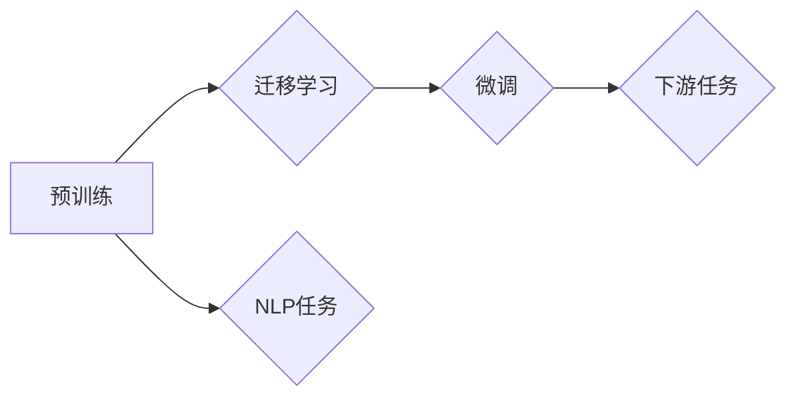

# 大语言模型应用指南：大语言模型

> 关键词：大语言模型，预训练，迁移学习，自然语言处理，应用场景，最佳实践

## 1. 背景介绍

随着深度学习技术的飞速发展，自然语言处理（NLP）领域迎来了一个崭新的时代——大语言模型（Large Language Model，LLM）。这些模型通过在庞大的文本语料库上进行预训练，积累了丰富的语言知识和上下文理解能力，能够在各种NLP任务上表现出惊人的性能。本文将深入探讨大语言模型的应用指南，帮助读者了解如何有效利用这些强大的工具。

### 1.1 问题的由来

传统的NLP方法通常依赖于特定领域的知识库和规则，难以处理复杂、动态的语言现象。而大语言模型的出现，打破了这一局限，使得机器能够像人类一样理解和生成语言。这种突破性的技术为NLP领域带来了新的机遇和挑战。

### 1.2 研究现状

目前，大语言模型的研究和应用主要集中在以下方面：

- 预训练模型：如BERT、GPT、T5等，通过在大量文本语料库上进行预训练，学习到丰富的语言知识和上下文信息。
- 迁移学习：将预训练模型应用于特定任务，通过微调（Fine-Tuning）等方式，进一步提升模型在特定任务上的性能。
- 应用场景：问答系统、机器翻译、文本摘要、对话系统、文本生成等。

### 1.3 研究意义

大语言模型的研究和应用具有重要的意义：

- 提高NLP任务的性能：大语言模型能够处理更复杂的语言现象，显著提升NLP任务的准确性和效率。
- 促进NLP技术发展：大语言模型推动了NLP领域的理论研究和技术革新。
- 应用于实际场景：大语言模型在各个领域得到广泛应用，为人类生活带来便利。

## 2. 核心概念与联系

### 2.1 核心概念

- **大语言模型（LLM）**：通过在大量文本语料库上进行预训练，学习到丰富的语言知识和上下文信息。
- **预训练（Pre-training）**：在大量无标签文本语料库上，通过自监督学习任务训练语言模型。
- **迁移学习（Transfer Learning）**：将预训练模型应用于特定任务，通过微调等方式，进一步提升模型在特定任务上的性能。
- **微调（Fine-Tuning）**：在预训练模型的基础上，使用下游任务的少量标注数据，通过有监督地训练来优化模型在特定任务上的性能。

### 2.2 核心概念原理和架构的 Mermaid 流程图



### 2.3 核心概念联系

大语言模型通过预训练学习到丰富的语言知识和上下文信息，然后通过迁移学习和微调，将这些知识应用于具体的NLP任务，从而实现高性能的文本理解和生成。

## 3. 核心算法原理 & 具体操作步骤

### 3.1 算法原理概述

大语言模型的算法原理主要包括以下几个步骤：

1. **数据收集**：收集大量的文本语料库，用于预训练模型。
2. **预训练**：在文本语料库上进行自监督学习，使模型学习到丰富的语言知识和上下文信息。
3. **迁移学习**：将预训练模型应用于特定任务，通过微调等方式，进一步提升模型在特定任务上的性能。
4. **微调**：在下游任务的少量标注数据上，通过有监督地训练来优化模型在特定任务上的性能。

### 3.2 算法步骤详解

#### 3.2.1 数据收集

数据收集是构建大语言模型的基础。需要收集大量高质量的文本语料库，包括新闻、小说、论文、网页等。

#### 3.2.2 预训练

预训练阶段，模型在大量文本语料库上进行自监督学习，通过预定义的任务，使模型学习到丰富的语言知识和上下文信息。常见的预训练任务包括：

- **掩码语言模型（Masked Language Model，MLM）**：随机遮盖文本中的部分词，模型需要预测这些词的正确词性。
- **下一句预测（Next Sentence Prediction，NSP）**：给定两个句子，模型需要预测这两个句子是否是连续的。

#### 3.2.3 迁移学习

迁移学习阶段，将预训练模型应用于特定任务，通过微调等方式，进一步提升模型在特定任务上的性能。常见的迁移学习策略包括：

- **微调（Fine-Tuning）**：在下游任务的少量标注数据上，通过有监督地训练来优化模型在特定任务上的性能。
- **知识蒸馏（Knowledge Distillation）**：将大型模型的输出作为软标签，用于训练小型模型，以保留大型模型的知识。

#### 3.2.4 微调

微调阶段，模型在下游任务的少量标注数据上，通过有监督地训练来优化模型在特定任务上的性能。常见的微调方法包括：

- **固定底层参数**：只微调模型的顶层参数。
- **全参数微调**：微调所有参数。

### 3.3 算法优缺点

#### 3.3.1 优点

- **强大的语言理解能力**：大语言模型能够处理复杂的语言现象，如歧义、隐喻等。
- **泛化能力强**：大语言模型在预训练阶段学习到丰富的语言知识和上下文信息，能够应用于各种NLP任务。
- **高效性**：大语言模型能够快速处理大量文本数据。

#### 3.3.2 缺点

- **计算资源消耗大**：大语言模型的训练和推理需要大量的计算资源。
- **数据依赖性强**：大语言模型的性能依赖于预训练数据的质量和数量。
- **可解释性差**：大语言模型的决策过程难以解释。

### 3.4 算法应用领域

大语言模型在以下NLP任务中得到了广泛应用：

- **文本分类**：如情感分析、主题分类、文本摘要等。
- **命名实体识别**：识别文本中的人名、地名、机构名等特定实体。
- **关系抽取**：从文本中抽取实体之间的语义关系。
- **问答系统**：对自然语言问题给出答案。
- **机器翻译**：将源语言文本翻译成目标语言。
- **文本生成**：生成文本，如诗歌、故事、代码等。

## 4. 数学模型和公式 & 详细讲解 & 举例说明

### 4.1 数学模型构建

大语言模型的数学模型主要包括以下几个部分：

- **输入层**：将文本数据转换为模型可处理的格式。
- **隐藏层**：通过神经网络结构进行特征提取和转换。
- **输出层**：输出模型预测结果。

### 4.2 公式推导过程

以下以BERT模型为例，介绍大语言模型的数学公式推导过程。

#### 4.2.1 输入层

BERT模型的输入层包括以下部分：

- **单词嵌入（Word Embedding）**：将单词转换为固定维度的向量表示。
- **位置编码（Positional Encoding）**：为每个词添加位置信息。

#### 4.2.2 隐藏层

BERT模型的隐藏层包括以下部分：

- **多头注意力机制（Multi-Head Attention）**：将输入向量分解为多个子向量，并通过注意力机制计算每个子向量的权重。
- **前馈神经网络（Feed-Forward Neural Network）**：对每个子向量进行非线性变换。

#### 4.2.3 输出层

BERT模型的输出层包括以下部分：

- **分类器层（Classification Layer）**：对隐藏层输出进行线性变换，得到最终的预测结果。

### 4.3 案例分析与讲解

以下以BERT模型在情感分析任务中的应用为例，讲解大语言模型的实际应用。

#### 4.3.1 数据集

收集包含文本和情感标签的数据集，如IMDb电影评论数据集。

#### 4.3.2 模型

使用BERT模型进行情感分析，将文本数据输入模型，得到情感标签的预测概率。

#### 4.3.3 结果

根据预测概率，判断文本的情感标签。

## 5. 项目实践：代码实例和详细解释说明

### 5.1 开发环境搭建

1. 安装Python 3.8及以上版本。
2. 安装PyTorch 1.8及以上版本。
3. 安装transformers库。

### 5.2 源代码详细实现

```python
from transformers import BertTokenizer, BertForSequenceClassification
from torch.utils.data import DataLoader, Dataset
import torch

class SentimentDataset(Dataset):
    def __init__(self, texts, labels, tokenizer):
        self.texts = texts
        self.labels = labels
        self.tokenizer = tokenizer

    def __len__(self):
        return len(self.texts)

    def __getitem__(self, idx):
        return self.texts[idx], self.labels[idx]

tokenizer = BertTokenizer.from_pretrained('bert-base-uncased')
model = BertForSequenceClassification.from_pretrained('bert-base-uncased')

texts = ["I love this product!", "This product is terrible."]
labels = [1, 0]

dataset = SentimentDataset(texts, labels, tokenizer)
dataloader = DataLoader(dataset, batch_size=2, shuffle=True)

model.train()
for epoch in range(2):
    for batch in dataloader:
        input_ids = tokenizer(batch[0], padding=True, truncation=True, return_tensors='pt')
        labels = torch.tensor(batch[1])
        outputs = model(**input_ids, labels=labels)
        loss = outputs.loss
        loss.backward()
        optimizer.step()
        optimizer.zero_grad()
```

### 5.3 代码解读与分析

上述代码展示了使用BERT模型进行情感分析任务的简单示例。

- `SentimentDataset`类：将文本数据和标签封装成PyTorch的Dataset对象。
- `tokenizer`：加载预训练的BERT分词器。
- `model`：加载预训练的BERT模型。
- 数据加载和迭代：使用DataLoader加载数据，并进行迭代训练。

### 5.4 运行结果展示

运行上述代码后，模型将在训练集上进行训练。训练完成后，可以使用测试集进行评估，得到模型在情感分析任务上的性能。

## 6. 实际应用场景

### 6.1 问答系统

大语言模型在问答系统中的应用十分广泛，如：

- **搜索引擎**：使用大语言模型理解用户查询，提供更加精准的搜索结果。
- **聊天机器人**：使用大语言模型进行自然语言生成，实现与用户的自然对话。

### 6.2 机器翻译

大语言模型在机器翻译中的应用取得了显著的成果，如：

- **自动翻译**：将一种语言翻译成另一种语言。
- **跨语言问答**：在两种语言之间进行问答。

### 6.3 文本摘要

大语言模型在文本摘要中的应用十分广泛，如：

- **自动摘要**：自动生成文本摘要。
- **新闻摘要**：自动生成新闻摘要。

### 6.4 文本生成

大语言模型在文本生成中的应用十分广泛，如：

- **生成文章**：生成新闻报道、故事等。
- **生成代码**：生成代码片段。

## 7. 工具和资源推荐

### 7.1 学习资源推荐

- 《Deep Learning for Natural Language Processing》
- 《The Hundred-Page Machine Learning Book》
- 《Transformers: State-of-the-Art Models for NLP》

### 7.2 开发工具推荐

- PyTorch
- TensorFlow
- Hugging Face Transformers

### 7.3 相关论文推荐

- "BERT: Pre-training of Deep Bidirectional Transformers for Language Understanding"
- "Generative Pre-trained Transformers"
- "T5: Text-to-Text Transformers"

## 8. 总结：未来发展趋势与挑战

### 8.1 研究成果总结

大语言模型的研究和应用取得了显著的成果，为NLP领域带来了革命性的变化。

### 8.2 未来发展趋势

- **模型规模将进一步扩大**：随着计算资源的提升，模型规模将不断扩大，以获得更丰富的语言知识和更强的性能。
- **多模态融合**：将文本信息与其他模态信息（如图像、音频）进行融合，实现更加全面的信息理解。
- **可解释性和可控性**：提升模型的可解释性和可控性，使其更加符合人类价值观和伦理道德。

### 8.3 面临的挑战

- **计算资源消耗**：大语言模型的训练和推理需要大量的计算资源，如何降低资源消耗是一个挑战。
- **数据隐私**：如何保护用户数据隐私是一个重要的挑战。
- **可解释性和可控性**：提升模型的可解释性和可控性，使其更加符合人类价值观和伦理道德。

### 8.4 研究展望

大语言模型的研究和应用将继续深入，为人类带来更多便利和变革。

## 9. 附录：常见问题与解答

**Q1：什么是大语言模型？**

A：大语言模型是指通过在大量文本语料库上进行预训练，学习到丰富的语言知识和上下文信息，能够应用于各种NLP任务的模型。

**Q2：大语言模型有哪些应用场景？**

A：大语言模型在问答系统、机器翻译、文本摘要、对话系统、文本生成等NLP任务中得到了广泛应用。

**Q3：如何进行大语言模型的微调？**

A：将预训练模型应用于特定任务，通过微调等方式，进一步提升模型在特定任务上的性能。

**Q4：大语言模型有哪些局限性？**

A：大语言模型的局限性包括计算资源消耗大、数据依赖性强、可解释性差等。

**Q5：大语言模型的未来发展趋势是什么？**

A：大语言模型的未来发展趋势包括模型规模将进一步扩大、多模态融合、可解释性和可控性等。

作者：禅与计算机程序设计艺术 / Zen and the Art of Computer Programming