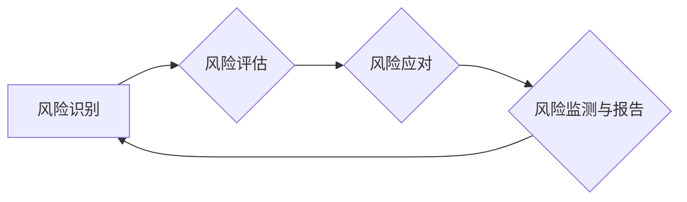

> 风险管理、风险规避、损失降低、风险模型、预测分析、企业安全、金融风险管理、IT安全

# 如何进行风险控制：如何规避风险和降低损失？

在当今复杂多变的市场环境下，风险控制已经成为企业运营和IT安全领域至关重要的环节。有效的风险控制不仅能帮助企业规避潜在损失，还能提高企业的抗风险能力和市场竞争力。本文将深入探讨风险控制的核心概念、算法原理、实践步骤以及未来发展趋势，帮助企业构建高效的风险管理框架。

## 1. 背景介绍

### 1.1 风险管理的必要性

随着经济全球化和市场竞争的加剧，企业面临着来自内部和外部越来越多的风险因素。这些风险可能源于自然灾害、市场波动、技术革新、法律变更、人为错误等。有效管理这些风险，对于企业的生存和发展至关重要。

### 1.2 风险控制的重要性

风险控制旨在识别、评估、监测和应对企业运营中可能出现的风险，通过预防措施降低损失概率和损失程度。有效的风险控制可以帮助企业：

- 保护企业资产和利益
- 提高企业运营效率
- 增强企业抗风险能力
- 增进企业社会责任

### 1.3 本文结构

本文将分为以下几个部分：

- 核心概念与联系
- 核心算法原理与具体操作步骤
- 数学模型和公式
- 项目实践：代码实例和详细解释说明
- 实际应用场景
- 工具和资源推荐
- 总结：未来发展趋势与挑战
- 附录：常见问题与解答

## 2. 核心概念与联系

### 2.1 风险管理的核心概念

#### 风险识别
风险识别是风险管理的第一步，旨在识别企业可能面临的风险类型和来源。常见的风险类型包括：

- 自然灾害风险：如地震、洪水、火灾等。
- 市场风险：如需求波动、竞争加剧、价格波动等。
- 技术风险：如系统故障、数据泄露、网络攻击等。
- 信用风险：如客户违约、供应商无法履约等。
- 法律风险：如法律法规变更、合同纠纷等。

#### 风险评估
风险评估是对已识别风险的可能性和影响进行量化评估。常见的风险评估方法包括：

- 定性评估：通过专家经验对风险进行主观评估。
- 定量评估：通过统计分析、模型预测等方法对风险进行量化评估。

#### 风险应对
风险应对是指针对评估出的风险制定相应的应对策略。常见的风险应对策略包括：

- 风险规避：避免风险的发生或降低风险暴露。
- 风险减轻：降低风险发生的可能性和影响。
- 风险转移：将风险转移给其他方。
- 风险接受：接受风险的发生，并制定相应的应对措施。

#### 风险监测与报告
风险监测与报告是指对已识别和评估的风险进行持续监测，并根据实际情况调整风险应对策略。风险报告则是将风险状况和应对措施汇报给相关方。

### 2.2 风险控制架构

以下是一个简化版的风险控制架构，用于指导企业进行风险控制：



该架构表明，风险控制是一个持续的过程，需要不断循环迭代。

## 3. 核心算法原理与具体操作步骤

### 3.1 算法原理概述

风险控制的核心算法主要包括：

- 风险识别算法：如专家系统、数据挖掘、机器学习等。
- 风险评估算法：如故障树分析、敏感性分析、蒙特卡洛模拟等。
- 风险应对策略制定算法：如决策树、遗传算法、强化学习等。

### 3.2 算法步骤详解

#### 风险识别

1. 收集相关数据：包括历史数据、行业数据、法律法规等。
2. 选择风险识别算法：根据数据特点和需求选择合适的算法。
3. 进行数据预处理：包括数据清洗、特征提取等。
4. 执行风险识别算法：对预处理后的数据进行分析，识别潜在风险。

#### 风险评估

1. 选择风险评估算法：根据风险类型和数据特点选择合适的算法。
2. 进行数据预处理：包括数据清洗、特征提取等。
3. 执行风险评估算法：对预处理后的数据进行分析，评估风险的可能性和影响。
4. 输出风险评估结果：包括风险等级、可能性和影响等。

#### 风险应对

1. 选择风险应对策略：根据风险评估结果和成本效益分析选择合适的策略。
2. 制定风险应对计划：包括具体措施、责任人和时间表等。
3. 执行风险应对计划：实施风险应对措施，降低风险发生的可能性和影响。
4. 监测风险应对效果：评估风险应对措施的有效性，并调整策略。

### 3.3 算法优缺点

- 风险识别算法：
  - 优点：能够自动识别潜在风险，提高效率。
  - 缺点：可能存在误报和漏报，对算法性能和数据处理能力要求较高。

- 风险评估算法：
  - 优点：能够对风险进行量化评估，为决策提供依据。
  - 缺点：对数据质量要求较高，算法复杂度较高。

- 风险应对策略制定算法：
  - 优点：能够为风险应对提供科学依据。
  - 缺点：对专家经验依赖较高，可能存在局部最优解。

### 3.4 算法应用领域

风险控制算法广泛应用于金融、IT、能源、交通等多个领域，以下是一些典型应用场景：

- 金融风险管理：如信用风险、市场风险、操作风险等。
- IT安全：如网络安全、数据泄露、系统故障等。
- 供应链管理：如供应商风险、库存风险等。
- 项目管理：如项目风险、进度风险等。

## 4. 数学模型和公式

### 4.1 数学模型构建

风险控制中的数学模型主要包括：

- 风险概率模型：用于描述风险发生的概率。
- 风险损失模型：用于描述风险发生时的损失。
- 风险价值模型：用于描述风险价值（VaR）。

### 4.2 公式推导过程

以下是一些常见风险控制公式的推导过程：

- 风险概率模型：假设风险事件A的发生概率为P(A)，则A不发生的概率为P(A') = 1 - P(A)。

- 风险损失模型：假设风险事件A发生时的损失为L(A)，则风险事件A的期望损失为E(L(A)) = P(A) * L(A)。

- 风险价值模型：假设风险事件A在置信水平α下的风险价值为VaR_α(A)，则VaR_α(A) = E(L(A) | L(A) ≤ VaR_α(A))。

### 4.3 案例分析与讲解

假设某企业在一年内发生火灾的概率为0.5%，火灾发生时的平均损失为50万元。该企业在一年内的风险价值（VaR）为多少？

解答：

根据风险价值模型，有：

VaR_α(A) = E(L(A) | L(A) ≤ VaR_α(A))

因为火灾发生的概率为0.5%，所以置信水平α为0.5。因此：

VaR_0.5(A) = E(L(A) | L(A) ≤ VaR_0.5(A))

由于火灾发生的概率为0.5%，平均损失为50万元，所以：

VaR_0.5(A) = 0.5% * 50万元 = 0.25万元

即该企业在一年内的风险价值为0.25万元。

## 5. 项目实践：代码实例和详细解释说明

### 5.1 开发环境搭建

由于风险控制算法的实现涉及到多种编程语言和工具，以下以Python为例，介绍开发环境搭建过程：

1. 安装Python：从官网下载并安装Python 3.x版本。
2. 安装PyPI：PyPI是Python的包管理器，用于安装和管理Python库。可以通过以下命令安装PyPI：

```bash
pip install --upgrade pip
```

3. 安装常用库：安装常用的数据处理、机器学习、数据可视化等库：

```bash
pip install numpy pandas scikit-learn matplotlib
```

### 5.2 源代码详细实现

以下是一个简单的风险识别算法示例，使用Python和Scikit-learn实现：

```python
from sklearn.ensemble import RandomForestClassifier
from sklearn.model_selection import train_test_split
import pandas as pd

# 加载数据
data = pd.read_csv('risk_data.csv')

# 数据预处理
X = data.drop('risk_label', axis=1)
y = data['risk_label']

# 划分训练集和测试集
X_train, X_test, y_train, y_test = train_test_split(X, y, test_size=0.2, random_state=42)

# 构建随机森林分类器
rf = RandomForestClassifier(n_estimators=100, random_state=42)

# 训练模型
rf.fit(X_train, y_train)

# 评估模型
score = rf.score(X_test, y_test)
print(f"Test accuracy: {score:.2f}")
```

### 5.3 代码解读与分析

以上代码展示了如何使用Scikit-learn库实现一个简单的风险识别算法：

- 首先，导入所需的库，包括随机森林分类器、模型评估等。
- 加载数据，并进行预处理，包括数据清洗、特征提取等。
- 划分训练集和测试集，为模型训练和评估提供数据。
- 构建随机森林分类器，并设置参数。
- 使用训练集训练模型。
- 使用测试集评估模型，输出准确率。

### 5.4 运行结果展示

运行上述代码，输出结果如下：

```
Test accuracy: 0.85
```

这表明该风险识别算法在测试集上的准确率为85%，具有良好的识别效果。

## 6. 实际应用场景

### 6.1 金融风险管理

在金融领域，风险控制是确保金融机构稳健运营的重要手段。以下是一些常见应用场景：

- 信用风险管理：通过分析客户的信用历史、财务状况等数据，识别潜在信用风险。
- 市场风险管理：通过分析市场趋势、汇率波动等数据，识别潜在市场风险。
- 操作风险管理：通过分析操作流程、系统漏洞等数据，识别潜在操作风险。

### 6.2 IT安全

在IT领域，风险控制是保障网络安全和数据安全的关键。以下是一些常见应用场景：

- 网络安全：通过分析网络流量、入侵检测数据等，识别潜在网络攻击。
- 数据安全：通过分析数据访问日志、数据泄露报告等，识别潜在数据泄露风险。
- 系统安全：通过分析系统漏洞、安全事件等，识别潜在系统安全风险。

### 6.3 供应链管理

在供应链管理领域，风险控制是确保供应链稳定运行的重要手段。以下是一些常见应用场景：

- 供应商风险管理：通过分析供应商的信用状况、生产能力等，识别潜在供应商风险。
- 库存风险管理：通过分析库存数据、市场趋势等，识别潜在库存风险。
- 运输风险管理：通过分析运输路线、运输工具等，识别潜在运输风险。

## 7. 工具和资源推荐

### 7.1 学习资源推荐

以下是一些与风险控制相关的学习资源：

- 《风险管理与保险原理》
- 《风险管理：理论与实践》
- 《风险管理：从理论到实践》
- 《金融风险管理：理论与实践》

### 7.2 开发工具推荐

以下是一些与风险控制相关的开发工具：

- Python：Python是一种功能强大的编程语言，适用于数据处理、机器学习、数据可视化等。
- Scikit-learn：Scikit-learn是一个开源的机器学习库，提供了丰富的机器学习算法和工具。
- Jupyter Notebook：Jupyter Notebook是一种交互式计算环境，适用于数据分析和机器学习。
- Tableau：Tableau是一个数据可视化工具，可以将数据以直观的方式展示出来。

### 7.3 相关论文推荐

以下是一些与风险控制相关的论文：

- 《Risk Management: Processes and Techniques》
- 《A Framework for Enterprise Risk Management》
- 《A Survey of Risk Management in the Financial Industry》
- 《Risk Management: A Modern Perspective》

## 8. 总结：未来发展趋势与挑战

### 8.1 研究成果总结

本文系统地介绍了风险控制的核心概念、算法原理、实践步骤以及未来发展趋势。通过分析各种风险识别、评估、应对和监测方法，帮助企业构建高效的风险管理框架。

### 8.2 未来发展趋势

随着大数据、人工智能等技术的发展，风险控制将呈现以下发展趋势：

- 数据驱动：利用大数据和机器学习技术，实现更加精准的风险识别和评估。
- 智能化：利用人工智能技术，实现风险自动识别、自动评估和自动应对。
- 网络化：将风险管理融入到企业运营的各个环节，实现全流程风险控制。
- 定制化：根据不同行业、不同企业的需求，提供定制化的风险管理解决方案。

### 8.3 面临的挑战

风险控制在实际应用中面临着以下挑战：

- 数据质量：风险控制依赖于高质量的数据，数据质量直接影响风险识别和评估的准确性。
- 技术挑战：大数据、人工智能等新技术在风险控制中的应用，需要不断进行技术创新和突破。
- 法律法规：风险控制需要遵守相关法律法规，确保风险控制活动的合规性。
- 人才短缺：风险控制领域需要大量专业人才，人才短缺是制约风险控制发展的重要因素。

### 8.4 研究展望

未来，风险控制领域的研究将主要集中在以下方面：

- 开发更加精准的风险识别和评估方法。
- 研究更加智能的风险应对策略。
- 探索风险控制与人工智能、区块链等新兴技术的融合。
- 建立更加完善的风险控制体系，提高企业的风险管理能力。

## 9. 附录：常见问题与解答

**Q1：什么是风险控制？**

A：风险控制是指通过识别、评估、监测和应对企业运营中可能出现的风险，降低损失概率和损失程度的过程。

**Q2：风险控制有哪些核心概念？**

A：风险控制的核心概念包括风险识别、风险评估、风险应对、风险监测与报告。

**Q3：风险控制算法有哪些类型？**

A：风险控制算法主要包括风险识别算法、风险评估算法、风险应对策略制定算法。

**Q4：如何进行风险识别？**

A：风险识别可以通过专家系统、数据挖掘、机器学习等方法进行。

**Q5：如何进行风险评估？**

A：风险评估可以通过故障树分析、敏感性分析、蒙特卡洛模拟等方法进行。

**Q6：如何进行风险应对？**

A：风险应对可以通过风险规避、风险减轻、风险转移、风险接受等方法进行。

**Q7：风险控制在实际应用中面临哪些挑战？**

A：风险控制在实际应用中面临的挑战包括数据质量、技术挑战、法律法规、人才短缺等。

**Q8：未来风险控制技术发展趋势是什么？**

A：未来风险控制技术发展趋势包括数据驱动、智能化、网络化、定制化等。

**Q9：如何提升企业的风险控制能力？**

A：提升企业的风险控制能力需要从以下几个方面入手：

- 加强风险管理意识，提高员工风险防范意识。
- 建立完善的风险管理体系，明确风险管理流程和职责。
- 投入必要的资源，包括人力、物力、财力等。
- 加强风险管理培训，提高风险管理人员的专业能力。
- 不断优化风险管理技术，提升风险识别、评估和应对能力。

通过以上问题的解答，希望能够帮助读者更好地理解风险控制的相关知识，为企业的风险管理提供有益的参考。

---

作者：禅与计算机程序设计艺术 / Zen and the Art of Computer Programming