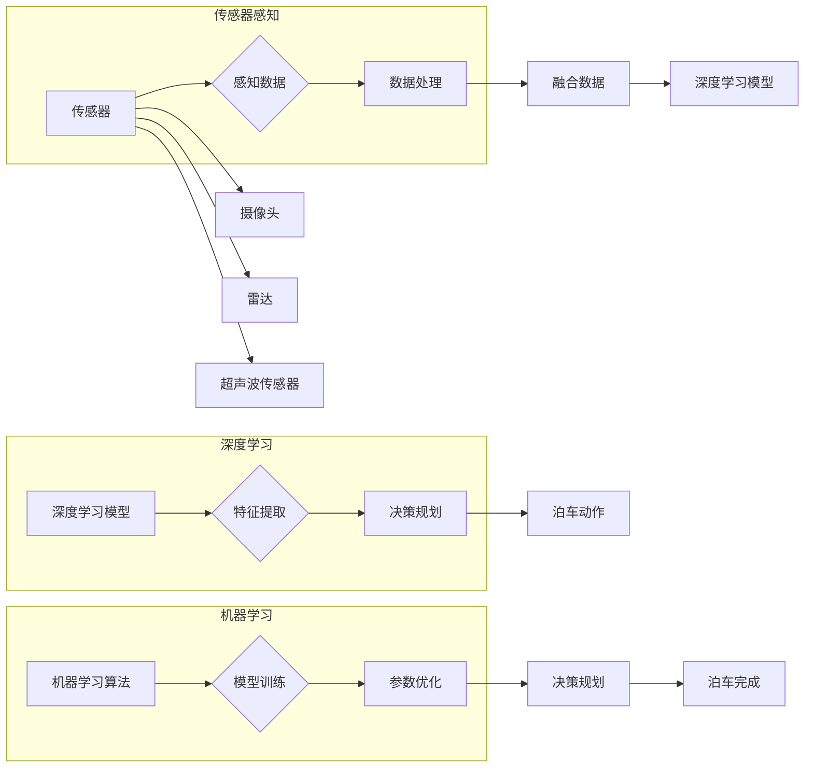

# 小米汽车的端到端泊车系统

> 关键词：小米汽车，端到端泊车，自动驾驶，深度学习，传感器融合，机器学习，视觉识别，决策规划

## 1. 背景介绍

随着科技的不断进步，自动驾驶技术正逐渐从科幻走向现实。在自动驾驶的诸多应用场景中，泊车系统是其中最为复杂和关键的环节之一。小米汽车作为国内领先的智能汽车品牌，其端到端泊车系统不仅体现了小米在自动驾驶领域的创新能力，也代表了智能汽车未来发展的趋势。

### 1.1 泊车难题

传统的泊车方式依赖于驾驶员的视觉和手动操作，不仅效率低下，而且在狭小的车位或复杂的停车环境中容易出错。自动驾驶泊车系统则旨在通过智能化的技术和算法，实现车辆在不依赖驾驶员操作的情况下，自动完成泊车过程。

### 1.2 小米泊车系统优势

小米汽车的端到端泊车系统具有以下优势：

- **高度自动化**：从搜索车位到泊车入位，全程无需驾驶员干预。
- **场景适应性强**：适用于多种停车环境，包括平行停车、垂直停车、斜角停车等。
- **安全可靠**：采用多传感器融合技术，确保泊车过程中的安全性和稳定性。
- **用户体验友好**：操作简单，用户可以通过语音或触控等方式控制泊车过程。

### 1.3 本文结构

本文将围绕小米汽车的端到端泊车系统展开，从核心概念、算法原理、项目实践、实际应用场景等方面进行全面解析，并展望未来发展趋势与挑战。

## 2. 核心概念与联系

### 2.1 核心概念

- **端到端泊车**：指从车辆启动泊车模式到泊车完成整个过程，均由自动驾驶系统自动完成，无需人工干预。
- **传感器融合**：将来自不同传感器的数据（如摄像头、雷达、超声波传感器等）进行整合，以获得更全面、准确的感知信息。
- **深度学习**：一种基于神经网络的学习方法，能够通过大量数据自动学习特征和模式，用于图像识别、语音识别等领域。
- **机器学习**：一种使计算机系统能够从数据中学习并做出决策的技术，包括监督学习、无监督学习、强化学习等。
- **决策规划**：根据感知信息和既定目标，制定合适的行动策略，实现泊车目标。

### 2.2 核心概念原理和架构 Mermaid 流程图



如图所示，端到端泊车系统通过传感器感知、深度学习、机器学习等核心概念相互关联，共同实现泊车功能。

## 3. 核心算法原理 & 具体操作步骤

### 3.1 算法原理概述

小米汽车的端到端泊车系统主要基于以下算法原理：

- **传感器融合**：通过融合摄像头、雷达、超声波传感器等数据，实现对周围环境的全面感知。
- **深度学习**：利用深度学习模型进行图像识别、障碍物检测等，为泊车决策提供依据。
- **机器学习**：通过机器学习算法进行模型训练和参数优化，提高泊车系统的鲁棒性和适应性。

### 3.2 算法步骤详解

1. **传感器数据采集**：摄像头、雷达、超声波传感器等设备采集车辆周围环境数据。
2. **数据处理**：对采集到的数据进行预处理，包括去噪、分割、特征提取等。
3. **深度学习模型**：利用深度学习模型进行障碍物检测、车道线检测等，提取环境信息。
4. **决策规划**：根据环境信息和泊车目标，制定泊车策略和动作序列。
5. **泊车动作**：执行泊车动作，实现车辆自动泊车。

### 3.3 算法优缺点

**优点**：

- **感知能力强**：融合多源数据，实现对周围环境的全面感知。
- **决策精度高**：深度学习模型能够精确识别障碍物和车道线。
- **泊车效率高**：自动化泊车，节省时间和人力成本。

**缺点**：

- **对环境依赖性强**：在恶劣天气或光线条件下，感知效果可能受到影响。
- **计算资源需求大**：深度学习模型和决策规划算法需要较大的计算资源。

### 3.4 算法应用领域

小米汽车的端到端泊车系统可应用于以下领域：

- **家用停车场**：方便用户在停车时无需手动操作，提高泊车效率。
- **商业停车场**：优化停车场管理，提高车位利用率和运营效率。
- **公共交通**：在公交车、出租车等交通工具上应用，提升出行体验。

## 4. 数学模型和公式 & 详细讲解 & 举例说明

### 4.1 数学模型构建

端到端泊车系统的数学模型主要包括以下部分：

1. **传感器数据处理模型**：用于对传感器数据进行预处理，如滤波、分割等。
2. **深度学习模型**：用于图像识别、障碍物检测等，如卷积神经网络（CNN）、循环神经网络（RNN）等。
3. **机器学习模型**：用于决策规划和参数优化，如支持向量机（SVM）、决策树等。

### 4.2 公式推导过程

以CNN为例，其基本原理如下：

- **卷积操作**：通过卷积核与输入图像进行卷积运算，提取图像特征。
- **激活函数**：对卷积后的特征进行非线性变换，如ReLU函数。
- **池化操作**：对激活后的特征进行降维，减少计算量。

### 4.3 案例分析与讲解

以下以停车场车位检测为例，讲解端到端泊车系统的应用。

**案例背景**：用户希望将车辆停入指定停车位，泊车系统需要识别车位并进行泊车操作。

**解决方案**：

1. **传感器数据处理**：摄像头采集车位图像，经过预处理后输入CNN模型。
2. **深度学习模型**：CNN模型对车位图像进行特征提取，识别出车位的位置和大小。
3. **机器学习模型**：根据车位信息和车辆尺寸，计算泊车路径和动作序列。
4. **泊车动作**：系统控制车辆按照计算出的路径进行泊车。

## 5. 项目实践：代码实例和详细解释说明

### 5.1 开发环境搭建

1. **硬件环境**：配置高性能计算设备，如GPU、CPU等。
2. **软件环境**：安装深度学习框架（如TensorFlow、PyTorch等）和机器学习库（如scikit-learn等）。

### 5.2 源代码详细实现

以下是一个简单的车位检测代码示例：

```python
import cv2
import numpy as np
import tensorflow as tf

# 加载预训练的深度学习模型
model = tf.keras.models.load_model('parking_space_model.h5')

# 加载图像
image = cv2.imread('parking_space.jpg')

# 对图像进行预处理
processed_image = cv2.resize(image, (224, 224))
processed_image = processed_image / 255.0

# 使用模型进行车位检测
prediction = model.predict(processed_image.reshape(1, 224, 224, 3))
parking_space = prediction > 0.5

# 显示检测结果
parking_space_image = np.where(parking_space, 255, 0).astype(np.uint8)
cv2.imshow('Parking Space', parking_space_image)
cv2.waitKey(0)
cv2.destroyAllWindows()
```

### 5.3 代码解读与分析

- 首先，加载预训练的深度学习模型。
- 然后，加载待检测图像并进行预处理。
- 使用模型对图像进行车位检测，得到车位检测结果。
- 最后，显示检测结果。

### 5.4 运行结果展示

运行上述代码后，将显示一个车位检测结果图像，其中车位区域为白色。

## 6. 实际应用场景

### 6.1 家庭停车场

在家庭停车场，端到端泊车系统可以帮助用户轻松停车，提高泊车效率。用户只需启动泊车模式，车辆即可自动完成泊车过程。

### 6.2 商业停车场

商业停车场可以采用端到端泊车系统实现智能停车管理，提高车位利用率。系统可以自动识别空车位，并将车辆引导至空车位。

### 6.3 公共交通

在公交车、出租车等交通工具上应用端到端泊车系统，可以提升乘客出行体验。例如，在机场、火车站等交通枢纽，车辆可以自动泊车，减少乘客等待时间。

## 7. 工具和资源推荐

### 7.1 学习资源推荐

1. 《深度学习》
2. 《机器学习实战》
3. 《自动驾驶系统设计》

### 7.2 开发工具推荐

1. TensorFlow
2. PyTorch
3. OpenCV

### 7.3 相关论文推荐

1. “Deep Learning for Real-Time 3D Object Detection from Single Camera”
2. “An Overview of Autonomous Parking Systems”
3. “Robust Parking System with 3D Point Clouds”

## 8. 总结：未来发展趋势与挑战

### 8.1 研究成果总结

本文介绍了小米汽车的端到端泊车系统，从核心概念、算法原理、项目实践、实际应用场景等方面进行了全面解析。研究表明，端到端泊车系统具有高度自动化、场景适应性强、安全可靠等优点，在家庭停车场、商业停车场、公共交通等领域具有广阔的应用前景。

### 8.2 未来发展趋势

1. **多传感器融合**：融合更多传感器数据，提高感知系统的鲁棒性和可靠性。
2. **深度学习模型优化**：研究更先进的深度学习模型，提高车位检测、障碍物检测等任务的精度。
3. **多智能体协同**：实现多车辆协同泊车，提高泊车效率。

### 8.3 面临的挑战

1. **感知系统鲁棒性**：在复杂多变的停车环境中，提高感知系统的鲁棒性。
2. **计算资源需求**：降低算法计算复杂度，降低计算资源需求。
3. **法律法规**：制定相关的法律法规，确保自动驾驶泊车系统的安全性。

### 8.4 研究展望

随着技术的不断进步，端到端泊车系统将在未来汽车领域发挥越来越重要的作用。相信通过科研人员和产业界的共同努力，端到端泊车系统将不断优化，为人类带来更加便捷、安全的出行体验。

## 9. 附录：常见问题与解答

**Q1：端到端泊车系统需要哪些传感器？**

A：端到端泊车系统通常需要以下传感器：

- 摄像头：用于采集车辆周围环境图像。
- 雷达：用于检测周围障碍物和距离信息。
- 超声波传感器：用于检测近距离障碍物。

**Q2：端到端泊车系统的关键技术是什么？**

A：端到端泊车系统的关键技术包括：

- 传感器融合
- 深度学习
- 机器学习
- 决策规划

**Q3：端到端泊车系统的应用场景有哪些？**

A：端到端泊车系统的应用场景包括：

- 家庭停车场
- 商业停车场
- 公共交通
- 高速公路

**Q4：端到端泊车系统的发展趋势是什么？**

A：端到端泊车系统的发展趋势包括：

- 多传感器融合
- 深度学习模型优化
- 多智能体协同

**Q5：端到端泊车系统面临的挑战有哪些？**

A：端到端泊车系统面临的挑战包括：

- 感知系统鲁棒性
- 计算资源需求
- 法律法规

作者：禅与计算机程序设计艺术 / Zen and the Art of Computer Programming