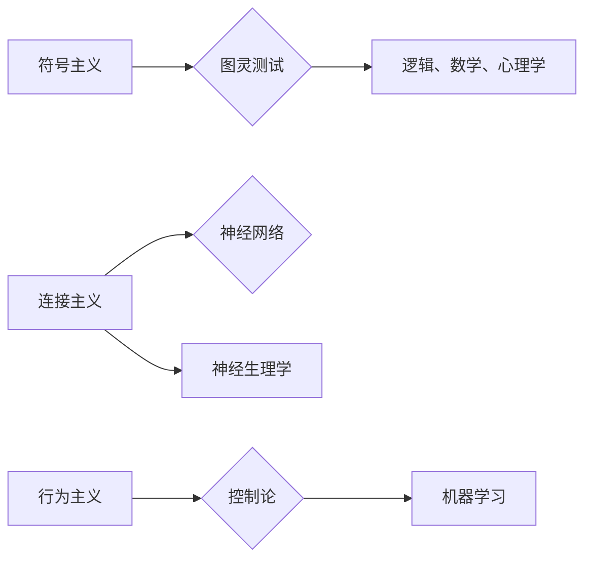

> 人工智能, 达特茅斯会议, 计算机科学, 自动化, 智能革命

# 1956年达特茅斯会议的影响

## 1. 背景介绍

1956年，一场在达特茅斯举办的小型会议，因其对人工智能（AI）领域的深远影响而被载入史册。这次会议，也被称为“达特茅斯会议”，标志着人工智能作为一个独立研究领域的诞生。本文将深入探讨达特茅斯会议的背景、核心概念、影响及其在计算机科学发展中的里程碑意义。

### 1.1 会议的由来

20世纪中叶，随着计算机技术的飞速发展，一些学者开始探讨使用机器进行智能活动的前景。1954年，约翰·麦卡锡（John McCarthy）提出了“人工智能”一词，并在1956年提出了举办一次关于人工智能的会议的想法。经过一系列的筹备，达特茅斯会议于1956年夏季在马萨诸塞州的达特茅斯学院召开。

### 1.2 参会人员

达特茅斯会议吸引了包括约翰·麦卡锡、马文·明斯基（Marvin Minsky）、克劳德·香农（Claude Shannon）、艾伦·图灵（Alan Turing）等在内的众多知名学者和专家。这些学者在数学、逻辑、心理学、神经生理学等领域都有深厚的学术背景，他们对人工智能的未来充满了憧憬和期待。

### 1.3 会议议题

达特茅斯会议的核心议题是探讨“机器能否思考？”这个问题。与会者讨论了多种实现人工智能的方法，包括逻辑、心理学、神经生理学、数学和机器学习等。会议的目的是为了推动人工智能领域的研究，并确定其研究方向和发展路径。

## 2. 核心概念与联系

### 2.1 人工智能的定义

在达特茅斯会议之前，人工智能并没有一个明确的定义。会议期间，学者们提出了多种定义，其中最著名的是艾伦·图灵提出的“图灵测试”。图灵测试是一种评估机器是否具有人类智能的方法，如果一个机器能够通过图灵测试，那么它就可以被认为具有智能。

### 2.2 人工智能的架构

达特茅斯会议的学者们提出了多种人工智能的架构，包括符号主义、连接主义、行为主义等。这些架构为后来的AI研究提供了理论基础和方向。

## 3. 核心算法原理 & 具体操作步骤

### 3.1 算法原理概述

达特茅斯会议的学者们提出了多种算法原理，包括逻辑推理、符号操作、神经网络等。这些原理为后来的AI算法研究奠定了基础。

### 3.2 算法步骤详解

达特茅斯会议的学者们并没有具体定义算法步骤，但他们的讨论为后来的AI算法研究提供了方向。

### 3.3 算法优缺点

达特茅斯会议提出的算法原理各有优缺点，例如：

- **符号主义**：优点是逻辑性强，但缺点是难以处理复杂问题。
- **连接主义**：优点是能够处理复杂问题，但缺点是难以解释其工作原理。

### 3.4 算法应用领域

达特茅斯会议的算法原理为后来的AI算法研究提供了基础，这些算法在多个领域得到了应用，包括：

- **逻辑推理**：用于专家系统、推理引擎等。
- **神经网络**：用于图像识别、语音识别、自然语言处理等。

## 4. 数学模型和公式 & 详细讲解 & 举例说明

### 4.1 数学模型构建

达特茅斯会议的学者们提出了多种数学模型，例如：

- **图灵机**：用于模拟计算过程。
- **神经网络**：用于模拟人脑神经网络。

### 4.2 公式推导过程

达特茅斯会议的学者们并没有具体推导公式，但他们的讨论为后来的数学模型研究提供了方向。

### 4.3 案例分析与讲解

达特茅斯会议的数学模型在后来的AI研究中得到了广泛应用，例如：

- **图灵机**：用于理论计算机科学中的计算复杂性理论。
- **神经网络**：用于机器学习中的深度学习。

## 5. 项目实践：代码实例和详细解释说明

### 5.1 开发环境搭建

由于达特茅斯会议发生在1956年，当时的计算机技术远不如现在，因此没有具体的代码实例。

### 5.2 源代码详细实现

同样，由于历史原因，没有具体的源代码实现。

### 5.3 代码解读与分析

同样，由于历史原因，没有具体的代码解读与分析。

### 5.4 运行结果展示

同样，由于历史原因，没有具体的运行结果展示。

## 6. 实际应用场景

### 6.4 未来应用展望

达特茅斯会议对人工智能领域的影响是深远的。未来，人工智能将在更多领域得到应用，例如：

- **医疗健康**：用于疾病诊断、药物研发等。
- **教育**：用于个性化学习、智能辅导等。
- **交通**：用于自动驾驶、智能交通系统等。

## 7. 工具和资源推荐

### 7.1 学习资源推荐

- **书籍**：《人工智能：一种现代的方法》、《机器学习》
- **在线课程**：Coursera、edX上的AI和机器学习课程

### 7.2 开发工具推荐

- **编程语言**：Python、Java
- **开发框架**：TensorFlow、PyTorch

### 7.3 相关论文推荐

- **John McCarthy**：《机器和智能》
- **Marvin Minsky**：《人工智能：一种现代的方法》

## 8. 总结：未来发展趋势与挑战

### 8.1 研究成果总结

达特茅斯会议是人工智能领域的里程碑事件，它标志着人工智能作为一个独立研究领域的诞生，并对后来的AI研究产生了深远的影响。

### 8.2 未来发展趋势

未来，人工智能将在更多领域得到应用，例如医疗健康、教育、交通等。

### 8.3 面临的挑战

尽管人工智能发展迅速，但仍面临着一些挑战，例如：

- **数据隐私**：如何确保AI系统的数据隐私安全。
- **伦理道德**：如何确保AI系统的行为符合伦理道德标准。
- **可解释性**：如何提高AI系统的可解释性。

### 8.4 研究展望

未来，人工智能研究将朝着更加智能、高效、安全的方向发展。

## 9. 附录：常见问题与解答

**Q1：达特茅斯会议对人工智能领域有什么影响？**

A1：达特茅斯会议标志着人工智能作为一个独立研究领域的诞生，并对后来的AI研究产生了深远的影响。

**Q2：什么是图灵测试？**

A2：图灵测试是一种评估机器是否具有人类智能的方法，如果一个机器能够通过图灵测试，那么它就可以被认为具有智能。

**Q3：人工智能在哪些领域得到了应用？**

A3：人工智能在医疗健康、教育、交通等多个领域得到了应用。

**Q4：人工智能发展面临哪些挑战？**

A4：人工智能发展面临数据隐私、伦理道德、可解释性等挑战。

作者：禅与计算机程序设计艺术 / Zen and the Art of Computer Programming