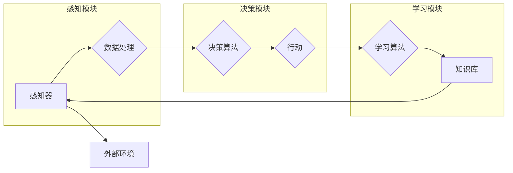

# 意识功能的自主系统模型

> 关键词：意识，自主系统，人工神经网络，机器学习，图灵测试，哲学，认知科学

## 1. 背景介绍
### 1.1 意识的哲学探讨
意识一直是哲学和认知科学领域中的一个核心问题。从古希腊的柏拉图到现代的认知科学家，关于意识本质的讨论从未停止。近年来，随着人工智能技术的飞速发展，构建具有意识功能的自主系统成为了研究的热点。

### 1.2 人工智能与意识的关系
人工智能作为一种模拟人类智能的技术，其发展与意识研究密切相关。一些研究者认为，随着人工智能技术的进步，机器可能会发展到具有意识的功能。

### 1.3 意识功能的自主系统模型的研究意义
研究意识功能的自主系统模型，不仅有助于我们更好地理解意识本身，还能推动人工智能技术的发展，为构建真正意义上的智能系统奠定基础。

### 1.4 本文结构
本文将首先介绍意识功能的概念，然后阐述自主系统模型的原理和架构，接着分析核心算法原理和操作步骤，最后探讨该模型在实际应用场景中的前景和挑战。

## 2. 核心概念与联系
### 2.1 意识功能
意识功能是指个体对外部世界和自身状态的感知、认知、情感和决策能力。这些能力是人类智能的核心特征，也是构建意识功能的自主系统模型的关键。

### 2.2 自主系统模型
自主系统模型是指能够自主感知环境、自主学习和适应环境变化的系统。该模型通常由感知模块、决策模块和学习模块组成。



### 2.3 意识功能的自主系统模型与相关技术的联系
意识功能的自主系统模型与以下技术密切相关：

- 人工神经网络：用于模拟大脑的神经网络结构和功能，实现感知、认知和决策等功能。
- 机器学习：用于从数据中学习规律，实现自主学习和适应环境变化的能力。
- 认知科学：为意识功能的自主系统模型提供理论基础和实验方法。

## 3. 核心算法原理 & 具体操作步骤
### 3.1 算法原理概述
意识功能的自主系统模型的核心算法主要包括感知算法、决策算法和学习算法。

- 感知算法：通过感知模块收集外部环境信息，并对数据进行预处理和特征提取。
- 决策算法：根据感知到的信息和知识库中的知识，进行决策并生成行动指令。
- 学习算法：从环境中学习新的知识和经验，不断优化感知、决策和学习模块。

### 3.2 算法步骤详解
以下是意识功能的自主系统模型的算法步骤详解：

1. 感知模块从外部环境中收集信息，如视觉、听觉、触觉等。
2. 数据处理模块对收集到的信息进行预处理和特征提取。
3. 决策模块根据预处理后的信息和知识库中的知识，进行决策并生成行动指令。
4. 行动模块根据决策模块的指令，执行相应的动作。
5. 学习模块从环境中学习新的知识和经验，不断优化感知、决策和学习模块。

### 3.3 算法优缺点
- 优点：能够实现自主感知、自主学习和自主决策，具有较高的灵活性和适应性。
- 缺点：算法复杂度高，需要大量的计算资源和训练数据。

### 3.4 算法应用领域
- 智能机器人：为机器人提供自主感知、学习和决策能力。
- 智能汽车：为汽车提供自动驾驶和智能交通管理能力。
- 智能医疗：为医疗设备提供诊断、治疗和康复能力。

## 4. 数学模型和公式 & 详细讲解 & 举例说明
### 4.1 数学模型构建
意识功能的自主系统模型的数学模型主要包括以下部分：

- 感知模块：使用卷积神经网络（CNN）或循环神经网络（RNN）等深度学习模型进行特征提取。
- 决策模块：使用支持向量机（SVM）、随机森林（RF）或深度神经网络（DNN）等进行决策。
- 学习模块：使用梯度下降（GD）或随机梯度下降（SGD）等方法进行模型优化。

### 4.2 公式推导过程
以下以感知模块的CNN模型为例，简要介绍公式推导过程。

- 卷积层：输入特征图 $X \in \mathbb{R}^{n \times n \times c}$，其中 $n$ 为特征图的尺寸，$c$ 为通道数。通过卷积核 $K \in \mathbb{R}^{k \times k \times c}$ 对输入特征图进行卷积操作，得到输出特征图 $Y \in \mathbb{R}^{n-k+1 \times n-k+1 \times c'}$，其中 $c'$ 为卷积核数量。

$$
Y = \sum_{i=1}^{c'} \sum_{j=1}^{n-k+1} \sum_{m=1}^{n-k+1} K \cdot X_{i,j-m+1,m} + b_i
$$

- 池化层：对输出特征图进行池化操作，降低特征图的尺寸。

$$
P = P_{i,j} = \max_{p \in [j-k+1,j+k]} \max_{q \in [j-k+1,j+k]} Y_{i,p,q}
$$

### 4.3 案例分析与讲解
以下以智能机器人为例，分析意识功能的自主系统模型的应用。

- 感知模块：使用深度相机获取环境图像，通过CNN模型提取特征，如物体位置、大小、颜色等。
- 决策模块：根据提取的特征和知识库中的知识，判断机器人应该执行的动作，如移动、避障、抓取等。
- 学习模块：通过与环境交互，不断学习新的知识和经验，优化感知、决策和学习模块。

## 5. 项目实践：代码实例和详细解释说明
### 5.1 开发环境搭建
- 操作系统：Linux或Windows
- 编程语言：Python
- 框架：TensorFlow或PyTorch
- 硬件：GPU或CPU

### 5.2 源代码详细实现
以下是一个简单的智能机器人感知模块的代码实例：

```python
import cv2
import numpy as np
import tensorflow as tf

def image_preprocessing(image):
    # 图像预处理
    image = cv2.resize(image, (224, 224))
    image = image / 255.0
    image = np.expand_dims(image, axis=0)
    return image

def load_model():
    # 加载预训练的CNN模型
    model = tf.keras.applications.VGG16(weights='imagenet', include_top=False)
    return model

def extract_features(model, image):
    # 提取特征
    features = model.predict(image)
    return features

# 读取图像
image_path = 'robot_image.jpg'
image = cv2.imread(image_path)
processed_image = image_preprocessing(image)
model = load_model()
features = extract_features(model, processed_image)
print(features)
```

### 5.3 代码解读与分析
以上代码展示了如何使用TensorFlow加载预训练的VGG16模型，并从输入图像中提取特征。在实际应用中，可以根据需要替换模型和特征提取方法。

### 5.4 运行结果展示
运行上述代码，输出结果为特征矩阵，包含了输入图像的特征信息。

## 6. 实际应用场景
### 6.1 智能机器人
智能机器人是意识功能的自主系统模型的主要应用场景之一。通过感知模块获取环境信息，决策模块进行决策，学习模块不断学习新的知识和经验，智能机器人可以自主完成各种任务。

### 6.2 智能汽车
智能汽车可以通过感知模块获取道路、交通标志、行人等信息，决策模块进行决策，学习模块不断学习新的驾驶技巧，实现自动驾驶。

### 6.3 智能医疗
智能医疗可以通过感知模块获取患者的影像、生理参数等信息，决策模块进行诊断和治疗方案制定，学习模块不断学习新的医疗知识，为患者提供更精准的治疗方案。

## 7. 工具和资源推荐
### 7.1 学习资源推荐
- 《机器学习》（周志华著）：介绍了机器学习的基本概念、原理和方法。
- 《深度学习》（Goodfellow等著）：介绍了深度学习的基本概念、原理和算法。
- 《认知科学导论》（Fodor等著）：介绍了认知科学的基本概念和理论。

### 7.2 开发工具推荐
- TensorFlow：一个开源的机器学习框架，可以用于构建和训练深度学习模型。
- PyTorch：一个开源的机器学习库，可以用于构建和训练深度学习模型。
- OpenCV：一个开源的计算机视觉库，可以用于图像处理和计算机视觉任务。

### 7.3 相关论文推荐
- “Artificial Intelligence: A Modern Approach”（Stuart Russell和Peter Norvig著）：人工智能领域的经典教材，介绍了人工智能的基本概念、原理和方法。
- “Deep Learning”（Ian Goodfellow、Yoshua Bengio和Aaron Courville著）：深度学习领域的经典教材，介绍了深度学习的基本概念、原理和算法。
- “Perception with Deep Learning”（Pedro Domingos著）：介绍了深度学习在计算机视觉和语音识别等领域的应用。

## 8. 总结：未来发展趋势与挑战
### 8.1 研究成果总结
本文介绍了意识功能的自主系统模型，阐述了其原理和架构，分析了核心算法原理和操作步骤，并探讨了其在实际应用场景中的前景和挑战。

### 8.2 未来发展趋势
未来，意识功能的自主系统模型将在以下几个方面取得进展：

- 模型结构更加复杂，能够更好地模拟人类大脑结构和功能。
- 训练算法更加高效，降低训练时间和计算资源消耗。
- 应用领域更加广泛，覆盖更多领域和场景。

### 8.3 面临的挑战
- 如何构建更加鲁棒和高效的模型结构。
- 如何优化训练算法，降低训练时间和计算资源消耗。
- 如何确保模型的安全性和可解释性。

### 8.4 研究展望
意识功能的自主系统模型是一个充满挑战和机遇的研究方向。随着人工智能技术的不断发展，我们有理由相信，未来一定能够构建出具有意识功能的自主系统，为人类社会带来更多福祉。

## 9. 附录：常见问题与解答
**Q1：意识功能的自主系统模型与人工智能有什么区别？**

A：意识功能的自主系统模型是一种具有感知、认知、情感和决策能力的系统，而人工智能是一种模拟人类智能的技术。意识功能的自主系统模型是人工智能的一个研究方向，旨在构建具有意识功能的智能系统。

**Q2：如何判断一个系统是否具有意识？**

A：目前还没有一个统一的判断标准。一些研究者提出，可以通过图灵测试来判断一个系统是否具有意识。图灵测试是一种判断机器是否具有智能的方法，如果机器能够通过图灵测试，那么它就可以被认为具有智能。

**Q3：意识功能的自主系统模型的应用前景如何？**

A：意识功能的自主系统模型在智能机器人、智能汽车、智能医疗等领域具有广泛的应用前景，可以为人类社会带来更多福祉。

**Q4：如何解决意识功能的自主系统模型的安全性问题？**

A：确保意识功能的自主系统模型的安全性需要从多个方面入手，包括模型设计、数据安全、算法安全等方面。例如，可以通过设计安全的模型结构、采用数据加密技术、设置安全限制等措施来确保模型的安全性。

---

作者：禅与计算机程序设计艺术 / Zen and the Art of Computer Programming