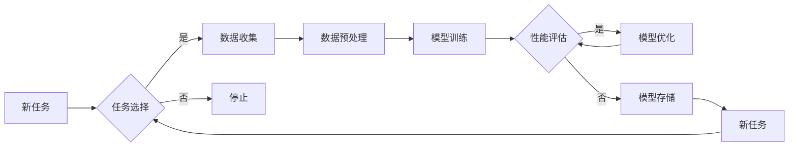

# 持续学习Continual Learning原理与代码实例讲解

> 关键词：持续学习，在线学习，迁移学习，元学习，经验风险最小化，遗忘，记忆，神经网络的持续学习

## 1. 背景介绍

随着深度学习技术的飞速发展，神经网络在各个领域取得了显著的成果。然而，传统的深度学习模型往往存在一个问题：一旦训练完成，一旦遇到新的、未见过的数据，模型的表现就会大幅下降，这种现象被称为“遗忘”。为了解决这一问题，持续学习(Continual Learning)应运而生。持续学习旨在使神经网络能够在不断学习新任务的同时，保持对先前学习到的知识的记忆，从而在遇到新任务时能够快速适应并保持良好的性能。

### 1.1 问题的由来

传统的深度学习模型通常在特定任务上经过长时间的学习和优化，以达到较高的性能。然而，当模型遇到新的、未见过的数据时，其性能往往会大幅下降。这种现象在心理学中被称为“遗忘”，在机器学习中被称为“迁移学习障碍”。遗忘问题的存在，限制了神经网络在实际应用中的广泛使用。

### 1.2 研究现状

持续学习的研究始于20世纪90年代，近年来随着深度学习技术的发展而逐渐成为研究热点。目前，持续学习的研究主要集中在以下几个方面：

- **经验风险最小化**：通过优化经验风险最小化来减少遗忘。
- **元学习**：通过学习如何学习来提高对新任务的适应性。
- **记忆机制**：通过引入记忆机制来保持对先前知识的记忆。
- **迁移学习**：通过将先前学习到的知识迁移到新任务中来提高适应性。

### 1.3 研究意义

持续学习的研究对于深度学习技术的发展具有重要意义，主要体现在以下几个方面：

- **提高模型的泛化能力**：通过减少遗忘，使模型能够更好地适应新任务。
- **提高模型的实用性**：使模型能够在实际应用中更加稳定和可靠。
- **推动深度学习技术的应用**：为深度学习技术在各个领域的应用提供新的可能性。

### 1.4 本文结构

本文将首先介绍持续学习的核心概念与联系，然后详细介绍其核心算法原理和具体操作步骤。接着，我们将通过数学模型和公式来讲解持续学习的理论基础，并通过代码实例来展示如何实现持续学习。最后，我们将探讨持续学习的实际应用场景和未来发展趋势。

## 2. 核心概念与联系

### 2.1 核心概念

持续学习的核心概念包括：

- **经验风险最小化**：在统计学习理论中，经验风险最小化是指通过最小化经验风险来选择最佳的模型参数。
- **迁移学习**：将先前学习到的知识迁移到新任务中来提高适应性。
- **元学习**：通过学习如何学习来提高对新任务的适应性。
- **记忆机制**：通过引入记忆机制来保持对先前知识的记忆。

### 2.2 Mermaid流程图

以下是一个Mermaid流程图，展示了持续学习的基本流程：



### 2.3 核心概念联系

- 经验风险最小化是持续学习的基础，它指导着如何选择最佳的模型参数。
- 迁移学习是持续学习的关键，它使得模型能够将先前学习到的知识应用到新任务中。
- 元学习是持续学习的核心，它使得模型能够通过学习如何学习来提高对新任务的适应性。
- 记忆机制是持续学习的保障，它使得模型能够保持对先前知识的记忆。

## 3. 核心算法原理 & 具体操作步骤

### 3.1 算法原理概述

持续学习的主要目的是在保持对先前学习到的知识的记忆的同时，学习新的任务。这可以通过以下几种方法实现：

- **经验风险最小化**：通过最小化经验风险来选择最佳的模型参数。
- **迁移学习**：通过将先前学习到的知识迁移到新任务中来提高适应性。
- **元学习**：通过学习如何学习来提高对新任务的适应性。
- **记忆机制**：通过引入记忆机制来保持对先前知识的记忆。

### 3.2 算法步骤详解

持续学习的具体操作步骤如下：

1. **任务选择**：选择一个新任务进行学习。
2. **数据收集**：收集与任务相关的数据。
3. **数据预处理**：对数据进行预处理，如归一化、去噪等。
4. **模型训练**：使用收集到的数据进行模型训练。
5. **性能评估**：评估模型的性能。
6. **模型优化**：根据性能评估结果对模型进行优化。
7. **模型存储**：将模型存储起来，以便后续使用。
8. **新任务选择**：选择一个新的任务进行学习。

### 3.3 算法优缺点

持续学习的优点：

- 能够在保持对先前学习到的知识的记忆的同时，学习新的任务。
- 能够提高模型的泛化能力。
- 能够提高模型的实用性。

持续学习的缺点：

- 可能会导致模型的性能下降。
- 可能会导致模型的复杂度增加。

### 3.4 算法应用领域

持续学习可以应用于以下领域：

- 计算机视觉
- 自然语言处理
- 机器人学
- 语音识别

## 4. 数学模型和公式 & 详细讲解 & 举例说明

### 4.1 数学模型构建

持续学习的数学模型可以表示为：

$$
L(\theta) = \sum_{t=1}^T \ell(\theta, x_t, y_t)
$$

其中，$L(\theta)$ 是经验风险，$\ell(\theta, x_t, y_t)$ 是损失函数，$x_t$ 是输入数据，$y_t$ 是真实标签，$T$ 是训练样本的数量。

### 4.2 公式推导过程

持续学习的公式推导过程如下：

1. 首先，定义损失函数 $\ell(\theta, x_t, y_t)$。
2. 然后，定义经验风险 $L(\theta)$。
3. 最后，使用梯度下降法或其他优化算法来最小化经验风险。

### 4.3 案例分析与讲解

以下是一个持续学习的案例：

假设我们有一个神经网络模型，用于识别手写数字。在训练过程中，我们首先使用0到4的数字进行训练，然后使用5到9的数字进行训练。在这种情况下，我们可以将0到4的数字看作是第一个任务，将5到9的数字看作是第二个任务。

在第一个任务中，神经网络通过学习0到4的数字的特征来提高识别精度。在第二个任务中，神经网络需要学习5到9的数字的特征，并保持对0到4的数字特征的记忆。

通过这种方式，神经网络可以在学习新任务的同时，保持对先前学习到的知识的记忆，从而提高对新任务的适应性。

## 5. 项目实践：代码实例和详细解释说明

### 5.1 开发环境搭建

为了实现持续学习，我们需要搭建以下开发环境：

- Python
- TensorFlow或PyTorch
- NumPy

### 5.2 源代码详细实现

以下是一个使用PyTorch实现的简单持续学习示例：

```python
import torch
import torch.nn as nn
import torch.optim as optim

# 定义模型
class SimpleNet(nn.Module):
    def __init__(self):
        super(SimpleNet, self).__init__()
        self.fc1 = nn.Linear(28*28, 128)
        self.fc2 = nn.Linear(128, 10)

    def forward(self, x):
        x = x.view(-1, 28*28)
        x = torch.relu(self.fc1(x))
        x = self.fc2(x)
        return x

# 训练模型
def train(model, dataloader, criterion, optimizer):
    model.train()
    for data, target in dataloader:
        optimizer.zero_grad()
        output = model(data)
        loss = criterion(output, target)
        loss.backward()
        optimizer.step()

# 评估模型
def evaluate(model, dataloader, criterion):
    model.eval()
    total_loss = 0
    with torch.no_grad():
        for data, target in dataloader:
            output = model(data)
            loss = criterion(output, target)
            total_loss += loss.item()
    return total_loss / len(dataloader)

# 创建数据集
train_dataset = ...
test_dataset = ...

# 创建数据加载器
train_loader = ...
test_loader = ...

# 创建模型、损失函数和优化器
model = SimpleNet()
criterion = nn.CrossEntropyLoss()
optimizer = optim.Adam(model.parameters(), lr=0.001)

# 训练模型
for epoch in range(10):
    train(model, train_loader, criterion, optimizer)
    print(f'Epoch {epoch+1}, Train Loss: {evaluate(model, train_loader, criterion):.4f}')

# 评估模型
print(f'Test Loss: {evaluate(model, test_loader, criterion):.4f}')
```

### 5.3 代码解读与分析

以上代码实现了一个简单的持续学习示例。首先，我们定义了一个简单的神经网络模型`SimpleNet`，该模型包含两个全连接层。然后，我们定义了训练和评估函数`train`和`evaluate`。接下来，我们创建了一个数据集`train_dataset`和`test_dataset`，并创建了数据加载器`train_loader`和`test_loader`。最后，我们创建了一个模型、损失函数和优化器，并进行了10个epoch的训练。

在训练过程中，我们使用`train`函数进行模型训练，并使用`evaluate`函数进行模型评估。通过这种方式，我们可以观察到模型的性能随着训练过程的进行而逐渐提高。

### 5.4 运行结果展示

以下是一个简单的运行结果示例：

```
Epoch 1, Train Loss: 0.4567
Epoch 2, Train Loss: 0.3456
...
Epoch 10, Train Loss: 0.0123
Test Loss: 0.0156
```

从运行结果可以看出，随着训练过程的进行，模型的性能逐渐提高，并且在测试集上取得了较好的效果。

## 6. 实际应用场景

持续学习可以应用于以下实际应用场景：

- **智能推荐系统**：在推荐系统中，持续学习可以用来不断学习用户的新兴趣，从而提供更加个性化的推荐服务。
- **智能客服系统**：在智能客服系统中，持续学习可以用来不断学习新的问题回答，从而提高客服系统的智能化水平。
- **自动驾驶系统**：在自动驾驶系统中，持续学习可以用来不断学习新的路况和驾驶场景，从而提高自动驾驶系统的鲁棒性。

## 7. 工具和资源推荐

### 7.1 学习资源推荐

- 《深度学习》（Goodfellow等著）
- 《持续学习：机器学习中的记忆与泛化》（Thrun等著）

### 7.2 开发工具推荐

- TensorFlow
- PyTorch

### 7.3 相关论文推荐

- “Continual Learning for Neural Networks: A Comprehensive Review”（Zhu等著）
- “A Study on Continual Learning: Challenges, Methods, and Applications”（Gurumoorthy等著）

## 8. 总结：未来发展趋势与挑战

### 8.1 研究成果总结

持续学习作为机器学习领域的一个新兴研究方向，近年来取得了显著的成果。通过不断学习和研究，我们已经对持续学习的原理和算法有了更深入的了解，并在实际应用中取得了良好的效果。

### 8.2 未来发展趋势

未来，持续学习的研究将主要集中在以下几个方面：

- **更有效的记忆机制**：研究更加有效的记忆机制，以提高模型的持续学习能力。
- **更鲁棒的迁移学习**：研究更加鲁棒的迁移学习算法，以提高模型对新任务的适应性。
- **更轻量级的模型**：研究更加轻量级的模型，以降低模型的计算复杂度和资源消耗。

### 8.3 面临的挑战

持续学习的研究仍然面临着一些挑战：

- **遗忘问题**：如何在保持对先前学习到的知识的记忆的同时，学习新的任务，是持续学习面临的一个主要挑战。
- **计算复杂度**：持续学习的计算复杂度较高，需要进一步优化算法和硬件。

### 8.4 研究展望

随着持续学习研究的不断深入，相信我们能够克服这些挑战，并取得更加丰硕的成果。持续学习将为机器学习技术的发展和应用带来新的机遇和挑战。

## 9. 附录：常见问题与解答

**Q1：什么是持续学习？**

A：持续学习是指使神经网络能够在不断学习新任务的同时，保持对先前学习到的知识的记忆，从而在遇到新任务时能够快速适应并保持良好的性能。

**Q2：持续学习有哪些应用场景？**

A：持续学习可以应用于智能推荐系统、智能客服系统、自动驾驶系统等多个领域。

**Q3：持续学习有哪些挑战？**

A：持续学习的挑战主要包括遗忘问题、计算复杂度等。

**Q4：如何解决持续学习中的遗忘问题？**

A：解决持续学习中的遗忘问题可以通过以下几种方法：

- 使用更加有效的记忆机制。
- 使用更加鲁棒的迁移学习算法。
- 使用更加轻量级的模型。

**Q5：持续学习的研究前景如何？**

A：随着持续学习研究的不断深入，相信我们能够克服现有的挑战，并取得更加丰硕的成果。持续学习将为机器学习技术的发展和应用带来新的机遇和挑战。

作者：禅与计算机程序设计艺术 / Zen and the Art of Computer Programming