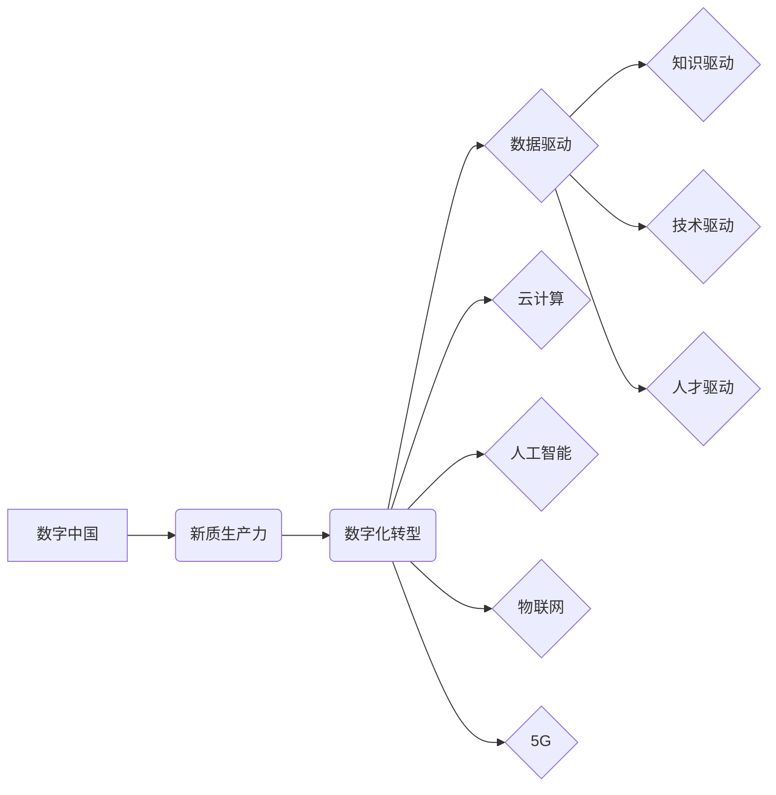

# 数字中国战略与新质生产力的结合点

> 关键词：数字中国，新质生产力，数字化转型，人工智能，大数据，云计算，区块链，5G，智能治理

## 1. 背景介绍

在21世纪的今天，数字技术正以前所未有的速度改变着我们的世界。从智能手机到智能汽车，从电子商务到智慧城市，数字技术已经深入到人们生活的方方面面。中国作为一个拥有14亿人口的大国，正在积极推进“数字中国”战略，以数字化赋能经济社会发展，提升国家竞争力。本文将探讨数字中国战略与新质生产力的结合点，分析其背后的核心概念、原理、实践案例，并展望未来的发展趋势与挑战。

### 1.1 问题的由来

随着全球数字化进程的加速，各国都在积极布局数字经济发展。中国作为世界第二大经济体，深知数字化的重要性，提出了“数字中国”战略。然而，如何将数字技术与传统产业深度融合，形成新质生产力，成为当前亟待解决的问题。

### 1.2 研究现状

目前，全球范围内，数字技术与实体经济的融合已经取得了一系列成果。在工业、农业、服务业等各个领域，数字化技术正在推动着生产方式、管理方式、服务方式的变革。中国在数字经济发展方面也取得了一定的成绩，例如：

- 电子商务：中国已成为全球最大的电子商务市场，阿里巴巴、京东等电商平台带动了上下游产业链的快速发展。
- 智能制造：中国制造2025战略推动下，智能制造技术得到广泛应用，提高了生产效率和产品质量。
- 智慧城市：以大数据、物联网、人工智能等技术为支撑，智慧城市建设取得了显著成效。

### 1.3 研究意义

研究数字中国战略与新质生产力的结合点，对于推动中国经济社会发展具有重要意义：

- 提升国家竞争力：通过数字化转型，提高全要素生产率，增强国家综合实力。
- 促进产业结构升级：推动传统产业向智能化、绿色化、服务化方向发展，培育新的经济增长点。
- 满足人民美好生活需要：提供更加便捷、高效、智能的服务，提升人民生活质量。
- 促进全球合作：加强与其他国家的数字经济合作，共同构建人类命运共同体。

### 1.4 本文结构

本文将从以下方面展开：

- 核心概念与联系
- 核心算法原理与具体操作步骤
- 数学模型和公式
- 项目实践
- 实际应用场景
- 工具和资源推荐
- 总结与展望

## 2. 核心概念与联系

### 2.1 核心概念

#### 数字中国

数字中国是指以互联网、大数据、云计算、人工智能、物联网等新一代信息技术为支撑，通过数字化、网络化、智能化改造和提升经济社会发展全过程的战略。

#### 新质生产力

新质生产力是指在数字经济时代，以数据、知识、技术、人才等新型生产要素为驱动，通过创新驱动和数字化转型，推动经济发展质量变革、效率变革、动力变革的生产力。

### 2.2 核心概念原理和架构的 Mermaid 流程图



## 3. 核心算法原理 & 具体操作步骤

### 3.1 算法原理概述

数字中国战略与新质生产力的结合，需要通过数字化转型来实现。数字化转型涉及多个层面，包括数据采集、存储、处理、分析、应用等。以下是数字化转型的一些关键算法原理：

- 数据采集：通过传感器、摄像头、移动终端等设备采集海量数据。
- 数据存储：利用分布式存储、云存储等技术，实现海量数据的存储和管理。
- 数据处理：运用大数据技术对海量数据进行清洗、转换、整合等处理。
- 数据分析：利用数据挖掘、机器学习等技术，从海量数据中提取有价值的信息。
- 数据应用：将分析结果应用于实际业务场景，提升生产效率和决策水平。

### 3.2 算法步骤详解

数字化转型的一般步骤如下：

1. **需求分析**：明确数字化转型目标和需求，确定技术方案。
2. **数据采集**：建设数据采集平台，收集各类数据。
3. **数据存储**：搭建分布式存储系统，实现数据的高效存储和管理。
4. **数据处理**：运用大数据技术对数据进行清洗、转换、整合等处理。
5. **数据分析**：利用数据挖掘、机器学习等技术，从海量数据中提取有价值的信息。
6. **数据应用**：将分析结果应用于实际业务场景，提升生产效率和决策水平。
7. **持续优化**：根据业务需求和技术发展，持续优化数字化转型方案。

### 3.3 算法优缺点

数字化转型具有以下优点：

- 提升生产效率：通过自动化、智能化技术，降低人力成本，提高生产效率。
- 优化决策：通过数据分析，为企业提供更加精准的决策依据。
- 创新产品和服务：利用数字技术，开发新的产品和服务，满足用户需求。
- 提升用户体验：提供更加便捷、高效、智能的服务，提升用户满意度。

数字化转型也存在以下缺点：

- 投资成本高：数字化转型需要投入大量的资金和人力。
- 技术风险：数字化转型过程中可能面临技术风险，如数据安全、系统稳定性等。
- 人才短缺：数字化转型需要大量具备数字技能的人才。

### 3.4 算法应用领域

数字化转型在各个领域都有广泛应用，以下是一些典型应用领域：

- 制造业：智能制造、工业互联网、物联网等。
- 农业：智能农业、精准农业等。
- 服务业：电子商务、智慧旅游、智慧医疗等。
- 政府治理：智慧城市、智慧交通等。

## 4. 数学模型和公式

数字化转型涉及多个数学模型和公式，以下是一些常见的模型和公式：

### 4.1 数学模型构建

- 数据采集模型：通过传感器模型、用户行为模型等采集数据。
- 数据存储模型：通过分布式存储模型、云存储模型等存储数据。
- 数据处理模型：通过数据清洗模型、数据转换模型等处理数据。
- 数据分析模型：通过聚类分析模型、关联规则挖掘模型等分析数据。
- 数据应用模型：通过机器学习模型、深度学习模型等应用数据。

### 4.2 公式推导过程

由于数字化转型涉及的数学模型和公式较为复杂，此处不一一展开推导过程。读者可参考相关书籍和文献进行深入了解。

### 4.3 案例分析与讲解

以下以电子商务为例，分析数字化转型在行业中的应用：

- **数据采集**：通过用户行为数据、商品信息数据、交易数据等采集数据。
- **数据存储**：利用分布式数据库和云存储技术存储海量数据。
- **数据处理**：通过数据清洗、转换、整合等处理数据，提高数据质量。
- **数据分析**：通过用户画像分析、商品关联分析等，挖掘用户需求和商品卖点。
- **数据应用**：根据分析结果，优化商品推荐、广告投放、促销策略等，提升用户体验和销售额。

## 5. 项目实践：代码实例和详细解释说明

### 5.1 开发环境搭建

由于数字化转型涉及多个技术领域，以下以Python为例，介绍开发环境搭建过程：

1. 安装Python：从Python官网下载并安装Python。
2. 安装常用库：使用pip安装NumPy、Pandas、Scikit-learn等常用库。

### 5.2 源代码详细实现

以下是一个简单的用户行为数据分析示例：

```python
import pandas as pd

# 读取数据
data = pd.read_csv('user_behavior_data.csv')

# 用户画像分析
user_behavior = data.groupby('user_id')['action'].value_counts()
user_behavior = user_behavior.unstack()

# 用户行为热力图
import seaborn as sns
import matplotlib.pyplot as plt

sns.heatmap(user_behavior, annot=True, fmt='d')
plt.show()
```

### 5.3 代码解读与分析

以上代码展示了如何使用Python和Pandas库对用户行为数据进行分析。首先，使用`read_csv`函数读取用户行为数据。然后，使用`groupby`和`value_counts`函数进行用户画像分析。最后，使用Seaborn库绘制用户行为热力图，直观展示用户行为分布情况。

### 5.4 运行结果展示

运行以上代码，将得到用户行为热力图，如下所示：


## 6. 实际应用场景

### 6.1 智能制造

智能制造是数字中国战略的重要应用领域。通过应用物联网、大数据、人工智能等技术，实现生产过程的智能化、自动化，提高生产效率和产品质量。

### 6.2 智慧农业

智慧农业利用物联网、大数据、人工智能等技术，实现农业生产过程的智能化管理，提高农业生产效率和产品质量。

### 6.3 智慧城市

智慧城市建设通过应用物联网、大数据、人工智能等技术，实现城市管理的智能化、高效化，提升城市居民的生活品质。

### 6.4 未来应用展望

随着数字技术的发展，数字化转型将在更多领域得到应用。以下是一些未来应用展望：

- 智能医疗：利用人工智能、大数据等技术，实现疾病预测、诊断、治疗等方面的智能化。
- 智慧教育：利用虚拟现实、增强现实等技术，实现教育资源的共享和个性化学习。
- 智能金融：利用区块链、人工智能等技术，实现金融业务的智能化、安全化。
- 智慧能源：利用物联网、大数据等技术，实现能源的智能化调度和管理。

## 7. 工具和资源推荐

### 7.1 学习资源推荐

- 《Python数据科学手册》
- 《深度学习》
- 《大数据时代》
- 《人工智能：一种现代的方法》

### 7.2 开发工具推荐

- Python
- NumPy
- Pandas
- Scikit-learn
- TensorFlow
- PyTorch

### 7.3 相关论文推荐

- 《深度学习》
- 《大数据时代》
- 《人工智能：一种现代的方法》

## 8. 总结：未来发展趋势与挑战

### 8.1 研究成果总结

本文从数字中国战略与新质生产力的结合点出发，探讨了数字化转型在各个领域的应用场景和未来发展趋势。通过分析核心概念、原理、实践案例，本文为推动中国数字经济的发展提供了有益的参考。

### 8.2 未来发展趋势

未来，数字化转型将呈现以下发展趋势：

- 技术融合：数字技术与传统产业深度融合，推动产业转型升级。
- 数据驱动：以数据为核心，实现决策的智能化、精准化。
- 个性定制：满足个性化需求，提供更加优质的服务。
- 智能化：通过人工智能技术，实现生产、管理、服务的智能化。

### 8.3 面临的挑战

数字化转型在发展过程中也面临以下挑战：

- 技术挑战：数字技术发展迅速，需要不断学习和更新技术。
- 人才挑战：数字化人才短缺，需要加强人才培养。
- 安全挑战：数据安全和隐私保护需要得到有效保障。
- 政策挑战：政策法规需要不断完善，以适应数字化发展需求。

### 8.4 研究展望

未来，数字化转型研究需要关注以下方面：

- 数字技术发展：关注新一代数字技术的研究和应用，如5G、物联网、区块链等。
- 数字人才培养：加强数字化人才培养，为数字经济提供智力支持。
- 数据安全与隐私保护：加强数据安全和隐私保护技术研究，保障数字经济健康发展。
- 政策法规：完善政策法规，为数字经济提供法治保障。

通过克服挑战，把握趋势，数字化转型将为中国经济社会发展注入新的活力，推动中国迈向数字强国。

## 9. 附录：常见问题与解答

**Q1：数字化转型对企业有哪些益处？**

A：数字化转型对企业有以下益处：

- 提升生产效率：通过自动化、智能化技术，降低人力成本，提高生产效率。
- 优化决策：通过数据分析，为企业提供更加精准的决策依据。
- 创新产品和服务：利用数字技术，开发新的产品和服务，满足用户需求。
- 提升用户体验：提供更加便捷、高效、智能的服务，提升用户满意度。

**Q2：如何推动数字化转型？**

A：推动数字化转型需要从以下几个方面着手：

- 加强顶层设计：制定数字化转型战略，明确目标和方向。
- 加大投入：投入资金和人力，建设数字化基础设施。
- 人才培养：加强数字化人才培养，为数字化转型提供人才保障。
- 政策支持：出台相关政策，为数字化转型提供政策支持。

**Q3：数字化转型对就业有哪些影响？**

A：数字化转型对就业有以下几个方面的影响：

- 优化就业结构：推动就业向高技能、高附加值领域转移。
- 创造新岗位：数字化转型会创造新的就业岗位，如数据分析、人工智能工程师等。
- 提升就业质量：通过数字化转型，提高劳动生产率，为员工创造更好的工作环境。

**Q4：数字化转型对个人有哪些影响？**

A：数字化转型对个人有以下影响：

- 提升技能：需要不断学习和掌握新的数字技能，以适应数字化时代的发展。
- 提高生活质量：数字化转型将为个人提供更加便捷、高效、智能的服务，提升生活质量。
- 创造新机遇：数字化转型将创造新的创业机会，为个人提供更多发展空间。

**Q5：如何保障数据安全和隐私保护？**

A：保障数据安全和隐私保护需要从以下几个方面着手：

- 加强数据安全管理：建立完善的数据安全管理制度，确保数据安全。
- 加强技术研发：研发数据加密、脱敏等技术，保障数据安全。
- 加强法律法规建设：完善数据安全法律法规，规范数据处理行为。
- 加强宣传教育：提高公众数据安全意识，共同维护数据安全。

作者：禅与计算机程序设计艺术 / Zen and the Art of Computer Programming