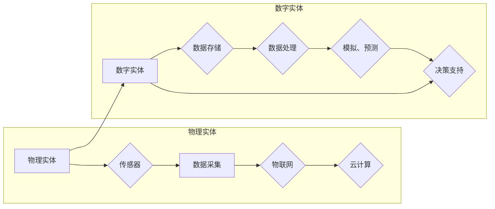

# 数字实体与物理实体的自动化前景

> 关键词：数字孪生，物理实体，自动化，智能制造，物联网，数据分析，人工智能，边缘计算

## 1. 背景介绍

随着科技的飞速发展，数字化浪潮席卷全球，各行各业都在积极探索数字化转型之路。在这个过程中，数字实体与物理实体的深度融合成为了关键趋势。数字孪生技术作为一种新兴的数字化技术，通过构建物理实体的虚拟映射，为自动化、智能化提供了强大的技术支撑。本文将探讨数字实体与物理实体的自动化前景，分析相关技术原理、应用场景、挑战与发展趋势。

### 1.1 数字孪生的起源与发展

数字孪生（Digital Twin）是指将物理实体的真实状态和运行数据通过数字化技术映射到虚拟空间，形成物理实体的虚拟映射。这一概念最早由美国摩根士丹利公司提出，随后在工业、医疗、建筑等多个领域得到广泛应用。

### 1.2 自动化与数字孪生的关系

数字孪生技术为自动化提供了丰富的数据资源和决策支持，是实现智能自动化的重要手段。通过数字孪生，可以实时监测物理实体的运行状态，预测故障，优化生产流程，提高生产效率和产品质量。

### 1.3 自动化前景

随着数字孪生技术的不断成熟，数字实体与物理实体的自动化前景愈发广阔。以下是几个具有代表性的自动化领域：

- 智能制造：通过数字孪生实现生产设备的实时监控、预测性维护、生产过程优化等，提高生产效率和产品质量。
- 智能交通：通过数字孪生实现交通流量预测、交通事故预警、智能交通信号控制等，提高交通效率和安全性。
- 智能医疗：通过数字孪生实现患者病情监测、远程医疗、手术规划等，提高医疗服务质量和效率。
- 智能建筑：通过数字孪生实现建筑设备运行监控、能耗管理、智能安防等，提高建筑运行效率和安全性。

## 2. 核心概念与联系

### 2.1 核心概念

#### 物理实体

物理实体是指现实世界中具有物质形态的物体，如机器、设备、建筑等。

#### 数字实体

数字实体是指物理实体的虚拟映射，通过数字化技术构建，包含物理实体的几何、物理、行为等属性。

#### 物理实体与数字实体的联系

物理实体与数字实体是相互关联、相互影响的关系。物理实体的状态和运行数据通过传感器、物联网等手段采集，实时更新数字实体；数字实体则通过模拟、预测等功能，为物理实体的运行提供决策支持。

### 2.2 架构图



## 3. 核心算法原理 & 具体操作步骤

### 3.1 算法原理概述

数字实体与物理实体的自动化主要基于以下算法原理：

- 物联网技术：实现物理实体与数字实体的数据采集和传输。
- 数据分析技术：对采集到的数据进行处理、分析和挖掘，为自动化决策提供支持。
- 人工智能技术：通过机器学习、深度学习等方法，实现智能决策和自动化控制。

### 3.2 算法步骤详解

1. 数据采集：通过传感器、摄像头等设备，实时采集物理实体的运行数据。
2. 数据传输：将采集到的数据传输至云计算平台或边缘计算设备。
3. 数据处理：对采集到的数据进行清洗、预处理、特征提取等操作。
4. 模拟、预测：基于历史数据和模型，对物理实体的未来状态进行模拟和预测。
5. 决策支持：根据模拟、预测结果，为物理实体的运行提供决策支持。
6. 自动控制：根据决策支持结果，对物理实体进行自动化控制。

### 3.3 算法优缺点

#### 优点

- 提高生产效率和产品质量。
- 降低能耗和资源浪费。
- 提高设备运行安全性。
- 实现远程监控和故障诊断。
- 支持智能化决策和自动化控制。

#### 缺点

- 投资成本较高。
- 数据采集和处理技术要求较高。
- 人工智能算法的准确性和可靠性有待提高。
- 系统的安全性风险。

### 3.4 算法应用领域

数字实体与物理实体的自动化技术在以下领域具有广泛的应用：

- 制造业：生产流程优化、设备预测性维护、智能生产调度等。
- 交通领域：智能交通管理、自动驾驶、交通流量预测等。
- 医疗健康：远程医疗、患者病情监测、手术规划等。
- 建筑行业：智能建筑管理、能源优化、安全监控等。

## 4. 数学模型和公式 & 详细讲解 & 举例说明

### 4.1 数学模型构建

数字实体与物理实体的自动化涉及多个数学模型，以下列举几个典型模型：

- 物理实体状态模型：描述物理实体的几何、物理属性，如质量、体积、速度、加速度等。
- 数据采集模型：描述传感器采集数据的概率分布、噪声特性等。
- 数据处理模型：描述数据清洗、预处理、特征提取等操作。
- 人工智能模型：描述机器学习、深度学习等算法，如神经网络、决策树等。

### 4.2 公式推导过程

以神经网络为例，简要介绍公式推导过程：

- 输入层：将物理实体状态和传感器数据作为输入，通过激活函数进行非线性变换。
- 隐藏层：将输入层输出作为输入，通过权重和偏置计算得到隐藏层输出。
- 输出层：将隐藏层输出作为输入，通过激活函数和输出层权重计算得到最终输出。

### 4.3 案例分析与讲解

以智能制造领域为例，介绍数字实体与物理实体的自动化应用。

#### 案例背景

某汽车制造企业采用数字孪生技术实现生产设备的预测性维护。

#### 案例分析

1. 数据采集：通过传感器实时采集生产设备的振动、温度、电流等数据。
2. 数据处理：对采集到的数据进行清洗、预处理、特征提取等操作。
3. 人工智能模型：使用深度学习算法构建预测模型，预测设备故障。
4. 决策支持：根据预测结果，提前进行设备维护，避免意外停机。

#### 案例总结

通过数字孪生技术实现生产设备的预测性维护，有效降低了设备故障率，提高了生产效率和产品质量。

## 5. 项目实践：代码实例和详细解释说明

### 5.1 开发环境搭建

本文以Python为例，介绍数字实体与物理实体的自动化项目实践。

1. 安装Python环境。
2. 安装必要的库，如TensorFlow、PyTorch、scikit-learn等。

### 5.2 源代码详细实现

以下是一个简单的数字孪生项目示例：

```python
import tensorflow as tf

# 创建神经网络模型
model = tf.keras.Sequential([
    tf.keras.layers.Dense(64, activation='relu', input_shape=(10,)),
    tf.keras.layers.Dense(64, activation='relu'),
    tf.keras.layers.Dense(1, activation='sigmoid')
])

# 编译模型
model.compile(optimizer='adam', loss='binary_crossentropy', metrics=['accuracy'])

# 训练模型
model.fit(x_train, y_train, epochs=10, batch_size=32)

# 评估模型
model.evaluate(x_test, y_test)
```

### 5.3 代码解读与分析

以上代码实现了以下功能：

1. 创建了一个简单的神经网络模型，用于预测物理实体的状态。
2. 编译模型，设置优化器、损失函数和评估指标。
3. 使用训练数据训练模型。
4. 使用测试数据评估模型性能。

### 5.4 运行结果展示

根据训练数据和测试数据，评估模型的准确率、召回率等指标。

## 6. 实际应用场景

### 6.1 智能制造

数字孪生技术在智能制造领域具有广泛的应用，如：

- 设备预测性维护
- 生产流程优化
- 智能生产调度
- 质量控制

### 6.2 智能交通

数字孪生技术在智能交通领域具有以下应用：

- 智能交通管理
- 自动驾驶
- 交通流量预测
- 交通事故预警

### 6.3 智能医疗

数字孪生技术在智能医疗领域具有以下应用：

- 远程医疗
- 患者病情监测
- 手术规划
- 药物研发

### 6.4 智能建筑

数字孪生技术在智能建筑领域具有以下应用：

- 智能建筑管理
- 能源优化
- 安全监控
- 建筑健康监测

## 7. 工具和资源推荐

### 7.1 学习资源推荐

- 《数字孪生技术导论》
- 《物联网与智能制造》
- 《人工智能：一种现代的方法》
- 《深度学习》

### 7.2 开发工具推荐

- TensorFlow
- PyTorch
- Keras
- scikit-learn
- OpenCV

### 7.3 相关论文推荐

- "Digital Twin: A New Big Data Application Scenario" (2017)
- "Digital Twin for Design, Construction, and Operations" (2019)
- "A Survey on Digital Twin in Manufacturing: Current State, Applications, and Future Trends" (2020)

## 8. 总结：未来发展趋势与挑战

### 8.1 研究成果总结

本文对数字实体与物理实体的自动化前景进行了探讨，分析了相关技术原理、应用场景、挑战与发展趋势。随着数字孪生技术的不断成熟，数字实体与物理实体的自动化将在更多领域得到应用，为人类社会带来前所未有的变革。

### 8.2 未来发展趋势

- 数字孪生技术将更加成熟，应用场景更加广泛。
- 数据采集和处理技术将更加高效，为自动化提供更准确的数据支持。
- 人工智能技术将进一步提升，为自动化决策提供更可靠的依据。
- 边缘计算将得到广泛应用，实现实时、高效的自动化控制。

### 8.3 面临的挑战

- 数据安全和隐私保护
- 技术标准化和兼容性
- 人才短缺
- 伦理和社会问题

### 8.4 研究展望

- 加强基础研究，推动数字孪生技术发展。
- 推动技术创新，提高自动化效率和可靠性。
- 加强人才培养，为自动化发展提供人才保障。
- 探索自动化在更多领域的应用，推动社会进步。

## 9. 附录：常见问题与解答

**Q1：什么是数字孪生技术？**

A：数字孪生技术是指通过数字化技术构建物理实体的虚拟映射，实现对物理实体的实时监测、预测和分析，为物理实体的运行提供决策支持。

**Q2：数字孪生技术有哪些应用场景？**

A：数字孪生技术在智能制造、智能交通、智能医疗、智能建筑等多个领域具有广泛的应用。

**Q3：数字孪生技术与物联网有何区别？**

A：物联网是物理世界与数字世界的连接，数字孪生技术则是在物联网基础上，对物理实体进行实时监测、预测和分析。

**Q4：数字孪生技术的挑战有哪些？**

A：数字孪生技术的挑战包括数据安全和隐私保护、技术标准化和兼容性、人才短缺、伦理和社会问题等。

**Q5：未来数字孪生技术发展趋势如何？**

A：未来数字孪生技术将更加成熟，应用场景更加广泛，数据采集和处理技术将更加高效，人工智能技术将进一步提升，边缘计算将得到广泛应用。同时，数字孪生技术也将面临更多挑战，需要不断进行技术创新和人才培养。

---

作者：禅与计算机程序设计艺术 / Zen and the Art of Computer Programming