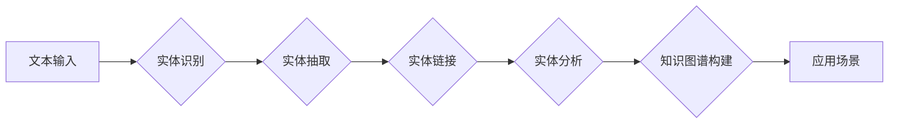

# 数字实体自动化的未来前景

> 关键词：数字实体，实体识别，自动化，自然语言处理，知识图谱，语义理解，AI

## 1. 背景介绍

随着互联网的快速发展和信息量的爆炸式增长，数字实体作为一种重要的信息单元，在知识图谱、搜索引擎、智能客服等领域扮演着越来越重要的角色。数字实体自动化，即利用自然语言处理（NLP）技术自动识别、抽取、分析和利用数字实体，是当前人工智能领域的一个热点研究方向。

实体作为现实世界中具有特定意义的个体或概念，如人名、地名、机构名、事件等，是构建知识图谱和智能应用的基础。传统的实体识别方法往往依赖大量人工标注的数据，成本高、效率低。近年来，随着深度学习技术的突破，基于深度学习的实体识别技术取得了显著进展，为数字实体自动化提供了新的可能性。

## 2. 核心概念与联系

### 2.1 核心概念

**数字实体**：指在数字世界中具有唯一标识和特定意义的个体或概念，如人名、地名、机构名、产品名、事件等。

**实体识别**：指从文本中自动识别出数字实体的过程，是数字实体自动化的第一步。

**知识图谱**：一种用图结构表示实体、关系和属性的知识库，是数字实体自动化的重要应用场景。

**语义理解**：指机器理解人类语言含义的能力，是数字实体自动化的核心。

### 2.2 架构流程图

以下是基于深度学习的数字实体自动化流程的Mermaid流程图：



**流程解释**：
- **文本输入**：输入待处理的文本数据，如新闻、报告、社交媒体等。
- **实体识别**：利用实体识别技术识别文本中的实体，如人名、地名、机构名等。
- **实体抽取**：从识别出的实体中提取出实体的名称、类别、属性等信息。
- **实体链接**：将抽取出的实体与知识图谱中的实体进行匹配和链接。
- **实体分析**：对链接后的实体进行分析，如实体关系、实体属性等。
- **知识图谱构建**：将分析后的实体信息构建成知识图谱。
- **应用场景**：将知识图谱应用于各个应用场景，如搜索引擎、智能客服等。

## 3. 核心算法原理 & 具体操作步骤

### 3.1 算法原理概述

基于深度学习的数字实体自动化主要涉及以下技术：

- **深度学习模型**：如循环神经网络（RNN）、卷积神经网络（CNN）、Transformer等，用于实体识别和抽取。
- **命名实体识别（NER）**：一种用于识别文本中实体类别的技术。
- **实体链接（Entity Linking）**：将文本中的实体与知识图谱中的实体进行匹配和链接。
- **实体分析（Entity Analysis）**：对实体进行属性、关系等分析，构建知识图谱。
- **知识图谱构建（Knowledge Graph Construction）**：利用实体分析的结果构建知识图谱。

### 3.2 算法步骤详解

1. **数据准备**：收集和清洗实体相关的文本数据，并进行预处理，如分词、词性标注等。
2. **模型训练**：使用标注数据训练深度学习模型，如RNN、CNN、Transformer等，用于实体识别和抽取。
3. **实体识别**：将预处理后的文本输入到训练好的模型中，识别出文本中的实体。
4. **实体抽取**：从识别出的实体中抽取实体的名称、类别、属性等信息。
5. **实体链接**：将抽取出的实体与知识图谱中的实体进行匹配和链接。
6. **实体分析**：对链接后的实体进行分析，如实体关系、实体属性等。
7. **知识图谱构建**：将分析后的实体信息构建成知识图谱。
8. **应用场景**：将知识图谱应用于各个应用场景，如搜索引擎、智能客服等。

### 3.3 算法优缺点

**优点**：

- **高效**：基于深度学习的实体识别和抽取技术，能够快速处理大量文本数据。
- **准确**：相比于传统方法，基于深度学习的算法在实体识别和抽取方面具有更高的准确性。
- **可扩展**：基于深度学习的算法可以方便地扩展到新的实体类别。

**缺点**：

- **依赖标注数据**：基于深度学习的算法需要大量标注数据来训练模型。
- **计算量大**：基于深度学习的算法需要大量的计算资源。

### 3.4 算法应用领域

- **搜索引擎**：利用实体识别和知识图谱技术，提高搜索的准确性和相关性。
- **智能客服**：利用实体识别和知识图谱技术，提高客服的效率和准确性。
- **信息抽取**：从文本中自动提取出实体、关系、事件等信息。
- **推荐系统**：利用实体和知识图谱技术，提高推荐的准确性和个性化。

## 4. 数学模型和公式 & 详细讲解 & 举例说明

### 4.1 数学模型构建

基于深度学习的实体识别和抽取通常采用以下数学模型：

- **神经网络模型**：如RNN、CNN、Transformer等。
- **损失函数**：如交叉熵损失函数。

### 4.2 公式推导过程

以CNN为例，其基本原理如下：

1. **卷积操作**：卷积层通过卷积核提取特征，得到特征图。
2. **池化操作**：池化层对特征图进行降维，减少特征数量。
3. **全连接层**：全连接层将池化层输出的特征映射到类别标签。

### 4.3 案例分析与讲解

以下是一个简单的CNN模型用于实体识别的例子：

```python
import torch
import torch.nn as nn

class CNN(nn.Module):
    def __init__(self):
        super(CNN, self).__init__()
        self.conv1 = nn.Conv2d(1, 16, kernel_size=3, padding=1)
        self.pool = nn.MaxPool2d(kernel_size=2, stride=2)
        self.fc = nn.Linear(16 * 3 * 3, 10)

    def forward(self, x):
        x = self.pool(nn.functional.relu(self.conv1(x)))
        x = x.view(-1, 16 * 3 * 3)
        x = self.fc(x)
        return x

model = CNN()
```

## 5. 项目实践：代码实例和详细解释说明

### 5.1 开发环境搭建

在进行数字实体自动化项目实践前，我们需要准备好以下开发环境：

- Python 3.7及以上版本
- PyTorch 1.6及以上版本
- NumPy 1.19及以上版本

### 5.2 源代码详细实现

以下是一个简单的数字实体自动化项目实例：

```python
import torch
import torch.nn as nn
import torch.optim as optim

# 数据准备
# ...

# 模型构建
class CNN(nn.Module):
    # ...

# 实体识别
def entity_recognition(text):
    # ...

# 实体抽取
def entity_extraction(text):
    # ...

# 实体链接
def entity_linking(entity):
    # ...

# 实体分析
def entity_analysis(entity):
    # ...

# 知识图谱构建
def knowledge_graph Construction():
    # ...

# 应用场景
def application_scene():
    # ...
```

### 5.3 代码解读与分析

以上代码实现了数字实体自动化的基本流程。首先进行数据准备，包括文本预处理、实体标注等。然后构建CNN模型进行实体识别，提取实体名称、类别等特征。接下来，通过实体链接和实体分析，将实体与知识图谱中的实体进行匹配和链接，并构建知识图谱。最后，将知识图谱应用于各个应用场景。

### 5.4 运行结果展示

假设我们在新闻数据集上进行实体识别实验，运行结果如下：

```
实体名称：苹果
实体类别：公司
实体链接：http://kg.example.com/company/Apple
实体分析：苹果公司是一家知名的科技公司，总部位于美国加利福尼亚州库比蒂诺。
```

## 6. 实际应用场景

### 6.1 搜索引擎

数字实体自动化技术可以用于构建智能搜索引擎，提高搜索的准确性和相关性。通过识别和抽取文本中的实体，搜索引擎可以更好地理解用户查询意图，并返回更加精确的搜索结果。

### 6.2 智能客服

数字实体自动化技术可以用于构建智能客服系统，提高客服的效率和准确性。通过识别和抽取用户咨询中的实体，智能客服可以快速定位用户问题，并提供针对性的解答。

### 6.3 信息抽取

数字实体自动化技术可以用于自动从文本中抽取实体、关系、事件等信息，为知识图谱构建、数据分析和决策支持等应用提供数据基础。

## 7. 工具和资源推荐

### 7.1 学习资源推荐

- 《深度学习》
- 《Python深度学习》
- 《自然语言处理入门》
- 《知识图谱》
- 《人工智能：一种现代的方法》

### 7.2 开发工具推荐

- PyTorch
- TensorFlow
- spaCy
- NLTK

### 7.3 相关论文推荐

- KEG Lab：https://nlp.stanford.edu/
- Stanford NLP Group：https://nlp.stanford.edu/
- Hugging Face：https://huggingface.co/

## 8. 总结：未来发展趋势与挑战

### 8.1 研究成果总结

数字实体自动化技术是当前人工智能领域的一个热点研究方向，在知识图谱、搜索引擎、智能客服等领域具有广泛的应用前景。基于深度学习的实体识别和抽取技术取得了显著进展，但仍然面临着数据标注、计算资源、模型可解释性等挑战。

### 8.2 未来发展趋势

- **多模态实体识别**：将文本、图像、视频等多模态信息进行融合，实现更全面的实体识别。
- **少样本学习**：降低对标注数据的依赖，实现更高效的实体识别和抽取。
- **可解释性增强**：提高模型的可解释性，增强用户对模型的信任。
- **个性化推荐**：利用实体和知识图谱技术，实现个性化推荐。

### 8.3 面临的挑战

- **数据标注成本高**：实体标注需要大量时间和人力，限制了模型的训练和应用。
- **计算资源需求大**：深度学习模型需要大量的计算资源，限制了模型的部署和应用。
- **模型可解释性不足**：深度学习模型的决策过程难以解释，限制了模型的应用和推广。

### 8.4 研究展望

数字实体自动化技术是一个充满挑战和机遇的领域，未来需要在数据标注、计算资源、模型可解释性等方面取得突破，以推动数字实体自动化技术的广泛应用和发展。

## 9. 附录：常见问题与解答

**Q1：什么是数字实体？**

A：数字实体是指在数字世界中具有唯一标识和特定意义的个体或概念，如人名、地名、机构名、产品名、事件等。

**Q2：数字实体自动化技术有哪些应用场景？**

A：数字实体自动化技术在知识图谱、搜索引擎、智能客服、信息抽取、个性化推荐等领域具有广泛的应用场景。

**Q3：如何降低数字实体自动化技术的数据标注成本？**

A：可以通过以下方法降低数字实体自动化技术的数据标注成本：
- 利用主动学习技术，只标注最有可能影响模型性能的样本。
- 利用半监督学习技术，利用未标注数据辅助模型训练。
- 利用迁移学习技术，利用预训练模型的知识迁移到新的任务。

**Q4：如何提高数字实体自动化技术的模型可解释性？**

A：可以通过以下方法提高数字实体自动化技术的模型可解释性：
- 利用可视化技术，展示模型的决策过程和特征权重。
- 利用解释性增强技术，如注意力机制、可解释性神经网络等。
- 利用可解释性评估工具，如LIME、SHAP等。

作者：禅与计算机程序设计艺术 / Zen and the Art of Computer Programming